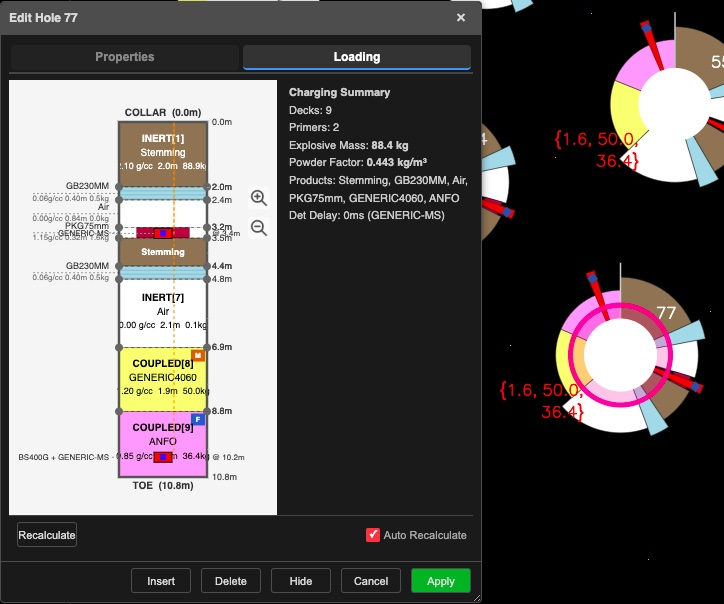
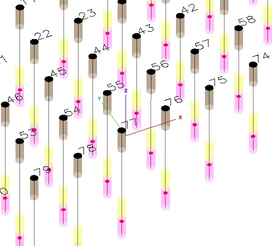

# Kirra

## Overview

**Kirra** is a web-based blasting pattern design application developed by Brent Buffham for mining and construction industries. The application provides comprehensive tools for creating, editing, and exporting blast hole patterns with support for multiple file formats, including **Surpac DTM/STR** surface triangulation files.

### Key Features

- **Multi-Format Support**: CSV, DXF, KAD (Kirra App Drawing), and **Surpac DTM/STR** file formats
- **Surface Management**: Import, visualize, and export 3D triangulated surfaces
- **Pattern Generation**: Create blast patterns using multiple methods
- **Interactive Canvas**: 2D/3D visualization with pan, zoom, and measurement tools
- **Data Management**: Import/export blast data with various column configurations
- **Internationalization**: Support for multiple languages (English, Russian, Spanish)
- **Dark/Light Mode**: Theme toggle for different working environments
- **Vector PDF Export**: High-quality SVG-based PDF generation

## Technology Stack

- **Primary Language**: JavaScript
- **Build Tool**: Vite
- **UI Framework**:  Vanilla JavaScript with custom dialog system
- **Visualization**: Plotly.js, D3.js
- **License**: MIT License

## Application Architecture

### File Structure

```
Kirra2D/
├── kirra.html              # Main application UI
├── src/
│   ├── dialog/             # Dialog system
│   │   └── popups/
│   │       └── generic/    # Pattern generation dialogs
│   ├── helpers/            # Utility functions
│   │   └── BlastStatistics. js
│   ├── print/              # PDF/SVG export system
│   │   ├── PrintSystem.js
│   │   ├── PrintStats.js
│   │   └── PrintRendering.js
│   └── kirra.css          # Application styles
├── libs/                   # External libraries
├── icons/                  # Application icons
└── vite.config.js         # Build configuration
```

---
---

## TreeView Node ID Convention (CRITICAL - DO NOT CHANGE)

The TreeView panel uses the **Braille Pattern U+28FF character `⣿`** as a separator in all tree node IDs. This character was deliberately chosen because it will **never appear in user data** (entity names, file names, hole IDs, etc.), making it a safe and unambiguous delimiter for composite keys.

> **WARNING**: This separator has been accidentally replaced with `?` (question mark) on multiple occasions during edits, breaking all show/hide, selection, and visibility cascading in the TreeView. If show/hide stops working, check that `⣿` has not been corrupted to `?` or any other character in `kirra.js` and `TreeView.js`.

### Node ID Formats

All node IDs follow the pattern: `prefix⣿part1⣿part2⣿...`

| Node Type | Format | Parts | Example |
|---|---|---|---|
| **Blast Entity** | `entity⣿entityName` | 2 | `entity⣿Pattern_A` |
| **Hole** | `hole⣿entityName⣿holeID` | 3 | `hole⣿Pattern_A⣿H001` |
| **KAD Point Entity** | `points⣿entityName` | 2 | `points⣿SurveyPts` |
| **KAD Line Entity** | `line⣿entityName` | 2 | `line⣿Boundary` |
| **KAD Polygon Entity** | `poly⣿entityName` | 2 | `poly⣿Pit_Shell` |
| **KAD Circle Entity** | `circle⣿entityName` | 2 | `circle⣿DrillHoles` |
| **KAD Text Entity** | `text⣿entityName` | 2 | `text⣿Labels` |
| **KAD Element (vertex)** | `entityType⣿entityName⣿element⣿pointID` | 4 | `line⣿Boundary⣿element⣿42` |
| **KAD Chunk (lazy load)** | `entityType⣿entityName⣿chunk⣿start-end` | 4 | `points⣿SurveyPts⣿chunk⣿1-50` |
| **Surface** | `surface⣿surfaceId` | 2 | `surface⣿dtm_001` |
| **Image** | `image⣿imageId` | 2 | `image⣿ortho_01` |
| **Drawing Layer** | `layer-drawing⣿layerId` | 2 | `layer-drawing⣿layer_default_drawings` |
| **Drawing Layer Folder** | `layer-drawing⣿layerId⣿entityTypeFolder` | 3 | `layer-drawing⣿layer_default_drawings⣿points` |
| **Surface Layer** | `layer-surface⣿layerId` | 2 | `layer-surface⣿layer_default_surfaces` |

### Entity Type Prefix Mapping

Note the discrepancy between `entityType` values stored in data vs the node ID prefix for entity-level nodes:

| Data entityType | Entity-Level Node Prefix | Element-Level Node Prefix |
|---|---|---|
| `"point"` | `"points"` (with 's') | `"point"` (no 's') |
| `"line"` | `"line"` | `"line"` |
| `"poly"` | `"poly"` | `"poly"` |
| `"circle"` | `"circle"` | `"circle"` |
| `"text"` | `"text"` | `"text"` |

The `"point"` -> `"points"` mapping is the only exception. When constructing entity-level node IDs programmatically, always use:

```javascript
var entityTypePrefix = entity.entityType === "point" ? "points" : entity.entityType;
var nodeId = entityTypePrefix + "⣿" + entityName;
```

### Tree Hierarchy (Layer-Based Structure)

```
blast                                          (top-level)
  entity⣿entityName                           (blast entity group)
    hole⣿entityName⣿holeID                   (individual hole)

drawings                                       (top-level)
  layer-drawing⣿layerId                       (drawing layer)
    layer-drawing⣿layerId⣿points             (entity type folder)
      points⣿entityName                       (individual KAD entity)
        points⣿entityName⣿element⣿pointID   (individual vertex)
    layer-drawing⣿layerId⣿lines
      line⣿entityName
    layer-drawing⣿layerId⣿polygons
      poly⣿entityName
    layer-drawing⣿layerId⣿circles
      circle⣿entityName
    layer-drawing⣿layerId⣿texts
      text⣿entityName

surfaces                                       (top-level)
  layer-surface⣿layerId                       (surface layer)
    surface⣿surfaceId                         (individual surface)

images                                         (top-level)
  image⣿imageId                               (individual image)
```

### Parsing Node IDs

Always split on `⣿` to extract parts:

```javascript
var parts = nodeId.split("⣿");
var type = parts[0];         // e.g. "hole", "line", "layer-drawing"
var itemId = parts.slice(1).join("⣿");  // remaining parts rejoined
```

### Files That Use This Convention

- `src/dialog/tree/TreeView.js` - Tree rendering, selection, hide/show, expand/collapse
- `src/kirra.js` - `updateTreeViewVisibilityStates()`, `handleTreeViewVisibility()`, visibility setters

---
---

## IndexedDB Database Schema

Kirra uses IndexedDB for client-side data persistence. The database structure consists of four main object stores that manage blast holes, drawings, surfaces, and layer organization.

### Database Structure Overview

```mermaid
erDiagram
    KIRRA-DATABASE ||--o{ BLASTHOLES : contains
    KIRRA-DATABASE ||--o{ KADDRAWINGS : contains
    KIRRA-DATABASE ||--o{ KADSURFACE : contains
    KIRRA-DATABASE ||--o{ KADLAYERS : contains

    BLASTHOLES {
        string id PK "blastHolesData"
        array data "Array of blast hole objects"
    }
    
    BLASTHOLE-OBJECT {
        float benchHeight
        float burden
        string colorHexDecimal
        int connectorCurve
        float endXLocation
        float endYLocation
        float endZLocation
        string entityName
        string entityType "hole"
        string fromHoleID
        float gradeXLocation
        float gradeYLocation
        float gradeZLocation
        float holeAngle
        float holeBearing
        float holeDiameter
        string holeID PK
        float holeLengthCalculated
        int holeTime
        string holeType "Production"
        string measuredComment
        string measuredCommentTimeStamp
        float measuredLength
        string measuredLengthTimeStamp
        float measuredMass
        string measuredMassTimeStamp
        int posID
        int rowID
        float spacing
        float startXLocation
        float startYLocation
        float startZLocation
        float subdrillAmount
        float subdrillLength
        int timingDelayMilliseconds
        boolean visible
    }

    KADDRAWINGS {
        string id PK "kadDrawingData"
        array data "Array[entityName, entityObject]"
    }

    DRAWING-ENTITY {
        string entityName PK "Unique entity identifier"
        string name "Display name"
        string entityType "poly|line|point|circle|text"
        string layerId FK "Reference to layer"
        boolean visible "Visibility flag"
        array data "Array of geometry points"
    }

    POLY-ENTITY {
        string entityName PK
        string name
        string entityType "poly"
        string layerId FK
        boolean visible
        array data "Array of poly points"
    }

    POLY-POINT {
        string entityName FK
        string entityType "poly"
        int pointID "Sequential point ID"
        float pointXLocation "Easting coordinate"
        float pointYLocation "Northing coordinate"
        float pointZLocation "Elevation"
        boolean closed "Is polygon closed"
        string color "Hex color #RRGGBB"
        int lineWidth "Line width in pixels"
        boolean visible
    }

    LINE-ENTITY {
        string entityName PK
        string name
        string entityType "line"
        string layerId FK
        boolean visible
        array data "Array of line points"
    }

    LINE-POINT {
        string entityName FK
        string entityType "line"
        int pointID "Sequential point ID"
        float pointXLocation "Easting coordinate"
        float pointYLocation "Northing coordinate"
        float pointZLocation "Elevation"
        boolean closed "Always false for lines"
        string color "Hex color #RRGGBB"
        int lineWidth "Line width in pixels"
        boolean visible
    }

    POINT-ENTITY {
        string entityName PK
        string name
        string entityType "point"
        string layerId FK
        boolean visible
        array data "Array of point objects"
    }

    POINT-OBJECT {
        string entityName FK
        string entityType "point"
        int pointID "Sequential point ID"
        float pointXLocation "Easting coordinate"
        float pointYLocation "Northing coordinate"
        float pointZLocation "Elevation"
        boolean closed "Always false"
        string color "Hex color #RRGGBB"
        boolean connected "Connection flag"
        boolean visible
    }

    CIRCLE-ENTITY {
        string entityName PK
        string entityName_attr "Entity identifier"
        string entityType "circle"
        string layerId FK
        boolean visible
        array data "Array of circle centers"
    }

    CIRCLE-OBJECT {
        string entityName FK
        string entityType "circle"
        int pointID "Sequential circle ID"
        float pointXLocation "Center X (Easting)"
        float pointYLocation "Center Y (Northing)"
        float pointZLocation "Center Z (Elevation)"
        string radius "Circle radius"
        boolean closed "Always false"
        string color "Hex color #RRGGBB"
        int lineWidth "Line width in pixels"
        boolean connected "Connection flag"
        boolean visible
    }

    TEXT-ENTITY {
        string entityName PK
        string entityName_attr "Entity identifier"
        string entityType "text"
        string layerId FK
        boolean visible
        array data "Array of text placements"
    }

    TEXT-OBJECT {
        string entityName FK
        string entityType "text"
        int pointID "Sequential text ID"
        float pointXLocation "Text X (Easting)"
        float pointYLocation "Text Y (Northing)"
        float pointZLocation "Text Z (Elevation)"
        string text "Text content"
        int fontHeight "Font size in pixels"
        boolean closed "Always false"
        string color "Hex color #RRGGBB"
        boolean connected "Connection flag"
        boolean visible
    }

    KADSURFACE {
        string id PK "Surface identifier"
        string name "Display name"
        string type "delaunay|triangulated"
        array points "Array of 3D vertices"
        array triangles "Array of triangle faces"
        string created "ISO DateTime"
        string gradient "hillshade|texture"
        string hillshadeColor "Color for hillshade"
        string layerId FK "Reference to layer"
        float maxLimit "Max elevation limit"
        float minLimit "Min elevation limit"
        object metadata "Surface metadata"
        float transparency "0-1 transparency"
        boolean visible "Visibility flag"
        boolean isTexturedMesh "Has texture mapping"
        string objContent "OBJ file content"
        string mtlContent "MTL file content"
        object meshBounds "3D bounding box"
        object flattenedImageBounds "2D image bounds"
        string flattenedImageDataURL "Base64 PNG"
        object flattenedImageDimensions "Image size"
        object materialProperties "Material definitions"
        object textureBlobs "Texture image blobs"
    }

    SURFACE-METADATA {
        string algorithm "constrained_delaunay"
        int pointCount "Number of vertices"
        int triangleCount "Number of triangles"
        int constraintCount "Number of constraints"
        string blastHolePointType "Point type"
    }

    SURFACE-POINT {
        float x "Easting coordinate"
        float y "Northing coordinate"
        float z "Elevation"
    }

    SURFACE-TRIANGLE {
        array vertices "3 vertex references"
        array uvs "UV texture coordinates"
        array normals "Normal vectors"
        string material "Material reference"
    }

    MESH-BOUNDS {
        float minX "Minimum easting"
        float maxX "Maximum easting"
        float minY "Minimum northing"
        float maxY "Maximum northing"
        float minZ "Minimum elevation"
        float maxZ "Maximum elevation"
    }

    MATERIAL-PROPERTIES {
        string name "Material name"
        array Ka "Ambient color RGB"
        array Kd "Diffuse color RGB"
        array Ks "Specular color RGB"
        int Ns "Specular exponent"
        int illum "Illumination model"
        string map_Kd "Texture filename"
    }

    TEXTURE-BLOB {
        string filename PK "Texture filename"
        int size "File size in bytes"
        string type "MIME type image/jpeg"
        blob data "Binary image data"
    }

    FLATTENED-IMAGE {
        int width "Image width pixels"
        int height "Image height pixels"
        string dataURL "Base64 PNG data"
    }

    KADLAYERS {
        string id PK "layersData"
        array drawingLayers "Drawing layer array"
        array surfaceLayers "Surface layer array"
    }

    DRAWING-LAYER {
        string layerId PK
        string layerName
        array entities "Array of entity IDs"
        string importDate "ISO DateTime"
        string sourceFile "Source filename"
        boolean visible
    }

    SURFACE-LAYER {
        string layerId PK
        string layerName
        array surfaces "Array of surface IDs"
        string importDate "ISO DateTime"
        string sourceFile "Source filename"
        boolean visible
    }

    BLASTHOLES ||--o{ BLASTHOLE-OBJECT : stores
    KADDRAWINGS ||--o{ DRAWING-ENTITY : stores
    DRAWING-ENTITY ||--o{ POLY-ENTITY : "is type of"
    DRAWING-ENTITY ||--o{ LINE-ENTITY : "is type of"
    DRAWING-ENTITY ||--o{ POINT-ENTITY : "is type of"
    DRAWING-ENTITY ||--o{ CIRCLE-ENTITY : "is type of"
    DRAWING-ENTITY ||--o{ TEXT-ENTITY : "is type of"
    POLY-ENTITY ||--o{ POLY-POINT : contains
    LINE-ENTITY ||--o{ LINE-POINT : contains
    POINT-ENTITY ||--o{ POINT-OBJECT : contains
    CIRCLE-ENTITY ||--o{ CIRCLE-OBJECT : contains
    TEXT-ENTITY ||--o{ TEXT-OBJECT : contains
    KADSURFACE ||--|| SURFACE-METADATA : has
    KADSURFACE ||--o{ SURFACE-POINT : contains
    KADSURFACE ||--o{ SURFACE-TRIANGLE : contains
    KADSURFACE ||--|| MESH-BOUNDS : has
    KADSURFACE ||--o{ MATERIAL-PROPERTIES : has
    KADSURFACE ||--o{ TEXTURE-BLOB : contains
    KADSURFACE ||--|| FLATTENED-IMAGE : generates
    MATERIAL-PROPERTIES ||--|| TEXTURE-BLOB : references
    KADLAYERS ||--o{ DRAWING-LAYER : manages
    KADLAYERS ||--o{ SURFACE-LAYER : manages
    DRAWING-LAYER ||--o{ DRAWING-ENTITY : references
    SURFACE-LAYER ||--o{ KADSURFACE : references
```



### Object Store Descriptions

#### BLASTHOLES Store
Stores all blast hole data with complete geometric and operational properties. Each blast hole includes collar, toe, and grade positions, along with calculated attributes like angle, bearing, length, and timing information.

#### KADDRAWINGS Store
Stores CAD-like drawing entities including:
- **Polylines (poly)**: Closed or open multi-point shapes with styling
- **Lines**: Open polylines connecting points
- **Points**: Discrete point objects
- **Circles**: Circle geometries with center and radius
- **Text**: Text annotations with font properties

All drawing entities are stored as `[entityName, entityObject]` pairs with geometry data arrays containing 3D coordinates.

#### KADSURFACE Store
Manages 3D surface data with two types:
- **Delaunay Surfaces**: Algorithm-generated terrain from point clouds with hillshade rendering
- **Triangulated Meshes**: Imported OBJ models with full texture mapping support

Textured meshes include:
- Complete OBJ/MTL file contents
- Material properties (ambient, diffuse, specular colors)
- Texture image blobs (JPEG/PNG)
- Pre-rendered 2D flattened images for quick display
- 3D mesh bounds for spatial queries

#### KADLAYERS Store
Organizes drawing entities and surfaces into layers with:
- Layer visibility toggles
- Import metadata (date, source file)
- Entity/surface references
- Separate management for drawings and surfaces

---

## Core Functionality

### 1. Blast Hole Management

Kirra manages blast holes with comprehensive data structures including: 

- **Hole ID**:  Unique identifier
- **Coordinates**: Collar (X, Y, Z) and Toe (X, Y, Z) positions
- **Geometry**: Diameter, length, angle, bearing, dip
- **Properties**: Type, subdrill, entity name
- **Timing**: Firing sequence and delay information
- **Visual**:  Color coding for visualization

### 2. Pattern Generation Methods

#### Add Pattern
Creates a rectangular blast pattern with:
- Orientation angle
- Starting position (X, Y, Z)
- Number of rows and holes per row
- Burden and spacing parameters
- Hole specifications (diameter, length, angle, bearing)

#### Generate Pattern in Polygon
Creates a blast pattern within a defined polygon:
- Burden and spacing values
- Spacing offset for staggered patterns
- Collar elevation and grade control
- Automatic hole numbering
- Duplicate detection

#### Holes Along Line
Generates holes along a straight line

#### Holes Along Polyline
Generates holes following a polyline path

### 3. File Import/Export

#### Import Formats (CSV - No Headers)

**4-column**:  ID, X, Y, Z (Dummy Holes)
```
1, 100. 0, 200.0, 50.0
```

**7-column**: ID, X, Y, Z, toeX, toeY, toeZ (Blast Holes)
```
1, 100.0, 200.0, 50.0, 105.0, 200.0, 40.0
```

**9-column**:  Adds Diameter, Type
```
1, 100.0, 200.0, 50.0, 105.0, 200.0, 40.0, 115, Production
```

**12-column**: Adds FromHole, Delay, Color
```
1, 100.0, 200.0, 50.0, 105.0, 200.0, 40.0, 115, Production, 0, 0, #FF0000
```

**14-column**: Adds entityName, entityType (Full format)
```
Blast_001, Pattern, 1, 100.0, 200.0, 50.0, 105.0, 200.0, 40.0, 115, Production, 0, 0, #FF0000
```

#### Export Formats

- **KIRRA CSV**: 14-column format for saving complete blast data
- **KAD Drawing**:  Kirra App Drawing format for vector data
- **EXTRA CSV**: Extended format with all hole aspects
- **Measurements**: Real-world measurement values
- **DXF**: AutoCAD-compatible format
- **AQM**: Specialized export format

### 4. Coordinate System

Kirra uses a 3D world coordinate system with camera conventions for proper spatial representation:

- **X-axis**: East-West direction
- **Y-axis**: North-South direction  
- **Z-axis**:  Elevation (vertical)
- **Angles**: Measured from horizontal
- **Bearing**: Measured from North (0-360°)
- **Dip**: Vertical angle from horizontal

### 5. Display Options

Users can toggle display of various hole properties:
- Hole ID
- Hole length
- Hole diameter
- Angle
- Dip
- Bearing
- Subdrill
- Timing information

### 6. Measurement Tools

- **Distance**: Measure distances between points
- **Area**: Calculate polygon areas
- **Ruler/Protractor**: Angle measurements
- **Snap Tolerance**: Configurable snapping for precise placement

### 7. Statistics and Reporting

The application calculates and displays per-entity statistics: 
- Hole count
- Total length
- Total volume
- Average burden and spacing
- Firing time range
- Voronoi metrics for rock distribution

## User Interface

### Menu Structure

- **File Operations**:  Import/Export, Save/Load
- **Edit Tools**: Add, Delete, Modify holes
- **Pattern Tools**: Various pattern generation methods
- **View Controls**: Zoom, Pan, Reset view
- **Display Options**: Toggle hole property labels
- **Settings**: Language, Theme, Snap tolerance
- **Help**: Version information and documentation

### Theme System

- **Light Mode**: White canvas with dark text
- **Dark Mode**: Black canvas with light text
- Customizable color scheme with CSS variables
- Persistent user preference storage

### Internationalization

Supported languages with full translation: 
- English (default)
- Russian (Русский)
- Spanish (Español)

All UI elements, tooltips, and messages are translatable. 

## Data Persistence

Kirra uses browser localStorage to save: 
- Last used pattern parameters
- Display preferences
- Theme selection
- Language preference
- Snap tolerance settings

This ensures user settings persist across sessions.

## Blast Design Workflow

### Typical Usage Pattern

1. **Setup**
   - Select language and theme
   - Configure display options
   - Set snap tolerance

2. **Import Data**
   - Import existing holes from CSV
   - Import DXF drawings for reference
   - Load saved KAD files

3. **Pattern Creation**
   - Use Add Pattern for rectangular grids
   - Use Polygon Pattern for irregular shapes
   - Use Line/Polyline tools for specific layouts

4. **Editing**
   - Select and modify individual holes
   - Adjust timing and delays
   - Update hole properties

5. **Verification**
   - View blast statistics
   - Check spacing and burden
   - Verify timing sequences

6. **Export**
   - Save to KIRRA format for future editing
   - Export to DXF for CAD systems
   - Generate PDF reports with SVG graphics

## Advanced Features

### Duplicate Detection

When naming a blast the same as an existing one, Kirra automatically: 
- Checks for duplicate hole IDs
- Detects overlapping hole positions
- Warns users of conflicts
- Prevents accidental data loss

### Grade Control

Patterns can use grade elevation (Z-values):
- Use existing surface topography
- Apply constant collar elevation
- Automatic subdrill calculation

### Voronoi Analysis

The application can calculate Voronoi metrics for: 
- Rock distribution per hole
- Blast efficiency analysis
- Powder factor calculations

## Print and PDF System

### Vector-Based Export

Modern PDF generation using SVG rendering:
- `printHeaderSVG()`: Title and metadata
- `printFooterSVG()`: Copyright and date
- `printBlastStatsSVG()`: Detailed statistics
- `printBlastStatsSimpleSVG()`: Summary statistics

### Print Areas

Configurable print layouts with:
- Header section
- Main canvas area
- Statistics section
- Footer section

## Development Information

### Build and Run

```bash
# Install dependencies
npm install

# Start dev server
npm run dev

# Build for production
npm run build
```

The dev server automatically opens `kirra.html` on port 5173.

### Browser Compatibility

- Modern browsers with ES6+ support
- Canvas and SVG support required
- localStorage for persistence
- Responsive design for various screen sizes

## Credits

**Author**: Brent Buffham  
**Copyright**: © 2023-2025  
**Website**: blastingapps.com  
**License**: MIT License

---

This documentation provides a comprehensive overview of the Kirra application.  For specific technical implementation details, refer to the source code comments and the AI commentary files in the repository. 
3D World Coordinate and Camera Conventions.


---

# Kirra2D Blast Attribute Calculation Relationships

## Primary Inputs (Survey/Design Data)
```
┌─────────────────────────────────────────────────────────────┐
│  COLLAR (Start)     │  TOE (End)        │  GRADE (Floor)    │
│  StartX, StartY, StartZ │ EndX, EndY, EndZ │ GradeX, GradeY, GradeZ │
└─────────────────────────────────────────────────────────────┘
```

---

## Vertical Calculations (Z-only)

| Attribute | Primary Formula | Equivalent Formulas |
|-----------|-----------------|---------------------|
| **BenchHeight** | `StartZ - GradeZ` | `HoleLength×cos(Angle) - SubdrillAmount` |
| **SubdrillAmount** | `GradeZ - EndZ` | `HoleLength×cos(Angle) - BenchHeight` |
| **VerticalDrop** | `StartZ - EndZ` | `BenchHeight + SubdrillAmount` = `HoleLength × cos(Angle)` |

---

## Length Calculations

| Attribute | Primary Formula | Equivalent Formulas |
|-----------|-----------------|---------------------|
| **HoleLength** | `√[(ΔX)² + (ΔY)² + (ΔZ)²]` | `VerticalDrop / cos(Angle)` = `(BenchHeight + Subdrill) / cos(Angle)` |
| **HorizontalDisplacement** | `√[(EndX-StartX)² + (EndY-StartY)²]` | `HoleLength × sin(Angle)` = `VerticalDrop × tan(Angle)` |

---

## Angle Calculations

| Attribute | Primary Formula | Equivalent Formulas |
|-----------|-----------------|---------------------|
| **HoleAngle** (from vertical) | `arccos(VerticalDrop / HoleLength)` | `arcsin(HorizDisp / HoleLength)` = `arctan(HorizDisp / VerticalDrop)` |
| **HoleBearing** (azimuth) | `atan2(ΔX, ΔY)` | — |

---

## Equation Chains (What Calculates What)

```
                    ┌──────────────┐
                    │   StartZ     │
                    └──────┬───────┘
                           │
              ┌────────────┼────────────┐
              │            │            │
              ▼            ▼            ▼
        ┌─────────┐  ┌─────────┐  ┌─────────┐
        │ GradeZ  │  │  EndZ   │  │ StartXY │
        └────┬────┘  └────┬────┘  └────┬────┘
             │            │            │
             │            │            ▼
             │            │       ┌─────────┐
             │            │       │  EndXY  │
             │            │       └────┬────┘
             │            │            │
             ▼            ▼            ▼
      ┌─────────────────────────────────────┐
      │         DERIVED ATTRIBUTES          │
      └─────────────────────────────────────┘

StartZ - GradeZ ──────────────────────────────► BenchHeight
GradeZ - EndZ ────────────────────────────────► SubdrillAmount  
StartZ - EndZ ────────────────────────────────► VerticalDrop

√(ΔX² + ΔY² + ΔZ²) ───────────────────────────► HoleLength
√(ΔX² + ΔY²) ─────────────────────────────────► HorizontalDisplacement

arccos(VerticalDrop / HoleLength) ────────────► HoleAngle
atan2(ΔX, ΔY) ────────────────────────────────► HoleBearing
```

---

## Cross-Check Equivalencies (Validation)

These should all resolve to TRUE if data is consistent:

```
✓ BenchHeight + SubdrillAmount = VerticalDrop

✓ SubdrillAmount = HoleLength × cos(Angle) - BenchHeight

✓ HoleLength² = HorizontalDisplacement² + VerticalDrop²

✓ HoleLength = (BenchHeight + SubdrillAmount) / cos(Angle)

✓ tan(Angle) = HorizontalDisplacement / VerticalDrop

✓ GradeXY = StartXY + (HorizontalDisplacement × BenchHeight/VerticalDrop) × [sin(Bearing), cos(Bearing)]
```

---

## For Angled Holes: Grade Point Interpolation

```
                     Start (Collar)
                        ●
                       /│
                      / │ BenchHeight
                     /  │
                    /   │
           Grade  ●─────┤ ← GradeZ elevation
                  │    /│
      SubdrillLen │   / │ SubdrillAmount (vertical)
                  │  /  │
                  │ /   │
                  ▼/    ▼
                 ● Toe (End)

GradeX = StartX + (EndX - StartX) × (BenchHeight / VerticalDrop)
GradeY = StartY + (EndY - StartY) × (BenchHeight / VerticalDrop)
```

---

## Accuracy Hierarchy

| Rank | Calculation | Error Source | Typical Accuracy |
|------|-------------|--------------|------------------|
| 1 | BenchHeight | Single Z difference | ±0.01m |
| 2 | SubdrillAmount | Single Z difference | ±0.01m |
| 3 | VerticalDrop | Single Z difference | ±0.01m |
| 4 | HoleBearing | 2D XY ratio | ±0.5° (degrades near vertical) |
| 5 | HoleLength | 3D compound | ±0.02m |
| 6 | HoleAngle | Inverse trig | ±1° (very poor near vertical) |
| 7 | GradeXY interpolation | Depends on angle accuracy | ±0.05m to ±0.5m |
| 8 | Burden/Spacing | Pattern geometry | ±0.1m |

---

## Quick Reference: "I have X, I need Y"

| If you have... | You can calculate... |
|----------------|---------------------|
| StartZ, GradeZ | BenchHeight |
| GradeZ, EndZ | SubdrillAmount |
| StartZ, EndZ | VerticalDrop |
| StartXYZ, EndXYZ | HoleLength, HoleAngle, HoleBearing |
| BenchHeight, SubdrillAmount | VerticalDrop |
| HoleLength, Angle | VerticalDrop, HorizontalDisplacement |
| VerticalDrop, Angle | HoleLength |
| BenchHeight, HoleLength, Angle | SubdrillAmount |
| StartXY, EndXY, BenchHeight, VerticalDrop | GradeXY |

---

## Input Scenarios: "I have these inputs, what can I calculate?"

### Scenario 1: StartXYZ + BenchHeight (Design from Collar)
```
GIVEN:  StartX, StartY, StartZ, BenchHeight
CALC:   GradeZ = StartZ - BenchHeight
NEED:   Angle, Bearing, (Subdrill OR Length OR ToeXYZ) to complete
```
| Can Calculate | Formula | Missing for Full Geometry |
|---------------|---------|---------------------------|
| GradeZ | StartZ - BenchHeight | — |
| — | — | ToeXYZ, Length, Angle, Bearing, Subdrill |

**To complete the hole, add ONE of:**
- Subdrill + Angle + Bearing → ToeXYZ, Length, GradeXY
- Length + Angle + Bearing → ToeXYZ, Subdrill, GradeXY
- ToeXYZ → Length, Angle, Bearing, Subdrill, GradeXY

---

### Scenario 2: StartXYZ + BenchHeight + Subdrill (Vertical Hole, Bench Design)
```
GIVEN:  StartX, StartY, StartZ, BenchHeight, SubdrillAmount
ASSUME: Vertical hole (Angle = 0°)
```
| Can Calculate | Formula |
|---------------|---------|
| GradeZ | StartZ - BenchHeight |
| EndZ (ToeZ) | GradeZ - SubdrillAmount |
| VerticalDrop | BenchHeight + SubdrillAmount |
| HoleLength | VerticalDrop (same for vertical) |
| EndX, EndY | StartX, StartY (vertical = no XY change) |
| GradeX, GradeY | StartX, StartY |
| Angle | 0° |
| Bearing | Undefined (vertical) |

✅ **Complete geometry for vertical holes**

---

### Scenario 3: StartXYZ + BenchHeight + Subdrill + Angle + Bearing (Angled Hole Design)
```
GIVEN:  StartX, StartY, StartZ, BenchHeight, SubdrillAmount, Angle, Bearing
```
| Can Calculate | Formula |
|---------------|---------|
| GradeZ | StartZ - BenchHeight |
| EndZ (ToeZ) | GradeZ - SubdrillAmount |
| VerticalDrop | BenchHeight + SubdrillAmount |
| HoleLength | VerticalDrop / cos(Angle) |
| HorizDisplacement | HoleLength × sin(Angle) |
| EndX | StartX + HorizDisp × sin(Bearing) |
| EndY | StartY + HorizDisp × cos(Bearing) |
| GradeX | StartX + (HorizDisp × BenchHeight/VerticalDrop) × sin(Bearing) |
| GradeY | StartY + (HorizDisp × BenchHeight/VerticalDrop) × cos(Bearing) |

✅ **Complete geometry**

---

### Scenario 4: ToeXYZ + Length + Subdrill (Working Backwards from Toe)
```
GIVEN:  EndX, EndY, EndZ, HoleLength, SubdrillAmount
NEED:   Angle + Bearing to solve
```
| Can Calculate | Formula | Notes |
|---------------|---------|-------|
| GradeZ | EndZ + SubdrillAmount | ✅ Always |
| — | — | Need Angle to continue |

**With Angle added:**
| Can Calculate | Formula |
|---------------|---------|
| VerticalDrop | HoleLength × cos(Angle) |
| StartZ | EndZ + VerticalDrop |
| BenchHeight | VerticalDrop - SubdrillAmount |
| HorizDisplacement | HoleLength × sin(Angle) |

**With Angle + Bearing added:**
| Can Calculate | Formula |
|---------------|---------|
| StartX | EndX - HorizDisp × sin(Bearing) |
| StartY | EndY - HorizDisp × cos(Bearing) |
| GradeX | EndX - (HorizDisp × Subdrill/VerticalDrop) × sin(Bearing) |
| GradeY | EndY - (HorizDisp × Subdrill/VerticalDrop) × cos(Bearing) |

✅ **Complete geometry (with Angle + Bearing)**

---

### Scenario 5: ToeXYZ + GradeZ + Angle + Bearing (Toe Survey + Grade RL)
```
GIVEN:  EndX, EndY, EndZ, GradeZ, Angle, Bearing
```
| Can Calculate | Formula |
|---------------|---------|
| SubdrillAmount | GradeZ - EndZ |
| SubdrillLength | SubdrillAmount / cos(Angle) |

**Need StartZ OR BenchHeight OR Length to complete**

---

### Scenario 6: StartXYZ + ToeXYZ (Full Survey - Most Common)
```
GIVEN:  StartX, StartY, StartZ, EndX, EndY, EndZ
```
| Can Calculate | Formula |
|---------------|---------|
| HoleLength | √[(ΔX)² + (ΔY)² + (ΔZ)²] |
| VerticalDrop | StartZ - EndZ |
| HorizDisplacement | √[(ΔX)² + (ΔY)²] |
| HoleAngle | arccos(VerticalDrop / HoleLength) |
| HoleBearing | atan2(ΔX, ΔY) |

**Need GradeZ to get Bench/Subdrill split:**
| With GradeZ | Formula |
|-------------|---------|
| BenchHeight | StartZ - GradeZ |
| SubdrillAmount | GradeZ - EndZ |
| GradeX | StartX + ΔX × (BenchHeight / VerticalDrop) |
| GradeY | StartY + ΔY × (BenchHeight / VerticalDrop) |

---

### Scenario 7: StartXYZ + Length + Angle + Bearing (Design Projection)
```
GIVEN:  StartX, StartY, StartZ, HoleLength, Angle, Bearing
```
| Can Calculate | Formula |
|---------------|---------|
| VerticalDrop | HoleLength × cos(Angle) |
| HorizDisplacement | HoleLength × sin(Angle) |
| EndX | StartX + HorizDisp × sin(Bearing) |
| EndY | StartY + HorizDisp × cos(Bearing) |
| EndZ | StartZ - VerticalDrop |

**Need GradeZ OR BenchHeight OR Subdrill to split:**
| With GradeZ | Formula |
|-------------|---------|
| BenchHeight | StartZ - GradeZ |
| SubdrillAmount | GradeZ - EndZ |

| With BenchHeight | Formula |
|------------------|---------|
| GradeZ | StartZ - BenchHeight |
| SubdrillAmount | VerticalDrop - BenchHeight |

| With SubdrillAmount | Formula |
|---------------------|---------|
| BenchHeight | VerticalDrop - SubdrillAmount |
| GradeZ | EndZ + SubdrillAmount |

---

## Summary Matrix: Minimum Inputs Required

| Hole Type | Minimum Inputs | What You Get |
|-----------|----------------|--------------|
| **Vertical** | StartXYZ + BenchHeight + Subdrill | Full geometry |
| **Angled** | StartXYZ + BenchHeight + Subdrill + Angle + Bearing | Full geometry |
| **From Survey** | StartXYZ + ToeXYZ + GradeZ | Full geometry |
| **From Toe** | ToeXYZ + Length + Subdrill + Angle + Bearing | Full geometry |
| **Design** | StartXYZ + Length + Angle + Bearing + (GradeZ OR Bench OR Sub) | Full geometry |

---

## The Three Ways to Define a Hole

```
METHOD 1: Two Points + Grade
┌─────────────────────────────────────┐
│  StartXYZ + ToeXYZ + GradeZ         │
│  (Survey data - most accurate)      │
└─────────────────────────────────────┘

METHOD 2: Collar + Vector + Depths
┌─────────────────────────────────────┐
│  StartXYZ + Angle + Bearing +       │
│  BenchHeight + Subdrill             │
│  (Design data - typical input)      │
└─────────────────────────────────────┘

METHOD 3: Toe + Vector + Depths
┌─────────────────────────────────────┐
│  ToeXYZ + Angle + Bearing +         │
│  Length + Subdrill                  │
│  (Reverse engineering)              │
└─────────────────────────────────────┘
```

# What is a blasthole?
A blasthole consists of these fields (for it to be valid all field but be there.)
```
entityName                 || "" //BlastName
entityType                 || "hole" //for future use when creating a binary KDB file (Drawings and Holes)
holeID                     || notNull //unique hole name with in a blast, no two holes within a blast can be called the same ID
-> Important as IREDES swaps the Easting and Northing X Y nomenclature WARNING: Ask about this isf not understood.
startXLocation             || 0 //Collar Easting  location 
startYLocation             || 0 //Collar Northing Location
startZLocation             || 0 // Collar Elevation
endXLocation               || 0 //Toe Easting
endYLocation               || 0 //Toe Northing
endZLocation               || 0 //Toe Elevation
gradeXLocation             || 0 //Always Calculate,Grade Easting
gradeYLocation             || 0 //Always Calculate,Grade Northing
gradeZLocation             || 0 //Always Calculate,Grade Elevation
subdrillAmount             || 0 //deltaZ of gradeZ to toeZ -> downhole =+ve uphole =-ve
subdrillLength             || 0 //Always Calculate,distance of subdrill from gradeXYZ to toeXYZ -> downhole =+ve uphole =-ve
benchHeight                || 0 //Always Calculate, deltaZ of collarZ to gradeZ -> always Absolute
holeDiameter               || 115 //Always convert to millimeters
holeType                   || "Undefined" //If not assigned always "undefined"
fromHoleID                 || "" // the ENTITYNAME:::HOLEID (must be at least connected to itself )
timingDelayMilliseconds    || 0 // The delay Connection amount not the holetime
colorHexDecimal            || "red" //Color of the delay arrow
holeLengthCalculated       || 0 // Always Calculate, Distance from the collarXYZ to the ToeXYZ
holeAngle                  || 0; //Angle of the blast hole from Collar to Toe --> 0° = Vertical - Hole Dip is = 90-holeAngle
holeBearing                || 0 //North is 0°
measuredLength             || 0 //Can be Zero but not -ve
measuredLengthTimeStamp    || "09/05/1975 00:00:00";
measuredMass               || 0 //Can Zero but not -ve
measuredMassTimeStamp      || "09/05/1975 00:00:00";
measuredComment            || "None" //Any Text string
measuredCommentTimeStamp   || "09/05/1975 00:00:00";
rowID                      || null // Always use HDBScan to determine if not assigned.
posID                      || null // Always use HDBScan to determine if not assigned.
visible                    || true (default) //Boolean Value not text only visible entities can be exported.
burden                     || 1 // Always use HDBScan to determine if not assigned.
spacing                    || 1 // Always use HDBScan to determine if not assigned.
connectorCurve             || 0 // the bend of the connector.
```


---

# Charging and Charging Rules/Codes

Kirra includes a comprehensive charging system for designing and managing blast hole loading configurations. The charging module supports template-based deck designs, primer placement, and multi-deck charge configurations with formula-driven automation.

## Charging System Overview

The charging system provides tools for:
- **Charge Configuration Design**: Template-based charge rules with typed deck arrays
- **Deck Management**: Inert (stemming), Coupled (bulk explosive), Decoupled (packaged explosive), and Spacer decks
- **Primer Placement**: Formula-driven detonator and booster positioning with indexed targeting
- **Mass and Length Modes**: Fixed mass, fixed length, and proportional scaling across different hole geometries
- **Import/Export**: CSV-based configuration management with ZIP packaging
- **Visual Design Tools**: Interactive Deck Builder with section view and 2D/3D visualization

## Key Features

### 1. Typed Deck Arrays

Every charge configuration consists of four typed deck arrays:
- **Inert Deck**: Non-explosive materials (stemming, water, air)
- **Coupled Deck**: Bulk explosives in direct contact with hole wall (ANFO, emulsion)
- **Decoupled Deck**: Packaged explosives with air gap (cartridges, primers)
- **Spacer Deck**: Gas bags, stem caps, and deck separators

### 2. Deck Scaling Modes

Each deck can use one of three scaling behaviors when applied to different hole lengths:

| Mode | Flag | Behavior | Use Case |
|------|------|----------|----------|
| **Proportional** | `PR` (default) | Deck length scales with hole length | Variable-depth blasting |
| **Fixed Length** | `FL` | Deck maintains exact metre length | Consistent stem lengths |
| **Fixed Mass** | `FM` | Deck maintains mass, length varies | Consistent charge mass per hole |

### 3. Formula-Driven Positioning

Deck lengths and primer depths can use formulas with hole properties:

```
fx:holeLength - 4           → Deck fills hole minus 4m
fx:chargeBase - 0.3         → Primer 0.3m above deepest charge
fx:chargeBase[4] - 0.3      → Primer 0.3m above charge at position 4
fx:Math.min(holeLength * 0.3, 5)  → 30% of hole, max 5m
m:50                        → 50kg of product (length varies with diameter)
```

**Available Variables:**
- `holeLength`, `benchHeight`, `subdrillLength`, `holeDiameter`
- `chargeBase`, `chargeTop`, `chargeLength` (deepest deck)
- `chargeBase[N]`, `chargeTop[N]`, `chargeLength[N]` (indexed targeting)

### 4. Mass-Based Length Mode

The `m:` prefix specifies deck mass in kilograms. Length is calculated from:
- Product density (from products.csv)
- Hole diameter (from blast data)
- Result varies per-hole to maintain constant mass

**Example:** `m:50` with ANFO (0.85 g/cc)
- 115mm hole → 5.66m
- 250mm hole → 1.03m
- Same mass (50kg), different lengths

### 5. Primer System

Primers combine detonators and boosters with formula-based depth positioning:

```
{1, fx:chargeBase-0.3, Det{GENERIC-MS}, HE{BS400G}}
{2, fx:chargeBase[4]-0.3, Det{GENERIC-MS}, HE{BS400G}}
```

Supports:
- Single and multi-primer configurations
- Indexed deck targeting for multi-deck charges
- Detonating cord (no booster): `HE{}`
- Literal depths: `{1, 8.5, Det{GENERIC-E}, HE{BS400G}}`

## Charging Visualization

Kirra provides multiple views for visualizing and editing charge configurations:

### 2D Charging View


The 2D radial view shows the complete charge configuration for all holes in a blast pattern, with color-coded deck types and mass distribution.

### 2D Hole Loading View


The hole section view displays detailed deck-by-deck breakdown with lengths, masses, and product information. This view is used in the Deck Builder for designing and editing charge configurations.

### 3D Charging View


The 3D view renders blast holes with their charge configurations in the spatial context, allowing visualization of deck layouts across the entire pattern.

## Workflow

### 1. Import Products and Configurations
- Load `kirra-charging-config.zip` containing products.csv and chargeConfigs.csv
- Products define explosives, detonators, stemming, and spacers
- Configs define charge rule templates

### 2. Design Charges with Deck Builder
- Open Deck Builder dialog for a selected hole
- Add decks (Inert, Coupled, Decoupled, Spacer)
- Set scaling mode per deck (Proportional, Fixed Length, Fixed Mass)
- Add primers with formula-based positioning
- Click **Save as Rule** to create reusable template

### 3. Apply Charge Rules
- Select charge rule from configuration list
- Apply to single hole or entire blast entity
- Rule engine resolves formulas, lengths, and masses per-hole
- Auto-recalculate option updates charges when hole geometry changes

### 4. Export Configurations
- Export current rules and products as ZIP
- Edit CSV files in Excel/Sheets to modify rules
- Re-import modified configurations for round-trip workflow

## Formula Examples

See the complete [Formula Reference](src/charging/docs/ChargeConfigCSV-README.md#20-useful-formula-examples-for-decks-and-charges) for 20 practical charging formulas covering:
- Length formulas (proportional, fixed, capped)
- Mass formulas (fixed mass decks and mass-aware spacing)
- Primer depth formulas (single and multi-deck targeting)
- Multi-deck formulas (indexed variables for complex configs)

## File Format Reference

Complete specification: [ChargeConfigCSV-README.md](src/charging/docs/ChargeConfigCSV-README.md)

### Key Format Details

**chargeConfigs.csv** (transposed format):
- Row 1 = header: `Type,Description,Field,[1],[2],[3],...`
- Each row = one field (configCode, configName, primerInterval, etc.)
- Each column = one charge configuration
- Add/remove columns to add/remove configurations

**products.csv**:
- Product definitions with type, density, diameter, length
- Types: Explosive, Stemming, Detonator, Spacer, Booster
- Referenced by name in deck entries

### Deck Syntax Examples

```
Inert:       {1,3.5,Stemming,FL};{5,fill,Stemming}
Coupled:     {2,fill,ANFO};{4,m:50,ANFO,FM}
Decoupled:   {3,1.5,PKG75mm,FL}
Spacer:      {3,GB230MM}
Primer:      {1,fx:chargeBase-0.3,Det{GENERIC-MS},HE{BS400G}}
```

## Source Files

| File | Purpose |
|------|---------|
| `src/charging/ConfigImportExport.js` | CSV parser, brace notation, ZIP handling |
| `src/charging/ChargeConfig.js` | ChargeConfig class with typed deck arrays |
| `src/charging/rules/SimpleRuleEngine.js` | Unified template engine with formula resolution |
| `src/charging/Deck.js` | Deck class with scaling modes and overlap patterns |
| `src/charging/Primer.js` | Primer class with indexed depth formulas |
| `src/charging/HoleCharging.js` | Per-hole charge state with dimension updates |
| `src/charging/ui/DeckBuilderDialog.js` | Interactive deck design UI |
| `src/charging/ui/HoleSectionView.js` | Visual section view with scaling badges |
| `src/helpers/FormulaEvaluator.js` | Formula evaluation with bracket notation |
| `src/charging/ChargingConstants.js` | Enums for deck types and scaling modes |

---

## Deck
*Combination of various Deck Elements, that reside in a blast hole.*

### Inert
*Input array of Non Explosive*

### Explosive Coupled
*Input array of a Bulk Explosive* 

### Explosive De-Coupled
*Input array of High-Explosive*

### Spacer
*Gas-bag, Stem-Cap, Stem-brush, etc.* 

---

## Non-Explosive
*Air, Water, Stemming, StemGel, etc*

---

## Bulk-Explosive
*ANFO, Blend-Gassed, Blend-Non-Gassed, Molecular*

---

## Primer
*Combination of Detonator and High-Explosive* 

---

## Detonators
*Detonator supplier*


## High-Explosives
*Packaged, Booster, etc*


---

# File Formats Accepted

## DXFs

### DXF file formats in here.

## Surpac DTM/STR Surface Format

### Overview

Kirra supports the **Surpac DTM/STR dual-file format** for representing triangulated surfaces. This format is widely used in mining software (Surpac, Vulcan, MineSight) for terrain modeling, pit design, and geological surfaces.

The DTM/STR system uses **two paired files** that work together:
- **STR file**: Contains the unique vertex coordinates (point cloud)
- **DTM file**: Contains the triangle topology (TRISOLATION)

### File Format Specifications

#### STR File (String File) - Vertex Coordinates

The STR file stores unique 3D vertices with **1-based indexing**:

```
filename, dd-Mmm-yy,,description
0, 0.000, 0.000, 0.000, 0.000, 0.000, 0.000
32000, Y1, X1, Z1, 
32000, Y2, X2, Z2, 
32000, Y3, X3, Z3, 
...
0, 0.000, 0.000, 0.000, END
```

**Format Details:**
- **Header Line**: `filename, date, empty, description`
- **Second Line**: Seven zeros (spacing preserved from Surpac format)
- **Vertex Lines**: `32000, Y, X, Z,` (note: **Y before X** - Northing, Easting, Elevation)
  - String number `32000` indicates surface vertices
  - Trailing space after Z coordinate
  - **No duplicate vertices** - each point appears exactly once
- **End Marker**: `0, 0.000, 0.000, 0.000, END`

**Coordinate Order**: Y (Northing), X (Easting), Z (Elevation)

#### DTM File (Digital Terrain Model) - Triangle Topology

The DTM file defines **how vertices connect** to form triangles:

```
filename.str,
0, 0.000, 0.000, 0.000, END
OBJECT, 1,
TRISOLATION, 1, neighbours=no,validated=true,closed=no
1, 2, 3, 1, 0, 0, 0,
2, 3, 4, 1, 0, 0, 0,
3, 5, 6, 2, 0, 0, 0,
...
END
```

**Format Details:**
- **Header Line**: References the STR filename (e.g., `mysurf.str,`)
- **Second Line**: Simple END marker
- **OBJECT Line**: Object identifier
- **TRISOLATION Line**: Triangle isolation metadata
  - `neighbours=no`: No neighbor calculations performed
  - `validated=true`: Topology is valid
  - `closed=no`: Surface is not closed (not a solid)

**Triangle Definition (7 values per line):**
```
TriangleID, Vertex1, Vertex2, Vertex3, Neighbor1, Neighbor2, Neighbor3, 0,
```

| Field | Description | Example |
|-------|-------------|---------|
| **TriangleID** | Sequential triangle number (1-based) | `1` |
| **Vertex1** | Index of first vertex from STR file | `2` |
| **Vertex2** | Index of second vertex from STR file | `3` |
| **Vertex3** | Index of third vertex from STR file | `1` |
| **Neighbor1** | Triangle sharing edge V1-V2 (0 = boundary) | `8` |
| **Neighbor2** | Triangle sharing edge V2-V3 (0 = boundary) | `4` |
| **Neighbor3** | Triangle sharing edge V3-V1 (0 = boundary) | `0` |
| **Terminator** | Always 0 | `0` |

**Vertex Indexing:**
- Vertices are **1-based** (first vertex in STR = index 1)
- Vertex order matches the STR file exactly
- Triangle vertices can be in any order (not necessarily sequential)

**Neighbor Information:**
- Value of `0` = **boundary edge** (no adjacent triangle)
- Non-zero value = ID of neighboring triangle
- Enables efficient surface traversal and topology operations

### Example Files

#### Example STR File: `24m-west-wall.str`
```
24m-west-wall,10-Jan-26,,mine-design
0, 0.000, 0.000, 0.000, 0.000, 0.000, 0.000
32000, 477743.285, 6771826.348, 334.000, 
32000, 477743.916, 6771819.412, 322.000, 
32000, 477767.820, 6771877.700, 322.000, 
32000, 477764.866, 6771878.971, 334.000, 
32000, 477744.698, 6771812.573, 310.000, 
0, 0.000, 0.000, 0.000, END
```

#### Example DTM File: `24m-west-wall.dtm`
```
24m-west-wall.str,
0, 0.000, 0.000, 0.000, END
OBJECT, 1,
TRISOLATION, 1, neighbours=no,validated=true,closed=no
1, 2, 3, 1, 8, 4, 0,
2, 3, 4, 1, 10, 0, 2,
3, 5, 6, 2, 0, 8, 0,
END
```

**Reading the Triangle Data:**
- Triangle #1: Connects vertices 2→3→1 (from STR lines 4, 5, 3)
- Triangle #2: Connects vertices 3→4→1 (from STR lines 5, 6, 3)
- Triangle #3: Connects vertices 5→6→2 (from STR lines 7, 8, 4)

### Import/Export in Kirra

#### Importing DTM/STR Surfaces

1. **File → Import → Surpac DTM Surface**
2. Select **both .dtm AND .str files** (must share same base filename)
3. Kirra parses:
   - Unique vertices from STR file
   - Triangle topology from DTM TRISOLATION section
   - Creates internal surface representation with gradient visualization

**Import Requirements:**
- Both files must have matching base filenames (e.g., `surface.dtm` + `surface.str`)
- Vertices must be numbered 1-based
- Triangle indices must reference valid vertices

#### Exporting DTM/STR Surfaces

1. **File → Export → Surpac DTM (Surfaces)**
2. Enter base filename (e.g., `mysurf`)
3. Kirra generates:
   - `mysurf.str` - Unique vertices from all visible surfaces
   - `mysurf.dtm` - TRISOLATION with triangle topology

**Export Process:**
1. **Collect Unique Vertices**: Scans all visible surface triangles
2. **Deduplicate**: Uses 3 decimal place precision matching
3. **Assign Indices**: Sequential 1-based numbering
4. **Write STR**: Outputs unique vertices in order
5. **Write DTM**: References STR filename and writes triangle indices

**Export Features:**
- Automatically deduplicates shared vertices between triangles
- Maintains coordinate precision (3 decimal places)
- Writes both files with matching base filename
- Supports multiple surfaces (merged into single DTM/STR pair)

### Technical Details

#### Coordinate System
- **X**: Easting (meters)
- **Y**: Northing (meters)
- **Z**: Elevation (meters)
- **File Format**: Y,X,Z (Northing first)
- **Typical Range**: UTM coordinates (6-7 digit values)

#### Vertex Deduplication
Kirra uses **formatted coordinate matching** to identify duplicate vertices:
```javascript
// Vertices match if coordinates are identical to 3 decimal places
key = formatNumber(x, 3) + "_" + formatNumber(y, 3) + "_" + formatNumber(z, 3);
```

This ensures:
- Consistent precision across export/import cycles
- Proper triangle connectivity
- No floating-point comparison errors

#### Triangle Winding Order
- **Clockwise or Counter-clockwise**: Format supports both
- **Normals**: Calculated from vertex order
- **Consistency**: All triangles in same surface should use same winding

### Common Use Cases

#### 1. Terrain Surface Export
Export topographic surveys for use in Surpac/Vulcan:
```
1. Import survey points or DXF/OBJ surface
2. View in 3D with gradient visualization
3. Export as DTM/STR for mine planning software
```

#### 2. Pit Design Surface
Export designed pit surfaces:
```
1. Create pit surface in Kirra
2. Apply gradient (hillshade, elevation)
3. Export to Surpac for volume calculations
```

#### 3. Geological Surface
Export geological boundaries:
```
1. Import OBJ mesh of ore body
2. Convert to DTM/STR format
3. Use in resource modeling software
```

### Troubleshooting

#### Problem: "Missing Files" Error on Import
**Solution**: Both .dtm and .str files must be selected together. They must share the same base filename.

#### Problem: Corrupted Surface After Export
**Solution**: Ensure surfaces are triangulated. Some import formats (CSV points) require triangulation before export.

#### Problem: Duplicate Vertices Warning
**Solution**: The STR writer automatically deduplicates. If Surpac reports duplicates, check coordinate precision.

#### Problem: Triangle Topology Errors in Surpac
**Solution**: Verify triangle vertices are wound consistently. Use Surpac's validation tools to check topology.

### References

For more information on Surpac DTM/STR format:
- [GeoTutes: DTM Concepts in Surpac](https://geotutes.com/what-are-dtms-dtm-concepts-in-surpac/)
- Surpac Documentation: Triangulated Irregular Networks (TIN)
- GEOVIA Surpac: Surface Module

---

