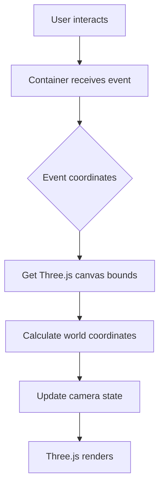

# Container Events Fix - Camera Controls Work in All Modes

## Problem

After the previous fix, camera controls **only worked in hybrid mode** but were **broken in Three.js-only mode**:

**Symptoms**:

-   ✅ Hybrid mode: All controls worked
-   ❌ Three.js-only mode: Only zoom worked, pan/rotate/orbit broken
-   User reported: "camera controls do not work in threejs mode apart from zoom"
-   User noted: "they were better several iterations ago"

## Root Cause

**Events Attached to Wrong Canvas**

Previous fix attached events to `canvas2D`:

```javascript
attachEvents() {
    const canvas = this.canvas2D; // Always 2D canvas
    canvas.addEventListener("wheel", this.handleWheel);
    // ...
}
```

**The Problem**:

-   **Hybrid mode**: 2D canvas on top (z:2) → ✅ Events fire
-   **Three.js-only mode**: 2D canvas behind (z:0) with `pointer-events: none` → ❌ Events blocked!

When `onlyShowThreeJS` is true:

```javascript
canvas.style.pointerEvents = "none"; // 2D canvas can't receive events
threeCanvas.style.zIndex = "2"; // Three.js on top
```

Events attached to 2D canvas never fire because it has `pointer-events: none`.

## Solution

**Attach Events to Container Element**

Instead of attaching to either canvas, attach to the **parent container** that holds both canvases. This works regardless of which canvas is on top or has pointer-events.

### Changes Made

**File**: `/Users/brentbuffhamair/Desktop/KIRRA-VITE-CLEAN/Kirra2D/src/three/CameraControls.js`

#### 1. Added Container Reference (Line 13)

```javascript
constructor(threeRenderer, canvas2D) {
    this.threeRenderer = threeRenderer;
    this.canvas2D = canvas2D;

    // Get the container that holds both canvases
    this.container = canvas2D.parentElement; // NEW!

    // ... rest of constructor
}
```

#### 2. Attach Events to Container (Lines 49-73)

**Before**:

```javascript
attachEvents() {
    const canvas = this.canvas2D; // Wrong - doesn't work in Three.js-only mode
    canvas.addEventListener("wheel", this.handleWheel);
    // ...
}
```

**After**:

```javascript
attachEvents() {
    // Attach to container that holds both canvases
    // This works regardless of which canvas is on top
    const container = this.container;

    container.addEventListener("wheel", this.handleWheel, { passive: false });
    container.addEventListener("mousedown", this.handleMouseDown);
    container.addEventListener("contextmenu", (e) => {
        e.preventDefault();
        return false;
    });

    document.addEventListener("mousemove", this.handleMouseMove);
    document.addEventListener("mouseup", this.handleMouseUp);
    container.addEventListener("mouseleave", this.handleMouseUp);

    container.addEventListener("touchstart", this.handleTouchStart, { passive: false });
    container.addEventListener("touchmove", this.handleTouchMove, { passive: false });
    container.addEventListener("touchend", this.handleTouchEnd);

    console.log("🎮 Camera controls attached to canvas container");
}
```

#### 3. Detach Events from Container (Lines 76-88)

Updated to remove events from container instead of canvas2D.

#### 4. Use Three.js Canvas for Calculations

Event listeners are on container, but coordinate calculations use Three.js canvas (since that's what we're controlling):

**Zoom Handler** (Line 117):

```javascript
const canvas = this.threeRenderer.getCanvas();
const rect = canvas.getBoundingClientRect();
```

**Rotation Handler** (Line 209):

```javascript
const canvas = this.threeRenderer.getCanvas();
const rect = canvas.getBoundingClientRect();
```

**Fit to View** (Line 344):

```javascript
const canvas = this.threeRenderer.getCanvas();
```

## How It Works

### Event Flow



### Container vs Canvas

**Container**: Parent `<div>` that holds both canvases

```html
<div class="canvas-container">  ← Container (events here)
    <canvas id="threeCanvas">   ← Three.js canvas
    <canvas id="canvas">        ← 2D canvas
</div>
```

**Benefits of Container Events**:

1. ✅ Works in all modes (hybrid, Three.js-only, 2D-only)
2. ✅ Not affected by canvas z-index changes
3. ✅ Not affected by pointer-events settings
4. ✅ Covers entire canvas area
5. ✅ Future-proof as 2D canvas is phased out

### Coordinate Calculations

Events captured on container, but calculations use Three.js canvas:

```javascript
// Event from container
handleWheel(event) {
    // But use Three.js canvas for bounds/size
    const canvas = this.threeRenderer.getCanvas();
    const rect = canvas.getBoundingClientRect();

    // Calculate mouse position relative to Three.js canvas
    const mouseX = event.clientX - rect.left;
    const mouseY = event.clientY - rect.top;

    // Calculate world coordinates
    const worldX = (mouseX - canvas.width / 2) / this.scale + this.centroidX;
    const worldY = -((mouseY - canvas.height / 2) / this.scale) + this.centroidY;

    // ... update camera
}
```

**Why This Works**:

-   Both canvases are same size and position
-   Container fills the same area
-   Event coordinates are identical for all three
-   Using Three.js canvas for calculations is correct (it's what we're controlling)

## Testing

### Test 1: Hybrid Mode (Default)

1. Load holes with both canvases visible
2. Try all controls:
    - Pan (drag)
    - Z-axis rotation (⌘/Ctrl + drag or right-click)
    - 3D orbit (Shift + ⌘/Ctrl + drag)
    - Zoom (scroll)
3. **Expected**: ✅ All controls work

### Test 2: Three.js-Only Mode

1. Toggle "Only Show Three.js" checkbox
2. Try all controls:
    - Pan (drag)
    - Z-axis rotation (⌘/Ctrl + drag or right-click)
    - 3D orbit (Shift + ⌘/Ctrl + drag)
    - Zoom (scroll)
3. **Expected**: ✅ All controls work
4. **Before**: ❌ Only zoom worked

### Test 3: Mode Switching

1. Start in hybrid mode
2. Pan/orbit to a specific view
3. Toggle to Three.js-only mode
4. Try controls
5. Toggle back to hybrid mode
6. Try controls
7. **Expected**: ✅ Controls work in both modes

### Test 4: Touch Gestures

1. On touch device (or browser dev tools touch emulation)
2. Try gestures in both modes:
    - Single finger pan
    - Two finger pinch zoom
3. **Expected**: ✅ Touch works in all modes

## Console Output

New console message:

```
🎮 Camera controls attached to canvas container
```

Previously:

```
🎮 Camera controls attached to 2D canvas (top layer)
```

## Architecture Diagram

```
┌─────────────────────────────────────┐
│  Canvas Container (div)             │  ← Events attached here
│  ┌───────────────────────────────┐  │
│  │  2D Canvas (z:2 or z:0)       │  │
│  └───────────────────────────────┘  │
│  ┌───────────────────────────────┐  │
│  │  Three.js Canvas (z:1 or z:2) │  │  ← Calculations use this
│  └───────────────────────────────┘  │
└─────────────────────────────────────┘

Event Flow:
Container → CameraControls → ThreeRenderer → Render
```

## Benefits

1. **Mode Independent**: Works in hybrid, Three.js-only, or 2D-only modes
2. **Z-Index Proof**: Not affected by canvas layering changes
3. **Pointer-Events Proof**: Not affected by pointer-events settings
4. **Future Ready**: As 2D canvas is phased out, controls still work
5. **Simpler Logic**: One attachment point, no mode switching needed
6. **Consistent Behavior**: Same controls work everywhere

## Why Previous Fixes Failed

**Iteration 1**: Attached to Three.js canvas

-   ❌ Blocked by 2D canvas in hybrid mode

**Iteration 2**: Attached to 2D canvas

-   ❌ Blocked when pointer-events: none in Three.js-only mode

**Iteration 3** (This Fix): Attached to container

-   ✅ Works in all modes!

## Related Files

**Modified**:

-   `/Users/brentbuffhamair/Desktop/KIRRA-VITE-CLEAN/Kirra2D/src/three/CameraControls.js` (Lines 13, 49-88, 117, 209, 344)

**Related**:

-   `/Users/brentbuffhamair/Desktop/KIRRA-VITE-CLEAN/Kirra2D/src/kirra.js` (Canvas container structure)

**Related Documentation**:

-   `EVENT_BLOCKING_FIX.md` - Previous (incorrect) fix
-   `CONTROL_IMPROVEMENTS.md` - Pan/rotate improvements
-   `ORBIT_CONTROLS_FIX.md` - Orbit implementation

## Status

✅ **FIXED** - Camera controls now work correctly in ALL modes:

-   ✅ Hybrid mode (2D + Three.js) - all controls
-   ✅ Three.js-only mode - all controls
-   ✅ All control types (pan, rotate, orbit, zoom)
-   ✅ All input methods (mouse, touch, wheel)
-   ✅ Future-proof for 2D canvas removal
