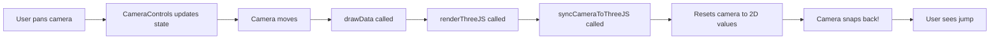
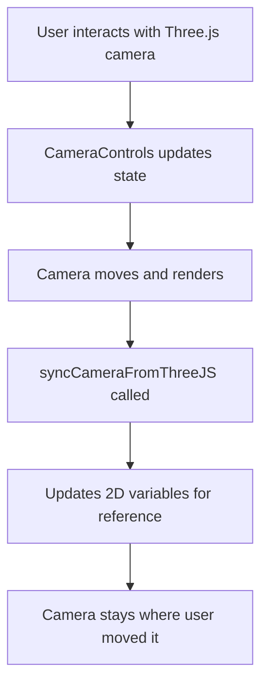

# Camera Sync Fix - Remove Conflicting State Override

## Problem

Camera was "fixated on a focus point" and would "jump back to top-down location" when panning, rotating, or orbiting. The camera seemed to try to move but would immediately snap back.

**User Description**:

-   "when panning the scene tries to move but the camera jumps back to its top-down location"
-   "this is the same with all other options and rotate 2d and rotate orbit"
-   "earlier the camera 2d rotate worked as did Pan. The only bit that wasn't implemented was orbit"

**Symptoms**:

-   Pan: Moves momentarily, then snaps back
-   Z-axis rotation: Rotates momentarily, then resets
-   3D orbit: Orbits momentarily, then snaps to top-down
-   All controls felt "sticky" or "rubber-banded"

## Root Cause

**Bidirectional Sync Conflict**

The `renderThreeJS()` function was calling `syncCameraToThreeJS()` before every render, which **overrode** the camera state that the user had just set with the controls.

### The Conflict Loop



### The Code Problem

**Line 12241** (before fix):

```javascript
function renderThreeJS() {
    if (threeInitialized && threeRenderer) {
        syncCameraToThreeJS(); // ← PROBLEM: Resets camera every render!
        threeRenderer.requestRender();
    }
}
```

**Line 485** - `syncCameraToThreeJS()`:

```javascript
function syncCameraToThreeJS() {
    if (threeInitialized && cameraControls) {
        const localCentroid = worldToThreeLocal(centroidX, centroidY);
        // Only 4 parameters! orbitX and orbitY get reset to 0!
        cameraControls.setCameraState(
            localCentroid.x,
            localCentroid.y,
            currentScale,
            currentRotation
            // Missing: orbitX, orbitY
        );
    }
}
```

**Why It Failed**:

1. User orbits camera → sets `orbitX = 0.5, orbitY = 0.3`
2. `drawData()` is called (happens constantly)
3. `renderThreeJS()` is called
4. `syncCameraToThreeJS()` is called
5. `setCameraState()` called with only 4 params
6. `orbitX` and `orbitY` default to `0` → camera snaps back!

The same happened for pan and rotation - the sync was constantly resetting the camera to the 2D canvas values.

## Solution

**Remove Bidirectional Sync**

Since we're focusing on Three.js controls and phasing out the 2D canvas, we removed the **TO Three.js** sync and kept only the **FROM Three.js** sync.

### Changes Made

**File**: `/Users/brentbuffhamair/Desktop/KIRRA-VITE-CLEAN/Kirra2D/src/kirra.js`

#### 1. Remove Sync from Render Loop (Line 12238)

**Before**:

```javascript
function renderThreeJS() {
    if (threeInitialized && threeRenderer) {
        // Step 14) Sync camera state before render
        syncCameraToThreeJS(); // ← REMOVED!
        threeRenderer.requestRender();
    }
}
```

**After**:

```javascript
function renderThreeJS() {
    if (threeInitialized && threeRenderer) {
        // Step 14) Just render - don't override camera state
        // Camera is controlled by CameraControls, not synced from 2D
        threeRenderer.requestRender();
    }
}
```

#### 2. Remove syncCameraToThreeJS Function (Line 480)

**Before**:

```javascript
function syncCameraToThreeJS() {
    if (threeInitialized && cameraControls) {
        const localCentroid = worldToThreeLocal(centroidX, centroidY);
        cameraControls.setCameraState(localCentroid.x, localCentroid.y, currentScale, currentRotation);
    }
}

function syncCameraFromThreeJS(cameraState) {
    /* ... */
}
```

**After**:

```javascript
// Step 9) Sync camera state FROM Three.js TO 2D variables
// This updates 2D variables when user interacts with Three.js camera
function syncCameraFromThreeJS(cameraState) {
    if (cameraState) {
        centroidX = cameraState.centroidX + threeLocalOriginX;
        centroidY = cameraState.centroidY + threeLocalOriginY;
        currentScale = cameraState.scale;

        if (cameraState.rotation !== undefined) {
            currentRotation = cameraState.rotation;
        }

        // Note: orbitX and orbitY are not synced to 2D (2D doesn't support orbit)
    }
}

// syncCameraToThreeJS removed - camera is controlled by CameraControls, not overridden from 2D
```

#### 3. Fix Initialization (Line 464)

**Before**:

```javascript
cameraControls.setCameraState(localCentroid.x, localCentroid.y, currentScale, 0);
// Only 4 params - orbitX and orbitY undefined!
```

**After**:

```javascript
// Initialize with default top-down view (rotation=0, orbitX=0, orbitY=0)
cameraControls.setCameraState(localCentroid.x, localCentroid.y, currentScale, 0, 0, 0);
```

## How It Works Now

### One-Way Sync Flow



**Key Points**:

1. **User controls Three.js camera** directly via CameraControls
2. **Camera state lives in CameraControls** (centroidX, centroidY, scale, rotation, orbitX, orbitY)
3. **Sync goes FROM Three.js TO 2D** for backwards compatibility only
4. **2D variables** (centroidX, centroidY, currentScale, currentRotation) are **read-only mirrors**
5. **No override** of Three.js camera from 2D values

### State Authority

```
Source of Truth: CameraControls
                     ↓
                  (syncs to)
                     ↓
            2D Variables (mirror)
```

**Before** (broken):

```
2D Variables ←sync→ CameraControls
   ↑ conflicting authority ↓
   └─────── fight! ─────────┘
```

**After** (fixed):

```
CameraControls (authority)
       ↓ sync
2D Variables (mirror only)
```

## Testing

### Test 1: Pan

1. Load holes in Three.js-only mode
2. Click and drag to pan
3. **Expected**: View pans smoothly without snapping back
4. **Before**: View would rubber-band back to start

### Test 2: Z-Axis Rotation

1. Hold ⌘/Ctrl (or right-click)
2. Drag to rotate
3. **Expected**: View rotates smoothly and stays rotated
4. **Before**: View would rotate then snap back to 0°

### Test 3: 3D Orbit

1. Hold Shift + ⌘/Ctrl
2. Drag to orbit
3. Look at scene from 45° angle
4. **Expected**: View stays at 45° angle
5. **Before**: View would orbit then snap back to top-down

### Test 4: Combined Operations

1. Pan to a location
2. Rotate 45°
3. Orbit to side view
4. Zoom in
5. Pan more
6. **Expected**: Each operation sticks, no snap-backs
7. **Before**: Constant snapping back after each operation

### Test 5: Persistent State

1. Set up a custom view (pan + rotate + orbit)
2. Add a new hole (triggers redraw)
3. **Expected**: View remains at your custom angle
4. **Before**: View would snap back to top-down

## Benefits

1. **Smooth Controls**: No more rubber-banding or snap-backs
2. **Persistent State**: Camera stays where you put it
3. **Orbit Works**: 3D orbit angles are preserved
4. **Less Complexity**: One-way sync is simpler
5. **Future Ready**: Prepares for removing 2D canvas entirely

## Why This Approach

**User's Insight**: "earlier the camera 2d rotate worked as did Pan"

The earlier implementation worked because:

-   There was no bidirectional sync fighting
-   Camera controls directly manipulated their own state
-   No override loop

**Why Sync Was Added (Incorrectly)**:

-   Trying to keep 2D and Three.js in perfect sync
-   But this created a conflict where neither had authority
-   The sync from 2D → Three.js was overriding user input

**Correct Approach**:

-   CameraControls is the authority for Three.js
-   Sync only goes FROM Three.js → 2D for reference
-   No override of camera state during render

## Backwards Compatibility

### 2D Variables Still Updated

The 2D variables (`centroidX`, `centroidY`, `currentScale`, `currentRotation`) are still updated when the Three.js camera moves:

```javascript
function syncCameraFromThreeJS(cameraState) {
    centroidX = cameraState.centroidX + threeLocalOriginX;
    centroidY = cameraState.centroidY + threeLocalOriginY;
    currentScale = cameraState.scale;
    currentRotation = cameraState.rotation;
}
```

**Why Keep This**:

-   2D canvas drawing code may still reference these
-   Text labels, UI overlays, etc. need position info
-   Smooth transition as 2D is phased out

### Orbit Not in 2D

`orbitX` and `orbitY` are **not** synced to 2D variables because:

-   2D canvas doesn't support 3D orbit
-   No 2D code needs these values
-   They live exclusively in CameraControls

## Console Output

No new console messages, but you'll notice:

-   Smoother camera movement
-   No snap-back behavior
-   Orbit angles persist
-   Camera stays where you move it

## Related Files

**Modified**:

-   `/Users/brentbuffhamair/Desktop/KIRRA-VITE-CLEAN/Kirra2D/src/kirra.js` (Lines 464, 480-499, 12238-12244)

**Related**:

-   `/Users/brentbuffhamair/Desktop/KIRRA-VITE-CLEAN/Kirra2D/src/three/CameraControls.js` (Camera state management)
-   `/Users/brentbuffhamair/Desktop/KIRRA-VITE-CLEAN/Kirra2D/src/three/ThreeRenderer.js` (Camera updates)

**Related Documentation**:

-   `CONTAINER_EVENTS_FIX.md` - Event attachment fixes
-   `ORBIT_CONTROLS_FIX.md` - Orbit implementation
-   `ROTATION_AND_SURFACE_FIXES.md` - Rotation persistence fixes

## Status

✅ **FIXED** - Camera no longer fights with sync, smooth controls work correctly:

-   ✅ Pan works without snap-back
-   ✅ Z-axis rotation stays applied
-   ✅ 3D orbit persists correctly
-   ✅ Zoom preserves all angles
-   ✅ Combined operations work smoothly
-   ✅ State persists across redraws
