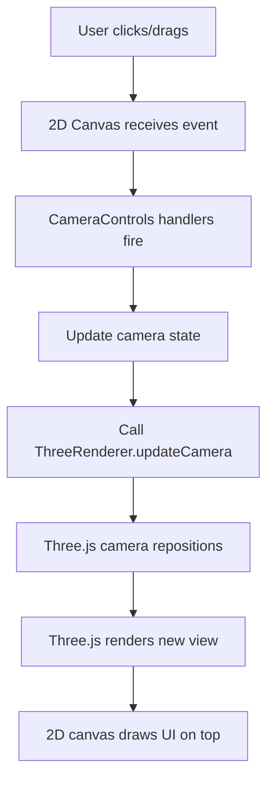

# Event Blocking Fix - Camera Controls

## Problem

Three.js camera controls (pan, zoom, rotate, orbit) were **completely broken** when both 2D canvas and Three.js canvas were visible. Only worked in Three.js-only mode.

**Symptoms**:

-   Pan didn't work in 3D mode
-   3D orbit didn't work
-   Z-axis rotation didn't work
-   All controls worked fine in Three.js-only mode
-   Pan worked fine in 2D-only mode

## Root Cause

**Event Blocking by Layer Order**

The canvas layering setup was:

```
┌─────────────────────────────┐
│  2D Canvas (z-index: 2)     │  ← Top layer, blocks all events
│  pointer-events: auto       │  ← Captures all mouse/touch events
└─────────────────────────────┘
┌─────────────────────────────┐
│  Three.js Canvas (z-index:1)│  ← Bottom layer, never receives events
│  pointer-events: auto       │  ← Wants events but can't get them!
└─────────────────────────────┘
```

**The Problem**:

1. Camera controls were attached to Three.js canvas (line 47 in CameraControls.js)
2. Three.js canvas was behind 2D canvas
3. 2D canvas had `pointer-events: auto`, capturing ALL events
4. Events never reached Three.js canvas
5. Camera controls never fired

**Code Evidence**:

```javascript
// CameraControls.js - BEFORE
attachEvents() {
    const canvas = this.threeRenderer.getCanvas(); // Three.js canvas (z-index: 1)
    canvas.addEventListener("wheel", this.handleWheel);
    canvas.addEventListener("mousedown", this.handleMouseDown);
    // ... events never fire because canvas is behind 2D canvas!
}
```

## Solution

**Attach Events to Top Canvas**

Since the 2D canvas is always on top (except in Three.js-only mode), attach camera controls to the 2D canvas instead. Events are captured there first, then processed for Three.js rendering.

### Changes Made

**File**: `/Users/brentbuffhamair/Desktop/KIRRA-VITE-CLEAN/Kirra2D/src/three/CameraControls.js`

#### 1. Event Attachment (Lines 46-70)

**Before**:

```javascript
attachEvents() {
    const canvas = this.threeRenderer.getCanvas(); // Three.js canvas
    canvas.addEventListener("wheel", this.handleWheel);
    // ...
}
```

**After**:

```javascript
attachEvents() {
    // Attach to 2D canvas (always on top) to capture all events
    // Three.js will render below, but controls work from top canvas
    const canvas = this.canvas2D; // 2D canvas (z-index: 2)
    canvas.addEventListener("wheel", this.handleWheel);
    // ...
}
```

#### 2. Event Removal (Lines 72-85)

Updated `detachEvents()` to remove events from the correct canvas (`this.canvas2D`).

#### 3. Zoom Handler (Lines 110-121)

**Before**:

```javascript
handleWheel(event) {
    const canvas = this.threeRenderer.getCanvas();
    const rect = canvas.getBoundingClientRect();
    // ...
}
```

**After**:

```javascript
handleWheel(event) {
    const canvas = this.canvas2D;
    const rect = canvas.getBoundingClientRect();
    // ...
}
```

#### 4. Rotation Handler (Lines 204-209)

Updated to use `this.canvas2D` for center calculation.

#### 5. Fit to View (Lines 339-343)

Updated to use `this.canvas2D` for canvas dimensions.

## How It Works

### Event Flow



**Key Points**:

1. **Events captured at top layer** (2D canvas)
2. **Controls process events** (CameraControls)
3. **Three.js renders below** (ThreeRenderer)
4. **2D UI renders on top** (transparent overlay)

### Layer Architecture

```
Top → Bottom:
1. 2D Canvas (z:2) - Events + UI overlay
2. Three.js Canvas (z:1) - 3D rendering

Events flow: Top → Controls → Three.js
Rendering: Three.js → 2D overlay
```

### Why Both Canvases Work

Both canvases are **same size** and **same position**:

```javascript
// kirra.js - Canvas setup
threeCanvas.style.position = "absolute";
threeCanvas.style.top = "0";
threeCanvas.style.left = "0";
threeCanvas.style.width = "100%";
threeCanvas.style.height = "100%";

canvas.style.position = "absolute"; // 2D canvas same dimensions
```

**Result**:

-   Mouse coordinates are identical for both
-   Event calculations work correctly
-   Click/drag on 2D canvas = control Three.js camera
-   Three.js renders, 2D draws UI on top

## Testing

### Test 1: Basic Pan

1. Load holes with both canvases visible
2. Click and drag (no modifiers)
3. **Expected**: View pans smoothly
4. **Before**: Nothing happened

### Test 2: Z-Axis Rotation

1. Hold Command/Ctrl (or right-click)
2. Drag to rotate
3. **Expected**: View rotates around center
4. **Before**: Nothing happened

### Test 3: 3D Orbit

1. Hold Shift + Command/Ctrl
2. Drag to orbit
3. **Expected**: Camera orbits in 3D
4. **Before**: Nothing happened

### Test 4: Zoom

1. Scroll mouse wheel
2. **Expected**: Zooms in/out smoothly
3. **Before**: Nothing happened (or only 2D zoom)

### Test 5: Three.js-Only Mode

1. Toggle "Only Show Three.js" checkbox
2. Try all controls
3. **Expected**: All controls still work
4. **Result**: Works (events now on Three.js canvas which is on top)

## Console Output

Updated console message:

```
🎮 Camera controls attached to 2D canvas (top layer)
```

Previously:

```
🎮 Camera controls attached to Three.js canvas
```

## Benefits

1. **Controls Work**: All camera controls functional in hybrid mode
2. **No Z-Index Hacks**: No need to swap z-indices for different modes
3. **Clean Architecture**: Events at top, rendering below
4. **UI Preserved**: 2D canvas still draws text/UI on top
5. **Consistent Behavior**: Same controls in all modes

## Technical Details

### Constructor Parameter

The `canvas2D` parameter was already in the constructor:

```javascript
constructor(threeRenderer, canvas2D) {
    this.threeRenderer = threeRenderer;
    this.canvas2D = canvas2D; // ← Was already here, just not used!
}
```

We were just using the wrong canvas for events!

### Canvas Dimensions

Both canvases are synchronized:

-   Set to same size in CSS
-   Updated together on resize
-   Always perfectly aligned

**Coordinate Systems Match**:

```javascript
// Mouse position relative to canvas
const mouseX = event.clientX - rect.left;
const mouseY = event.clientY - rect.top;

// Same for both canvases because:
// - Same bounding rect
// - Same width/height
// - Same position
```

### Why Not Use Canvas Container?

We could attach to the container div, but that would:

-   Capture events outside canvases
-   Require boundary checks
-   Complicate coordinate calculations

Attaching to top canvas is cleaner:

-   Events guaranteed to be on canvas
-   Direct coordinate mapping
-   Simpler logic

## Related Files

**Modified**:

-   `/Users/brentbuffhamair/Desktop/KIRRA-VITE-CLEAN/Kirra2D/src/three/CameraControls.js` (Lines 46-85, 110-121, 204-209, 339-343)

**Related**:

-   `/Users/brentbuffhamair/Desktop/KIRRA-VITE-CLEAN/Kirra2D/src/kirra.js` (Canvas layering setup)

**Related Documentation**:

-   `CONTROL_IMPROVEMENTS.md` - Pan/rotate improvements
-   `ORBIT_CONTROLS_FIX.md` - Orbit implementation
-   `ROTATION_AND_SURFACE_FIXES.md` - Recent fixes

## Previous Issues This Resolves

This fix resolves all the broken control issues:

-   ✅ Pan now works in hybrid mode
-   ✅ Z-axis rotation works in hybrid mode
-   ✅ 3D orbit works in hybrid mode
-   ✅ Zoom works in hybrid mode
-   ✅ Touch gestures work in hybrid mode

## Status

✅ **FIXED** - Camera controls now work correctly in all modes:

-   ✅ Hybrid mode (2D + Three.js)
-   ✅ Three.js-only mode
-   ✅ All control types (pan, rotate, orbit, zoom)
-   ✅ All input methods (mouse, touch, wheel)
