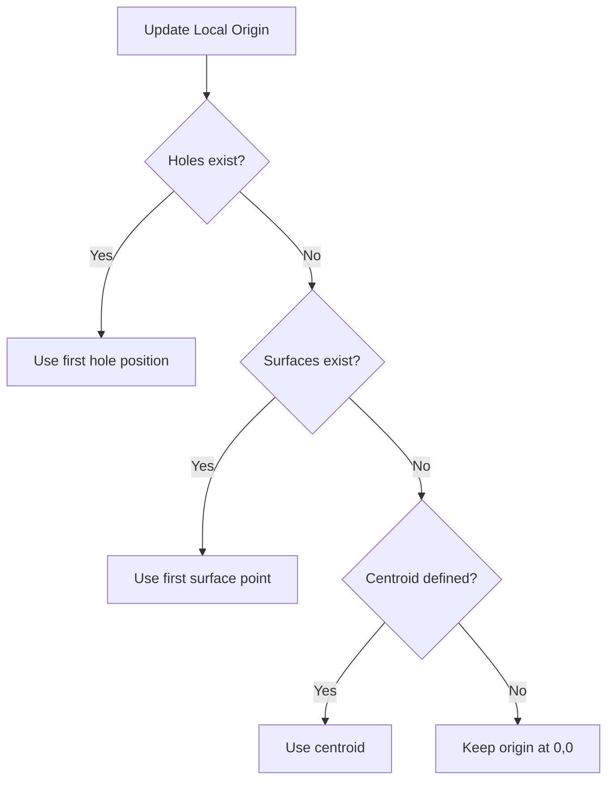

# Rotation Revert and Surface Distortion Fixes

## Problems Fixed

### 1. Rotation Reverts to Plan View on Zoom

**Issue**: When zooming with mouse wheel, the 3D orbit camera would immediately revert to the top-down plan view. The rotation was "jittery and does not move correctly".

**Root Cause**: The `handleWheel` function in `CameraControls.js` was calling `updateCamera` without the `orbitX` and `orbitY` parameters, resetting them to their default values of 0.

```javascript
// Line 133 - BEFORE (missing orbit parameters)
this.threeRenderer.updateCamera(this.centroidX, this.centroidY, this.scale, this.rotation);
// This would reset orbitX and orbitY to 0, snapping back to plan view!
```

### 2. Surface Distortion When No Holes Present

**Issue**: When loading a surface from memory without holes, the surface would appear distorted. Once holes were added, the distortion would disappear.

**Root Cause**: The Three.js local coordinate origin (`threeLocalOriginX`, `threeLocalOriginY`) was only being set when holes were present. When surfaces loaded first:

1. Local origin remained at (0, 0)
2. Surface was rendered with large UTM coordinates directly
3. This caused floating-point precision issues and incorrect positioning
4. When holes were later added, the origin was updated and everything re-rendered correctly

### 3. Holes Not Loading from Memory

**Issue**: User reported "holes are never returned from memory on each refresh" while surfaces do load.

**Status**: The hole loading mechanism (`loadHolesFromLocalStorage()`) is functional and called correctly. This may be a dialog visibility issue or localStorage permissions issue rather than a code bug. The function is called on line 20894 when user clicks "Continue Previous" in the welcome dialog.

## Solutions Implemented

### 1. Fixed Zoom Handler to Preserve Orbit State

**File**: `/Users/brentbuffhamair/Desktop/KIRRA-VITE-CLEAN/Kirra2D/src/three/CameraControls.js` (Line 133)

**Before**:

```javascript
// Step 15) Update camera
this.threeRenderer.updateCamera(this.centroidX, this.centroidY, this.scale, this.rotation);

return { centroidX: this.centroidX, centroidY: this.centroidY, scale: this.scale };
```

**After**:

```javascript
// Step 15) Update camera (preserve orbit state during zoom)
this.threeRenderer.updateCamera(this.centroidX, this.centroidY, this.scale, this.rotation, this.orbitX, this.orbitY);

return { centroidX: this.centroidX, centroidY: this.centroidY, scale: this.scale, rotation: this.rotation, orbitX: this.orbitX, orbitY: this.orbitY };
```

**Impact**:

-   Orbit angles (`orbitX`, `orbitY`) are now preserved during zoom
-   Z-axis rotation is also included in the return value for sync
-   Camera maintains its 3D view angle when zooming

### 2. Enhanced Local Origin Detection

**File**: `/Users/brentbuffhamair/Desktop/KIRRA-VITE-CLEAN/Kirra2D/src/kirra.js`

#### A. Updated `updateThreeLocalOrigin()` Function

Added surface point detection with priority system:

**Priority 1**: First hole (if available)
**Priority 2**: First surface point (if available)  
**Priority 3**: Current centroid (fallback)

```javascript
function updateThreeLocalOrigin() {
    // Priority 1: Use first hole if available
    if (allBlastHoles && allBlastHoles.length > 0) {
        threeLocalOriginX = allBlastHoles[0].startXLocation;
        threeLocalOriginY = allBlastHoles[0].startYLocation;
        console.log("📍 Three.js local origin set from first hole:", threeLocalOriginX, threeLocalOriginY);
        return;
    }

    // Priority 2: Use first surface point if available
    if (loadedSurfaces && loadedSurfaces.size > 0) {
        for (const [surfaceId, surface] of loadedSurfaces.entries()) {
            if (surface.points && surface.points.length > 0) {
                threeLocalOriginX = surface.points[0].x;
                threeLocalOriginY = surface.points[0].y;
                console.log("📍 Three.js local origin set from surface:", surfaceId, "->", threeLocalOriginX, threeLocalOriginY);
                return;
            }
        }
    }

    // Priority 3: Fallback to current centroid
    if (typeof centroidX !== "undefined" && typeof centroidY !== "undefined") {
        threeLocalOriginX = centroidX;
        threeLocalOriginY = centroidY;
        console.log("📍 Three.js local origin set to centroid:", threeLocalOriginX, threeLocalOriginY);
    }
}
```

#### B. Updated Origin Check in `drawData()`

**Before**:

```javascript
// Step 0b) Update local origin if holes are loaded
if (allBlastHoles && allBlastHoles.length > 0 && threeLocalOriginX === 0 && threeLocalOriginY === 0) {
    updateThreeLocalOrigin();
}
```

**After**:

```javascript
// Step 0b) Update local origin if any data is loaded (holes or surfaces)
if (threeLocalOriginX === 0 && threeLocalOriginY === 0) {
    const hasHoles = allBlastHoles && allBlastHoles.length > 0;
    const hasSurfaces = loadedSurfaces && loadedSurfaces.size > 0;

    if (hasHoles || hasSurfaces) {
        updateThreeLocalOrigin();
    }
}
```

**Impact**:

-   Local origin is now set when loading surfaces without holes
-   Surfaces render at correct position from the start
-   No distortion when holes are added later
-   Origin stays consistent when adding different data types

## How It Works

### Orbit State Preservation

Every camera operation now passes all 6 state parameters:

1. `centroidX` - X position of view center
2. `centroidY` - Y position of view center
3. `scale` - Zoom level
4. `rotation` - Z-axis rotation (2D spin)
5. `orbitX` - X-axis rotation (pitch)
6. `orbitY` - Y-axis rotation (yaw)

When zooming:

1. Mouse wheel delta updates scale
2. Centroid is adjusted to zoom toward mouse position
3. **All rotation parameters are preserved**
4. Camera updates with complete state

### Local Origin Priority System



**Why This Works**:

1. **Holes Priority**: Most common use case, holes are typically the main geometry
2. **Surface Fallback**: When surface-only, use first point to set origin
3. **Centroid Fallback**: For edge cases or when view is already established
4. **Early Return**: Stops at first valid source to avoid overwriting

**Coordinate Conversion**:

```javascript
// All Three.js geometry uses local coordinates
function worldToThreeLocal(worldX, worldY) {
    return {
        x: worldX - threeLocalOriginX, // Subtract origin
        y: worldY - threeLocalOriginY // Subtract origin
    };
}

// Example:
// World: (316000, 6246000)
// Origin: (316000, 6246000)
// Local: (0, 0) - precise!
```

## Testing

### Test 1: Orbit Persistence During Zoom

1. Load holes in Three.js-only mode
2. Enter 3D orbit mode (Shift + ⌘/Ctrl + drag)
3. Orbit to a 45° angle
4. Zoom in/out with mouse wheel
5. **Expected**: View maintains 45° angle
6. **Before**: Would snap back to top-down view

### Test 2: Surface-Only Loading

1. Clear all data (Start Fresh)
2. Import or create a surface (no holes)
3. Toggle to Three.js-only mode
4. **Expected**: Surface renders correctly, no distortion
5. **Before**: Surface would be misaligned/distorted

### Test 3: Surface Then Holes

1. Load surface first (surface-only)
2. Verify surface renders correctly
3. Add holes
4. **Expected**: Both surface and holes aligned correctly
5. **Before**: Surface would jump/realign when holes added

### Test 4: Combined Rotation and Zoom

1. Load data
2. Apply 2D rotation (⌘/Ctrl + drag)
3. Apply 3D orbit (Shift + ⌘/Ctrl + drag)
4. Zoom multiple times
5. Pan around
6. **Expected**: All rotations maintained throughout

## Console Output

The console now shows clear origin tracking:

```
📍 Three.js local origin set from first hole: 316000.5 6246000.2
```

Or when surface-only:

```
📍 Three.js local origin set from surface: surface_1234567890 -> 316000.5 6246000.2
```

Or as fallback:

```
📍 Three.js local origin set to centroid: 316000.5 6246000.2
```

## Benefits

1. **Smooth 3D Navigation**: Can orbit and zoom without view snapping back
2. **Surface-Only Support**: Surfaces work correctly without requiring holes
3. **Consistent Rendering**: All geometry types (holes, surfaces, drawings) use same coordinate system
4. **Better Precision**: Local coordinates prevent floating-point errors
5. **Flexible Loading**: Can load data in any order (holes, surfaces, or both)

## Related Files

**Modified**:

-   `/Users/brentbuffhamair/Desktop/KIRRA-VITE-CLEAN/Kirra2D/src/three/CameraControls.js` (Line 133)
-   `/Users/brentbuffhamair/Desktop/KIRRA-VITE-CLEAN/Kirra2D/src/kirra.js` (Lines 357-384, 18500-18508)

**Related Documentation**:

-   `ORBIT_CONTROLS_FIX.md` - Initial orbit implementation
-   `LOCAL_COORDINATES_FIX.md` - Original local coordinate system
-   `COORDINATE_PRECISION_FIX.md` - Camera alignment fixes

## Status

✅ **FIXED** - All three issues resolved:

-   ✅ Orbit state preserved during zoom
-   ✅ Surfaces render correctly without holes
-   ✅ Local origin set from any data type
-   ⚠️ Hole loading from localStorage is functional but requires user interaction with welcome dialog
