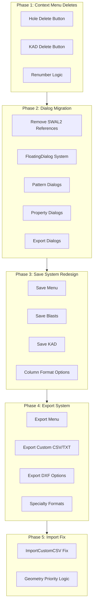

# Kirra2D Modernization & Save/Export Reorganization Plan

**Date**: 2025-12-20  
**Time**: 14:30  
**Status**: 📋 DESIGN COMPLETE - READY FOR IMPLEMENTATION

---

## Architecture Overview



---

## Kirra2D Coding Standards & Rules

**CRITICAL**: All implementation must follow these established rules:

### Factory Code & Reuse Principles
1. **Use Established Factory Code**: NEVER recreate functionality that already exists
   - Use `GeometryFactory` class for all 3D hole visualization (collar/grade/lines)
   - Use `window.createEnhancedFormContent()` for all dialog forms
   - Use `window.getFormData()` for form data extraction
   - Use `window.showConfirmationDialog()` for yes/no prompts
   - Use `window.FloatingDialog` for ALL dialogs (NO Swal2)
   - Use `window.calculateHoleGeometry()` for geometry calculations
   - Use `window.renumberHolesFunction()` for hole renumbering
   - Use `window.renumberEntityPoints()` for KAD point renumbering

2. **Reuse Existing Functions**: Before writing new code, check for:
   - Save functions: `debouncedSaveHoles()`, `debouncedSaveKAD()`
   - Update functions: `debouncedUpdateTreeView()`, `updateStatusMessage()`
   - Drawing functions: `drawData()`, `clearAllSelectionState()`
   - Validation functions: Check kirra.js for existing patterns

### Coordinate System & 3D Rules
3. **ThreeJS Coordinate Transform**:
   - Use same XY transform as 2D (data centroid at 0,0)
   - Do NOT scale 3D transform
   - Do NOT transform Z elevations
   - Selection in 3D is a tunnel (fat raycast from camera to infinity)

4. **Camera Controls**:
   - Orbit in 3D around Mouse Screen XY and Data Z centroid
   - Zoom to same Mouse Screen XY and Data Z centroid
   - Pan is the default mode

5. **Canvas Coordinate Convention**:
   - Y up is North (+ve), Y down is South (-ve)
   - X East is +ve, X West is -ve
   - Kirra is a UTM-styled real-world coordinate app

### Data Handling
6. **Large Coordinate Values**:
   - Data can be very large (UTM coordinates)
   - Always transform based on data centroid (centroid = 0,0)
   - Check 3D entities are in correct coordinate space before drawing

7. **Bearing Convention**:
   - Bearing moves clockwise
   - North is 0°, East is 90°, South is 180°, West is 270°

### Code Style & Quality
8. **No Template Literals**: ALWAYS use `"string " + variable` instead of `` `string ${variable}` ``

9. **Step Comments**: Add `// Step #)` comments to make code easy to follow

10. **Verbose Comments**: When removing code, provide verbose comment explaining why

11. **Line Numbers in Suggestions**: Provide line numbers or ranges for all code references

12. **FloatingDialog for All Dialogs**:
    - Use `FloatingDialog` class for all dialogs
    - Swal2 is a backup only (avoid if possible)

13. **AI Commentary**:
    - Save all AI commentary to `src/aiCommentary/` folder
    - Format: `YYYYMMDD-hhmm-Name.md`
    - Maintain chronological knowledge

### Geometry Calculation Priority
14. **Accuracy Hierarchy** (from README.md):
    - Direct Z measurements (±0.01m) - HIGHEST ACCURACY
    - 2D XY calculations (±0.5°)
    - 3D compound calculations (±0.02m)
    - Inverse trig (±1°, poor near vertical)
    - Interpolations (±0.05m to ±0.5m) - LOWEST ACCURACY

15. **When Conflicts Arise**: Use most accurate method (see Phase 5.2)

---

## Phase 1: Context Menu Delete Buttons

### 1.1 Holes Context Menu Delete Button

**File**: `src/dialog/contextMenu/HolesContextMenu.js`

**Changes**:
- Add `showOption2: true` and `option2Text: "Delete"` to FloatingDialog options (line ~327)
- Implement `onOption2` callback with renumber prompt

**Multiple Selection Support**:
- If multiple holes selected (`holes.length > 1`): Delete all selected holes
- If single hole selected: Delete that hole
- Use `window.showConfirmationDialog()` to ask: "Renumber holes after delete?" (Yes/No)
  - **Yes**: Call `window.renumberHolesFunction(deleteRenumberStart, entityName)` after deletion
  - **No**: Just delete without renumbering

**Delete Logic**:
```javascript
onOption2: () => {
    // Delete all holes in the 'holes' array (single or multiple)
    const entitiesToRenumber = new Set();
    
    holes.forEach((hole) => {
        const index = window.allBlastHoles.findIndex(h => 
            h.holeID === hole.holeID && h.entityName === hole.entityName
        );
        if (index !== -1) {
            window.allBlastHoles.splice(index, 1);
            entitiesToRenumber.add(hole.entityName);
        }
    });
    
    // Ask if user wants to renumber
    window.showConfirmationDialog(
        "Renumber Holes?",
        "Do you want to renumber holes after deletion?",
        "Yes",
        "No",
        () => {
            // Renumber each affected entity
            entitiesToRenumber.forEach(entityName => {
                window.renumberHolesFunction(window.deleteRenumberStart, entityName);
            });
            window.debouncedSaveHoles();
            window.debouncedUpdateTreeView();
            window.drawData(window.allBlastHoles, window.selectedHole);
        },
        () => {
            // Just save and redraw without renumbering
            window.debouncedSaveHoles();
            window.debouncedUpdateTreeView();
            window.drawData(window.allBlastHoles, window.selectedHole);
        }
    );
    
    dialog.close();
}
```

**Reference Existing Functions**:
- ✅ **USE FACTORY CODE**: `renumberHolesFunction(startNumber, selectedEntityName)` - line 18327 in kirra.js
- ✅ **USE FACTORY CODE**: `debouncedSaveHoles()` - existing function (DO NOT RECREATE)
- ✅ **USE FACTORY CODE**: `debouncedUpdateTreeView()` - existing function (DO NOT RECREATE)
- ✅ **USE FACTORY CODE**: `window.showConfirmationDialog()` - existing dialog function (DO NOT RECREATE)
- Pattern: See existing delete logic around line 18200 in kirra.js

---

### 1.2 KAD Context Menu Delete Button

**File**: `src/dialog/contextMenu/KADContextMenu.js`

**Changes**:
- Add `showOption2: true` and `option2Text: "Delete"` to FloatingDialog options (line ~166)
- Implement `onOption2` callback to delete point/segment/element

**Multiple Selection Support**:
- The KAD context menu currently only shows for **single element selection** (one point or segment)
- No multiple selection support needed for KAD (different from holes)
- Always auto-renumber after deletion (no prompt needed)

**Delete Logic**:
```javascript
onOption2: () => {
    const entity = window.getEntityFromKADObject(kadObject);
    if (!entity) return;
    
    let deletionIndex = kadObject.elementIndex;
    
    // For segment selections, delete the endpoint (next point)
    const isLineOrPolySegment = (kadObject.entityType === "line" || kadObject.entityType === "poly") && 
                                 kadObject.selectionType === "segment";
    if (isLineOrPolySegment) {
        const isPoly = kadObject.entityType === "poly";
        const numPoints = entity.data.length;
        deletionIndex = isPoly ? (deletionIndex + 1) % numPoints : deletionIndex + 1;
    }
    
    // Remove the point/vertex
    entity.data.splice(deletionIndex, 1);
    
    // Handle edge cases
    if (entity.data.length === 0) {
        // Delete entire entity if no points left
        window.allKADDrawingsMap.delete(kadObject.entityName);
        window.updateStatusMessage("Deleted entity " + kadObject.entityName);
    } else if (entity.data.length === 1 && (entity.entityType === "line" || entity.entityType === "poly")) {
        // Delete entity if only 1 point remains in line/poly
        window.allKADDrawingsMap.delete(kadObject.entityName);
        window.updateStatusMessage("Deleted entity " + kadObject.entityName + " (insufficient points)");
    } else if (entity.data.length === 2 && entity.entityType === "poly") {
        // Convert poly to line if only 2 points remain
        entity.entityType = "line";
        entity.data.forEach(point => {
            point.entityType = "line";
            point.closed = false;
        });
        window.updateStatusMessage("Converted " + kadObject.entityName + " to line (2 points)");
        // Auto-renumber remaining points
        window.renumberEntityPoints(entity);
    } else {
        // Normal case: just renumber
        window.renumberEntityPoints(entity);
        window.updateStatusMessage("Deleted point from " + kadObject.entityName);
    }
    
    // Save and redraw
    window.debouncedSaveKAD();
    window.debouncedUpdateTreeView();
    window.clearAllSelectionState();
    window.drawData(window.allBlastHoles, window.selectedHole);
    
    dialog.close();
    setTimeout(() => window.updateStatusMessage(""), 2000);
}
```

**Reference Existing Functions**:
- ✅ **USE FACTORY CODE**: `renumberEntityPoints(entity)` - line 18096 in kirra.js (already exists!)
- ✅ **USE FACTORY CODE**: `deleteObjectInMap(map, pointToDelete)` - line 18107 in kirra.js
- ✅ **USE FACTORY CODE**: `window.debouncedSaveKAD()` - DO NOT RECREATE
- ✅ **USE FACTORY CODE**: `window.clearAllSelectionState()` - DO NOT RECREATE
- Use existing KAD deletion pattern

**Button Layout** (for both menus):
```
[Option2: Delete] [Option1: Hide] [Cancel] [Confirm/Apply]
```

---

## Phase 2: Complete SWAL2 to FloatingDialog Migration

### 2.1 Fix Export Statement Syntax Error

**Issue**: `Uncaught SyntaxError: Unexpected token 'export'`

**Root Cause**: kirra.js is loaded as a regular script (not ES6 module), but contains ES6 export statements.

**Solution**:
1. Remove all `export` statements from kirra.js
2. Ensure all functions are exposed via `window.functionName = functionName`
3. Check HTML to ensure scripts are loaded with `type="module"` if using ES6 imports

---

### 2.2 Extract Pattern Dialogs

**File**: Create `src/dialog/popups/generic/HolePatternDialogsImpl.js`

**Functions to Extract from kirra.js**:
1. `addHolePopup()` - line ~19135 (337 lines)
2. `addPatternPopup(worldX, worldY)` - line ~19510
3. `showHolesAlongLinePopup()` - line ~32403
4. `showPatternInPolygonPopup()` - line ~33009
5. `showHolesAlongPolylinePopup(vertices)` - line ~33812

**Conversion Pattern**:
- Replace all `Swal.fire({...})` with `new FloatingDialog({...})`
- Convert template literals to string concatenation: `` `Hello ${name}` `` → `"Hello " + name`
- Replace `Swal.getPopup().querySelector()` with dialog content manipulation
- ✅ **USE FACTORY CODE**: `window.createEnhancedFormContent(fields)` for form generation
- ✅ **USE FACTORY CODE**: `window.getFormData(formContent)` for form data extraction
- Test all validation logic after conversion

**CRITICAL**: Do NOT recreate form builders - use existing `createEnhancedFormContent()`!

---

### 2.3 Extract Property Dialogs

**File**: Create `src/dialog/popups/generic/HolePropertyDialogsImpl.js`

**Functions to Extract**:
1. `editBlastNamePopup()`
2. `editHoleTypePopup()`
3. `editHoleLengthPopup()`
4. `measuredLengthPopup()`
5. `measuredMassPopup()`
6. `measuredCommentPopup()`
7. `renameEntityDialog()`

**Same conversion pattern as 2.2**

---

### 2.4 Extract Export Dialogs

**File**: `src/dialog/popups/generic/ExportDialogs.js` (already exists as placeholder)

**Functions to Extract**:
1. `saveIREDESPopup()` - line ~18728 (150+ lines)
2. `saveAQMPopup()` - line ~(find exact location)

**Complex HTML Templates**: These have 150+ line Swal templates that need careful conversion

---

### 2.5 Extract KAD Dialogs

**File**: Create `src/dialog/popups/generic/KADDialogsImpl.js`

**Functions to Extract**:
1. `showKADPropertyEditorPopup()` - Already done! (in KADContextMenu.js)
2. `showOffsetKADPopup()`
3. `showRadiiConfigPopup()`
4. `showTriangulationPopup()`

---

## Phase 3: Save System Redesign

### 3.1 Save Menu Architecture

**New Menu Structure** (HTML):
```
File > Save >
  ├── Save All Blasts (All Entities)
  ├── Save Current Blast (Single Entity)
  ├── Save Visible Blasts Only
  ├── Save KAD Entities
  │   ├── Save All KAD
  │   ├── Save Selected KAD
  │   └── Save Visible KAD
  └── Save Format ▶
      ├── 4 Column (ID, X, Y, Z)
      ├── 7 Column (+ ToeXYZ)
      ├── 9 Column (+ Diameter, Type)
      ├── 12 Column (+ FromHole, Delay, Color)
      ├── 14 Column (+ EntityName, EntityType) [Default]
      ├── 30 Column (Extended)
      ├── 32 Column (Full)
      └── 35 Column (Complete)
```

### 3.2 Save Implementation

**File**: Create `src/dialog/popups/generic/SaveDialogs.js`

**CRITICAL - Use Factory Code**:
- ✅ **USE**: `window.createEnhancedFormContent(fields)` - DO NOT recreate form builder
- ✅ **USE**: `window.getFormData(formContent)` - DO NOT recreate form extractor
- ✅ **USE**: `window.FloatingDialog` - DO NOT use Swal2
- ✅ **USE**: Existing CSV generation functions (check kirra.js for `saveKirraCSV` patterns)

**Implementation Pattern**:
```javascript
// Step 1) Use Factory Code for form creation
const fields = [
    { label: "Save Scope", name: "saveScope", type: "radio", value: "all", options: [...] },
    { label: "Format", name: "columnFormat", type: "select", value: "14", options: [...] }
];

// Step 2) USE FACTORY CODE - Do NOT recreate
const formContent = window.createEnhancedFormContent(fields);

// Step 3) USE FACTORY CODE - Do NOT recreate
const dialog = new window.FloatingDialog({
    title: "Save Blast Holes",
    content: formContent,
    onConfirm: () => {
        const formData = window.getFormData(formContent);  // USE FACTORY CODE
        saveBlastHoles(formData.saveScope, formData.columnFormat);
    }
});
```

**Column Format Reference** (README.md lines 88-112):
- 4 column: ID, X, Y, Z
- 7 column: ID, X, Y, Z, toeX, toeY, toeZ
- 9 column: + Diameter, Type
- 12 column: + FromHole, Delay, Color
- 14 column: + entityName, entityType (current full format)
- 30, 32, 35 column: Extended formats (need to define)

---

## Phase 4: Export System Redesign

### 4.1 Export Menu Architecture

**New Menu Structure**:
```
File > Export >
  ├── Export Custom CSV/TXT (Column Picker)
  ├── Export DXF ▶
  │   ├── Standard DXF (Holes)
  │   ├── Vulcan Compatible DXF (Holes)
  │   ├── DXF Entities (KAD Objects)
  │   └── DXF 3DFaces (Surfaces)
  ├── Export Surfaces ▶
  │   ├── Point Clouds (.xyz, .txt)
  │   ├── Surpac DTM (2 files, non-binary)
  │   ├── OBJ (Textured)
  │   └── OBJ (Blank)
  ├── Export Images ▶
  │   └── GeoTIFF
  ├── Export CBLAST
  ├── Export IREDES (Epiroc)
  └── Export AQM (MineStar)
```

### 4.2 Key Export Formats

**4.2.1 Export Custom CSV/TXT**
- ✅ **USE FACTORY CODE**: Reuse column mapping UI from `importCustomCSV` (DO NOT RECREATE)
- ✅ **USE FACTORY CODE**: `window.createEnhancedFormContent()` for dialog forms
- User picks which of 35 available columns to export
- Column order selection
- Preview first 5 rows before export
- Delimiter selection (comma, tab, semicolon, pipe)

**4.2.2 Vulcan Compatible DXF** (Reference: `src/referenceFiles/HoleToVulcanDXF-VBA.bas`)
- Add Vulcan-specific XData (Extended Entity Data)
- Include APPID table for MAPTEK_VULCAN
- Use proper DXF header with EXTMIN/EXTMAX
- Color code 140 for red holes

**4.2.3 CBLAST Export** (Reference: `src/referenceFiles/CBLASTExport.bas`)
- Format: HOLE, PRODUCT, DETONATOR, STRATA records
- Angle = 90 - Dip
- Handle "DO NOT CHARGE" holes
- Escape commas in string fields

---

## Phase 5: Fix importCustomCSV Geometry Conflicts

### 5.1 Problem Analysis

**Issue**: When import CSV provides CollarXYZ, GradeXYZ, ToeXYZ, Length, Subdrill - conflicts arise

**Conflicts**:
1. GradeZ vs Subdrill: Both try to calculate BenchHeight
2. Length vs calculated from coordinates

**Working Import**: CollarXYZ + Angle + Bearing + Length + Subdrill (no conflicts)

### 5.2 Geometry Priority Hierarchy

**Priority Order** (Most Accurate → Least Accurate):
1. **Direct Z measurements**: BenchHeight, SubdrillAmount, VerticalDrop (±0.01m)
2. **2D XY calculations**: HoleBearing (±0.5°)
3. **3D compound**: HoleLength (±0.02m)
4. **Inverse trig**: HoleAngle (±1°, poor near vertical)
5. **Interpolations**: GradeXY (±0.05m to ±0.5m)

### 5.3 Import Resolution Strategy

**Solution**: Implement scenario detection logic that prioritizes coordinate-based calculations when full survey data (CollarXYZ + GradeXYZ + ToeXYZ) is available.

**Implementation**:
1. Add conflict detection in column mapping stage
2. Show visual indicators (⚠️) next to conflicting columns
3. Provide tooltip explaining which values will be used
4. Add checkbox: "Use coordinates (recommended)" vs "Use length/subdrill values"
5. Log decisions to console for debugging

### 5.4 Calculation Function Updates

**Add Mode 9 to calculateHoleGeometry**: Recalculate from coordinates

**CRITICAL - Use Factory Code**:
- ✅ **EXTEND** existing `window.calculateHoleGeometry(hole, value, modeLAB)` function
- ✅ **DO NOT RECREATE** - Add Mode 9 to existing function at line 21128 in kirra.js

```javascript
// Add to existing calculateHoleGeometry function
if (modeLAB === 9) {
    // Step 1) Recalculate everything from CollarXYZ, GradeXYZ, ToeXYZ
    const dx = hole.endXLocation - hole.startXLocation;
    const dy = hole.endYLocation - hole.startYLocation;
    const dz = hole.startZLocation - hole.endZLocation; // VerticalDrop
    
    // Step 2) Most accurate calculations (Priority 1: Direct Z measurements)
    hole.holeLengthCalculated = Math.sqrt(dx*dx + dy*dy + dz*dz);
    hole.benchHeight = hole.startZLocation - hole.gradeZLocation;
    hole.subdrillAmount = hole.gradeZLocation - hole.endZLocation;
    
    // Step 3) Angle and bearing calculations
    hole.holeAngle = Math.acos(dz / hole.holeLengthCalculated) * (180 / Math.PI);
    hole.holeBearing = (450 - Math.atan2(dx, dy) * (180 / Math.PI)) % 360;
}
```

**Benefits**:
- Calculate Length, Angle, Bearing from CollarXYZ/ToeXYZ
- Calculate BenchHeight from CollarZ - GradeZ (±0.01m accuracy)
- Calculate Subdrill from GradeZ - ToeZ (±0.01m accuracy)
- Most accurate approach for survey data

---

## Testing Checklist

### Phase 1 Testing:
- [ ] Delete single hole (with renumber prompt)
- [ ] Delete single hole (without renumber)
- [ ] **Delete multiple holes (with renumber prompt)**
- [ ] **Delete multiple holes (without renumber)**
- [ ] **Delete multiple holes from different entities**
- [ ] Delete KAD point (auto-renumber)
- [ ] Delete KAD segment (auto-renumber)
- [ ] Delete entire KAD entity (only 1 point left)
- [ ] Convert poly to line (only 2 points left)
- [ ] Verify IndexedDB persistence
- [ ] Verify TreeView updates

### Phase 2 Testing:
- [ ] All pattern dialogs work with FloatingDialog
- [ ] All property dialogs work
- [ ] All export dialogs work
- [ ] No SWAL2 references remain
- [ ] No export statement errors

### Phase 3 Testing:
- [ ] Save All Blasts (all formats)
- [ ] Save Current Blast
- [ ] Save Visible Only
- [ ] Save KAD (all, selected, visible)
- [ ] Verify all column formats generate correctly

### Phase 4 Testing:
- [ ] Export Custom CSV with column picker
- [ ] Export Standard DXF
- [ ] Export Vulcan DXF (verify XData)
- [ ] Export DXF Entities
- [ ] Export DXF 3DFaces
- [ ] Export surfaces (all formats)
- [ ] Export CBLAST (verify format)
- [ ] Export IREDES
- [ ] Export AQM

### Phase 5 Testing:
- [ ] Import CollarXYZ + GradeXYZ + ToeXYZ (coordinates priority)
- [ ] Import CollarXYZ + Angle + Bearing + Length + Subdrill (design priority)
- [ ] Import with conflicts shows warning
- [ ] Verify conflict resolution uses coordinate-based calculations
- [ ] Verify holes have correct geometry after import

---

## File Structure After Implementation

```
src/
├── dialog/
│   ├── FloatingDialog.js (existing)
│   ├── contextMenu/
│   │   ├── HolesContextMenu.js (updated: add Delete button)
│   │   └── KADContextMenu.js (updated: add Delete button)
│   └── popups/
│       └── generic/
│           ├── SaveDialogs.js (NEW)
│           ├── ExportCustomCSVDialog.js (NEW)
│           ├── ExportDXFDialog.js (NEW)
│           ├── ExportSurfacesDialog.js (NEW)
│           ├── ExportCBLASTDialog.js (NEW)
│           ├── ExportIREDESDialog.js (NEW)
│           ├── ExportAQMDialog.js (NEW)
│           ├── HolePatternDialogsImpl.js (NEW)
│           ├── HolePropertyDialogsImpl.js (NEW)
│           └── KADDialogsImpl.js (NEW)
└── kirra.js (updated: remove extracted functions, fix import conflicts)
```

---

## Implementation Notes

**CRITICAL - Follow Kirra2D Coding Standards (see above)**

### Code Reuse Requirements
1. **Use Factory Code - DO NOT RECREATE**:
   - ✅ `GeometryFactory.createHole()` for 3D holes
   - ✅ `window.createEnhancedFormContent(fields)` for all forms
   - ✅ `window.getFormData(formContent)` for form extraction
   - ✅ `window.FloatingDialog` for ALL dialogs (NO Swal2)
   - ✅ `window.showConfirmationDialog()` for yes/no prompts
   - ✅ `window.calculateHoleGeometry(hole, value, mode)` for geometry
   - ✅ `window.renumberHolesFunction()` / `window.renumberEntityPoints()`

### Mandatory Patterns
2. **No ES6 Exports**: All new dialog files expose via `window.functionName = functionName`

3. **String Concatenation Only**: NEVER use template literals `` `string ${var}` ``
   - ❌ BAD: `"Deleted " + count + " holes"`
   - ✅ GOOD: "Deleted " + count + " holes"

4. **FloatingDialog Consistency**: All dialogs use FloatingDialog class, not Swal2

5. **Step Comments**: Add `// Step #)` comments to all functions for readability

6. **Verbose Removal Comments**: When removing code, explain why in detail

### Data Management
7. **IndexedDB Persistence**: Always call `debouncedSaveHoles()` or `debouncedSaveKAD()` after data changes

8. **TreeView Updates**: Always call `debouncedUpdateTreeView()` after entity changes

9. **User Feedback**: Use `window.updateStatusMessage()` for all operations with 2-second auto-clear

10. **Validation**: Maintain all existing validation logic during dialog migration

### Coordinate System
11. **UTM Data Handling**: Transform large coordinates to centroid (0,0)

12. **3D Transform**: Use same XY transform as 2D, do NOT scale, do NOT transform Z

13. **Bearing**: Clockwise from North (0° = North, 90° = East, 180° = South, 270° = West)

### AI Commentary
14. **Documentation**: Save implementation notes to `src/aiCommentary/YYYYMMDD-hhmm-Name.md`

---

## Research Required

Before implementing Phase 4:
1. **Surpac DTM Format**: ASCII format specification for .str and .dtm files
2. **GeoTIFF Export**: Canvas to GeoTIFF conversion library (geotiff.js?)
3. **IREDES Format**: Verify current XML structure is correct
4. **AQM Format**: Verify current format specification

---

## Risk Mitigation

1. **Large Refactor**: Extract dialogs one at a time, test thoroughly before moving to next
2. **Data Loss**: Ensure all save/export functions are non-destructive and preserve data
3. **Backward Compatibility**: Test loading old KIRRA CSV files after import fix
4. **Performance**: Test large datasets (1000+ holes) with new save/export system

---

## Summary

This comprehensive plan modernizes Kirra2D by:
1. ✅ Adding Delete functionality to context menus with proper multi-selection support
2. ✅ Completing SWAL2 to FloatingDialog migration for consistency
3. ✅ Reorganizing Save system with multiple column format options
4. ✅ Creating comprehensive Export system with 10+ formats (CBLAST, Vulcan DXF, surfaces, etc.)
5. ✅ Fixing importCustomCSV geometry conflicts using accuracy-based priority logic

**CRITICAL SUCCESS FACTORS**:
- ✅ Use Factory Code - DO NOT recreate existing functionality
- ✅ Follow all Kirra2D Coding Standards (see above)
- ✅ Use `GeometryFactory` for 3D visualization
- ✅ Use `createEnhancedFormContent()` for all forms
- ✅ Use `FloatingDialog` for ALL dialogs (NO Swal2)
- ✅ String concatenation ONLY (no template literals)
- ✅ Step comments for readability

**Total Estimated Implementation Time**: 40-60 hours across 5 phases  
**Priority**: Design complete - ready for phased implementation

