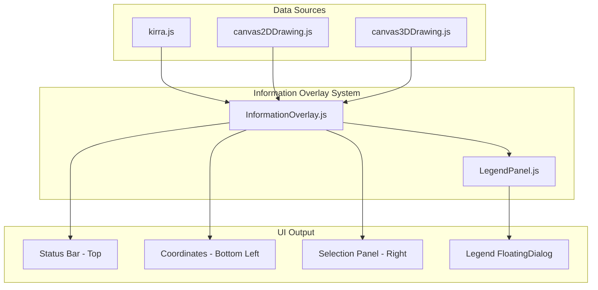

# Information Overlay System Plan

**Date:** 2025-12-26 17:00  
**Author:** AI Assistant  
**Status:** Planning

## Problem Statement

Currently, UI text information is rendered in multiple ways:

- 3D scene: `drawToolPromptThreeJS()` renders verbose text sprites that look bad and clutter the scene
- 2D canvas: Direct `ctx.fillText()` calls for legends, measurements, and status (only visible in 2D mode)
- No unified system for coordinates, selections, or status messages

## Architecture Overview



## Screen Layout Concept

```
+-------------------------------------------------------------------------+
|                         [Status Bar / Tool Tips]                         |
|                                                                          |
|                                                                          |
|                                                                          |
|                                                                          |
|                                                                 [Select] |
| [Measurements]                                                  Selected |
| Distance: 12.5m                                                 - Hole 1 |
| Angle: 45.2deg                                                  - Hole 2 |
|                                                                 (ESC)    |
| [Coordinates]                                                            |
| X: 12345.67                                                    [Legend]  |
| Y: 67890.12                                                    (if on)   |
| Z: 450.00                                                                |
+-------------------------------------------------------------------------+
|                    [Existing Toggle Buttons / View Options]              |
+-------------------------------------------------------------------------+
```

## File Structure

```
src/
├── ui/                           (NEW FOLDER)
│   ├── InformationOverlay.js     (NEW - Main overlay system)
│   └── LegendPanel.js            (NEW - FloatingDialog-based legends)
├── dialog/
│   └── FloatingDialog.js         (EXISTING - Extended for legends)
├── kirra.js                      (MODIFY - Integration)
└── kirra.css                     (MODIFY - Add overlay styles)
```

## Implementation Phases

### Phase 1: Create InformationOverlay Module

Create `src/ui/InformationOverlay.js`:

**Key exports:**
- `initInformationOverlay()` - Creates DOM structure
- `updateOverlayStatus(message, type)` - Replaces `updateStatusMessage()`
- `updateOverlayCoordinates(worldX, worldY, worldZ)` - Mouse/world position
- `updateOverlaySelection(holes, kadObjects, connectorInfo)` - Selection info
- `updateOverlayMeasurements(measurements)` - Distance, angle, etc.
- `clearInformationOverlay()` - Reset all panels

**DOM Structure to create:**
```html
<div id="information-overlay" class="information-overlay">
    <div id="overlay-status" class="overlay-panel overlay-status"></div>
    <div id="overlay-measurements" class="overlay-panel overlay-measurements"></div>
    <div id="overlay-coordinates" class="overlay-panel overlay-coordinates"></div>
    <div id="overlay-selection" class="overlay-panel overlay-selection"></div>
</div>
```

### Phase 2: Create LegendPanel Module

Create `src/ui/LegendPanel.js`:

Uses existing FloatingDialog pattern (src/dialog/FloatingDialog.js) for:
- Draggable, closable legend window
- Collapsible sections for each legend type
- Auto-show/hide based on active features

**Legend types to support:**

| Legend Type | Source Function | Line # | When Active |
|-------------|-----------------|--------|-------------|
| Slope | `drawLegend()` | 20459 | `displayOptions.slopeMap` |
| Relief | `drawReliefLegend()` | 15293 | `displayOptions.burdenRelief` |
| Voronoi | `drawVoronoiLegendAndCells()` | 22115 | `displayOptions.voronoiPF` |
| Surface | `drawSurfaceLegend()` | 34501 | Any surface visible |

### Phase 3: CSS Styling

Add to `src/kirra.css`:

```css
/* ================================================= */
/* Information Overlay System                        */
/* ================================================= */

.information-overlay {
    position: absolute;
    top: 0;
    left: 0;
    width: 100%;
    height: 100%;
    pointer-events: none;
    z-index: 100;
    font-family: Arial, sans-serif;
    font-size: 12px;
}

.overlay-panel {
    position: absolute;
    background: rgba(0, 0, 0, 0.75);
    color: #ffffff;
    padding: 8px 12px;
    border-radius: 4px;
    pointer-events: auto;
    display: none;
    max-width: 280px;
}

/* Status bar - top center */
.overlay-status {
    top: 10px;
    left: 50%;
    transform: translateX(-50%);
    text-align: center;
    white-space: pre-wrap;
    max-width: 500px;
}

.overlay-status.status-success { background: rgba(0, 150, 0, 0.85); }
.overlay-status.status-warning { background: rgba(200, 150, 0, 0.85); }
.overlay-status.status-error { background: rgba(200, 0, 0, 0.85); }
.overlay-status.status-info { background: rgba(0, 100, 200, 0.85); }

/* Measurements - bottom left */
.overlay-measurements {
    bottom: 80px;
    left: 10px;
}

/* Coordinates - bottom left, below measurements */
.overlay-coordinates {
    bottom: 10px;
    left: 10px;
    font-family: monospace;
    font-size: 11px;
}

/* Selection panel - right side */
.overlay-selection {
    top: 50%;
    right: 10px;
    transform: translateY(-50%);
    max-height: 60vh;
    overflow-y: auto;
}

/* Dark mode overrides */
.dark-mode .overlay-panel {
    background: rgba(40, 40, 40, 0.9);
    border: 1px solid #555;
}

/* Light mode overrides */
body:not(.dark-mode) .overlay-panel {
    background: rgba(255, 255, 255, 0.9);
    color: #000000;
    border: 1px solid #ccc;
}
```

### Phase 4: Integration in kirra.js

**Modifications to `src/kirra.js`:**

1. Import new modules (around line 144):
```javascript
import { initInformationOverlay, updateOverlayStatus, updateOverlayCoordinates, updateOverlaySelection, clearInformationOverlay } from "./ui/InformationOverlay.js";
import { showLegendPanel, hideLegendPanel, updateLegendData } from "./ui/LegendPanel.js";
```

2. Initialize overlay on startup (in init function)

3. Replace `updateStatusMessage()` (line 31743) calls with `updateOverlayStatus()`

4. Replace `drawToolPromptThreeJS()` calls (lines 21881-21900) with `updateOverlaySelection()`

5. Call `updateOverlayCoordinates()` in mouse move handlers

6. Call legend functions when display options change

### Phase 5: Remove/Deprecate Canvas Legend Drawing

Comment out or remove:
- `drawLegend()` function (lines 20459-20503)
- `drawReliefLegend()` function (lines 15293-15351)
- Canvas legend calls in `drawVoronoiLegendAndCells()` (keep cell drawing)
- `drawSurfaceLegend()` function (lines 34501-34600)

### Phase 6: Remove 3D Tool Prompts

In `src/draw/canvas3DDrawing.js`:
- Remove or deprecate `drawToolPromptThreeJS()` function (lines 739-781)
- Update TODO comment at line 738 to mark as complete

## Migration Mapping

| Current Function | New Function | Call Sites |
|-----------------|--------------|------------|
| `updateStatusMessage()` | `updateOverlayStatus()` | ~216 |
| `drawToolPromptThreeJS()` | `updateOverlaySelection()` | 5 |
| `drawLegend()` | `showLegendPanel()` | 1 |
| `drawReliefLegend()` | `showLegendPanel()` | 1 |
| `drawVoronoiLegendAndCells()` legend part | `showLegendPanel()` | 7 |
| `drawSurfaceLegend()` | `showLegendPanel()` | 1 |

## Behavior Rules

1. Status messages auto-clear after timeout (configurable, default 3s)
2. Selection panel shows only when items selected, hides on ESC
3. Coordinates update on mouse move (throttled for performance)
4. Legend panel auto-shows when feature activated, can be manually closed
5. All panels respect dark mode via CSS classes
6. Overlay works identically in 2D and 3D modes
7. Measurements stay on canvas ctx (cursor-following)

## Implementation TODOs

- [ ] Create src/ui/ folder for new overlay modules
- [ ] Create InformationOverlay.js with status, coordinates, selection panels
- [ ] Create LegendPanel.js using FloatingDialog for legend display
- [ ] Add overlay CSS styles to kirra.css
- [ ] Import and initialize overlay system in kirra.js
- [ ] Replace updateStatusMessage calls with updateOverlayStatus
- [ ] Replace drawToolPromptThreeJS calls with updateOverlaySelection
- [ ] Replace canvas legend draws with LegendPanel calls
- [ ] Remove or comment out deprecated canvas legend functions

## Testing Checklist

- [ ] Status messages appear and auto-clear
- [ ] Coordinates update on mouse move in both modes
- [ ] Selection panel shows holes and KAD objects
- [ ] Connector info shows during connection mode
- [ ] Each legend type displays correctly
- [ ] Legend panel is draggable and closable
- [ ] Dark mode styling works
- [ ] 3D mode no longer shows verbose text sprites
- [ ] Performance acceptable (no lag on mouse move)

## Notes

- Template literals avoided per project rules - use string concatenation
- FloatingDialog class already supports dragging, resizing, close button
- Consider throttling coordinate updates to 60fps max
- Legend colors should match existing canvas legend colors exactly

