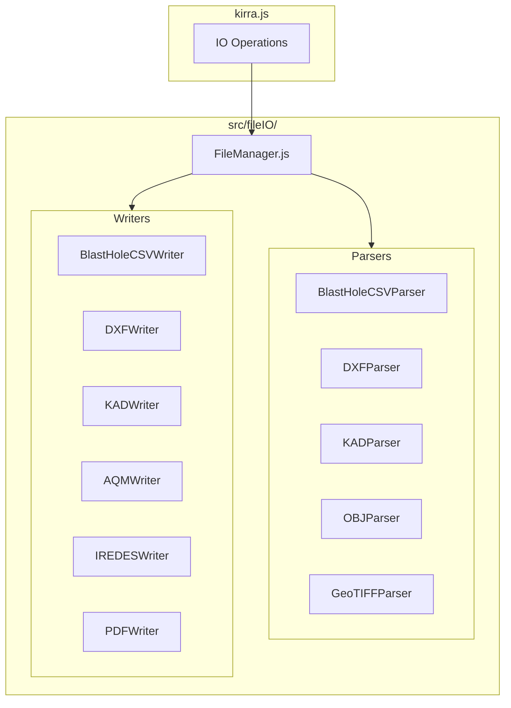

# FileManager IO System Modularization Plan

**Date:** 2026-01-03 14:30
**Author:** AI Agent (Claude)
**Status:** Planning

---

## RULES

The following Cursor rules apply to this implementation:

### TreeView Node ID Formats
- **Hole Node ID format:** "hole⣿entityName⣿holeID" (3 parts)
- **TreeViewEntity Node ID format:** "entityType⣿entityName⣿element⣿pointID" (4 parts)

### Code Reuse (Factory Pattern)
- Use Factory code, do not make custom code if there is an existing function that can be reused. Avoid "Code Bloat".
- Example 1: The GeometryFactory is where all the ThreeJS Geometry base code is, and it should be reused for UX consistency.
- Example 2: The FloatingDialog Class is what all Dialogs, Popups, Menus should be constructed from.

### File Naming Conventions
- Plans should be saved in the folder called "aiPlans" with the naming convention of YYYYMMDD-hhmm-PlanName.md
- All AI Agent Commentary (md files) should be written to "aiCommentary" folder (Kirra2D > src > aiCommentary). Always date and time-stamp with YYYYMMDD-hhmm-Name.md

### Coordinate System Rules
- The canvas in Kirra App is Y up (North +ve), Y down (South -ve), West is X -ve and East is X +ve. Kirra is a UTM styled Real World Coordinate app.
- Bearing moves clockwise: North is 0 degrees, 90 degrees is West, 180 degrees is South, 270 degrees is East.
- Data used in this application can be very large values (often UTM). 2D approach is to transform the data based on the data centroid. The data centroid is 0,0 and the XY needs to be transformed. Do not scale the 3D - use the same 2D transform.
- Do not transform Z elevations.
- Do not scale the 3D transform. Use the same XY transform as 2D.

### ThreeJS Rules
- Selection in ThreeJS is a tunnel. A fat ray cast from the camera to infinity. It is displayed in screen space or camera frustum space.
- Orbit in 3D should be around the Mouse Screen X Y and the Data Z centroid.
- Zoom should zoom to the Same Mouse Screen XY and the Data Z centroid.
- The 3D entities should mimic the 2D entities except that the scene can orbit and rotate.
- Pan is the default mode.
- Selection and interaction should interact the same as the 2D selection and interaction.
- Generally the data loaded will be in UTM or a custom mine grid. 2D translates the large UTM coords to the 2D local by subtracting off the centroid. Always check the 3D is in the correct coordinate space to be drawn.

### Code Style Rules
- In suggestions, also provide the line number the code is on. If it relates to a range, provide a line number range.
- Use FloatingDialog inside kirra.js.
- Do not use template literals like ('Say ${variable} world') - instead use ("Say " + variable + " world").
- Do not remove code without providing a verbose comment.
- Use FloatingDialog class for all dialogs. Swal2 is a backup.
- Add Step #) comments so the code is easy to follow.
- Do not use template literals or template strings - always use " " + variable.value style.

---

## Overview

Modularize the ~20+ IO functions currently embedded in `src/kirra.js` (44,000+ lines) into a dedicated `src/fileIO/` folder structure with specialized parser/writer modules for each file format family.

---

## Current State Analysis

### Existing IO Functions in kirra.js

**Parsers (Lines ~8300-9200, ~10159-10485, ~36863-37300, ~40650-40800):**

- `parseK2Dcsv()` - Blast hole CSV (4/7/9/12/14/20/25/30/32/35 columns)
- `parseDXFtoKadMaps()` - DXF to KAD entities
- `parseKADFile()` - KAD proprietary format
- `parseOBJFile()` - OBJ 3D mesh
- `parseCSVPointCloud()` - Point cloud CSV
- `loadGeoTIFF()` / `processGeoTIFF()` - GeoTIFF images/elevation

**Writers (Lines ~10489-10590, ~10957-11190, ~11048-11123, ~25277-25350):**

- `exportKADFile()` / `exportKADDXF()` - KAD exports
- `exportHolesDXF()` - Blast holes to DXF
- `exportSurfaceToDXF()` - Surfaces to DXF
- `convertPointsTo14ColumnCSV()` / `convertPointsTo12ColumnCSV()` / `convertPointsToAllDataCSV()`
- `convertPointsToAQMCSV()` - MineStar AQM format
- IREDES functions (already extracted to `ExportDialogs.js`)

**Reference Files for Format Specifications:**

- `src/referenceFiles/BRENTBUFFHAM_FiletoASCII-NAV.pm` - Wenco NAV format
- `src/referenceFiles/BRENTBUFFHAM_SurfaceMan_Files-GF-H-S.pm` - Epiroc Surface Manager
- `src/referenceFiles/BRENTBUFFHAM_BlastToSurpac.pm` - Surpac STR format
- `src/referenceFiles/CBLASTExport.bas` - CBLAST format
- `src/referenceFiles/HoleToVulcanDXF-VBA.bas` - Vulcan DXF XData
- `src/referenceFiles/KMLexample.kml.txt` - KML format

---

## Proposed Architecture



---

## Folder Structure

```
src/fileIO/
├── FileManager.js              # Central manager with format registry
├── BaseParser.js               # Abstract base class for parsers
├── BaseWriter.js               # Abstract base class for writers
│
├── TextIO/
│   ├── BlastHoleCSVParser.js   # FROM: parseK2Dcsv() ~360 lines
│   └── BlastHoleCSVWriter.js   # FROM: convertPointsTo*CSV() ~80 lines
│
├── AutoCadIO/
│   ├── DXFParser.js            # FROM: parseDXFtoKadMaps() ~500 lines
│   ├── DXFWriter.js            # Compact Simple DXF (2 layers: HOLES, HOLE_TEXT)
│   └── VulcanDXFWriter.js      # Vulcan-compatible with XData (REF: HoleToVulcanDXF-VBA.bas)
│
├── KirraIO/
│   ├── KADParser.js            # FROM: parseKADFile() ~330 lines
│   └── KADWriter.js            # FROM: exportKADFile() ~100 lines
│
├── SurpacIO/
│   ├── SurpacSTRParser.js      # REF: BRENTBUFFHAM_FileToSurpac.pm
│   ├── SurpacSTRWriter.js      # REF: BRENTBUFFHAM_BlastToSurpac.pm
│   ├── SurpacDTMParser.js      # NEW: DTM surface format
│   └── SurpacDTMWriter.js      # NEW: DTM export
│
├── ImageIO/
│   ├── GeoTIFFParser.js        # FROM: loadGeoTIFF() ~150 lines
│   ├── GeoTIFFWriter.js        # NEW: GeoTIFF export
│   ├── JPGParser.js            # NEW: JPEG import
│   └── JPGWriter.js            # NEW: JPEG export
│
├── ThreeJSMeshIO/
│   ├── OBJParser.js            # FROM: parseOBJFile() ~300 lines
│   ├── OBJWriter.js            # NEW: OBJ export
│   ├── GLTFParser.js           # NEW: GLTF import
│   ├── GLTFWriter.js           # NEW: GLTF export
│   ├── PLYParser.js            # NEW: PLY import
│   └── PLYWriter.js            # NEW: PLY export
│
├── PointCloudIO/
│   ├── PointCloudParser.js     # FROM: parseCSVPointCloud() + XYZ/ASC/TXT
│   └── PointCloudWriter.js     # NEW: Point cloud export
│
├── MinestarIO/
│   ├── AQMParser.js            # NEW: AQM import
│   └── AQMWriter.js            # FROM: convertPointsToAQMCSV() ~75 lines
│
├── EpirocIO/
│   ├── IREDESParser.js         # NEW: IREDES import
│   ├── IREDESWriter.js         # FROM: ExportDialogs.js (already modular)
│   ├── SurfaceManagerParser.js # REF: BRENTBUFFHAM_SurfaceMan_Files-GF-H-S.pm
│   └── SurfaceManagerWriter.js # NEW: .geofence/.hazard/.socket export
│
├── WencoIO/
│   ├── NAVASCIIParser.js       # NEW: NAV import
│   └── NAVASCIIWriter.js       # REF: BRENTBUFFHAM_FiletoASCII-NAV.pm
│
├── CBlastIO/
│   ├── CBLASTParser.js         # NEW: CBLAST import
│   └── CBLASTWriter.js         # REF: CBLASTExport.bas
│
├── GoogleMapsIO/
│   ├── KMLKMZParser.js         # REF: KMLexample.kml.txt
│   └── KMLKMZWriter.js         # NEW: KML/KMZ export
│
├── EsriIO/
│   ├── SHAPEParser.js          # NEW: Shapefile import
│   └── SHAPEWriter.js          # NEW: Shapefile export
│
├── LasFileIO/
│   ├── LASParser.js            # NEW: LAS point cloud import
│   └── LASWriter.js            # NEW: LAS export
│
└── AcrobatPDF/
    └── PDFWriter.js            # FROM: PrintVectorPDF.js (facade)
```

---

## Implementation Strategy

### Phase 1: Core Infrastructure

1. Create `FileManager.js` - Central registry with `registerFormat()`, `parse()`, `write()` methods
2. Create `BaseParser.js` / `BaseWriter.js` abstract classes with common patterns
3. Establish standard interfaces for data exchange

### Phase 2: Extract Existing Functions (Priority)

Extract and refactor functions already in kirra.js:

1. `BlastHoleCSVParser.js` - Extract `parseK2Dcsv()` 
2. `BlastHoleCSVWriter.js` - Extract `convertPointsTo*CSV()` functions
3. `DXFParser.js` - Extract `parseDXFtoKadMaps()`
4. `DXFWriter.js` - **REPLACE** current `exportHolesDXF()` with two compact versions (see DXF Export Strategy below)
5. `KADParser.js` / `KADWriter.js` - Extract `parseKADFile()`, `exportKADFile()`
6. `OBJParser.js` - Extract `parseOBJFile()`, `loadOBJWithMTL()`
7. `GeoTIFFParser.js` - Extract `loadGeoTIFF()`, `processGeoTIFF()`
8. `PointCloudParser.js` - Extract `parseCSVPointCloud()`
9. `AQMWriter.js` - Extract `convertPointsToAQMCSV()`

#### DXF Export Strategy (Replaces Current Heavy Implementation)

The current `exportHolesDXF()` creates excessive layers (one per hole with _Collar, _Track, _Grade, _Toe, _Text suffixes) which many CAD programs struggle to load. Replace with two compact options:

**Option 1: Vulcan-Compatible DXF** (Based on `HoleToVulcanDXF-VBA.bas`)

- Proper DXF header with EXTMIN/EXTMAX bounds
- TABLES section with LAYER and APPID tables
- APPID registration for `MAPTEK_VULCAN`
- 3D POLYLINE entities (collar -> grade -> toe) with XData:
  - VulcanName, VulcanGroup, VulcanValue, VulcanDescription
  - VulcanPrimitive, VulcanLine, VulcanPattern, VulcanFeature
- Single layer per blast name (e.g., `BlastName_MGA` or `BlastName_LOCAL`)
- Handles for entity linking

**Option 2: Simple/Compact DXF** (Maximum Compatibility)

- Minimal header (AC1009 format)
- Two layers only: `HOLES` and `HOLE_TEXT`
- All hole geometry (collar circle, track line, grade circle, toe circle) on `HOLES` layer
- All hole ID text on `HOLE_TEXT` layer
- No XData (pure geometry only)
- Smallest file size, loads in any CAD program

```
DXF Export Options:
├── Export Vulcan DXF    -> Full 3D polylines + XData for Vulcan/Envisage
└── Export Simple DXF    -> Compact 2-layer format for universal compatibility
```

### Phase 3: New Format Implementations

Implement new formats based on reference files:

1. `SurpacSTRWriter.js` - Based on `BRENTBUFFHAM_BlastToSurpac.pm`
2. `NAVASCIIWriter.js` - Based on `BRENTBUFFHAM_FiletoASCII-NAV.pm`
3. `SurfaceManagerWriter.js` - Based on `BRENTBUFFHAM_SurfaceMan_Files-GF-H-S.pm`
4. `CBLASTWriter.js` - Based on `CBLASTExport.bas`
5. `KMLKMZParser.js` - Based on `KMLexample.kml.txt`

### Phase 4: Advanced Formats (Future)

- Shapefile support (requires external library)
- LAS point cloud (requires external library)
- GLTF/GLB 3D models

---

## FileManager.js Interface

```javascript
// FileManager.js - Central File IO Manager
// Step 1) Define class with parser/writer registries
class FileManager {
    constructor() {
        this.parsers = new Map();  // format -> ParserClass
        this.writers = new Map();  // format -> WriterClass
    }
    
    // Step 2) Register format handlers
    registerParser(format, ParserClass) {
        this.parsers.set(format, ParserClass);
    }
    
    registerWriter(format, WriterClass) {
        this.writers.set(format, WriterClass);
    }
    
    // Step 3) Parse file based on extension/format
    async parse(file, options) {
        var ext = this.getExtension(file.name);
        var Parser = this.parsers.get(ext);
        if (!Parser) throw new Error("Unsupported format: " + ext);
        return new Parser(options).parse(file);
    }
    
    // Step 4) Write data to format
    async write(data, format, options) {
        var Writer = this.writers.get(format);
        if (!Writer) throw new Error("Unsupported format: " + format);
        return new Writer(options).write(data);
    }
    
    // Step 5) Get supported formats
    getSupportedFormats() {
        return {
            parsers: Array.from(this.parsers.keys()),
            writers: Array.from(this.writers.keys())
        };
    }
    
    // Step 6) Helper to extract extension
    getExtension(filename) {
        var parts = filename.split(".");
        return parts[parts.length - 1].toLowerCase();
    }
}

export default new FileManager();
```

---

## Migration Pattern (Per Function)

For each extracted function:

1. Create new module file in appropriate folder
2. Move function code with all dependencies
3. Add class wrapper extending BaseParser/BaseWriter
4. Export class and register with FileManager
5. Add verbose removal comment in kirra.js (per RULES - do not remove code without verbose comment)
6. Create thin wrapper function in kirra.js calling FileManager
7. Test import/export functionality

**Example Verbose Removal Comment:**
```javascript
// VERBOSE REMOVAL COMMENT - parseK2Dcsv function extracted
// Step 1) Function (360 lines, lines 8305-8665) was extracted to src/fileIO/TextIO/BlastHoleCSVParser.js
// Step 2) Reason: Part of FileManager IO System modularization
// Step 3) Date: 2026-01-03
// Step 4) The function is now exposed globally via FileManager.parse() with format "csv"
// Step 5) Backward compatibility maintained via wrapper function below
```

---

## Key Considerations

1. **Backward Compatibility** - All existing `window.functionName()` calls must continue working
2. **No Template Literals** - Use string concatenation per RULES ("Say " + variable + " world")
3. **Factory Pattern** - Reuse existing `GeometryFactory`, `FloatingDialog` per RULES
4. **Large Coordinates** - Handle UTM/mine grid with centroid transform (per RULES)
5. **Progress Dialogs** - Use `FloatingDialog` for large file operations (per RULES)
6. **Step Comments** - Add Step #) comments so the code is easy to follow (per RULES)

---

## Todo Items

- [ ] **core-infrastructure** - Create FileManager.js with BaseParser/BaseWriter abstract classes
- [ ] **extract-csv** - Extract parseK2Dcsv() and convertPointsTo*CSV() to TextIO/
- [ ] **extract-dxf** - Extract DXF parser + create compact DXFWriter and VulcanDXFWriter (replace heavy layer-per-hole export)
- [ ] **extract-kad** - Extract KAD parse/export functions to KirraIO/
- [ ] **extract-obj** - Extract OBJ parsing functions to ThreeJSMeshIO/
- [ ] **extract-geotiff** - Extract GeoTIFF functions to ImageIO/
- [ ] **extract-aqm** - Extract AQM export to MinestarIO/
- [ ] **implement-surpac** - Implement SurpacSTRWriter based on reference PM files
- [ ] **implement-wenco** - Implement NAVASCIIWriter based on BRENTBUFFHAM_FiletoASCII-NAV.pm
- [ ] **implement-cblast** - Implement CBLASTWriter based on CBLASTExport.bas
- [ ] **implement-kml** - Implement KMLKMZParser based on KMLexample.kml.txt
- [ ] **implement-surfacemanager** - Implement SurfaceManagerWriter for .geofence/.hazard/.socket

---

## Testing Checklist

- [ ] Import/Export CSV (all column formats)
- [ ] Import DXF (entities parsing)
- [ ] Export Simple DXF (2-layer compact format - test in various CAD programs)
- [ ] Export Vulcan DXF (XData - test import into Vulcan/Envisage)
- [ ] Import/Export KAD files
- [ ] Import OBJ/MTL with textures
- [ ] Import GeoTIFF (imagery and elevation)
- [ ] Export AQM (MineStar)
- [ ] Export IREDES (Epiroc)
- [ ] New: Surpac STR export
- [ ] New: NAV ASCII export
- [ ] New: Surface Manager exports
- [ ] New: CBLAST export
- [ ] New: KML/KMZ import

