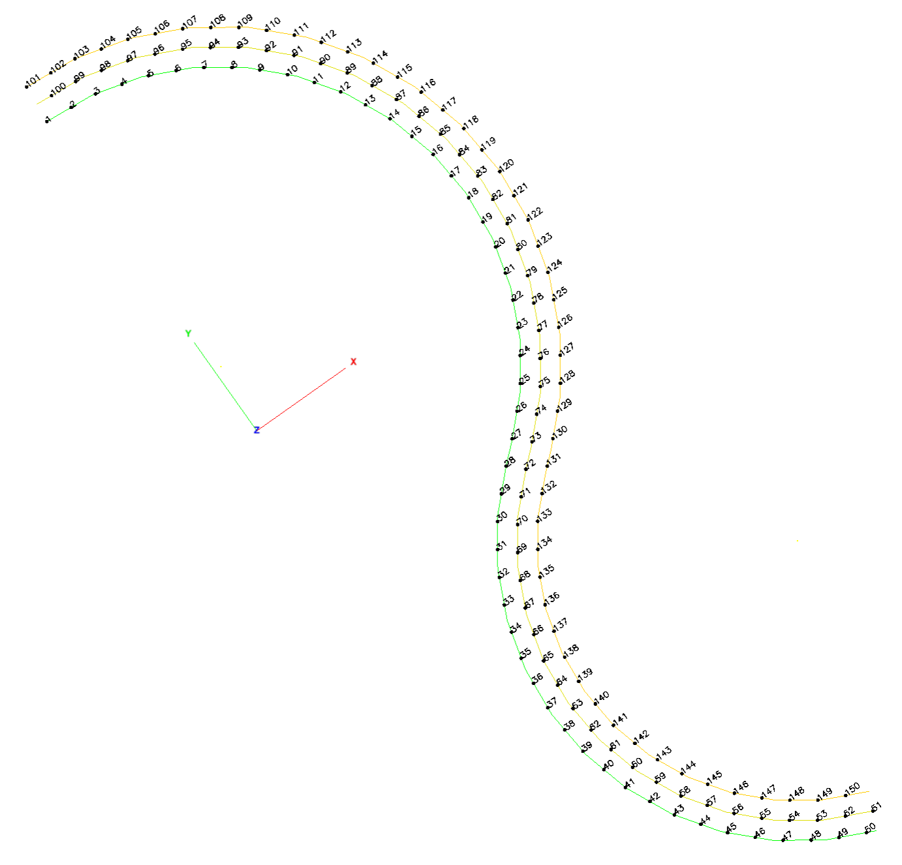
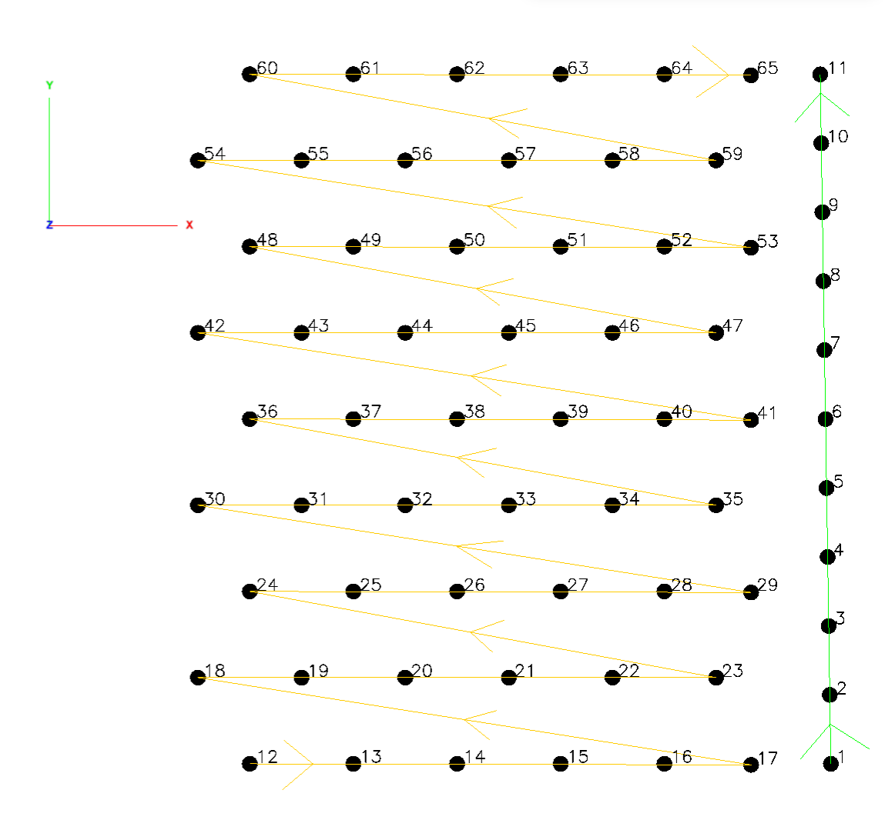
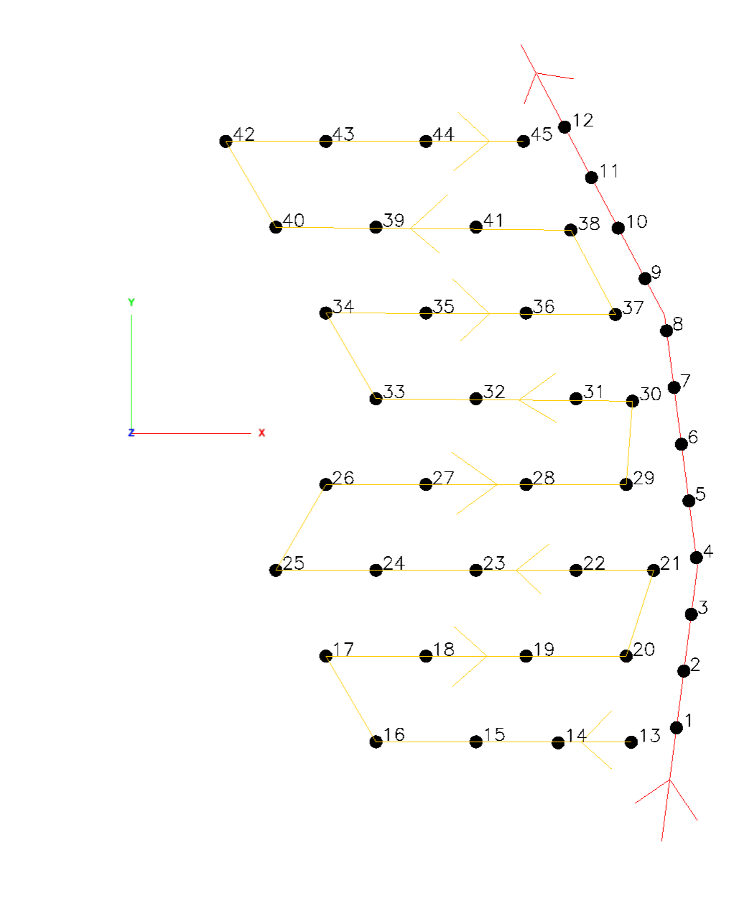
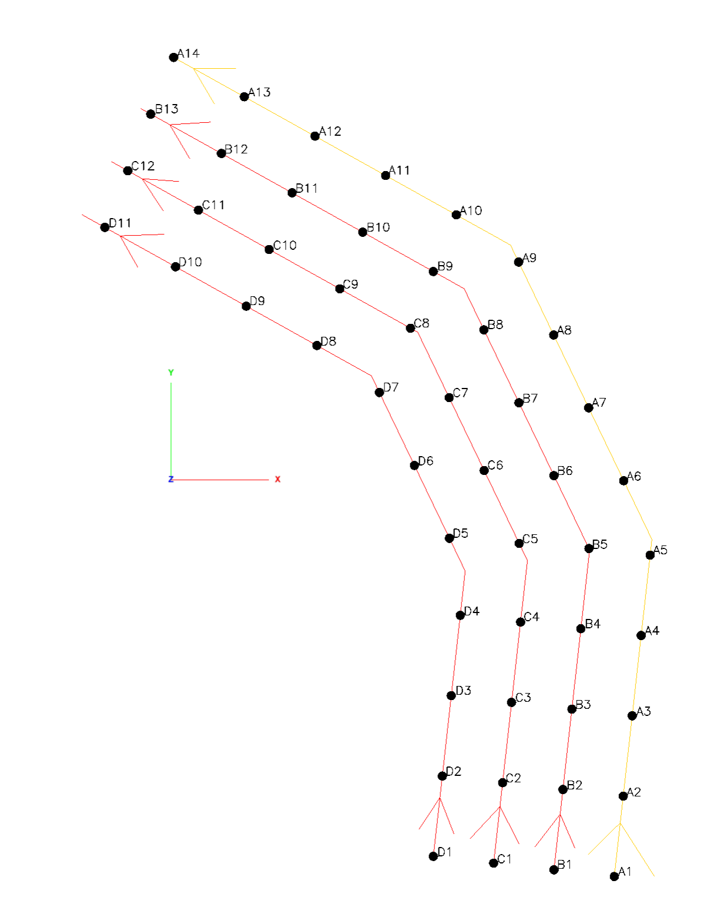

# Enhanced Blast Hole Pattern Detection System

**Plan Created:** 2026-01-24 14:30
**Plan Revised:** 2026-01-28 - Added modularization (Phase 0), post-detection editing tools (Phase 9)
**Plan Updated:** 2026-01-29 - Phases 0, 1, 2, 3, 4, 7 COMPLETE. Fixed missing `calculateBurdenAndSpacingForHoles`. Module uses `calculateDistanceXY(x1,y1,x2,y2)` (coordinate-based) to avoid conflict with kirra.js `calculateDistance(p1,p2)` (object-based).
**Plan Updated:** 2026-01-29 - Phase 5 COMPLETE. Added DBSCAN + Douglas-Peucker fallback. Also added: winding/S-curve detection for continuous snake patterns, Snake Row Angle setting (75-105°), distance consistency check to distinguish winding from traditional serpentine patterns. Fixed CSV import undo batching.
**Plan Updated:** 2026-01-30 - Phase 6 COMPLETE. Created RowValidation.js with validation functions, metrics calculation, and confidence scoring. Updated orchestrator to return enhanced metadata (validation status, detailed metrics, confidence score, pattern type).
**Plan Updated:** 2026-01-30 - Phase 8 COMPLETE. Created ImportProgressDialog.js with progress bar, stage tracking, and metrics display. Integrated into parseK2Dcsv for KirraCSV imports.
**Plan Updated:** 2026-01-30 - Phase 9 COMPLETE. Created RowEditingTools.js with renameRows, invertRowOrder, resequencePositions, and KAD editing tools. Added UI dialogs to HolesContextMenu.js. All functions exposed on window for global access.
**Status:** Implementation COMPLETE - All Phases (0-9) Complete
**Priority:** High
**Complexity:** High (10 phases, 28 todos)

**Key Change:** All row detection code will be moved from `kirra.js` to `src/helpers/RowDetection/` module

---

## Executive Summary

This plan addresses the critical need for improved blast hole row detection and pattern recognition in Kirra2D. Current methods assume straight-line rows and fail with curved patterns, multi-pattern blasts, and serpentine position ordering. The solution is a hierarchical detection system with multiple specialized algorithms selected based on pattern characteristics.

---

## Problem Statement

### Current Limitations

The existing row detection methods in `kirra.js` (lines 38552-40365) struggle with:

1. **Curved/Winding Rows** - Rows that curve like a road (see Image 1 from user)
2. **Multi-Pattern Blasts** - Blasts containing forward rows, serpentine rows, AND perpendicular batter/buffer rows in a single entity (see Image 2 from user)
3. **Serpentine Position Ordering** - Position numbering that alternates direction each row (1→2→3→4, then 8←7←6←5)

### Current Detection Methods (in priority order)

| Method | Function | Location | Limitation |
|--------|----------|----------|------------|
| 1. Sequence-Based | `trySequenceBasedDetection()` | kirra.js:38577 | Uses `detectRowsUsingLineFitting` - assumes straight lines |
| 2. Sequence-Weighted HDBSCAN | `detectRowsUsingSequenceWeightedHDBSCAN()` | kirra.js:39913 | Isotropic clustering - poor for linear patterns |
| 3. Pure HDBSCAN | `detectRowsUsingHDBSCAN()` | kirra.js:39342 | Same isotropic limitation |
| 4. Adaptive Grid | `detectRowsUsingAdaptiveGrid()` | kirra.js:39657 | Grid-based - breaks on curved patterns |
| 5. Bearing-Based | `useBearingBasedDetection()` | kirra.js (fallback) | Last resort fallback |

---

## Available Algorithm Options from Data Science

### Density-Based Clustering Algorithms

| Algorithm | Strength | Weakness | Implementation Complexity |
|-----------|----------|----------|---------------------------|
| DBSCAN | Arbitrary shapes, noise robust | Isotropic - poor for linear patterns | Low |
| HDBSCAN | No parameter tuning, hierarchical | Same isotropic limitation | Medium |
| **ADCN** | Anisotropic - detects elongated/linear clusters | More complex to implement | High |
| **LINSCAN** | Specifically designed for lineated clusters | Newer, less tested | High |

### Curve Detection Algorithms

| Algorithm | Strength | Weakness | Implementation Complexity |
|-----------|----------|----------|---------------------------|
| RANSAC | Fast line/curve fitting | Parametric - needs shape assumption | Low |
| **TriplClust** | Non-parametric curve detection via triplets | Computationally heavier | High |
| **Principal Curves** | Smooth curves through point distributions | Requires manifold assumptions | Medium |
| RDP (Douglas-Peucker) | Polyline simplification | Needs ordered input | Low |

### Graph-Based Approaches

| Algorithm | Strength | Weakness | Implementation Complexity |
|-----------|----------|----------|---------------------------|
| **MST Path Extraction** | Natural for ordered sequences | Can break at density changes | Medium |
| Sequential Graph Tracing | Progressive extraction | Requires good starting points | Medium |
| K-NN Graph | Local structure | Can miss global patterns | Low |

### Curve Fitting Methods

| Algorithm | Strength | Weakness | Implementation Complexity |
|-----------|----------|----------|---------------------------|
| **B-Spline Fitting** | Smooth curves, local control points | Requires ordered input | Medium |
| **Polynomial Regression** | Simple, fast | Overfits at high degrees | Low |
| **LOESS Smoothing** | Non-parametric, handles noise | Computationally heavier | Medium |

### Hybrid Approaches (Recommended)

| Algorithm | Strength | Weakness | Implementation Complexity |
|-----------|----------|----------|---------------------------|
| **HDBSCAN + Principal Curves** | Best of both - clusters then refines | Two-stage complexity | High |
| **HDBSCAN + Alpha Shapes** | Curved cluster boundaries | Alpha parameter sensitivity | Medium |
| **DBSCAN + Douglas-Peucker** | Robust chain approximation | May oversimplify curves | Medium |

---

## Proposed Hierarchical Detection System

### System Architecture Diagram

```
┌─────────────────────────────────────────────────────────────────────────────────┐
│                           LEVEL 0: PRE-ANALYSIS                                  │
│  Input: holesData array                                                          │
│  Actions:                                                                        │
│    - Count holes, calculate extent, density                                      │
│    - Check for existing rowID/posID assignments                                  │
│    - Detect hole ID patterns (numeric, alphanumeric, mixed)                      │
│  Output: analysisMetadata { holeCount, extent, density, idPattern, hasExisting } │
└─────────────────────────────────────────────────────────────────────────────────┘
                                        │
                                        ▼
┌─────────────────────────────────────────────────────────────────────────────────┐
│                       LEVEL 1: PATTERN CLASSIFICATION                            │
│  Input: holesData, analysisMetadata                                              │
│  Actions:                                                                        │
│    - Calculate PCA variance ratio (eigenvalue1 / eigenvalue2)                    │
│    - Measure local curvature by fitting curves to point subsets                  │
│    - Cluster by local orientation to identify sub-patterns                       │
│  Output: patternType { STRAIGHT, CURVED, MULTI_PATTERN }, subPatterns[]          │
│                                                                                  │
│  Classification Rules:                                                           │
│    - High variance ratio (>5) + low avg curvature (<0.1) → STRAIGHT              │
│    - Low variance ratio (<3) + high avg curvature (>0.3) → CURVED                │
│    - Multiple orientation clusters (>1) → MULTI_PATTERN                          │
└─────────────────────────────────────────────────────────────────────────────────┘
                                        │
              ┌─────────────────────────┼─────────────────────────┐
              ▼                         ▼                         ▼
     ┌─────────────────┐      ┌─────────────────┐      ┌─────────────────┐
     │  Single Pattern │      │  Multi-Pattern  │      │  Perpendicular  │
     │  (straight or   │      │  (separate then │      │  Rows (batter/  │
     │   curved)       │      │  process each)  │      │   buffer)       │
     │                 │      │                 │      │                 │
     │  Go to Level 2  │      │  Recursively    │      │  Treat as       │
     │  directly       │      │  call Level 1   │      │  separate       │
     │                 │      │  for each       │      │  entity         │
     └─────────────────┘      └─────────────────┘      └─────────────────┘
              │                         │                         │
              └─────────────────────────┼─────────────────────────┘
                                        ▼
┌─────────────────────────────────────────────────────────────────────────────────┐
│                           LEVEL 2: ROW DETECTION                                 │
│  Input: holesData (single pattern), patternType                                  │
│  Actions: Select and apply appropriate algorithm based on pattern type           │
└─────────────────────────────────────────────────────────────────────────────────┘
                                        │
          ┌─────────────────────────────┼─────────────────────────┐
          ▼                             ▼                         ▼
┌───────────────────┐        ┌───────────────────┐     ┌───────────────────┐
│   Straight Rows   │        │    Curved Rows    │     │    Irregular      │
│                   │        │                   │     │                   │
│  Algorithms:      │        │  Algorithms:      │     │  Algorithms:      │
│  - Line Fitting   │        │  - B-Spline       │     │  - HDBSCAN        │
│  - RANSAC         │        │  - Principal      │     │  - Adaptive Grid  │
│  - Existing       │        │    Curves         │     │  - DBSCAN +       │
│    methods        │        │  - MST Path       │     │    Douglas-       │
│                   │        │    Extraction     │     │    Peucker        │
│                   │        │  - KNN + Bearing  │     │                   │
│                   │        │  - PCA + LOESS    │     │                   │
└───────────────────┘        └───────────────────┘     └───────────────────┘
          │                             │                         │
          └─────────────────────────────┼─────────────────────────┘
                                        ▼
┌─────────────────────────────────────────────────────────────────────────────────┐
│                        LEVEL 3: POSITION ORDERING                                │
│  Input: detectedRows[]                                                           │
│  Actions:                                                                        │
│    - Analyze sequence direction within each row                                  │
│    - Detect if pattern is Forward (Return) or Serpentine                         │
│    - Assign posID values respecting detected direction                           │
│                                                                                  │
│  Serpentine Detection Logic:                                                     │
│    For each pair of adjacent rows:                                               │
│      - Calculate distance from row1.end to row2.start                            │
│      - Calculate distance from row1.start to row2.start                          │
│      - If end-to-start < start-to-start → Serpentine detected                    │
│                                                                                  │
│  Output: orderedRows[] with posID assignments, serpentinePattern (boolean)       │
└─────────────────────────────────────────────────────────────────────────────────┘
                                        │
                                        ▼
┌─────────────────────────────────────────────────────────────────────────────────┐
│                     LEVEL 4: ROW ORDERING AND VALIDATION                         │
│  Input: orderedRows[]                                                            │
│  Actions:                                                                        │
│    - Order rows by distance from face/initiation point                           │
│    - Assign rowID values (1, 2, 3, ...)                                          │
│    - Calculate burden/spacing metrics                                            │
│    - Validate: consistent spacing, no orphan holes, serpentine correctness       │
│                                                                                  │
│  Output: finalRows[] with rowID/posID, burdenSpacingMetrics, validationReport    │
└─────────────────────────────────────────────────────────────────────────────────┘
```

---

## Key Algorithms to Implement

### 1. Pattern Type Classifier (Level 1)

**Purpose:** Determine if a blast pattern is straight, curved, or multi-pattern before selecting detection algorithm.

**File Location:** `src/kirra.js` (add after line 40365)

**Function Signature:**
```javascript
function classifyPatternType(holesData) {
    // Returns: { type: 'STRAIGHT'|'CURVED'|'MULTI_PATTERN', subPatterns: [], isSerpentineCandidate: boolean }
}
```

**Algorithm Steps:**

1. **Calculate Global Curvature using PCA**
   - Compute covariance matrix from hole coordinates
   - Extract eigenvalues (λ1, λ2) and eigenvectors
   - Variance ratio = λ1 / λ2
   - High ratio (>5) suggests linear pattern

2. **Calculate Local Curvature**
   - For each hole, fit a curve through its k nearest neighbors (k=5)
   - Measure curvature at each point
   - Average curvature indicates overall pattern curvature
   - Curvature variance indicates consistency

3. **Cluster by Local Orientation**
   - Calculate local bearing for each hole (bearing to nearest neighbor)
   - Cluster bearings using circular statistics
   - Multiple clusters (>15° apart) suggest multi-pattern blast

**Classification Thresholds:**
```javascript
const CLASSIFICATION_THRESHOLDS = {
    varianceRatioHigh: 5.0,      // Above this = likely straight
    varianceRatioLow: 3.0,       // Below this = likely curved
    curvatureLow: 0.1,           // Below this = low curvature (straight)
    curvatureHigh: 0.3,          // Above this = high curvature (curved)
    orientationTolerance: 15     // Degrees - clusters within this are same orientation
};
```

---

### 2. Curved Row Detection using Principal Curves (Level 2)

**Purpose:** Detect rows in curved/winding patterns like Image 1.

**File Location:** `src/kirra.js` (add after classifyPatternType)

**Function Signature:**
```javascript
function detectCurvedRows(holesData, expectedRowCount) {
    // Returns: rows[] where each row is an ordered array of hole indices
}
```

**Algorithm: Hastie-Stuetzle Principal Curves**

```javascript
function fitPrincipalCurve(holes, smoothingParam) {
    // Step 1) Initialize curve with first principal component
    const pca = calculatePCA(holes);
    let curve = initializeCurveFromPCA(holes, pca);
    
    // Step 2) Iterative refinement (max 20 iterations)
    let previousCurve = null;
    for (let iter = 0; iter < 20; iter++) {
        // Step 2a) Project each point onto current curve
        const projections = holes.map(h => projectOnCurve(h, curve));
        
        // Step 2b) Smooth curve through projected points using LOESS
        curve = loessSmooth(projections, smoothingParam);
        
        // Step 2c) Check convergence
        if (curveConverged(curve, previousCurve, tolerance=0.001)) {
            break;
        }
        previousCurve = curve;
    }
    
    return curve;
}
```

---

### 3. MST-Based Path Extraction (Level 2 alternative)

**Purpose:** Extract ordered sequences from curved patterns without requiring ordered input.

**Function Signature:**
```javascript
function extractRowsViaMST(holesData) {
    // Returns: rows[] where each row is an ordered array of hole indices
}
```

**Algorithm Steps:**

1. **Build MST from Spatial Distances**
   - Already implemented: `buildMinimumSpanningTree()` at kirra.js:39528
   - Use Kruskal's algorithm with Union-Find

2. **Find Longest Paths**
   - Identify degree-1 nodes (endpoints)
   - For each pair of endpoints, find path through MST
   - Extract longest non-overlapping paths

3. **Validate Paths as Rows**
   - Check consistent spacing along path
   - Verify bearing continuity (no sharp turns)
   - Merge collinear adjacent paths

---

### 4. Serpentine Detection (Level 3)

**Purpose:** Detect if position ordering follows serpentine pattern (alternating direction).

**Function Signature:**
```javascript
function detectSerpentinePattern(holesData, detectedRows) {
    // Returns: { pattern: 'FORWARD'|'SERPENTINE', directions: [], confidence: number }
}
```

**Algorithm:**

```javascript
function detectSerpentinePattern(holesData, detectedRows) {
    const rowDirections = [];
    
    // Step 1) For each pair of adjacent rows, check direction
    for (let i = 0; i < detectedRows.length - 1; i++) {
        const row1 = detectedRows[i];
        const row2 = detectedRows[i + 1];
        
        // Step 2) Get endpoint positions
        const row1Start = holesData[row1[0]];
        const row1End = holesData[row1[row1.length - 1]];
        const row2Start = holesData[row2[0]];
        
        // Step 3) Determine direction relationship
        const distEndToStart = distance(row1End, row2Start);
        const distStartToStart = distance(row1Start, row2Start);
        
        rowDirections.push({
            rowIndex: i,
            isSerpentine: distEndToStart < distStartToStart,
            confidence: Math.abs(distEndToStart - distStartToStart) / 
                        Math.max(distEndToStart, distStartToStart)
        });
    }
    
    // Step 4) Determine overall pattern
    const serpentineCount = rowDirections.filter(d => d.isSerpentine).length;
    const totalPairs = rowDirections.length;
    
    return {
        pattern: serpentineCount > totalPairs / 2 ? 'SERPENTINE' : 'FORWARD',
        directions: rowDirections,
        confidence: serpentineCount / totalPairs
    };
}
```

---

### 5. Multi-Pattern Separator (Level 1)

**Purpose:** Separate distinct pattern groups (main rows, batter rows, buffer rows) before detection.

**Function Signature:**
```javascript
function separateSubPatterns(holesData) {
    // Returns: subPatterns[] where each has { holes: [], type: 'MAIN'|'BATTER'|'BUFFER', orientation: number }
}
```

**Algorithm:**

1. **Calculate Local Orientation for Each Hole**
   - For each hole, find k nearest neighbors (k=5)
   - Calculate bearing from hole to centroid of neighbors
   - Store as local orientation (0-360°)

2. **Cluster by Orientation**
   - Use circular mean for clustering
   - Group orientations within 15° tolerance
   - Each cluster = potential sub-pattern

3. **Refine by Spatial Connectivity**
   - Within each orientation cluster, check spatial connectivity
   - Spatially disconnected groups = separate sub-patterns
   - This handles perpendicular batter rows that are spatially separate

4. **Classify Sub-Patterns**
   - Largest cluster by hole count → 'MAIN'
   - Smaller perpendicular clusters → 'BATTER' or 'BUFFER' based on position

---

## Enhancement Algorithms (5 Additional Methods)

### Enhancement 1: B-Spline / Polynomial Curve Fitting

**When to Use:** Holes have reliable sequence numbers that follow the curve.

**File Location:** `src/kirra.js`

**Key Functions:**
```javascript
function detectRowsUsingSplineFitting(orderedHoles, entityName)
function fitBSpline(controlPoints, degree)
function bSplineBasis(i, degree, t, knots)  // Cox-de Boor recursion
function pointToSplineDistance(point, spline)
```

**Algorithm:**
1. Sort holes by sequence number
2. Extract control points (every N holes)
3. Fit cubic B-spline (degree=3)
4. Measure distance from each hole to spline
5. If hole deviates beyond tolerance (0.5 × spacing), start new row

---

### Enhancement 2: HDBSCAN + Principal Curves / Alpha Shapes

**When to Use:** Pattern has irregular density or noise, need flexible cluster shapes.

**File Location:** `src/kirra.js`

**Key Functions:**
```javascript
function detectRowsUsingHDBSCANWithCurveRefinement(holesData, entityName)
function fitPrincipalCurve(holes, smoothingParam)  // Hastie-Stuetzle algorithm
function orderHolesAlongCurve(clusterHoles, principalCurve)
```

**Algorithm:**
1. Run HDBSCAN to get initial clusters
2. For each cluster, fit principal curve using iterative projection
3. Order holes along the principal curve by arc length position
4. Return ordered rows

---

### Enhancement 3: KNN Graph with Bearing-Based Traversal

**When to Use:** Need to handle serpentine patterns with automatic direction detection.

**File Location:** `src/kirra.js`

**Key Functions:**
```javascript
function detectRowsUsingKNNGraphTraversal(holesData, entityName)
function buildKNNGraph(holesData, k)
function findGraphEndpoints(knnGraph)
function traceRowWithBearingContinuity(start, graph, visited, maxBearingChange)
```

**Algorithm:**
1. Build K-NN graph (k = min(6, holes/5))
2. Find endpoints (degree 1-2 nodes at edges)
3. Trace rows from endpoints using bearing continuity
4. Stop when bearing changes >30° (gentle curves allowed)
5. Detect direction reversal (>150° change) = serpentine turn

---

### Enhancement 4: PCA Rotation + LOESS Adaptive Binning

**When to Use:** Overall pattern follows a curved spine with parallel rows.

**File Location:** `src/kirra.js`

**Key Functions:**
```javascript
function detectRowsUsingPCAWithLOESS(holesData, entityName)
function loessSmooth(xValues, yValues, bandwidth)
function adaptiveBinning(distances, spacing)
function weightedLinearRegression(neighborhood, weights, x)
```

**Algorithm:**
1. Calculate PCA to find dominant direction
2. Rotate data so principal axis is horizontal
3. Apply LOESS smoothing to estimate curved "row axis"
4. Calculate perpendicular distance from each point to LOESS curve
5. Bin by perpendicular distance (adaptive based on spacing)
6. Each bin = one row, ordered by position along curve

**LOESS Details:**
- Bandwidth = 0.3 (30% of points in local window)
- Tricube weight function: w(u) = (1 - u³)³
- Weighted linear regression for local fit

---

### Enhancement 5: DBSCAN + Douglas-Peucker Chain Approximation (Fallback)

**When to Use:** As robust fallback when other methods fail, or for very irregular patterns.

**File Location:** `src/kirra.js`

**Key Functions:**
```javascript
function detectRowsUsingDBSCANWithDouglasPeucker(holesData, entityName)
function runDBSCAN(holesData, eps, minPts)
function estimateEpsilon(holesData)  // k-distance graph method
function orderByNearestNeighborChain(holes)
function douglasPeucker(points, epsilon)
function assignPointsToChain(cluster, simplifiedChain)
```

**Algorithm:**
1. Run DBSCAN with estimated epsilon (k-distance graph)
2. For each cluster, order points using nearest-neighbor chain
3. Apply Douglas-Peucker to get simplified polyline
4. Re-assign original points to simplified segments
5. Return rows

---

## Algorithm Selection Decision Tree

```
START: improvedSmartRowDetection(holesData, entityName)
  │
  ├── Step 1: Pre-Analysis
  │   └── Analyze hole count, extent, ID patterns
  │
  ├── Step 2: Check for reliable sequence numbers?
  │   │
  │   ├── YES (>70% numeric or alphanumeric IDs)
  │   │   │
  │   │   ├── Pattern is curved? (variance ratio < 3 OR avg curvature > 0.3)
  │   │   │   │
  │   │   │   ├── YES → Use B-Spline Fitting (Enhancement 1)
  │   │   │   │
  │   │   │   └── NO → Use existing Line Fitting (trySequenceBasedDetection)
  │   │   │
  │   │   └── Continue to validation
  │   │
  │   └── NO (unreliable or no sequence)
  │       │
  │       ├── Multiple distinct orientations? (orientation clusters > 1)
  │       │   │
  │       │   ├── YES → Separate sub-patterns first (separateSubPatterns)
  │       │   │         Then recursively apply detection to each
  │       │   │
  │       │   └── NO → Single pattern
  │       │       │
  │       │       ├── High curvature detected? (avg curvature > 0.3)
  │       │       │   │
  │       │       │   ├── YES → Use HDBSCAN + Principal Curves (Enhancement 2)
  │       │       │   │
  │       │       │   └── NO → Standard patterns
  │       │       │       │
  │       │       │       ├── Need serpentine detection? (sequence suggests alternating)
  │       │       │       │   │
  │       │       │       │   ├── YES → Use KNN + Bearing Traversal (Enhancement 3)
  │       │       │       │   │
  │       │       │       │   └── NO → Use PCA + LOESS Binning (Enhancement 4)
  │       │       │       │
  │       │       │       └── Continue to validation
  │       │       │
  │       │       └── Continue to validation
  │       │
  │       └── Continue to validation
  │
  ├── Step 3: Position Ordering
  │   └── Apply detectSerpentinePattern() to determine Forward vs Serpentine
  │
  ├── Step 4: Row Ordering and Validation
  │   ├── Order rows by distance from face
  │   ├── Calculate burden/spacing metrics
  │   └── Validate consistency
  │
  └── FALLBACK: If all methods fail
      └── Use DBSCAN + Douglas-Peucker (Enhancement 5)
```

---

## Additional Requirements

### 1. Progress Dialog for Blast Imports

**Purpose:** Inform users of processing stages during import operations.

**File Locations:**
- `src/fileIO/TextIO/BlastHoleCSVParser.js`
- `src/fileIO/TextIO/CustomBlastHoleTextParser.js`
- `src/dialog/popups/generic/ImportProgressDialog.js` (new file)

**Progress Stages:**
```javascript
const IMPORT_STAGES = {
    PARSING:          { label: "Parsing file...",                weight: 20 },
    GEOMETRY:         { label: "Calculating geometry...",        weight: 15 },
    PATTERN_ANALYSIS: { label: "Analyzing pattern type...",      weight: 10 },
    ROW_DETECTION:    { label: "Detecting rows...",              weight: 30 },
    POSITION_ORDERING:{ label: "Ordering positions...",          weight: 15 },
    BURDEN_SPACING:   { label: "Calculating burden/spacing...",  weight:  5 },
    FINALIZING:       { label: "Finalizing import...",           weight:  5 }
};
```

**Implementation:**
```javascript
function showImportProgressDialog(filename) {
    const progressContent = document.createElement("div");
    progressContent.innerHTML = 
        '<div class="import-progress-container">' +
            '<div class="import-filename">' + filename + '</div>' +
            '<div class="import-progress-bar">' +
                '<div class="import-progress-fill" style="width: 0%"></div>' +
            '</div>' +
            '<div class="import-stage-label">Initializing...</div>' +
            '<div class="import-details"></div>' +
        '</div>';
    
    return new FloatingDialog({
        title: "Importing Blast Data",
        content: progressContent,
        width: 400,
        height: 200,
        showConfirm: false,
        showCancel: true,
        cancelText: "Cancel Import"
    });
}
```

---

### 2. Burden Field for "Holes Along Line" and "Holes Along Polyline"

**Purpose:** Allow explicit burden specification when creating batter/buffer rows.

**File Location:** `src/dialog/popups/generic/PatternGenerationDialogs.js`

**Current State:** Only has `spacing` field
**Required:** Add `burden` field (meters)

**Modifications:**

1. **showHolesAlongPolylinePopup()** (line ~347-363)
   - Add to `lastValues`:
     ```javascript
     burden: savedHolesAlongPolylineSettings.burden || 3.0,
     ```
   - Add to `fields` array (after spacing):
     ```javascript
     { label: "Burden (m)", name: "burden", type: "number", value: lastValues.burden, step: 0.1, min: 0.1, max: 50 },
     ```
   - Add to `params` in onConfirm:
     ```javascript
     burden: parseFloat(formData.burden) || 3.0,
     ```

2. **showHolesAlongLinePopup()** (line ~651-666)
   - Same modifications as above

---

### 3. Row Direction Option in Pattern Generation

**Purpose:** Control how rows are numbered - Forward (Return) or Serpentine.

**File Location:** `src/dialog/popups/generic/PatternGenerationDialogs.js`

**Options:**
- **"Return" (Forward Only):** All rows numbered same direction
  - Row 1: 1→2→3→4 (left to right)
  - Row 2: 5→6→7→8 (left to right)
  - Row 3: 9→10→11→12 (left to right)

- **"Serpentine" (Forward & Back):** Alternating direction each row
  - Row 1: 1→2→3→4 (left to right)
  - Row 2: 8←7←6←5 (right to left)
  - Row 3: 9→10→11→12 (left to right)

**Modifications:**

1. **showPatternDialog()** - Add to `lastValues`:
   ```javascript
   rowDirection: savedSettings.rowDirection || "return",
   ```

2. **showPatternDialog()** - Add to `fields` array:
   ```javascript
   { 
       label: "Row Direction", 
       name: "rowDirection", 
       type: "select", 
       options: [
           { value: "return", label: "Return (Forward Only)" },
           { value: "serpentine", label: "Serpentine (Forward & Back)" }
       ],
       value: lastValues.rowDirection
   }
   ```

3. **processPatternGeneration()** - Pass to generation functions:
   ```javascript
   window.addPattern(..., formData.rowDirection);
   // or
   window.generatePatternInPolygon({ ..., rowDirection: formData.rowDirection });
   ```

4. **kirra.js - addPattern()** - Handle rowDirection parameter:
   ```javascript
   function addPattern(..., rowDirection) {
       // In hole generation loop:
       for (let row = 0; row < rows; row++) {
           const isReversed = (rowDirection === "serpentine") && (row % 2 === 1);
           const startPos = isReversed ? holesPerRow : 1;
           const endPos = isReversed ? 1 : holesPerRow;
           const step = isReversed ? -1 : 1;
           
           for (let pos = startPos; isReversed ? pos >= endPos : pos <= endPos; pos += step) {
               // Create hole with posID = pos
           }
       }
   }
   ```

---

### 4. Accurate Burden/Spacing Calculations

**Purpose:** Calculate and store burden/spacing statistics after row detection.

**File Location:** `src/kirra.js` (add after row detection functions)

**Function:**
```javascript
function calculateBurdenSpacingMetrics(rows, holesData) {
    const metrics = {
        avgBurden: 0,
        avgSpacing: 0,
        burdenVariance: 0,
        spacingVariance: 0,
        estimatedPatternType: "unknown" // "square", "staggered", "irregular"
    };
    
    // Step 1) Calculate spacing within rows
    const spacings = [];
    rows.forEach(function(row) {
        for (let i = 0; i < row.length - 1; i++) {
            const hole1 = holesData[row[i]];
            const hole2 = holesData[row[i + 1]];
            const dx = hole1.startXLocation - hole2.startXLocation;
            const dy = hole1.startYLocation - hole2.startYLocation;
            const spacing = Math.sqrt(dx * dx + dy * dy);
            spacings.push(spacing);
        }
    });
    
    // Step 2) Calculate burden between rows
    const burdens = [];
    for (let i = 0; i < rows.length - 1; i++) {
        const avgBurden = calculateAvgDistanceBetweenRows(rows[i], rows[i + 1], holesData);
        burdens.push(avgBurden);
    }
    
    // Step 3) Calculate statistics
    metrics.avgSpacing = mean(spacings);
    metrics.avgBurden = mean(burdens);
    metrics.spacingVariance = variance(spacings);
    metrics.burdenVariance = variance(burdens);
    
    // Step 4) Estimate pattern type based on offset ratio
    const offsetRatio = calculateOffsetRatio(rows, holesData);
    metrics.estimatedPatternType = 
        Math.abs(offsetRatio) < 0.15 ? "square" :
        Math.abs(offsetRatio - 0.5) < 0.15 ? "staggered" : "irregular";
    
    return metrics;
}

function calculateOffsetRatio(rows, holesData) {
    // Calculate how much rows are offset from each other
    // 0 = square pattern (holes aligned)
    // 0.5 = staggered pattern (holes offset by half spacing)
    // Other = irregular
    
    if (rows.length < 2) return 0;
    
    const offsets = [];
    for (let i = 0; i < rows.length - 1; i++) {
        const row1FirstHole = holesData[rows[i][0]];
        const row2FirstHole = holesData[rows[i + 1][0]];
        
        // Project row2 first hole onto row1 direction
        // Calculate offset as fraction of spacing
        const offset = calculateProjectedOffset(row1FirstHole, row2FirstHole, rows[i], holesData);
        offsets.push(offset);
    }
    
    return mean(offsets);
}
```

---

## Implementation Strategy

### Phase 0: Modularization - Extract Row Detection to Helpers (PREREQUISITE)

**Priority:** Critical
**Estimated Complexity:** Medium

**Rationale:** The existing row detection code in kirra.js spans ~1,800 lines (39073-40884). Moving this to `src/helpers/` reduces kirra.js size and improves maintainability.

**New File Structure:**
```
src/helpers/
├── RowDetection/
│   ├── index.js                    # Main exports, orchestrator
│   ├── RowDetectionCore.js         # Core detection functions (existing)
│   ├── PatternClassifier.js        # Pattern type classification (new)
│   ├── CurveDetection.js           # Principal Curves, B-Spline (new)
│   ├── GraphBasedDetection.js      # MST, KNN traversal (new)
│   ├── ClusteringAlgorithms.js     # HDBSCAN, DBSCAN (existing + new)
│   ├── SerpentineDetection.js      # Serpentine pattern detection (new)
│   ├── RowValidation.js            # Validation and metrics (new)
│   └── MathUtilities.js            # PCA, LOESS, Douglas-Peucker (new)
```

**Tasks:**
1. Create `src/helpers/RowDetection/` directory structure
2. Extract existing functions from kirra.js (lines 39073-40884):
   - `trySequenceBasedDetection()` → `RowDetectionCore.js`
   - `detectRowsUsingLineFitting()` → `RowDetectionCore.js`
   - `detectRowsUsingHDBSCAN()` → `ClusteringAlgorithms.js`
   - `detectRowsUsingSequenceWeightedHDBSCAN()` → `ClusteringAlgorithms.js`
   - `detectRowsUsingAdaptiveGrid()` → `RowDetectionCore.js`
   - `buildMinimumSpanningTree()` → `GraphBasedDetection.js`
   - `buildMinimumSpanningTreeFromMatrix()` → `GraphBasedDetection.js`
   - `estimateRowDirection()` → `MathUtilities.js`
   - `improvedSmartRowDetection()` → `index.js` (main orchestrator)
3. Update kirra.js to import from `src/helpers/RowDetection/`
4. Expose functions globally via `window.` for backward compatibility
5. Test existing functionality works unchanged

**Files to Create:**
- `src/helpers/RowDetection/index.js`
- `src/helpers/RowDetection/RowDetectionCore.js`
- `src/helpers/RowDetection/ClusteringAlgorithms.js`
- `src/helpers/RowDetection/GraphBasedDetection.js`
- `src/helpers/RowDetection/MathUtilities.js`

**Files to Modify:**
- `src/kirra.js` - Remove lines 39073-40884, add imports

---

### Phase 1: Foundation - Pattern Classification

**Priority:** High
**Estimated Complexity:** Medium

**Tasks:**
1. Add `classifyPatternType()` function with curvature analysis
2. Add `separateSubPatterns()` function for multi-pattern separation
3. Add PCA utilities (move existing `estimateRowDirection()` to MathUtilities.js)
4. Add curvature calculation helpers

**Files to Create/Modify:**
- `src/helpers/RowDetection/PatternClassifier.js` - New file with classification logic
- `src/helpers/RowDetection/MathUtilities.js` - Add curvature calculations

---

### Phase 2: Core Curve Methods

**Priority:** High
**Estimated Complexity:** High

**Tasks:**
1. **Enhancement 1:** Implement B-Spline fitting with Cox-de Boor basis functions
2. **Enhancement 2:** Implement HDBSCAN + Principal Curves (Hastie-Stuetzle algorithm)
3. Add curve refinement utilities (alpha shapes optional)

**Files to Create/Modify:**
- `src/helpers/RowDetection/CurveDetection.js` - Principal Curves, B-Spline fitting
- `src/helpers/RowDetection/MathUtilities.js` - Add B-Spline basis functions

---

### Phase 3: Graph-Based Methods

**Priority:** Medium
**Estimated Complexity:** Medium

**Tasks:**
1. **Enhancement 3:** Implement KNN graph with bearing-based traversal
2. Add serpentine direction detection via bearing reversal
3. Implement MST Path Extraction as alternative

**Files to Create/Modify:**
- `src/helpers/RowDetection/GraphBasedDetection.js` - Add KNN traversal
- `src/helpers/RowDetection/SerpentineDetection.js` - New file for serpentine logic

---

### Phase 4: Adaptive Methods

**Priority:** Medium
**Estimated Complexity:** Medium

**Tasks:**
1. **Enhancement 4:** Implement PCA rotation + LOESS adaptive binning
2. Add LOESS smoothing with tricube weights
3. Add adaptive bin sizing based on estimated spacing

**Files to Create/Modify:**
- `src/helpers/RowDetection/MathUtilities.js` - Add LOESS smoothing
- `src/helpers/RowDetection/RowDetectionCore.js` - Add adaptive binning method

---

### Phase 5: Fallback Chain

**Priority:** Medium
**Estimated Complexity:** Low

**Tasks:**
1. **Enhancement 5:** Implement DBSCAN + Douglas-Peucker chain approximation
2. Add nearest-neighbor chain ordering
3. Integrate as final fallback in detection hierarchy

**Files to Create/Modify:**
- `src/helpers/RowDetection/ClusteringAlgorithms.js` - Add DBSCAN
- `src/helpers/RowDetection/MathUtilities.js` - Add Douglas-Peucker

---

### Phase 6: Integration and Orchestration

**Priority:** High
**Estimated Complexity:** High

**Tasks:**
1. Update `improvedSmartRowDetection()` with algorithm selection decision tree
2. Add pattern type metadata to output (STRAIGHT, CURVED, SERPENTINE, MULTI_PATTERN)
3. Implement validation layer (spacing consistency, orphan holes, serpentine correctness)
4. Add confidence scores for detection results

**Files to Create/Modify:**
- `src/helpers/RowDetection/index.js` - Update orchestrator with decision tree
- `src/helpers/RowDetection/RowValidation.js` - New file for validation logic

---

### Phase 7: Pattern Generation Enhancements

**Priority:** Medium
**Estimated Complexity:** Low

**Tasks:**
1. Add "Burden" field to `showHolesAlongLinePopup()` and `showHolesAlongPolylinePopup()`
2. Add "Row Direction" select option (Return vs Serpentine) to `showPatternDialog()`
3. Update `addPattern()` and `generatePatternInPolygon()` to handle row direction
4. Update hole generation algorithms to reverse position order for serpentine rows

**Files to Modify:**
- `src/dialog/popups/generic/PatternGenerationDialogs.js` - Add fields
- `src/kirra.js` - Update `addPattern()` and `generatePatternInPolygon()`

---

### Phase 8: Import Progress and Metrics

**Priority:** Low
**Estimated Complexity:** Medium

**Tasks:**
1. Create `showImportProgressDialog()` using FloatingDialog
2. Integrate progress updates into BlastHoleCSVParser and CustomBlastHoleTextParser
3. Implement `calculateBurdenSpacingMetrics()` function
4. Add burden/spacing statistics to import results and display in progress dialog

**Files to Create/Modify:**
- `src/helpers/RowDetection/RowValidation.js` - Add metrics calculation
- `src/fileIO/TextIO/BlastHoleCSVParser.js` - Add progress hooks
- `src/fileIO/TextIO/CustomBlastHoleTextParser.js` - Add progress hooks

---

### Phase 9: Post-Detection Editing Tools (NEW)

**Priority:** Medium
**Estimated Complexity:** Medium

**Rationale:** Users need manual override capabilities when automatic detection fails or needs adjustment.

**Tasks:**
1. **Row Rename Tool** - Change rowID assignments for selected holes
2. **Invert Rows Tool** - Flip row numbering direction (Row 1→N becomes Row N→1)
3. **Resequence Positions Tool** - Renumber posID within selected rows
4. **Apply to KAD Objects** - Same tools for KAD line/polyline entities

**Tool Specifications:**

```javascript
// Row Rename - change rowID for selected holes
function renameRows(selectedHoles, newRowMapping) {
    // newRowMapping: { oldRowID: newRowID, ... }
    // Example: { 1: 3, 2: 1, 3: 2 } swaps row order
}

// Invert Rows - flip row order within entity
function invertRowOrder(entityName) {
    // Row 1 becomes Row N, Row 2 becomes Row N-1, etc.
    // Maintains posID ordering within each row
}

// Resequence Positions - renumber posID within rows
function resequencePositions(entityName, options) {
    // options: { direction: "forward"|"serpentine", startPos: 1 }
}

// Apply to KAD - same operations for KAD polylines
function renameKADSegments(kadId, newSegmentMapping) {
    // Works on KAD line/polyline point sequences
}
```

**UI Integration:**
- Add to Edit menu: "Row Tools" submenu
- Context menu on selected holes: "Rename Row...", "Invert Rows", "Resequence..."
- Toolbar button for quick access

**Files to Create/Modify:**
- `src/helpers/RowDetection/RowEditingTools.js` - New file for editing functions
- `src/dialog/menuBar/editMenu.js` - Add Row Tools submenu
- `src/kirra.js` - Add context menu integration

---

## File Modifications Summary

### New Files to Create

| File | Purpose |
|------|---------|
| `src/helpers/RowDetection/index.js` | Main exports, orchestrator function |
| `src/helpers/RowDetection/RowDetectionCore.js` | Core detection (line fitting, adaptive grid) |
| `src/helpers/RowDetection/PatternClassifier.js` | Pattern type classification |
| `src/helpers/RowDetection/CurveDetection.js` | Principal Curves, B-Spline fitting |
| `src/helpers/RowDetection/GraphBasedDetection.js` | MST, KNN graph traversal |
| `src/helpers/RowDetection/ClusteringAlgorithms.js` | HDBSCAN, DBSCAN implementations |
| `src/helpers/RowDetection/SerpentineDetection.js` | Serpentine pattern detection |
| `src/helpers/RowDetection/RowValidation.js` | Validation, metrics calculation |
| `src/helpers/RowDetection/MathUtilities.js` | PCA, LOESS, Douglas-Peucker |
| `src/helpers/RowDetection/RowEditingTools.js` | Post-detection editing tools |

### Existing Files to Modify

| File | Modifications |
|------|---------------|
| `src/kirra.js` | Remove lines 39073-40884 (~1,800 lines), add imports from RowDetection module |
| `src/dialog/popups/generic/PatternGenerationDialogs.js` | Add "Burden" field, add "Row Direction" select |
| `src/dialog/menuBar/editMenu.js` | Add "Row Tools" submenu |
| `src/fileIO/TextIO/BlastHoleCSVParser.js` | Add progress dialog integration |
| `src/fileIO/TextIO/CustomBlastHoleTextParser.js` | Add progress dialog integration |

### Code Movement Summary (Phase 0)

| Function | From | To |
|----------|------|-----|
| `trySequenceBasedDetection()` | kirra.js:39096 | RowDetectionCore.js |
| `detectRowsUsingLineFitting()` | kirra.js:39370 | RowDetectionCore.js |
| `detectRowsUsingHDBSCAN()` | kirra.js:39861 | ClusteringAlgorithms.js |
| `detectRowsUsingSequenceWeightedHDBSCAN()` | kirra.js:40432 | ClusteringAlgorithms.js |
| `detectRowsUsingAdaptiveGrid()` | kirra.js:40176 | RowDetectionCore.js |
| `buildMinimumSpanningTree()` | kirra.js:40047 | GraphBasedDetection.js |
| `buildMinimumSpanningTreeFromMatrix()` | kirra.js:39955 | GraphBasedDetection.js |
| `estimateRowDirection()` | kirra.js:40324 | MathUtilities.js |
| `improvedSmartRowDetection()` | kirra.js:40388 | index.js |

---

## Todo Checklist

| ID | Task | Status | Phase |
|----|------|--------|-------|
| **PHASE 0: MODULARIZATION (PREREQUISITE)** ||||
| create-directory-structure | Create `src/helpers/RowDetection/` directory with module files | **COMPLETE** | 0 |
| extract-core-detection | Extract trySequenceBasedDetection, detectRowsUsingLineFitting, detectRowsUsingAdaptiveGrid to RowDetectionCore.js | **COMPLETE** | 0 |
| extract-clustering | Extract detectRowsUsingHDBSCAN, detectRowsUsingSequenceWeightedHDBSCAN to ClusteringAlgorithms.js | **COMPLETE** | 0 |
| extract-graph-methods | Extract buildMinimumSpanningTree, buildMinimumSpanningTreeFromMatrix to GraphBasedDetection.js | **COMPLETE** | 0 |
| extract-math-utilities | Extract estimateRowDirection and helper math functions to MathUtilities.js | **COMPLETE** | 0 |
| create-index-orchestrator | Create index.js with improvedSmartRowDetection as main orchestrator with exports | **COMPLETE** | 0 |
| update-kirra-imports | Update kirra.js to import from RowDetection module, remove ~1,800 lines | **COMPLETE** | 0 |
| test-existing-functionality | Verify all existing row detection still works after modularization | **COMPLETE** (build passes) | 0 |
| **PHASE 1: PATTERN CLASSIFICATION** ||||
| pattern-classifier | Implement Pattern Type Classifier - analyze curvature, variance ratio, orientation clusters | **COMPLETE** | 1 |
| multi-pattern-separator | Implement Multi-Pattern Separator - cluster by local orientation and spatial connectivity | **COMPLETE** | 1 |
| **PHASE 2: CORE CURVE METHODS** ||||
| curved-row-detection | Implement Curved Row Detection using Principal Curves and MST Path Extraction | **COMPLETE** | 2 |
| bspline-fitting | Enhancement 1: Implement B-Spline/Polynomial curve fitting to replace line fitting for curved rows | **COMPLETE** | 2 |
| hdbscan-principal-curves | Enhancement 2: Implement HDBSCAN + Principal Curves hybrid with alpha shapes for cluster refinement | Pending (deferred) | 2 |
| **PHASE 3: GRAPH-BASED METHODS** ||||
| serpentine-detection | Implement Serpentine Pattern Detection - detect forward vs forward-back position ordering | **COMPLETE** | 3 |
| knn-bearing-traversal | Enhancement 3: Implement KNN graph with bearing-based traversal for serpentine direction detection | **COMPLETE** | 3 |
| **PHASE 4: ADAPTIVE METHODS** ||||
| pca-loess-binning | Enhancement 4: Implement PCA rotation + LOESS adaptive binning for curved axis estimation | **COMPLETE** | 4 |
| **PHASE 5: FALLBACK CHAIN** ||||
| dbscan-douglas-peucker | Enhancement 5: Implement DBSCAN + Douglas-Peucker chain approximation as fallback | **COMPLETE** | 5 |
| **PHASE 6: INTEGRATION** ||||
| hierarchical-orchestrator | Update improvedSmartRowDetection() to use hierarchical approach with algorithm selection tree | **COMPLETE** | 6 |
| validation-layer | Add validation layer - consistent spacing, orphan hole handling, pattern metadata | **COMPLETE** | 6 |
| **PHASE 7: PATTERN GENERATION** ||||
| burden-field-line-tools | Add burden field to showHolesAlongLinePopup() and showHolesAlongPolylinePopup() dialogs | **COMPLETE** | 7 |
| row-direction-option | Add Row Direction option (Return vs Serpentine) to pattern generation dialogs | **COMPLETE** | 7 |
| **PHASE 8: IMPORT PROGRESS** ||||
| import-progress-dialog | Add progress dialog for blast imports showing stages (parsing, row detection, burden/spacing calc) | **COMPLETE** | 8 |
| burden-spacing-calculation | Implement accurate burden/spacing calculation with metrics after row detection | **COMPLETE** | 8 |
| **PHASE 9: POST-DETECTION EDITING TOOLS (NEW)** ||||
| row-rename-tool | Implement Row Rename Tool - change rowID assignments for selected holes | **COMPLETE** | 9 |
| invert-rows-tool | Implement Invert Rows Tool - flip row numbering direction (Row 1→N becomes Row N→1) | **COMPLETE** | 9 |
| resequence-positions-tool | Implement Resequence Positions Tool - renumber posID within selected rows | **COMPLETE** | 9 |
| kad-editing-tools | Apply same editing tools to KAD line/polyline entities | **COMPLETE** | 9 |
| edit-menu-integration | Add dialog functions to HolesContextMenu.js, exposed globally (no edit menu exists) | **COMPLETE** | 9 |

---

## Handling "Snaking Rows" vs "Serpentine Positions"

### Critical Distinction

**Snaking Rows** (Image 1 pattern):
- The row geometry itself curves (like a winding road)
- All positions within a row follow the curve
- Position ordering can still be forward or serpentine
- Requires: Principal Curves, MST Path Extraction, B-Spline fitting

**Serpentine Positions** (Image 2 pattern):
- Rows are straight (or curved)
- Position numbering alternates direction each row
- Row 1: 1,2,3,4 left-to-right; Row 2: 8,7,6,5 right-to-left
- Requires: Serpentine detection via row endpoint analysis

**Combined Case:**
A curved row CAN have serpentine position ordering. The system handles both independently:
1. **Row Shape Detection:** Principal Curves / MST detect the actual geometry
2. **Position Ordering Detection:** Serpentine detection runs separately on detected rows
3. **Final Assignment:** Apply both - curved row shape WITH serpentine position numbering

---

## Notes for Future Reference

1. **Coordinate System:** Kirra uses UTM-style coordinates where Y+ is North, Y- is South, X+ is East, X- is West.

2. **Bearing Convention:** North = 0°, East = 90°, South = 180°, West = 270° (clockwise from North).

3. **Existing PCA Implementation:** `estimateRowDirection()` at kirra.js:39283 can be reused.

4. **Existing MST Implementation:** `buildMinimumSpanningTree()` at kirra.js:39528 can be reused.

5. **HDBSCAN Implementation:** Simplified custom implementation exists (no external library).

6. **FloatingDialog Class:** Use for all dialogs per project rules.

7. **No Template Literals:** Use string concatenation (`"text " + variable`) per project rules.

---

## References

- HDBSCAN Documentation: https://hdbscan.readthedocs.io/
- Principal Curves (Hastie-Stuetzle): "Principal Curves" JASA 1989
- B-Splines: Cox-de Boor recursion formula
- LOESS: Cleveland, W.S. (1979) "Robust Locally Weighted Regression"
- Douglas-Peucker: "Algorithms for the Reduction of the Number of Points" (1973)

---

**Plan Last Updated:** 2026-01-24 14:30
**Plan Author:** AI Assistant (Claude)
**Review Status:** Ready for Implementation

## Images

### Image 1: Curved Row Pattern (Principal Curves)
### Image 2: Perpendicular Buffer/Batter Row on "Forward Only"/Return Carridge (unidirectional boustrophedon-like)
### Image 3: "Serpentine" Bidirectional zigzag rows (boustrophedon) with perpendicular trunk line
### Image 4: Straight Segment Bends - Multi-column boustrophedon with staggered diagonal returns

---

## Implementation Notes

### Session 2026-01-29: Phase 5 + Winding Detection + Undo Batching

**Phase 5: DBSCAN + Douglas-Peucker Fallback**

Added to `MathUtilities.js`:
- `douglasPeucker(points, epsilon)` - Ramer-Douglas-Peucker polyline simplification
- `orderByNearestNeighborChain(points)` - Greedy nearest-neighbor chain ordering from endpoint

Added to `ClusteringAlgorithms.js`:
- `estimateEpsilon(holesData, k)` - K-distance graph "elbow" method for DBSCAN epsilon parameter
- `runDBSCAN(holesData, eps, minPts)` - Standard DBSCAN density-based clustering
- `detectRowsUsingDBSCANWithDouglasPeucker(holesData, entityName)` - Combined fallback method

Updated `index.js`:
- Added DBSCAN+DP as step 2f2 in orchestrator (before single-row fallback)
- Exported all new functions with window assignments

**Winding/S-Curve Detection**

Added to `SerpentineDetection.js`:
- `detectRowsUsingWindingSequence(holesData, entityName)` - Detects continuous winding patterns
- Uses sliding window (4 holes) to track bearing changes
- Detects direction reversals based on `window.snakeRowAngle` threshold (default 90°)
- Distance consistency check: rejects patterns with jumps >3x median spacing (traditional serpentine)

Added to `kirra.html`:
- Snake Row Angle input (75-105°) in developer settings
- Unchecked "Vector Text (Hershey)" by default

Added to `kirra.js`:
- Handler for snakeRowAngle setting, exposed as `window.snakeRowAngle`

**CSV Import Undo Batching**

Modified `kirra.js`:
- KirraCSV import: Wrapped with `undoManager.beginBatch()`/`endBatch()` (lines 13263-13344)
- Custom CSV import: Added `AddMultipleHolesAction` for all imported holes (line 38096)
- Single Ctrl+Z now undoes entire CSV import instead of hole-by-hole

**Detection Order (Updated)**:
1. Winding sequence detection (S-curves)
2. Sequence-based detection (line fitting)
3. Sequence-weighted HDBSCAN
4. Pure HDBSCAN
5. Adaptive grid detection
6. DBSCAN + Douglas-Peucker (new fallback)
7. Single-row fallback (last resort)

**Key Distinction: Winding vs Traditional Serpentine**
- **Winding**: Continuous path that curves back, consistent spacing throughout
- **Traditional Serpentine**: Parallel rows with large jump (return carriage) between row ends
- Distance consistency check prevents winding detection from triggering on traditional patterns