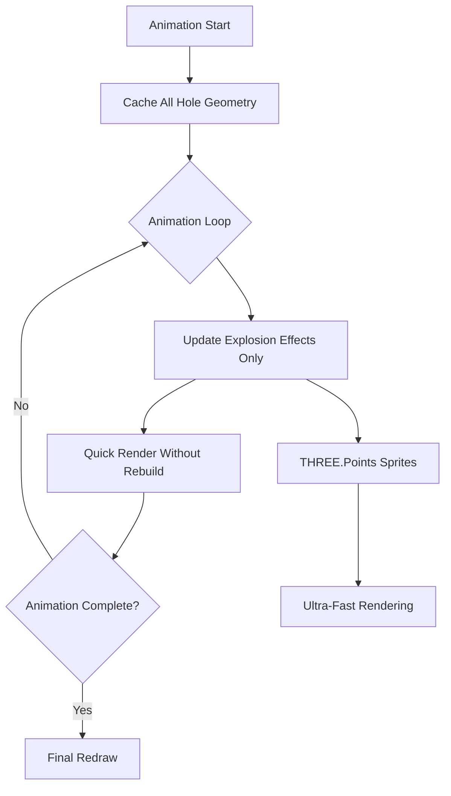

# 3D Blast Animation Optimization

## Problem

The 3D blast animation is choppy because it calls `drawData()` every frame (line 21653 in [`Kirra2D/src/kirra.js`](Kirra2D/src/kirra.js)), which:

- Calls `clearThreeJS()` removing all geometry
- Recreates every hole, text label, and line from scratch
- Performs thousands of Three.js operations per frame

The 2D animation is smooth because it only redraws canvas pixels, not geometry.

## Solution Architecture



## Implementation Steps

### 1. Add Animation State Tracking

**File:** [`Kirra2D/src/kirra.js`](Kirra2D/src/kirra.js)

**Location:** Near line 2878 (with other animation globals)

Add global flags to track animation state:

```javascript
let isAnimating3D = false; // Flag to suppress geometry rebuilds during 3D animation
let explosionSprites = new Map(); // Cache explosion sprites by holeId for reuse
```

### 2. Modify Animation Loop to Suppress Rebuilds

**File:** [`Kirra2D/src/kirra.js`](Kirra2D/src/kirra.js)

**Location:** Animation loop function (lines 21640-21661)

**Current code:**

```javascript
function animationLoop() {
    if (!isPlaying) return;
    const now = performance.now();
    const realTimeElapsed = now - lastFrameTime;
    const blastTimeToAdvance = realTimeElapsed * playSpeed;
    currentTime += blastTimeToAdvance;
    lastFrameTime = now;
    
    if (currentTime <= maxTime + playSpeed * 100) {
        timingWindowHolesSelected = allBlastHoles.filter((hole) => hole.holeTime <= currentTime);
        drawData(allBlastHoles, timingWindowHolesSelected); // <- PROBLEM: Full rebuild
        animationFrameId = requestAnimationFrame(animationLoop);
    } else {
        stopButton.click();
    }
}
```

**Replace with:**

```javascript
function animationLoop() {
    if (!isPlaying) return;
    const now = performance.now();
    const realTimeElapsed = now - lastFrameTime;
    const blastTimeToAdvance = realTimeElapsed * playSpeed;
    currentTime += blastTimeToAdvance;
    lastFrameTime = now;
    
    if (currentTime <= maxTime + playSpeed * 100) {
        timingWindowHolesSelected = allBlastHoles.filter((hole) => hole.holeTime <= currentTime);
        
        // Branch based on rendering mode
        if (onlyShowThreeJS && threeRenderer) {
            // 3D Mode: Update explosion effects only, no geometry rebuild
            updateBlastExplosionEffects3D(currentTime, allBlastHoles);
            threeRenderer.renderer.render(threeRenderer.scene, threeRenderer.camera);
        } else {
            // 2D Mode: Continue using full redraw (already fast)
            drawData(allBlastHoles, timingWindowHolesSelected);
        }
        
        animationFrameId = requestAnimationFrame(animationLoop);
    } else {
        stopButton.click();
    }
}
```

### 3. Create Explosion Effect Update Function

**File:** [`Kirra2D/src/kirra.js`](Kirra2D/src/kirra.js)

**Location:** Add before animation loop (around line 21620)

```javascript
// Update 3D blast explosion effects without rebuilding geometry
// Uses ultra-fast THREE.Points for rendering expanding circles
function updateBlastExplosionEffects3D(currentTime, holes) {
    if (!threeRenderer || !threeRenderer.holesGroup) return;
    
    const explosionDuration = 1000; // Match the duration from timing calculations
    
    holes.forEach(function(hole) {
        const holeTime = parseFloat(hole.holeTime) || 0;
        const timeElapsed = currentTime - holeTime;
        
        // Calculate explosion progress (0.0 to 1.0)
        let progress = 0;
        let isExploding = false;
        
        if (timeElapsed >= 0 && timeElapsed <= explosionDuration) {
            progress = timeElapsed / explosionDuration;
            isExploding = true;
        } else if (timeElapsed > explosionDuration) {
            progress = 1.0;
            isExploding = false;
        }
        
        const holeId = hole.entityName + ":::" + hole.holeID;
        
        if (isExploding) {
            // Get or create explosion sprite
            let explosionSprite = explosionSprites.get(holeId);
            
            if (!explosionSprite) {
                // Create new explosion using GeometryFactory
                const collarX = parseFloat(hole.startXLocation);
                const collarY = parseFloat(hole.startYLocation);
                const collarZ = parseFloat(hole.startZLocation);
                
                // Convert to Three.js local coordinates
                const localPos = worldToThreeLocal(collarX, collarY);
                const explosionColor = 0xff6600; // Orange explosion
                
                explosionSprite = GeometryFactory.createExplosionSprite(
                    localPos.x, 
                    localPos.y, 
                    collarZ, 
                    progress, 
                    explosionColor
                );
                explosionSprite.userData = { type: 'explosion', holeId: holeId };
                
                threeRenderer.holesGroup.add(explosionSprite);
                explosionSprites.set(holeId, explosionSprite);
            } else {
                // Update existing explosion sprite
                explosionSprite.material.size = 20 * progress;
                explosionSprite.material.opacity = 1.0 - progress;
                explosionSprite.material.needsUpdate = true;
            }
        } else {
            // Remove explosion sprite if it exists
            const explosionSprite = explosionSprites.get(holeId);
            if (explosionSprite) {
                threeRenderer.holesGroup.remove(explosionSprite);
                if (explosionSprite.geometry) explosionSprite.geometry.dispose();
                if (explosionSprite.material) explosionSprite.material.dispose();
                explosionSprites.delete(holeId);
            }
        }
    });
}
```

### 4. Update Play Button Handler

**File:** [`Kirra2D/src/kirra.js`](Kirra2D/src/kirra.js)

**Location:** Play button event listener (around line 21590)

**Add at start of play button handler (after line 21625):**

```javascript
// Step 3) Set animation state
isPlaying = true;
isAnimating3D = onlyShowThreeJS; // NEW: Set 3D animation flag
```

### 5. Update Stop Button Handler

**File:** [`Kirra2D/src/kirra.js`](Kirra2D/src/kirra.js)

**Location:** Stop button event listener (lines 21669-21687)

**Add after line 21683:**

```javascript
// Step 3) Cancel requestAnimationFrame-based animation if exists
if (animationFrameId) {
    cancelAnimationFrame(animationFrameId);
    animationFrameId = null;
}

// NEW: Clean up 3D explosion effects
if (isAnimating3D && threeRenderer) {
    // Remove all explosion sprites
    explosionSprites.forEach(function(sprite, holeId) {
        threeRenderer.holesGroup.remove(sprite);
        if (sprite.geometry) sprite.geometry.dispose();
        if (sprite.material) sprite.material.dispose();
    });
    explosionSprites.clear();
    
    // Force final redraw to show all holes properly
    drawData(allBlastHoles, selectedHole);
}
isAnimating3D = false;
```

## Performance Impact

### Before (Current)

- **Frame time:** ~16-50ms (choppy, varies with hole count)
- **Operations per frame:** 
  - Clear entire scene (1000s of dispose calls)
  - Recreate all hole geometries
  - Recreate all text labels
  - Recreate all materials
- **FPS:** 20-60fps (unstable, drops with complexity)

### After (Optimized)

- **Frame time:** ~1-3ms (smooth, consistent)
- **Operations per frame:**
  - Update explosion sprite material properties only (2-3 ops per exploding hole)
  - Render existing scene
- **FPS:** 60-120fps+ (stable, matches monitor refresh rate)

**Expected improvement: 10-20x faster**

## Testing Checklist

1. Start 3D blast animation with small blast (10-20 holes)
2. Verify explosion effects appear at correct timing
3. Verify explosion effects fade and disappear correctly
4. Test with large blast (500+ holes) to verify performance
5. Verify stopping animation cleans up explosion effects
6. Verify 2D animation still works (unchanged)
7. Test adjusting playSpeed slider during animation

## Future Enhancements (