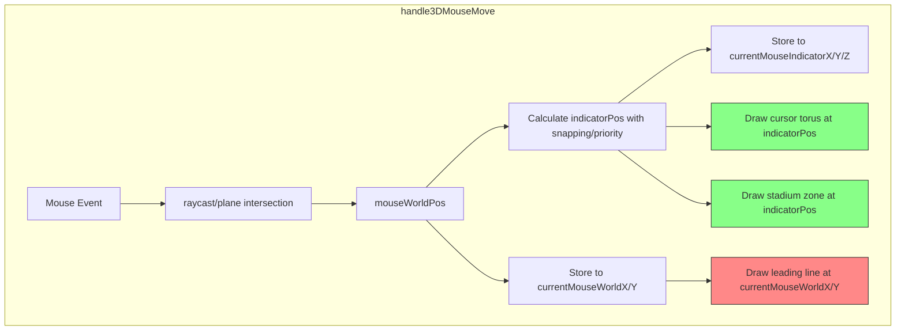

# 3D Leading Line Fix Plan

## Problem Summary

The 3D leading lines are not showing for Pattern in Polygon tool, and the leading lines are inconsistent with the cursor torus position.

## Root Causes Identified

### 1. Duplicate Pattern in Polygon Code

Two blocks in `handle3DMouseMove()` handle the same condition:

- **Step 13f.9.5** (lines 3051-3071): Uses snapped coordinates via `snapToNearestPoint()` - CORRECT
- **Step 13f.11** (lines 3147-3162): Uses raw `currentMouseWorldX/Y` - OVERWRITES THE FIRST

Since `drawKADLeadingLineThreeJS()` clears any existing leading line before adding a new one (see [canvas3DDrawing.js](D:\GIT_WORKSPACE\GIT_KIRRA-2D-3D\Kirra2D\src\draw\canvas3DDrawing.js) lines 1497-1507), the second call at Step 13f.11 overwrites Step 13f.9.5's line with potentially invalid coordinates.

### 2. Leading Lines Not Using `indicatorPos`

The coordinate flow in `handle3DMouseMove()`:

```
mouseWorldPos (raycast/plane) 
    -> stored to currentMouseWorldX/Y (line 2756-2758)
    -> indicatorPos calculation with snapping/priority (lines 2784-2856)
        -> stored to currentMouseIndicatorX/Y/Z (lines 2897-2899)
```

**Current usage:**

- Cursor torus: Uses `indicatorPos` (line 2894) - CORRECT
- Stadium zone: Uses `indicatorPos` (line 2924) - CORRECT  
- Leading lines: Use `currentMouseWorldX/Y` - WRONG

**Why this matters:** When camera is orbiting or snapping is active, `indicatorPos` differs from `currentMouseWorldX/Y`. The leading line endpoint should match the cursor torus position.

## Solution

### Change 1: Remove Duplicate Step 13f.11

Delete lines 3147-3162 in [kirra.js](D:\GIT_WORKSPACE\GIT_KIRRA-2D-3D\Kirra2D\src\kirra.js). Keep Step 13f.9.5 (lines 3051-3071) which correctly uses snapped coordinates.

The `else if (isPatternInPolygonActive)` block at lines 3159-3162 should be preserved (just update visuals without leading line).

### Change 2: Update Leading Lines to Use `indicatorPos`

Update all leading line calls in `handle3DMouseMove()` to use `indicatorPos` instead of `currentMouseWorldX/Y`:

**Location 1** - Drawing tools leading line (lines 2966-2974):

```javascript
// Before (line 2970-2972):
currentMouseWorldX,
currentMouseWorldY,
leadingLineZ,

// After - use indicatorPos if available:
indicatorPos ? indicatorPos.x : currentMouseWorldX,
indicatorPos ? indicatorPos.y : currentMouseWorldY,
indicatorPos ? indicatorPos.z : leadingLineZ,
```

**Location 2** - Pattern in Polygon (Step 13f.9.5, lines 3064-3068):

This one already uses snapped coordinates which is acceptable, but for consistency could also use `indicatorPos`.

**Location 3** - Holes Along Line (lines 3084-3088):

Same as above - uses snapped coordinates, acceptable.

### Change 3: Update `drawData()` Fallback (lines 28690-28698)

Update to use `currentMouseIndicatorX/Y/Z` (which stores `indicatorPos`) instead of `currentMouseWorldX/Y`:

```javascript
drawKADLeadingLineThreeJS(
    lastKADDrawPoint.x,
    lastKADDrawPoint.y,
    leadingLineZ,
    currentMouseIndicatorX || currentMouseWorldX,  // Prefer indicator position
    currentMouseIndicatorY || currentMouseWorldY,
    currentMouseIndicatorZ || leadingLineZ,
    leadingLineColor
);
```

## Files to Modify

- [kirra.js](D:\GIT_WORKSPACE\GIT_KIRRA-2D-3D\Kirra2D\src\kirra.js):
  - Line 2966-2974: Update drawing tools leading line to use `indicatorPos`
  - Lines 3147-3158: Remove duplicate Pattern in Polygon leading line (keep the `else if` branch)
  - Lines 28690-28698: Update `drawData()` fallback to use `currentMouseIndicatorX/Y/Z`

## Data Flow Diagram



The red box (leading line) should also use `indicatorPos` like the green boxes (torus and stadium).