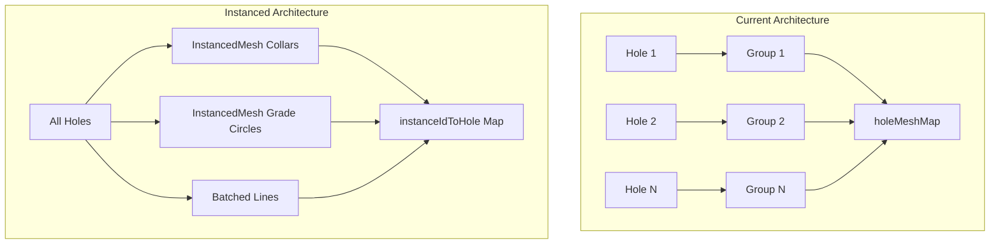
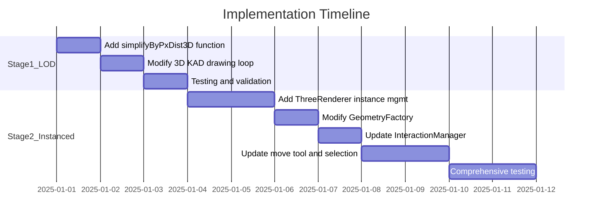

# 3D Level of Detail (LOD) Performance Optimization Plan

## Problem Statement

Large DXF imports crash the 3D view because:

1. KAD lines/polygons in 3D draw EVERY segment without simplification (unlike 2D which uses `simplifyByPxDist`)
2. Each segment creates a separate MeshLine mesh (100K segments = 100K draw calls)
3. Each hole creates a separate THREE.Group with multiple child meshes

## Current Architecture

```mermaid
flowchart TD
    subgraph current2D [2D Canvas - Lines 20803-20817]
        A[Original Points] --> B[simplifyByPxDist]
        B --> C[Simplified Points]
        C --> D[Draw fewer segments]
    end
    
    subgraph current3D [3D Canvas - Lines 21952-21976]
        E[Original Points] --> F[NO simplification]
        F --> G[Draw ALL segments]
        G --> H[Create MeshLine per segment]
    end
    
    subgraph currentHoles [Holes - Line 21837]
        I[Each Hole] --> J[drawHoleThreeJS]
        J --> K[THREE.Group per hole]
        K --> L[holeMeshMap.set]
    end
```



---

## Stage 1: LOD Simplification for KAD Entities (Safe, High Impact)

### Goal

Apply the same pixel-distance simplification to 3D that 2D already uses. This preserves all interactions since we're just drawing fewer segments.

### Files to Modify

1. **[src/kirra.js](src/kirra.js)** - Lines 21952-21993

- Add 3D-aware simplification before drawing loop
- Use camera frustum to calculate pixel distances

### Implementation

Add a new function `simplifyByPxDist3D()` that:

1. Projects 3D world coordinates to screen pixels using camera matrix
2. Applies same distance threshold logic as 2D version
3. Returns simplified point array

Modify the 3D KAD drawing loop (around line 21957):

```javascript
// BEFORE (current - no simplification):
const visiblePoints = entity.data.filter((point) => point.visible !== false);
if (visiblePoints.length >= 2) {
    for (var i = 0; i < visiblePoints.length - 1; i++) {
        // draws EVERY segment
    }
}

// AFTER (with simplification):
const visiblePoints = entity.data.filter((point) => point.visible !== false);
if (visiblePoints.length >= 2) {
    // Step 1) Apply pixel-distance simplification (same as 2D)
    var pointThreshold = (currentScale > 1) ? 2 : 1;
    var simplifiedPoints = simplifyByPxDist3D(visiblePoints, pointThreshold);
    
    for (var i = 0; i < simplifiedPoints.length - 1; i++) {
        // draws simplified segments only
    }
}
```


### New Function: `simplifyByPxDist3D()`

```javascript
// 3D version of simplifyByPxDist - uses camera projection for pixel distance
function simplifyByPxDist3D(points, pxThreshold) {
    if (!points || points.length < 2) return points;
    if (!threeRenderer || !threeRenderer.camera) return points;
    
    const camera = threeRenderer.camera;
    const canvas = document.getElementById("threeCanvas");
    if (!canvas) return points;
    
    const pxThresholdSq = pxThreshold * pxThreshold;
    const simplified = [points[0]];
    
    // Step 1) Project first point to screen
    var lastKeptPoint = points[0];
    var lastScreenPos = worldToScreen3D(lastKeptPoint.pointXLocation, 
                                         lastKeptPoint.pointYLocation, 
                                         lastKeptPoint.pointZLocation || 0, 
                                         camera, canvas);
    
    for (var i = 1; i < points.length; i++) {
        var currentPoint = points[i];
        var currentScreenPos = worldToScreen3D(currentPoint.pointXLocation,
                                                currentPoint.pointYLocation,
                                                currentPoint.pointZLocation || 0,
                                                camera, canvas);
        
        var dx = currentScreenPos.x - lastScreenPos.x;
        var dy = currentScreenPos.y - lastScreenPos.y;
        
        // Keep point if distance is significant OR if it's the last point
        if (dx * dx + dy * dy >= pxThresholdSq || i === points.length - 1) {
            simplified.push(currentPoint);
            lastKeptPoint = currentPoint;
            lastScreenPos = currentScreenPos;
        }
    }
    
    return simplified;
}

// Helper: Project 3D world point to screen coordinates
function worldToScreen3D(worldX, worldY, worldZ, camera, canvas) {
    var local = worldToThreeLocal(worldX, worldY);
    var vector = new THREE.Vector3(local.x, local.y, worldZ);
    vector.project(camera);
    
    return {
        x: (vector.x * 0.5 + 0.5) * canvas.width,
        y: (-vector.y * 0.5 + 0.5) * canvas.height
    };
}
```


### Validation Checklist (Stage 1)

- [ ] Load small DXF - verify all lines render correctly
- [ ] Zoom out - verify lines simplify (fewer segments drawn)
- [ ] Zoom in - verify detail returns
- [ ] Select KAD line - verify selection still works
- [ ] Right-click KAD line - verify context menu works
- [ ] Move KAD vertex - verify manipulation works
- [ ] Performance: Check render time with large DXF before/after

---

## Stage 2: Instanced Rendering for Holes (Optional, Requires Careful Testing)

### Goal

Replace individual hole Groups with THREE.InstancedMesh for significant performance gains with thousands of holes.

### Risk Assessment

| Current Feature | Risk Level | Mitigation ||----------------|------------|------------|| Single-click selection | LOW | InstancedMesh returns instanceId in raycast || Multi-select (box/polygon) | MEDIUM | Need to map instanceId to hole data || Right-click context menu | LOW | Same as single-click || Move tool dragging | MEDIUM | Use setMatrixAt() instead of group.position || Highlighting | MEDIUM | Use setColorAt() or separate highlight geometry || Real-time position updates | MEDIUM | Update instance matrix, call needsUpdate |

### Files to Modify

1. **[src/three/GeometryFactory.js](src/three/GeometryFactory.js)** - Add `createInstancedHoles()` method
2. **[src/draw/canvas3DDrawing.js](src/draw/canvas3DDrawing.js)** - New `drawHolesInstancedThreeJS()` function
3. **[src/three/ThreeRenderer.js](src/three/ThreeRenderer.js)** - Add instance management
4. **[src/three/InteractionManager.js](src/three/InteractionManager.js)** - Handle instanceId in raycasting
5. **[src/kirra.js](src/kirra.js)** - Update hole drawing loop, move tool, selection

### Architecture Change




### Implementation Approach

#### Step 2.1: Add Instance Management to ThreeRenderer

```javascript
// ThreeRenderer.js additions
this.instancedCollars = null;      // InstancedMesh for collar circles
this.instancedGrades = null;       // InstancedMesh for grade circles  
this.instanceIdToHole = new Map(); // instanceId -> hole data
this.holeToInstanceId = new Map(); // holeId -> instanceId

// Method to update single hole position
updateHolePosition(holeId, newX, newY, newZ) {
    const instanceId = this.holeToInstanceId.get(holeId);
    if (instanceId === undefined) return;
    
    const matrix = new THREE.Matrix4();
    var local = window.worldToThreeLocal(newX, newY);
    matrix.setPosition(local.x, local.y, newZ);
    
    this.instancedCollars.setMatrixAt(instanceId, matrix);
    this.instancedCollars.instanceMatrix.needsUpdate = true;
    // Repeat for other instanced geometries
}
```


#### Step 2.2: Modify InteractionManager.findClickedHole()

```javascript
// InteractionManager.js modification
findClickedHole(intersects, allBlastHoles) {
    for (const intersect of intersects) {
        // NEW: Check for instanced mesh hit
        if (intersect.instanceId !== undefined) {
            const holeData = this.threeRenderer.instanceIdToHole.get(intersect.instanceId);
            if (holeData) {
                return holeData;
            }
        }
        
        // EXISTING: Check for userData.holeId (fallback for non-instanced)
        // ... existing code ...
    }
}
```


#### Step 2.3: Modify Move Tool Position Updates

```javascript
// kirra.js - handleMoveToolMouseMove modification (around line 25920)
// BEFORE:
if (threeRenderer && threeRenderer.holeMeshMap) {
    const holeGroup = threeRenderer.holeMeshMap.get(hole.holeID);
    if (holeGroup) {
        holeGroup.position.set(newLocal.x, newLocal.y, z);
    }
}

// AFTER:
if (threeRenderer) {
    threeRenderer.updateHolePosition(
        hole.entityName + ":::" + hole.holeID,
        newX, newY, hole.startZLocation
    );
}
```


### Feature Flag Approach

Add a settings toggle to enable/disable instanced rendering:

```javascript
// In 3D settings
var useInstancedHoles = true; // Can be toggled in settings

// In drawing code
if (useInstancedHoles && allBlastHoles.length > 100) {
    drawHolesInstancedThreeJS(allBlastHoles);
} else {
    // Use existing per-hole approach
    for (const hole of allBlastHoles) {
        drawHoleThreeJS(hole);
    }
}
```


### Validation Checklist (Stage 2)

- [ ] Load pattern with 10 holes - verify rendering matches original
- [ ] Load pattern with 1000+ holes - verify performance improvement
- [ ] Single-click hole - verify selection works
- [ ] Shift-click multiple holes - verify multi-select works
- [ ] Box select holes - verify selection works
- [ ] Right-click hole - verify context menu works
- [ ] Move tool: drag single hole - verify position updates
- [ ] Move tool: drag multiple holes - verify all update
- [ ] Undo/redo hole move - verify works
- [ ] Delete hole - verify instance removed correctly
- [ ] Add new hole - verify instance added correctly
- [ ] Toggle between 2D/3D - verify consistency

---

## Stage 3: KAD Line Batching (Deferred - Needs Further Analysis)

### Current Assessment

KAD line batching is complex for a CAD application because:

- Individual segment selection is essential
- Per-segment color/width properties must be preserved
- Vertex manipulation (move tool) requires segment identification

### Recommended Approach (Future)

Consider a **hybrid system**:

- Use batched geometry during pan/zoom for performance
- Switch to individual meshes when selection tool is active
- Rebuild batch when selection ends

This stage is deferred pending results from Stages 1 and 2.---

## Implementation Order



---

## Rollback Strategy

Each stage is implemented behind a feature flag with UI controls.

### UI Already Added (kirra.html lines 2019-2021)

```html
<input type="checkbox" id="use3DSimplification" checked> <label for="use3DSimplification">Use 3D Simplification</label>
<input type="checkbox" id="useInstancedHoles" > <label for="useInstancedHoles">Use Instanced Holes</label>
```


### JavaScript to Wire Up Feature Flags (kirra.js)

```javascript
// Read feature flags from UI checkboxes
function get3DOptimizationFlags() {
    var use3DSimplification = document.getElementById("use3DSimplification");
    var useInstancedHoles = document.getElementById("useInstancedHoles");
    
    return {
        use3DSimplification: use3DSimplification ? use3DSimplification.checked : true,
        useInstancedHoles: useInstancedHoles ? useInstancedHoles.checked : false
    };
}

// Store in window for global access
window.use3DSimplification = true;   // Stage 1 - enabled by default
window.useInstancedHoles = false;    // Stage 2 - disabled by default until tested
```

This allows:

1. Easy A/B comparison for performance testing
2. Quick rollback if issues discovered
3. User choice if instancing causes problems on specific hardware