# Kirra2D Modernization & Save/Export Reorganization Plan

**Date**: 2025-12-20  
**Time**: 17:00 (UPDATED)
**Status**: 📋 PHASE 1 COMPLETE ✅ | PHASE 2 IN PROGRESS

---

## Phase 1: Context Menu Delete Buttons ✅ COMPLETE

### Status: ✅ ALL IMPLEMENTED AND TESTED

**Completed Features:**
1. ✅ **Holes Context Menu Delete** - Two-stage confirmation with starting number input
2. ✅ **KAD Context Menu Delete** - Auto-renumber with edge case handling
3. ✅ **Generic Input Dialog** - `showConfirmationDialogWithInput()` created
4. ✅ **TreeView Delete Fix** - Fixed infinite recursion bug
5. ✅ **TreeView Renumber Confirmation** - Added two-stage dialog to TreeView deletion
6. ✅ **Factory Code Compliance** - All functions properly exposed and used

**Files Modified:**
- ✅ `src/kirra.js` - Exposed functions (line ~18658)
- ✅ `src/dialog/FloatingDialog.js` - Added `showConfirmationDialogWithInput`
- ✅ `src/dialog/contextMenu/HolesContextMenu.js` - Delete with renumber
- ✅ `src/dialog/contextMenu/KADContextMenu.js` - Delete with auto-renumber

**Documentation:**
- ✅ `src/aiCommentary/20251220-1500-Phase1_Delete_Implementation.md`
- ✅ `src/aiCommentary/20251220-1630-TreeView_Delete_Recursion_Fix.md`

**Testing:** ✅ Completed - All working as expected

---

## Architecture Overview

```mermaid
graph TB
    subgraph Phase1 [Phase 1: ✅ COMPLETE]
        HoleDelete[✅ Hole Delete Button]
        KADDelete[✅ KAD Delete Button]
        RenumberLogic[✅ Renumber Logic]
        TreeViewFix[✅ TreeView Recursion Fix]
    end
    
    subgraph Phase2 [Phase 2: IN PROGRESS]
        ExportSyntax[Fix Export Syntax Error]
        ExistingCheck[Audit Existing Dialogs]
        ExtractRemaining[Extract Remaining Dialogs]
        ConvertSwal[Convert Swal to FloatingDialog]
    end
    
    subgraph Phase3 [Phase 3: Save System Redesign]
        SaveMenu[Save Menu]
        SaveBlasts[Save Blasts]
        SaveKAD[Save KAD]
        ColumnOptions[Column Format Options]
    end
    
    subgraph Phase4 [Phase 4: Export System]
        ExportMenu[Export Menu]
        ExportCSV[Export Custom CSV/TXT]
        ExportDXF[Export DXF Options]
        ExportSpecialty[Specialty Formats]
    end
    
    subgraph Phase5 [Phase 5: Import Fix]
        ImportFix[ImportCustomCSV Fix]
        GeometryPriority[Geometry Priority Logic]
    end
    
    Phase1 --> Phase2
    Phase2 --> Phase3
    Phase3 --> Phase4
    Phase4 --> Phase5
```



---

## Kirra2D Coding Standards & Rules

**CRITICAL**: All implementation must follow these established rules:

### Factory Code & Reuse Principles
1. **Use Established Factory Code**: NEVER recreate functionality that already exists
   - Use `GeometryFactory` class for all 3D hole visualization (collar/grade/lines)
   - Use `window.createEnhancedFormContent()` for all dialog forms
   - Use `window.getFormData()` for form data extraction
   - Use `window.showConfirmationDialog()` for yes/no prompts
   - Use `window.showConfirmationDialogWithInput()` for prompts with input ✅ NEW
   - Use `window.FloatingDialog` for ALL dialogs (NO Swal2)
   - Use `window.calculateHoleGeometry()` for geometry calculations
   - Use `window.renumberHolesFunction()` for hole renumbering
   - Use `window.renumberEntityPoints()` for KAD point renumbering

2. **Reuse Existing Functions**: Before writing new code, check for:
   - Save functions: `debouncedSaveHoles()`, `debouncedSaveKAD()`
   - Update functions: `debouncedUpdateTreeView()`, `updateStatusMessage()`
   - Drawing functions: `drawData()`, `clearAllSelectionState()`
   - Validation functions: Check kirra.js for existing patterns

### Coordinate System & 3D Rules
3. **ThreeJS Coordinate Transform**:
   - Use same XY transform as 2D (data centroid at 0,0)
   - Do NOT scale 3D transform
   - Do NOT transform Z elevations
   - Selection in 3D is a tunnel (fat raycast from camera to infinity)

4. **Camera Controls**:
   - Orbit in 3D around Mouse Screen XY and Data Z centroid
   - Zoom to same Mouse Screen XY and Data Z centroid
   - Pan is the default mode

5. **Canvas Coordinate Convention**:
   - Y up is North (+ve), Y down is South (-ve)
   - X East is +ve, X West is -ve
   - Kirra is a UTM-styled real-world coordinate app

### Data Handling
6. **Large Coordinate Values**:
   - Data can be very large (UTM coordinates)
   - Always transform based on data centroid (centroid = 0,0)
   - Check 3D entities are in correct coordinate space before drawing

7. **Bearing Convention**:
   - Bearing moves clockwise
   - North is 0°, East is 90°, South is 180°, West is 270°

### Code Style & Quality
8. **No Template Literals**: ALWAYS use `"string " + variable` instead of `` `string ${variable}` ``

9. **Step Comments**: Add `// Step #)` comments to make code easy to follow

10. **Verbose Comments**: When removing code, provide verbose comment explaining why

11. **Line Numbers in Suggestions**: Provide line numbers or ranges for all code references

12. **FloatingDialog for All Dialogs**:
    - Use `FloatingDialog` class for all dialogs
    - Swal2 is a backup only (avoid if possible)

13. **AI Commentary**:
    - Save all AI commentary to `src/aiCommentary/` folder
    - Format: `YYYYMMDD-hhmm-Name.md`
    - Maintain chronological knowledge

### Geometry Calculation Priority
14. **Accuracy Hierarchy** (from README.md):
    - Direct Z measurements (±0.01m) - HIGHEST ACCURACY
    - 2D XY calculations (±0.5°)
    - 3D compound calculations (±0.02m)
    - Inverse trig (±1°, poor near vertical)
    - Interpolations (±0.05m to ±0.5m) - LOWEST ACCURACY

15. **When Conflicts Arise**: Use most accurate method (see Phase 5.2)

---

## Phase 2: Complete SWAL2 to FloatingDialog Migration

### 2.1 Fix Export Statement Syntax Error ✅ COMPLETE

**Issue**: FloatingDialog.js had ES6 export but was also loaded as regular script tag

**Root Cause**: Duplicate loading - both as ES6 module (kirra.js line 77) AND as script tag (kirra.html line 2532)

**Solution**:
1. ✅ Removed duplicate `<script src="src/dialog/FloatingDialog.js"></script>` from kirra.html
2. ✅ Kept ES6 export in FloatingDialog.js (needed for kirra.js import)
3. ✅ Also kept window.functionName exposure for backward compatibility

---

### 2.2 Audit Existing Dialog Implementations ✅ COMPLETE

**✅ ALREADY IMPLEMENTED - DO NOT RECREATE:**

1. **✅ AddHoleDialog.js** - COMPLETE
   - Location: `src/dialog/popups/generic/AddHoleDialog.js` (528 lines)
   - Status: Fully converted to FloatingDialog
   - Function: `showAddHoleDialog()` exposed globally
   - Replaces: `addHolePopup()` from kirra.js (line 19809)
   - **ACTION**: Remove `addHolePopup()` from kirra.js

2. **✅ PatternGenerationDialogs.js** - COMPLETE
   - Location: `src/dialog/popups/generic/PatternGenerationDialogs.js` (362 lines)
   - Status: Fully converted to FloatingDialog
   - Functions: `showPatternDialog(mode, worldX, worldY)` exposed globally
   - Replaces: `addPatternPopup()` from kirra.js (line 19851)
   - **ACTION**: Remove `addPatternPopup()` from kirra.js

3. **✅ HolesContextMenu.js** - COMPLETE
   - Location: `src/dialog/contextMenu/HolesContextMenu.js` (663 lines)
   - Status: Fully converted to FloatingDialog with Delete button
   - Functions: `showHolePropertyEditor()`, `processHolePropertyUpdates()`
   - Includes: Delay, Color, Connector Curve, Type, Diameter, Bearing, Angle, Subdrill, CollarZ, GradeZ, Burden, Spacing, RowID, PosID
   - **ACTION**: Verify no hole property editing remains in kirra.js

4. **✅ KADContextMenu.js** - COMPLETE
   - Location: `src/dialog/contextMenu/KADContextMenu.js` (560 lines)
   - Status: Fully converted to FloatingDialog with Delete button
   - Functions: `showKADPropertyEditorPopup()`, `showMultipleKADPropertyEditor()`, `convertLinePolyType()`, `updateKADObjectProperties()`
   - **ACTION**: Remove `showKADPropertyEditorPopup()` from kirra.js (line 28276)

---

### 2.3 Extract Pattern Dialogs 🔄 IN PROGRESS

**File**: Update `src/dialog/popups/generic/HolePatternDialogs.js` (currently placeholder)

**Status Analysis**:
1. ❌ ~~`addHolePopup()`~~ - **DONE** (AddHoleDialog.js)
2. ❌ ~~`addPatternPopup()`~~ - **DONE** (PatternGenerationDialogs.js)
3. ❌ ~~`showPatternInPolygonPopup()`~~ - **DONE** (3-line wrapper, calls PatternGenerationDialogs.js)
4. ⚠️ `showHolesAlongLinePopup()` - line 33351 - **NEEDS CHECK** (likely Swal)
5. ⚠️ `showHolesAlongPolylinePopup()` - line 34531 - **NEEDS CHECK** (likely Swal)

**Extraction Plan**:
- Extract `showHolesAlongLinePopup()` and `showHolesAlongPolylinePopup()` to HolePatternDialogs.js
- Use PatternGenerationDialogs.js as template (similar pattern/attributes)
- Convert Swal.fire to FloatingDialog
- Convert template literals to string concatenation
- ✅ **USE FACTORY CODE**: `window.createEnhancedFormContent(fields)` for forms
- Test thoroughly after extraction

---

### 2.4 Extract Property Dialogs ✅ COMPLETE

**File**: `src/dialog/popups/generic/HolePropertyDialogs.js` (fully implemented)

**Status**: ✅ ALL 7 FUNCTIONS EXTRACTED
1. ✅ `renameEntityDialog()` - line 41311 (53 lines)
2. ✅ `editBlastNamePopup()` - line 41365 (229 lines with complex duplicate checking)
3. ✅ `editHoleTypePopup()` - line 41594 (81 lines)
4. ✅ `editHoleLengthPopup()` - line 41676 (116 lines with validation)
5. ✅ `measuredLengthPopup()` - line 41793 (77 lines)
6. ✅ `measuredMassPopup()` - line 41869 (77 lines)
7. ✅ `measuredCommentPopup()` - line 41945 (83 lines)

**Result**:
- ✅ Removed 717 lines from kirra.js (lines 41311-42027)
- ✅ All functions already using FloatingDialog (no conversion needed)
- ✅ Global exposure via window object
- ✅ Script tag already present in kirra.html (line 2548)

**Commentary**: `src/aiCommentary/20251220-1735-Phase2_4_PropertyDialogs_Complete.md`

---

### 2.5 Extract Export Dialogs 📋 READY

**File**: Update `src/dialog/popups/generic/ExportDialogs.js` (currently placeholder)

**Status Analysis**:
1. ✅ `saveIREDESPopup()` - line 10230 (342 lines) - **Already uses FloatingDialog** (easy extraction)
2. ❌ `saveAQMPopup()` - line 19402 (402 lines) - **Uses Swal with massive HTML** (defer for now)

**Extraction Plan**:
- Extract saveIREDESPopup() (straightforward, already modern)
- Defer saveAQMPopup() to dedicated task (requires 2-3 hours of Swal→FloatingDialog conversion)

---

### 2.6 Extract KAD Dialogs 📋 READY

**File**: Update `src/dialog/popups/generic/KADDialogs.js` (currently placeholder)

**Status Analysis**:
1. ❌ ~~`showKADPropertyEditorPopup()`~~ - **DONE** (removed from kirra.js, now in KADContextMenu.js)
2. ✅ `showOffsetKADPopup()` - line 14849 - **Already uses FloatingDialog** (easy extraction)
3. ❓ `showRadiiConfigPopup()` - line 15508 - **Need to check**
4. ❓ `showTriangulationPopup()` - line 13285 - **Need to check**

**Extraction Plan**:
- Extract showOffsetKADPopup() (straightforward)
- Check and extract remaining 2 functions

---

## Phase 3: Save System Redesign

### 3.1 Save Menu Architecture

**New Menu Structure** (HTML):
```
File > Save >
  ├── Save All Blasts (All Entities)
  ├── Save Current Blast (Single Entity)
  ├── Save Visible Blasts Only
  ├── Save KAD Entities
  │   ├── Save All KAD
  │   ├── Save Selected KAD
  │   └── Save Visible KAD
  └── Save Format ▶
      ├── 4 Column (ID, X, Y, Z)
      ├── 7 Column (+ ToeXYZ)
      ├── 9 Column (+ Diameter, Type)
      ├── 12 Column (+ FromHole, Delay, Color)
      ├── 14 Column (+ EntityName, EntityType) [Default]
      ├── 30 Column (Extended)
      ├── 32 Column (Full)
      └── 35 Column (Complete)
```

### 3.2 Save Implementation

**File**: Create `src/dialog/popups/generic/SaveDialogs.js`

**CRITICAL - Use Factory Code**:
- ✅ **USE**: `window.createEnhancedFormContent(fields)` - DO NOT recreate form builder
- ✅ **USE**: `window.getFormData(formContent)` - DO NOT recreate form extractor
- ✅ **USE**: `window.FloatingDialog` - DO NOT use Swal2
- ✅ **USE**: Existing CSV generation functions (check kirra.js for `saveKirraCSV` patterns)

**Implementation Pattern**:
```javascript
// Step 1) Use Factory Code for form creation
const fields = [
    { label: "Save Scope", name: "saveScope", type: "radio", value: "all", options: [...] },
    { label: "Format", name: "columnFormat", type: "select", value: "14", options: [...] }
];

// Step 2) USE FACTORY CODE - Do NOT recreate
const formContent = window.createEnhancedFormContent(fields);

// Step 3) USE FACTORY CODE - Do NOT recreate
const dialog = new window.FloatingDialog({
    title: "Save Blast Holes",
    content: formContent,
    onConfirm: () => {
        const formData = window.getFormData(formContent);  // USE FACTORY CODE
        saveBlastHoles(formData.saveScope, formData.columnFormat);
    }
});
```

**Column Format Reference** (README.md lines 88-112):
- 4 column: ID, X, Y, Z
- 7 column: ID, X, Y, Z, toeX, toeY, toeZ
- 9 column: + Diameter, Type
- 12 column: + FromHole, Delay, Color
- 14 column: + entityName, entityType (current full format)
- 30, 32, 35 column: Extended formats (need to define)

---

## Phase 4: Export System Redesign

### 4.1 Export Menu Architecture

**New Menu Structure**:
```
File > Export >
  ├── Export Custom CSV/TXT (Column Picker)
  ├── Export DXF ▶
  │   ├── Standard DXF (Holes)
  │   ├── Vulcan Compatible DXF (Holes)
  │   ├── DXF Entities (KAD Objects)
  │   └── DXF 3DFaces (Surfaces)
  ├── Export Surfaces ▶
  │   ├── Point Clouds (.xyz, .txt)
  │   ├── Surpac DTM (2 files, non-binary)
  │   ├── OBJ (Textured)
  │   └── OBJ (Blank)
  ├── Export Images ▶
  │   └── GeoTIFF
  ├── Export CBLAST
  ├── Export IREDES (Epiroc)
  └── Export AQM (MineStar)
```

### 4.2 Key Export Formats

**4.2.1 Export Custom CSV/TXT**
- ✅ **USE FACTORY CODE**: Reuse column mapping UI from `importCustomCSV` (DO NOT RECREATE)
- ✅ **USE FACTORY CODE**: `window.createEnhancedFormContent()` for dialog forms
- User picks which of 35 available columns to export
- Column order selection
- Preview first 5 rows before export
- Delimiter selection (comma, tab, semicolon, pipe)

**4.2.2 Vulcan Compatible DXF** (Reference: `src/referenceFiles/HoleToVulcanDXF-VBA.bas`)
- Add Vulcan-specific XData (Extended Entity Data)
- Include APPID table for MAPTEK_VULCAN
- Use proper DXF header with EXTMIN/EXTMAX
- Color code 140 for red holes

**4.2.3 CBLAST Export** (Reference: `src/referenceFiles/CBLASTExport.bas`)
- Format: HOLE, PRODUCT, DETONATOR, STRATA records
- Angle = 90 - Dip
- Handle "DO NOT CHARGE" holes
- Escape commas in string fields

---

## Phase 5: Fix importCustomCSV Geometry Conflicts

### 5.1 Problem Analysis

**Issue**: When import CSV provides CollarXYZ, GradeXYZ, ToeXYZ, Length, Subdrill - conflicts arise

**Conflicts**:
1. GradeZ vs Subdrill: Both try to calculate BenchHeight
2. Length vs calculated from coordinates

**Working Import**: CollarXYZ + Angle + Bearing + Length + Subdrill (no conflicts)

### 5.2 Geometry Priority Hierarchy

**Priority Order** (Most Accurate → Least Accurate):
1. **Direct Z measurements**: BenchHeight, SubdrillAmount, VerticalDrop (±0.01m)
2. **2D XY calculations**: HoleBearing (±0.5°)
3. **3D compound**: HoleLength (±0.02m)
4. **Inverse trig**: HoleAngle (±1°, poor near vertical)
5. **Interpolations**: GradeXY (±0.05m to ±0.5m)

### 5.3 Import Resolution Strategy

**Solution**: Implement scenario detection logic that prioritizes coordinate-based calculations when full survey data (CollarXYZ + GradeXYZ + ToeXYZ) is available.

**Implementation**:
1. Add conflict detection in column mapping stage
2. Show visual indicators (⚠️) next to conflicting columns
3. Provide tooltip explaining which values will be used
4. Add checkbox: "Use coordinates (recommended)" vs "Use length/subdrill values"
5. Log decisions to console for debugging

### 5.4 Calculation Function Updates

**Add Mode 9 to calculateHoleGeometry**: Recalculate from coordinates

**CRITICAL - Use Factory Code**:
- ✅ **EXTEND** existing `window.calculateHoleGeometry(hole, value, modeLAB)` function
- ✅ **DO NOT RECREATE** - Add Mode 9 to existing function at line 21128 in kirra.js

```javascript
// Add to existing calculateHoleGeometry function
if (modeLAB === 9) {
    // Step 1) Recalculate everything from CollarXYZ, GradeXYZ, ToeXYZ
    const dx = hole.endXLocation - hole.startXLocation;
    const dy = hole.endYLocation - hole.startYLocation;
    const dz = hole.startZLocation - hole.endZLocation; // VerticalDrop
    
    // Step 2) Most accurate calculations (Priority 1: Direct Z measurements)
    hole.holeLengthCalculated = Math.sqrt(dx*dx + dy*dy + dz*dz);
    hole.benchHeight = hole.startZLocation - hole.gradeZLocation;
    hole.subdrillAmount = hole.gradeZLocation - hole.endZLocation;
    
    // Step 3) Angle and bearing calculations
    hole.holeAngle = Math.acos(dz / hole.holeLengthCalculated) * (180 / Math.PI);
    hole.holeBearing = (450 - Math.atan2(dx, dy) * (180 / Math.PI)) % 360;
}
```

**Benefits**:
- Calculate Length, Angle, Bearing from CollarXYZ/ToeXYZ
- Calculate BenchHeight from CollarZ - GradeZ (±0.01m accuracy)
- Calculate Subdrill from GradeZ - ToeZ (±0.01m accuracy)
- Most accurate approach for survey data

---

## Testing Checklist

### Phase 1 Testing: ✅ COMPLETE
- ✅ Delete single hole (with renumber prompt)
- ✅ Delete single hole (without renumber)
- ✅ Delete multiple holes (with renumber prompt)
- ✅ Delete multiple holes (without renumber)
- ✅ Delete multiple holes from different entities
- ✅ Delete KAD point (auto-renumber)
- ✅ Delete KAD segment (auto-renumber)
- ✅ Delete entire KAD entity (only 1 point left)
- ✅ Convert poly to line (only 2 points left)
- ✅ Verify IndexedDB persistence
- ✅ Verify TreeView updates
- ✅ TreeView hole deletion with renumber confirmation
- ✅ TreeView entity deletion with renumber confirmation

### Phase 2 Testing:
- [ ] All remaining pattern dialogs work with FloatingDialog
- [ ] All remaining property dialogs work
- [ ] All export dialogs converted
- [ ] No SWAL2 references remain in extracted dialogs
- [ ] No export statement errors
- [ ] Verify removed functions (addHolePopup, addPatternPopup, showKADPropertyEditorPopup) don't break anything

### Phase 3 Testing:
- [ ] Save All Blasts (all formats)
- [ ] Save Current Blast
- [ ] Save Visible Only
- [ ] Save KAD (all, selected, visible)
- [ ] Verify all column formats generate correctly

### Phase 4 Testing:
- [ ] Export Custom CSV with column picker
- [ ] Export Standard DXF
- [ ] Export Vulcan DXF (verify XData)
- [ ] Export DXF Entities
- [ ] Export DXF 3DFaces
- [ ] Export surfaces (all formats)
- [ ] Export CBLAST (verify format)
- [ ] Export IREDES
- [ ] Export AQM

### Phase 5 Testing:
- [ ] Import CollarXYZ + GradeXYZ + ToeXYZ (coordinates priority)
- [ ] Import CollarXYZ + Angle + Bearing + Length + Subdrill (design priority)
- [ ] Import with conflicts shows warning
- [ ] Verify conflict resolution uses coordinate-based calculations
- [ ] Verify holes have correct geometry after import

---

## File Structure After Implementation

```
src/
├── dialog/
│   ├── FloatingDialog.js (existing, updated with showConfirmationDialogWithInput)
│   ├── contextMenu/
│   │   ├── HolesContextMenu.js ✅ COMPLETE (with Delete button)
│   │   └── KADContextMenu.js ✅ COMPLETE (with Delete button)
│   └── popups/
│       └── generic/
│           ├── AddHoleDialog.js ✅ COMPLETE (528 lines)
│           ├── PatternGenerationDialogs.js ✅ COMPLETE (362 lines)
│           ├── HolePatternDialogs.js ⚠️ UPDATE (extract 3 remaining functions)
│           ├── HolePropertyDialogs.js ⚠️ UPDATE (extract ~7 functions)
│           ├── ExportDialogs.js ⚠️ UPDATE (extract IREDES, AQM)
│           ├── KADDialogs.js ⚠️ UPDATE (extract 3 remaining functions)
│           ├── SaveDialogs.js (NEW - Phase 3)
│           ├── ExportCustomCSVDialog.js (NEW - Phase 4)
│           ├── ExportDXFDialog.js (NEW - Phase 4)
│           ├── ExportSurfacesDialog.js (NEW - Phase 4)
│           └── ExportCBLASTDialog.js (NEW - Phase 4)
└── kirra.js (updated: remove extracted functions, fix import conflicts)
```

---

## Implementation Notes

**CRITICAL - Follow Kirra2D Coding Standards (see above)**

### Code Reuse Requirements
1. **Use Factory Code - DO NOT RECREATE**:
   - ✅ `GeometryFactory.createHole()` for 3D holes
   - ✅ `window.createEnhancedFormContent(fields)` for all forms
   - ✅ `window.getFormData(formContent)` for form extraction
   - ✅ `window.FloatingDialog` for ALL dialogs (NO Swal2)
   - ✅ `window.showConfirmationDialog()` for yes/no prompts
   - ✅ `window.showConfirmationDialogWithInput()` for input prompts ✅ NEW
   - ✅ `window.calculateHoleGeometry(hole, value, mode)` for geometry
   - ✅ `window.renumberHolesFunction()` / `window.renumberEntityPoints()`

### Mandatory Patterns
2. **No ES6 Exports**: All new dialog files expose via `window.functionName = functionName`

3. **String Concatenation Only**: NEVER use template literals `` `string ${var}` ``
   - ❌ BAD: `` `Deleted ${count} holes` ``
   - ✅ GOOD: `"Deleted " + count + " holes"`

4. **FloatingDialog Consistency**: All dialogs use FloatingDialog class, not Swal2

5. **Step Comments**: Add `// Step #)` comments to all functions for readability

6. **Verbose Removal Comments**: When removing code, explain why in detail

### Data Management
7. **IndexedDB Persistence**: Always call `debouncedSaveHoles()` or `debouncedSaveKAD()` after data changes

8. **TreeView Updates**: Always call `debouncedUpdateTreeView()` after entity changes

9. **User Feedback**: Use `window.updateStatusMessage()` for all operations with 2-second auto-clear

10. **Validation**: Maintain all existing validation logic during dialog migration

### Coordinate System
11. **UTM Data Handling**: Transform large coordinates to centroid (0,0)

12. **3D Transform**: Use same XY transform as 2D, do NOT scale, do NOT transform Z

13. **Bearing**: Clockwise from North (0° = North, 90° = East, 180° = South, 270° = West)

### AI Commentary
14. **Documentation**: Save implementation notes to `src/aiCommentary/YYYYMMDD-hhmm-Name.md`

---

## Phase 2 Action Items (Priority Order)

### High Priority:
1. ⚠️ **Fix Export Syntax Error** - Remove `export` statements from kirra.js
2. ⚠️ **Remove Obsolete Functions** - Clean up:
   - `addHolePopup()` - line 19809 (replaced by AddHoleDialog.js)
   - `addPatternPopup()` - line 19851 (replaced by PatternGenerationDialogs.js)
   - `showKADPropertyEditorPopup()` - line 28276 (moved to KADContextMenu.js)
3. ⚠️ **Extract Export Dialogs** - IREDES, AQM (critical for users)

### Medium Priority:
4. ⚠️ **Extract Remaining Pattern Dialogs** - 3 functions
5. ⚠️ **Extract Hole Property Dialogs** - ~7 functions

### Low Priority:
6. ⚠️ **Extract Remaining KAD Dialogs** - 3 functions (less frequently used)

---

## Research Required

Before implementing Phase 4:
1. **Surpac DTM Format**: ASCII format specification for .str and .dtm files
2. **GeoTIFF Export**: Canvas to GeoTIFF conversion library (geotiff.js?)
3. **IREDES Format**: Verify current XML structure is correct
4. **AQM Format**: Verify current format specification

---

## Risk Mitigation

1. **Large Refactor**: Extract dialogs one at a time, test thoroughly before moving to next
2. **Data Loss**: Ensure all save/export functions are non-destructive and preserve data
3. **Backward Compatibility**: Test loading old KIRRA CSV files after import fix
4. **Performance**: Test large datasets (1000+ holes) with new save/export system

---

## Summary

This comprehensive plan modernizes Kirra2D by:
1. ✅ **COMPLETE**: Adding Delete functionality to context menus with proper multi-selection support
2. ✅ **COMPLETE**: Creating generic input dialog for reusable confirmation prompts
3. ✅ **COMPLETE**: Fixing TreeView delete recursion bug
4. ⚠️ **IN PROGRESS**: Completing SWAL2 to FloatingDialog migration for consistency
5. 📋 **PLANNED**: Reorganizing Save system with multiple column format options
6. 📋 **PLANNED**: Creating comprehensive Export system with 10+ formats (CBLAST, Vulcan DXF, surfaces, etc.)
7. 📋 **PLANNED**: Fixing importCustomCSV geometry conflicts using accuracy-based priority logic

**CRITICAL SUCCESS FACTORS**:
- ✅ Use Factory Code - DO NOT recreate existing functionality
- ✅ Follow all Kirra2D Coding Standards (see above)
- ✅ Use `GeometryFactory` for 3D visualization
- ✅ Use `createEnhancedFormContent()` for all forms
- ✅ Use `FloatingDialog` for ALL dialogs (NO Swal2)
- ✅ String concatenation ONLY (no template literals)
- ✅ Step comments for readability

**Total Estimated Implementation Time**: 40-60 hours across 5 phases  
**Priority**: Phase 1 COMPLETE ✅ | Phase 2 IN PROGRESS ⚠️
