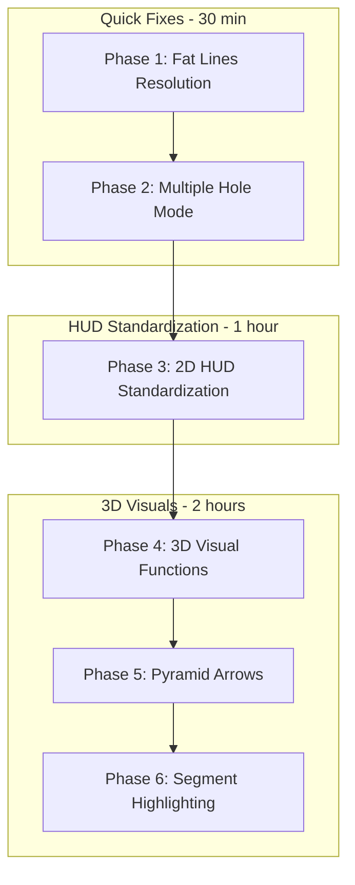

# Pattern

Tools and 3D Visual Feedback Remediation Plan

## Issue Analysis

| Issue | Root Cause | Solution ||-------|------------|----------|| 1. Fat lines not rendering | Resolution not updated on initial render | Update LineMaterial.resolution on scene traversal || 2. 3D patternInPolygon not working | drawPatternInPolygon3DVisual() not being called | Add call to drawData or handle3DMouseMove || 3. 2D holesAlongLine wrong style | Uses ctx.fillText instead of HUD overlay | Convert to showPatternToolLabels() || 4. 3D holesAlongPolyline no feedback | No 3D visual function exists | Create drawHolesAlongPolyline3DVisual() || 5. 3D pattern tools no feedback | 3D visuals exist but not rendering | Ensure draw functions are called in render loop || 6. 3D Add Hole multiple mode broken | Always calls showAddHoleDialog() | Check isAddingSingleHole flag first || 7. 2D tools inconsistent styling | Mix of ctx.fillText and HUD overlay | Standardize all to HUD overlay || 8. 3D needs pyramid arrows | Uses basic spheres/lines | Add pyramid geometry for direction arrows |---

## Phase 1: Fix 3D Fat Lines Resolution (Issue 1)

**File:** [src/kirra.js](src/kirra.js)The existing resize handler at line 6233-6243 only traverses `kadGroup`. Need to:

1. Also traverse the entire scene for pattern tool fat lines
2. Call resolution update on initial 3D render (not just resize)

**Current code (line 6233):**

```javascript
window.addEventListener("resize", function () {
    if (window.threeRenderer && window.threeRenderer.kadGroup) {
        var res = new THREE.Vector2(window.innerWidth, window.innerHeight);
        window.threeRenderer.kadGroup.traverse(function (child) {
            if (child.material && child.material.isLineMaterial) {
                child.material.resolution.copy(res);
            }
        });
    }
});
```

**Solution:** Create a reusable `updateAllLineMaterialResolution()` function that traverses the entire scene, and call it:

- On resize
- After adding any new fat lines to the scene
- On initial 3D render

---

## Phase 2: Fix 3D Add Hole Multiple Mode (Issue 6)

**File:** [src/kirra.js](src/kirra.js) lines 1151-1163**Current 3D code:**

```javascript
} else if (isAddingHole) {
    window.worldX = worldX;
    window.worldY = worldY;
    window.worldZ = worldZ;
    if (typeof window.showAddHoleDialog === "function") {
        window.showAddHoleDialog();
    }
}
```

**Should match 2D code at line 17954:**

```javascript
if (window.isAddingSingleHole && window.multipleAddHoleFormData) {
    window.addHoleMultipleMode(worldX, worldY);
} else {
    addHolePopup();
}
```

**Solution:** Add the same conditional check to the 3D handler.---

## Phase 3: Standardize 2D Tools to HUD Overlay (Issues 3, 7)

### 3a. Convert holesAlongLine visuals

**File:** [src/kirra.js](src/kirra.js) lines 34430-34530Currently uses `ctx.fillText("START")` and `ctx.fillText("END")`. Convert to build `overlayData` and call `showPatternToolLabels(overlayData)` like `drawPatternInPolygonVisual()` does.

### 3b. Convert holesAlongPolyline visuals  

**File:** [src/kirra.js](src/kirra.js) lines 34360-34393Currently uses `ctx.fillText("START")` and `ctx.fillText("END")`. Same conversion needed.**Pattern to follow (from drawPatternInPolygonVisual):**

```javascript
var overlayData = { toolType: "line" };
if (lineStartPoint) {
    overlayData.startPoint = lineStartPoint;
    overlayData.startCanvasX = startX + canvas.getBoundingClientRect().left;
    overlayData.startCanvasY = startY + canvas.getBoundingClientRect().top;
}
// ... similar for endPoint
showPatternToolLabels(overlayData);
```

---

## Phase 4: Add 3D Visual Feedback Functions (Issues 2, 4, 5)

### 4a. Ensure drawPatternInPolygon3DVisual is called

**File:** [src/kirra.js](src/kirra.js)Function exists at line 34122. Need to verify it's called in:

- `drawData()` when in 3D mode
- Or `handle3DMouseMove()` for live preview

### 4b. Create drawHolesAlongLine3DVisual()

New function to draw:

- Green sphere at START point
- Red sphere at END point  
- Dashed line between them
- Distance label via HUD overlay
- Fat line for the connection

### 4c. Create drawHolesAlongPolyline3DVisual()

New function to draw:

- Green sphere at START
- Red sphere at END
- Highlight current segment differently (e.g., cyan vs green)
- Point markers at polyline vertices
- Fat lines for segments

---

## Phase 5: Add Pyramid Arrow Indicators (Issue 8)

**File:** [src/kirra.js](src/kirra.js) or [src/three/GeometryFactory.js](src/three/GeometryFactory.js)Create helper function `createDirectionArrow3D(position, direction, color)`:

- Uses `THREE.ConeGeometry` for pyramid shape
- Rotates to point in direction
- Semi-transparent material

Use for:

- Burden direction indicator in Pattern in Polygon
- Row direction in Holes Along Line
- Segment direction in Holes Along Polyline

---

## Phase 6: Segment Highlighting for Polyline Tool (Issue 4)

**File:** [src/kirra.js](src/kirra.js)When a segment is selected for hole placement:

- Draw that segment with a different color (cyan) and thicker line
- Add visual indicator showing which segment holes will be added to
- Both 2D (ctx) and 3D (fat line) versions needed

---

## Implementation Order



---

## Files to Modify

| File | Changes ||------|---------|| [src/kirra.js](src/kirra.js) | Fat line resolution, multiple hole mode, 2D visual functions, 3D visual functions || [src/three/GeometryFactory.js](src/three/GeometryFactory.js) | Optional: Add createDirectionArrow3D helper || [src/overlay/panels/PatternToolPanel.js](src/overlay/panels/PatternToolPanel.js) | May need segment highlight label support |---

## Testing Checklist

- [ ] Fat lines render correctly on initial 3D view
- [ ] Fat lines update on window resize
- [ ] Add Hole multiple mode works in 3D without reopening dialog
- [ ] Holes Along Line shows START/END labels via HUD in 2D
- [ ] Holes Along Polyline shows START/END labels via HUD in 2D