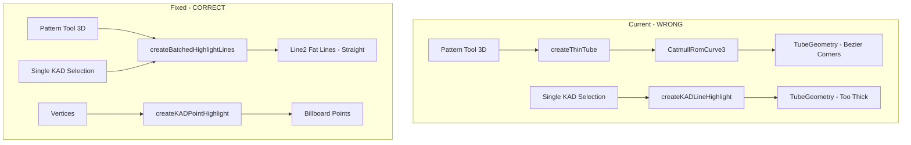

# 3D Pattern Tool Visual Fix

## Root Cause Analysis

Three issues create the visual problems:

1. **Tube Geometry with Bezier Curves**: All 3D pattern tool visuals use `createThinTube()` which creates `TubeGeometry` from a `CatmullRomCurve3`. This spline curve causes the ugly bezier corners in Image 6.
2. **Inconsistent Line Rendering**: Single KAD selection uses tube geometry (`createKADLineHighlight`) while multiple selection uses fat lines (`createBatchedHighlightLines`). The fat line approach looks correct (Images 2-3).
3. **Pyramid Direction Wrong**: Current code positions pyramid perpendicular to line (burden direction) but should point along the line toward the last hole.

## Code Structure




## Changes Required

### 1. Fix Single KAD Selection in [canvas3DDrawSelection.js](Kirra2D/src/draw/canvas3DDrawSelection.js)

**Location**: `drawKADEntityHighlight()` function (lines 279-475)**Current**: Uses `createKADLineHighlight` (tube geometry) for each segment

```javascript
const lineMesh = GeometryFactory.createKADLineHighlight(
    local1.x, local1.y, z1, local2.x, local2.y, z2, 
    baseRadiusNonSelected, nonSelectedSegmentColor);
```

**Fix**: Collect segments and use `createBatchedHighlightLines` like multiple selection does:

```javascript
var greenSegments = [];
var magentaSegments = [];

// Collect all segments into arrays
for (let i = 0; i < numSegments; i++) {
    greenSegments.push({ x1, y1, z1, x2, y2, z2 });
}

// Selected segment goes to magenta array
if (kadObject.selectionType === "segment") {
    magentaSegments.push({ x1, y1, z1, x2, y2, z2 });
}

// Batch create (ONE draw call)
var resolution = new THREE.Vector2(window.innerWidth, window.innerHeight);
var batchedLines = GeometryFactory.createBatchedHighlightLines(
    greenSegments, magentaSegments, 3, 5, resolution);
```


### 2. Fix Pattern Tool 3D Visuals in [kirra.js](Kirra2D/src/kirra.js)

**Location**: `drawPatternInPolygon3DVisual()` (lines 34204-34390)**Remove**: The `createThinTube()` helper function that uses `CatmullRomCurve3`**Replace polygon outline** (lines 34259-34276):

```javascript
// Collect segments for batched fat lines
var greenSegments = [];
for (var i = 0; i < polygonPoints.length; i++) {
    var p1 = polygonPoints[i];
    var p2 = polygonPoints[(i + 1) % polygonPoints.length];
    var local1 = worldToThreeLocal(p1.pointXLocation || p1.x, p1.pointYLocation || p1.y);
    var local2 = worldToThreeLocal(p2.pointXLocation || p2.x, p2.pointYLocation || p2.y);
    greenSegments.push({
        x1: local1.x, y1: local1.y, z1: drawZ,
        x2: local2.x, y2: local2.y, z2: drawZ
    });
}
var resolution = new THREE.Vector2(window.innerWidth, window.innerHeight);
var batchedLines = GeometryFactory.createBatchedHighlightLines(greenSegments, null, 3, 0, resolution);
if (batchedLines.greenLines) {
    window.patternTool3DGroup.add(batchedLines.greenLines);
}
```

**Replace vertices** (lines 34279-34286): Use billboarded points instead of spheres:

```javascript
for (var j = 0; j < polygonPoints.length; j++) {
    var pt = polygonPoints[j];
    var plocal = worldToThreeLocal(pt.pointXLocation || pt.x, pt.pointYLocation || pt.y);
    var vertexPoint = GeometryFactory.createKADPointHighlight(
        plocal.x, plocal.y, drawZ + 0.1, 0.5, "rgba(255, 102, 0, 0.9)");
    window.patternTool3DGroup.add(vertexPoint);
}
```

**Fix pyramid direction** (lines 34326-34360): Point along line toward last hole, not perpendicular:

```javascript
// Current: points perpendicular (burden direction)
var perpX = -dirY;
var perpY = dirX;
var angle = Math.atan2(perpY, perpX);

// Fixed: point along line direction (first hole -> last hole)
var angle = Math.atan2(dirY, dirX);  // Direction from start to end
pyramid.position.set(midX, midY, drawZ + 0.5);  // On the line, not offset
pyramid.rotation.z = angle;
pyramid.rotation.x = Math.PI / 2;
```


### 3. Fix Holes Along Line 3D in [kirra.js](Kirra2D/src/kirra.js)

**Location**: `drawHolesAlongLine3DVisual()` (lines 34392-34535)Same pattern as above:

- Remove `createThinTube()` helper
- Use `createBatchedHighlightLines()` for the line segment
- Use `createKADPointHighlight()` for start/end markers
- Fix pyramid to point along line toward end point (last hole direction)
- Add leading line using `createBatchedHighlightLines()` when selecting end point

### 4. Fix Holes Along Polyline 3D in [kirra.js](Kirra2D/src/kirra.js)

**Location**: `drawHolesAlongPolyline3DVisual()` (lines 34692+)Same pattern - replace tubes with fat lines, spheres with billboard points.

## Visual Specification

| Element | 2D Style | 3D Style (Fixed) ||---------|----------|------------------|| Polygon/line outline | `lineWidth: 3`, `#00FF00` | Fat line width 3px, green || Vertices | `radius: 4`, `rgba(255,0,0,0.5)` | Billboard point, orange/red || Start marker | `radius: 6`, `rgba(0,255,0,0.8)` | Billboard point, green || End marker | `radius: 6`, `rgba(255,0,0,0.8)` | Billboard point, red || Preview line | `lineWidth: 1`, dashed | Fat line width 2px, semi-transparent || Pyramid arrow | Points toward last hole along line | Same direction |

## Testing Checklist

After implementation:

1. Single KAD poly selection should have same line thickness as multiple selection
2. Pattern in polygon outline should be straight lines (no bezier corners)