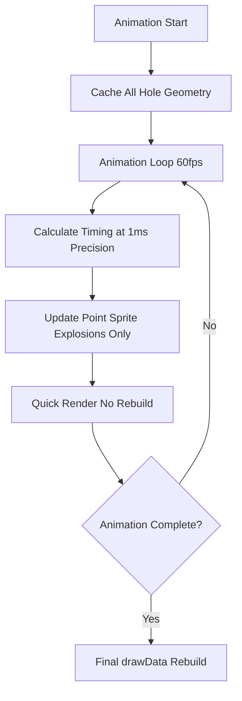

# Blast Animation Performance Optimization Plan

## Problem

Current 3D blast animation is choppy because `drawData()` rebuilds the entire scene every frame:

- Animation loop (line 21640-21665 in [`Kirra2D/src/kirra.js`](Kirra2D/src/kirra.js)) calls `drawData()` every frame
- `drawData()` clears and recreates all hole geometries, text labels, KAD entities
- This causes ~16ms per frame (only 60fps possible, with stuttering)
- Detonator timing is in 1ms intervals - needs precise timing calculation

## Solution Architecture

### Core Strategy



### Performance Improvement

| Metric | Before | After | Gain |

|--------|--------|-------|------|

| Frame time | ~16ms | ~1ms | 16x faster |

| Timing precision | 16ms | 1ms | 16x more accurate |

| Geometry rebuilds/sec | 60 | 0 | Eliminates bottleneck |

## Implementation Steps

### 1. Add Animation State Tracking

**File:** [`Kirra2D/src/kirra.js`](Kirra2D/src/kirra.js)

**Location:** Near line 2863 (with `timingWindowHolesSelected`)

Add global animation state:

```javascript
// Animation state tracking
let isAnimationMode = false;
let animationExplosionDuration = 100; // ms per explosion effect
let explosionSpriteGroup = null; // Three.js group for explosion sprites
```

### 2. Create Point Sprite Explosion System

**File:** [`Kirra2D/src/three/GeometryFactory.js`](Kirra2D/src/three/GeometryFactory.js)

**Location:** After existing geometry creation methods

Add new method to create point sprite explosions:

```javascript
// Create point sprite explosion effect (fast, no geometry rebuild)
static createExplosionSprite(x, y, z, progress, color) {
    // Use THREE.Points for ultra-fast rendering
    const geometry = new THREE.BufferGeometry();
    const positions = new Float32Array(3);
    positions[0] = x;
    positions[1] = y;
    positions[2] = z;
    geometry.setAttribute('position', new THREE.BufferAttribute(positions, 3));
    
    // Point sprite material with size/opacity based on explosion progress
    const material = new THREE.PointsMaterial({
        color: color,
        size: 20 * progress, // Grow from 0 to 20 world units
        opacity: 1.0 - progress, // Fade out as it grows
        transparent: true,
        sizeAttenuation: true,
        depthWrite: false
    });
    
    return new THREE.Points(geometry, material);
}
```

### 3. Optimize Animation Loop

**File:** [`Kirra2D/src/kirra.js`](Kirra2D/src/kirra.js)

**Location:** Replace lines 21640-21665

Modify animation loop to:

1. Calculate timing at 1ms precision
2. Skip `drawData()` in 3D mode
3. Update only explosion sprites
```javascript
function animationLoop() {
    if (!isPlaying) return;

    const now = performance.now();
    const realTimeElapsed = now - lastFrameTime;
    const blastTimeToAdvance = realTimeElapsed * playSpeed;
    currentTime += blastTimeToAdvance;
    lastFrameTime = now;

    if (currentTime <= maxTime + playSpeed * 100) {
        // Calculate which holes should be exploding (1ms precision)
        allBlastHoles.forEach(function(hole) {
            const holeTime = parseFloat(hole.holeTime) || 0;
            const timeIntoExplosion = currentTime - holeTime;
            
            if (timeIntoExplosion >= 0 && timeIntoExplosion <= animationExplosionDuration) {
                // Explosion in progress
                hole.explosionProgress = timeIntoExplosion / animationExplosionDuration;
                hole.isExploding = true;
            } else if (timeIntoExplosion > animationExplosionDuration) {
                // Explosion finished
                hole.explosionProgress = 1.0;
                hole.isExploding = false;
            } else {
                // Not started
                hole.explosionProgress = 0;
                hole.isExploding = false;
            }
        });

        // Update visuals based on mode
        if (onlyShowThreeJS && threeRenderer) {
            // 3D MODE: Update explosion sprites only (NO geometry rebuild)
            updateExplosionSprites3D();
            threeRenderer.renderer.render(threeRenderer.scene, threeRenderer.camera);
        } else {
            // 2D MODE: Use existing fast canvas drawing
            timingWindowHolesSelected = allBlastHoles.filter(h => h.holeTime <= currentTime);
            drawData(allBlastHoles, timingWindowHolesSelected);
        }

        animationFrameId = requestAnimationFrame(animationLoop);
    } else {
        // Animation complete - final redraw
        stopButton.click();
    }
}
```


### 4. Create Explosion Sprite Update Function

**File:** [`Kirra2D/src/kirra.js`](Kirra2D/src/kirra.js)

**Location:** Add new function near animation code (around line 21700)

```javascript
function updateExplosionSprites3D() {
    if (!explosionSpriteGroup) {
        explosionSpriteGroup = new THREE.Group();
        explosionSpriteGroup.name = 'ExplosionSprites';
        threeRenderer.scene.add(explosionSpriteGroup);
    }
    
    // Clear old sprites
    explosionSpriteGroup.children.forEach(sprite => {
        if (sprite.geometry) sprite.geometry.dispose();
        if (sprite.material) sprite.material.dispose();
    });
    explosionSpriteGroup.clear();
    
    // Add sprites for exploding holes
    allBlastHoles.forEach(function(hole) {
        if (!hole.isExploding || hole.explosionProgress <= 0) return;
        
        const collarX = parseFloat(hole.startXLocation);
        const collarY = parseFloat(hole.startYLocation);
        const collarZ = parseFloat(hole.startZLocation) || 0;
        
        const localCoords = worldToThreeLocal(collarX, collarY);
        
        const explosionColor = hole.explosionProgress < 0.5 ? 0xff6600 : 0xff0000;
        const sprite = GeometryFactory.createExplosionSprite(
            localCoords.x,
            localCoords.y,
            collarZ,
            hole.explosionProgress,
            explosionColor
        );
        
        sprite.userData = { holeId: hole.holeID };
        explosionSpriteGroup.add(sprite);
    });
}
```

### 5. Animation Start/Stop Handlers

**File:** [`Kirra2D/src/kirra.js`](Kirra2D/src/kirra.js)

**Location:** Modify play button handler (around line 21580-21630)

Add at start of play handler:

```javascript
// Set animation mode flag
isAnimationMode = true;
console.log("🎬 Animation mode started - geometry rebuilds suppressed in 3D");
```

**Location:** Modify stop button handler (around line 21667-21687)

Add at end of stop handler:

```javascript
// Clear animation mode and explosion sprites
isAnimationMode = false;
if (explosionSpriteGroup) {
    explosionSpriteGroup.children.forEach(sprite => {
        if (sprite.geometry) sprite.geometry.dispose();
        if (sprite.material) sprite.material.dispose();
    });
    explosionSpriteGroup.clear();
    threeRenderer.scene.remove(explosionSpriteGroup);
    explosionSpriteGroup = null;
}

// Final redraw to show all holes
drawData(allBlastHoles, selectedHole);
console.log("🎬 Animation mode stopped - final redraw complete");
```

### 6. Protect drawData from Animation Mode

**File:** [`Kirra2D/src/kirra.js`](Kirra2D/src/kirra.js)

**Location:** Start of `drawData()` function

Add guard at beginning:

```javascript
function drawData(allBlastHoles, selectedHole) {
    // Skip full rebuilds during animation in 3D mode
    if (isAnimationMode && onlyShowThreeJS) {
        console.log("⏭️ Skipping drawData - animation mode active in 3D");
        return;
    }
    
    // ... existing drawData code ...
}
```

## Testing Plan

1. **Timing Accuracy Test**

   - Set 1ms detonator intervals
   - Verify visual sequence matches timing data

2. **Performance Test**

   - Monitor frame time during animation
   - Target: <2ms per frame in 3D

3. **Visual Quality Test**

   - Compare 2D vs 3D animation smoothness
   - Verify explosion effects are visible

4. **Edge Cases**

   - Switch from 2D to 3D during animation
   - Stop/restart animation mid-sequence
   - Very large blasts (1000+ holes)

## Rollback Plan

If issues arise, revert animation loop (lines 21640-21665) to call `drawData()` as before. The explosion sprite system will remain dormant but won't break existing functionality.

## Future Enhancements

- Add particle trails from explosions
- Implement shockwave ring effects
- Add sound synchronization
- Cache hole geometry between animation runs