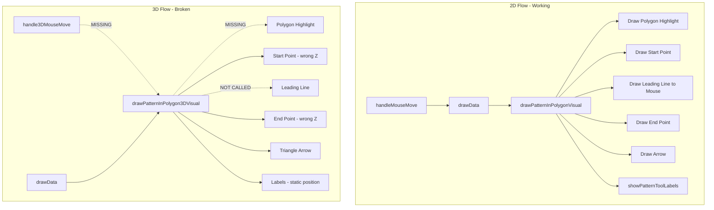

# Pattern in Polygon 3D Tool Fix

## Root Cause Analysis

After examining the code, I identified **5 key issues**:| Issue | Root Cause | 2D Reference ||-------|------------|--------------|| 1. Polygon not highlighting | Pattern tool sets local `selectedPolygon` but not `window.selectedKADObject` | 2D draws polygon in `drawPatternInPolygonVisual()` lines 34030-34062 || 2. No leading line to mouse | `drawPatternInPolygon3DVisual()` only called from `drawData()`, NOT from `handle3DMouseMove()` | 2D calls `drawData()` from `handleMouseMove()` line 7293 || 3. Markers misaligned | Z-coordinate using `dataCentroidZ` instead of polygon's actual Z values | 2D doesn't have Z issues || 4. CSS labels don't update on orbit | Labels computed in `worldToScreen()` but only when `drawData()` runs | 2D has no orbit concept || 5. Arrow is triangular | Custom BufferGeometry with 3 vertices, not square pyramid | 2D uses 3-point triangle (acceptable in 2D) |




## Implementation Plan

### Phase 1: Enable Continuous 3D Visual Updates

**File:** [`src/kirra.js`](src/kirra.js)Add pattern tool visual calls to `handle3DMouseMove()` (around line 2700, after ruler/protractor handling):

```javascript
// Step 13f.10) Draw Pattern In Polygon visual if active
if (isPatternInPolygonActive) {
    drawPatternInPolygon3DVisual();
}
```

This ensures the 3D visuals (including leading line) update on every mouse move, matching 2D behavior.

### Phase 2: Fix Polygon Highlighting

**File:** [`src/kirra.js`](src/kirra.js)In `handlePatternInPolygonClick()` (line 32735), when polygon is selected, also set `window.selectedKADObject`:

```javascript
case 0: // Select polygon
    const clickedEntityInfo = getClickedKADEntity(worldX, worldY);
    if (clickedEntityInfo && clickedEntityInfo.entity.entityType === "poly") {
        selectedPolygon = clickedEntityInfo.entity;
        // NEW: Set window.selectedKADObject so highlightSelectedKADThreeJS() draws the highlight
        window.selectedKADObject = clickedEntityInfo;
        patternPolygonStep = 1;
        // ...
    }
```

Then in `drawPatternInPolygon3DVisual()`, remove the need to draw polygon ourselves - the existing `highlightSelectedKADThreeJS()` at line 23331 will handle it.

### Phase 3: Fix Z-Coordinate Alignment

**File:** [`src/kirra.js`](src/kirra.js)In `drawPatternInPolygon3DVisual()`, get the polygon's actual Z from its points:

```javascript
// Get Z from selected polygon's first point, fallback to dataCentroidZ
var drawZ = (dataCentroidZ || 0) + 0.5;
if (selectedPolygon && selectedPolygon.data && selectedPolygon.data.length > 0) {
    var firstPoint = selectedPolygon.data[0];
    drawZ = (firstPoint.pointZLocation || firstPoint.z || dataCentroidZ || 0) + 0.5;
}
```


### Phase 4: Fix CSS Label Updates During Orbit

Two-pronged approach:**4a. Call visual function on camera change:File:** [`src/three/CameraControls.js`](src/three/CameraControls.js)In `handleMouseMove()` orbit/pan handling (around line 750), add callback:

```javascript
// After camera update
if (this.onCameraChange) {
    this.onCameraChange();
}
```

**File:** [`src/kirra.js`](src/kirra.js)Set callback when initializing camera controls:

```javascript
cameraControls.onCameraChange = function() {
    if (isPatternInPolygonActive) {
        drawPatternInPolygon3DVisual();
    }
};
```

**4b. Alternative - Billboarded 3D Labels:**If CSS positioning proves unreliable, create billboarded text sprites in Three.js that automatically face the camera. This is more robust but requires more code.

### Phase 5: Fix Arrow to Square Pyramid

**File:** [`src/kirra.js`](src/kirra.js)Replace the custom BufferGeometry triangle (lines 34346-34369) with proper pyramid:

```javascript
// Create square pyramid using ConeGeometry(radius, height, 4 sides)
var pyramidRadius = 1.5;
var pyramidHeight = 3;
var pyramidGeom = new THREE.ConeGeometry(pyramidRadius, pyramidHeight, 4);

// Rotate so pyramid points perpendicular to line
var pyramidMat = new THREE.MeshBasicMaterial({
    color: 0x00ff00,
    transparent: true,
    opacity: 0.6
});
var pyramidMesh = new THREE.Mesh(pyramidGeom, pyramidMat);

// Position at midpoint offset perpendicular to line
pyramidMesh.position.set(tipX, tipY, drawZ + 0.3);

// Rotate to point perpendicular (90 degrees from line direction)
var arrowAngle = Math.atan2(perpY, perpX);
pyramidMesh.rotation.z = arrowAngle - Math.PI / 2;

window.patternTool3DGroup.add(pyramidMesh);
```


## Files to Modify

1. **[`src/kirra.js`](src/kirra.js)**:

- `handle3DMouseMove()` - Add pattern tool visual call
- `handlePatternInPolygonClick()` - Set `window.selectedKADObject`
- `drawPatternInPolygon3DVisual()` - Fix Z coords, fix arrow geometry

2. **[`src/three/CameraControls.js`](src/three/CameraControls.js)**:

- Add `onCameraChange` callback hook for label updates

## Testing Checklist

- [ ] Select polygon - should highlight green with red vertices (like 2D)
- [ ] Click start point - green marker appears at correct position
- [ ] Move mouse - leading line follows cursor
- [ ] Click end point - red marker appears, dashed line connects start to end
- [ ] Arrow displays as square pyramid perpendicular to line
- [ ] Labels (START, END, distance) appear and update position