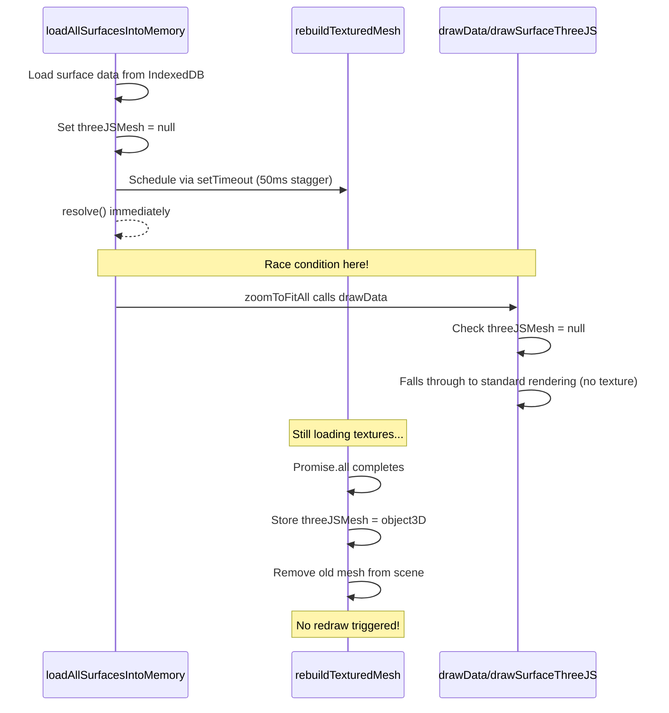
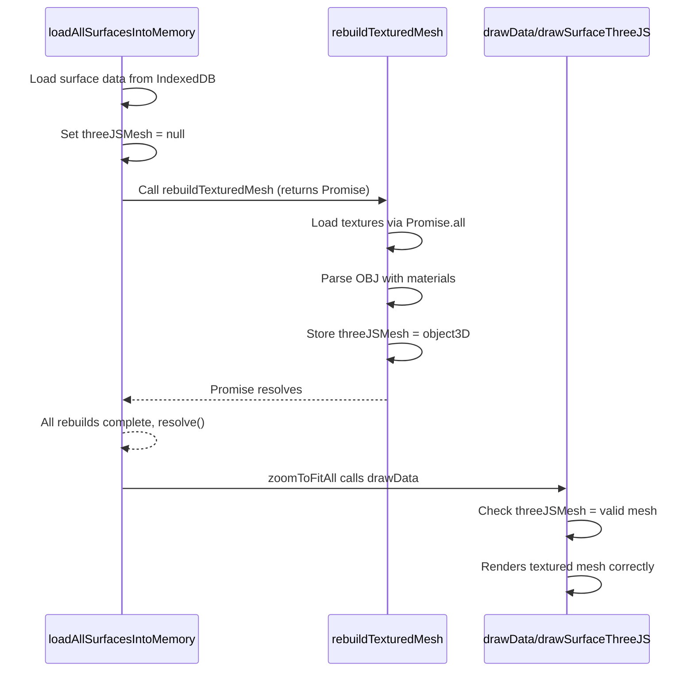

# Fix Textured OBJ Mesh Display on Browser Reload

## Root Cause Analysis

The issue is a **timing race condition** in the reload flow:



**Key Problem**: `loadAllSurfacesIntoMemory()` calls `resolve()` at line 24535 BEFORE the textured meshes are rebuilt. By the time `drawData()` runs, `surface.threeJSMesh` is still `null`.

## Solution

Convert `rebuildTexturedMesh()` to return a Promise and have `loadAllSurfacesIntoMemory()` await all rebuilds before resolving.

### Changes in [kirra.js](Kirra2D/src/kirra.js)

**1. Modify `rebuildTexturedMesh()` (line 8495) to return a Promise:**

- Wrap the function body in `return new Promise()`
- Move the `Promise.all(texturePromises).then()` to use `resolve()` 
- Handle errors with `reject()`
- This ensures callers can await the full texture loading and mesh creation

**2. Modify `loadAllSurfacesIntoMemory()` (line 24524-24535) to await all rebuilds:**

Current code schedules rebuilds via `setTimeout` and resolves immediately:
```javascript
texturedSurfaceIds.forEach(function (surfaceId, index) {
    setTimeout(function () {
        rebuildTexturedMesh(surfaceId);
    }, index * 50);
});
resolve(); // Resolves before rebuilds complete!
```

Change to:
```javascript
// Build array of promises for all textured mesh rebuilds
var rebuildPromises = texturedSurfaceIds.map(function (surfaceId) {
    return rebuildTexturedMesh(surfaceId);
});

// Wait for ALL rebuilds to complete before resolving
Promise.all(rebuildPromises).then(function () {
    console.log("All textured meshes rebuilt");
    resolve();
}).catch(function (error) {
    console.error("Error rebuilding textured meshes:", error);
    resolve(); // Still resolve to continue app loading
});
```

### Expected Result After Fix



## Additional Cleanup (per user request)

Remove `onlyShowThreeJS` flag usage and ensure 2D/3D mode is controlled by `dimension2D-3DBtn.checked`.