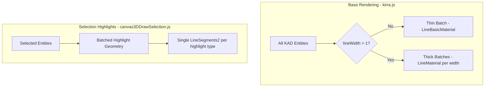

# Hybrid Fat Lines - Complete Implementation

## Scope

| Entity | Base Rendering | Highlight Rendering |
|--------|---------------|---------------------|
| Lines/Polys | Hybrid: thin=LineBasic, thick=FatLines | Batched FatLines |
| Circles | Hybrid: thin=LineBasic, thick=FatLines | Batched FatLines |
| Points | Already working (THREE.Points) | Already working |

## Architecture



## Files to Modify

1. **[src/three/GeometryFactory.js](src/three/GeometryFactory.js)** - Add Fat Line imports and hybrid methods
2. **[src/kirra.js](src/kirra.js)** - Update super-batch calls for lines and circles
3. **[src/draw/canvas3DDrawSelection.js](src/draw/canvas3DDrawSelection.js)** - Batch highlight rendering

---

## Part 1: Fat Line Imports

Add to `GeometryFactory.js` (line ~5):

```javascript
import { LineSegments2 } from "three/examples/jsm/lines/LineSegments2.js";
import { LineSegmentsGeometry } from "three/examples/jsm/lines/LineSegmentsGeometry.js";
import { LineMaterial } from "three/examples/jsm/lines/LineMaterial.js";
```

---

## Part 2: Hybrid Lines/Polys Base Rendering

Create `createHybridSuperBatchedLines()` in `GeometryFactory.js` after line 614:

- Split entities: thin (lineWidth <= 1) vs thick (lineWidth > 1)
- Thin → existing `THREE.LineSegments` + `LineBasicMaterial`
- Thick → `LineSegments2` + `LineMaterial` grouped by width
- Return `{ thinLineSegments, fatLinesByWidth, entityRanges }`

Update `kirra.js` line 22837 to call new method and add all batches to scene.

---

## Part 3: Hybrid Circles Base Rendering

Create `createHybridSuperBatchedCircles()` in `GeometryFactory.js` after `createSuperBatchedCircles()` (line ~858):

- Same strategy: thin circles → `LineSegments`, thick circles → `LineSegments2`
- Circles typically all same lineWidth, so usually 1-2 draw calls total

Update `kirra.js` line 22860 to call new method.

---

## Part 4: Batched Highlight Rendering

Refactor `drawKADEntityHighlight()` in `canvas3DDrawSelection.js` to batch all highlights:

### Current (slow for multi-select):
```
For each selected entity:
  For each segment:
    Create MeshLine mesh  // Many draw calls!
```

### New (batched):
```
Collect all highlight segments:
  - Green segments (non-selected parts)
  - Magenta segments (selected parts)
  - Vertex points (already batched via Points)

Create ONE LineSegments2 for green highlights
Create ONE LineSegments2 for magenta highlights
```

Add new methods to `GeometryFactory.js`:
- `createBatchedHighlightLines(segments, color, lineWidth, resolution)`
- `createBatchedHighlightCircles(circles, color, lineWidth, resolution)`

---

## Part 5: Resolution Resize Handler

Add to `kirra.js` Three.js init section:

```javascript
window.addEventListener("resize", function() {
    var res = new THREE.Vector2(window.innerWidth, window.innerHeight);
    if (window.threeRenderer) {
        // Update all LineMaterial instances
        window.threeRenderer.scene.traverse(function(child) {
            if (child.material && child.material.isLineMaterial) {
                child.material.resolution.copy(res);
            }
        });
    }
});
```

---

## Performance Summary

| Scenario | Before (MeshLine) | After (Fat Lines) |
|----------|------------------|-------------------|
| 3000 thin lines | 1 draw call | 1 draw call |
| 3000 lines, 10 thick | 10 MeshLine calls | 2 draw calls |
| 500 selected entities | 500+ MeshLine calls | 2 draw calls |
