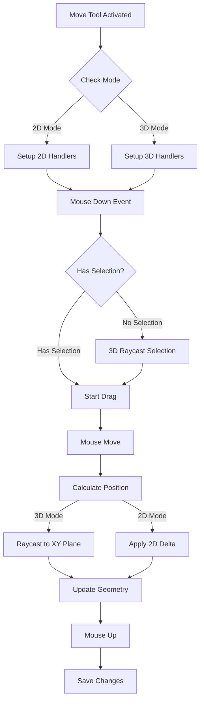

# Move Tool 3D Mode Implementation

## Overview

Enable the Move Tool to work in 3D mode with raycasting-based interaction for holes and KAD entities. The tool will extend existing 2D handlers to work in both modes, allow Alt+drag camera orbit while blocking panning, and use raycasting to a plane at the object's Z elevation for precise positioning.

## Architecture



## Implementation Steps

### 1. Create Snap Function for Moving Holes

**File**: [`Kirra2D/src/kirra.js`](Kirra2D/src/kirra.js)

#### 1a. Add Move Tool Snap Priorities Constant (near line 36500)

Create new priority constant specifically for Move Tool (excludes holes):

```javascript
// Snap priorities for Move Tool (holes moving - excludes hole snap targets)
const MOVE_SNAP_PRIORITIES = {
    KAD_POINT: 1,              // Highest priority
    KAD_LINE_VERTEX: 2,
    KAD_POLYGON_VERTEX: 3,
    KAD_CIRCLE_CENTER: 4,
    KAD_TEXT_POSITION: 5,
    KAD_LINE_SEGMENT: 6,       // Segments lower priority
    KAD_POLYGON_SEGMENT: 7,
    SURFACE_POINT: 8,
    SURFACE_FACE: 9,           // Lowest priority (with interpolation)
};
```

#### 1b. Create snapToNearestPointExcludingHoles() Function (near line 36516)

**Purpose**: When moving holes, snap to KAD objects and surfaces, but NOT to other holes (two holes cannot occupy the same space).

**Function Signature**:

```javascript
function snapToNearestPointExcludingHoles(rawWorldX, rawWorldY, searchRadius = getSnapToleranceInWorldUnits())
```

**Snap Targets** (using `MOVE_SNAP_PRIORITIES`):

1. KAD vertices (points, line vertices, polygon vertices, circle centers, text positions)
2. KAD segments (line segments, polygon segments)
3. Surface points
4. **Surface faces** (with Z interpolation from triangle barycentric coordinates)

**Excluded**:

- All hole collar/grade/toe positions (holes cannot snap to holes)

**Implementation Pattern**:

- Copy structure from `snapToNearestPointExcludingKAD()` (line 36516)
- Include all KAD search logic (vertices and segments)
- Include surface vertex search logic
- **Add surface face interpolation**: Project point onto triangle face, use barycentric coordinates to interpolate Z
- REMOVE all hole search logic (sections that add HOLE_COLLAR, HOLE_GRADE, HOLE_TOE candidates)
- Use `MOVE_SNAP_PRIORITIES` instead of `SNAP_PRIORITIES`
- Return same format: `{worldX, worldY, worldZ, snapped, snapTarget}`

**Surface Face Interpolation Logic**:

```javascript
// For each surface triangle:
// 1. Project point onto triangle plane
// 2. Check if point is inside triangle (barycentric test)
// 3. Calculate distance from point to triangle face
// 4. If within snap radius, interpolate Z using barycentric coordinates
// 5. Add to snap candidates with SURFACE_FACE priority
```

**3D Variant**: Also create `snapToNearestPointExcludingHolesWithRay()` for 3D cylindrical snap:

- Similar to `snapToNearestPointWithRay()` (line 36820)
- Uses ray origin and direction for cylindrical snap along view ray
- Excludes holes from snap candidates
- Includes surface face interpolation (raycast to triangle, interpolate Z)
- Uses `MOVE_SNAP_PRIORITIES`
- Used when moving holes in 3D mode

### 2. Mode Detection and Handler Setup

**File**: [`Kirra2D/src/kirra.js`](Kirra2D/src/kirra.js)

Modify the Move Tool activation event listener (lines 26186-26301) to:

- Detect current mode using `onlyShowThreeJS` flag
- Attach 3D canvas listeners when in 3D mode
- Attach 2D canvas listeners when in 2D mode
- Store mode state for handler routing

**Key Changes**:

- Check `if (onlyShowThreeJS)` to determine which canvas to attach to
- Store `moveToolIn3DMode` boolean flag
- Attach listeners to `threeRenderer.getCanvas()` in 3D mode
- Keep existing 2D canvas listeners for 2D mode

### 2. Enhanced Mouse Down Handler for 3D

**File**: [`Kirra2D/src/kirra.js`](Kirra2D/src/kirra.js)

Extend `handleMoveToolMouseDown` (line 26308) to support 3D mode:

**3D Mode Logic**:

1. Check `moveToolIn3DMode` flag at start
2. If in 3D mode, use `interactionManager.raycast()` for object detection
3. For KAD: traverse intersects looking for `userData.kadId`
4. For Holes: use `interactionManager.findClickedHole()`
5. Store the object's current Z elevation in `dragPlaneZ`
6. Set `event.preventDefault()` to block camera pan

**2D Mode Logic**:

- Keep existing logic unchanged (lines 26308-26462)

**Camera Controls Integration**:

- Don't block Alt key so user can still orbit
- Block normal pan by preventing default on mousedown

### 3. Enhanced Mouse Move Handler for 3D Positioning

**File**: [`Kirra2D/src/kirra.js`](Kirra2D/src/kirra.js)

Extend `handleMoveToolMouseMove` (line 26478) with 3D positioning:

**Critical Behavior**:

- **Default (no snap)**: Object follows screen-space mouse cursor by raycasting to horizontal plane at object's Z
- **When snapping**: Object snaps to nearest feature (KAD/surface) within snap radius
- Objects always stay at their original Z elevation (no vertical movement)

**3D Raycasting Approach**:

```javascript
if (moveToolIn3DMode && threeRenderer && interactionManager) {
    // Step 1) Create horizontal plane at object's Z elevation (screen-space following)
    const plane = new THREE.Plane(new THREE.Vector3(0, 0, 1), -dragPlaneZ);
    
    // Step 2) Update raycaster with current mouse position
    interactionManager.updateMousePosition(event, threeRenderer.getCanvas());
    const raycaster = interactionManager.raycaster;
    
    // Step 3) Intersect ray with plane to get screen-space position
    const intersectionPoint = new THREE.Vector3();
    raycaster.ray.intersectPlane(plane, intersectionPoint);
    
    // Step 4) Convert from local Three.js coords to world coords
    // This is the DEFAULT position - object follows mouse in screen space
    let worldX = intersectionPoint.x + threeLocalOriginX;
    let worldY = intersectionPoint.y + threeLocalOriginY;
    
    // Step 5) ONLY if snapping is enabled, check for snap targets
    let snapResult = null;
    const snapRadiusWorld = getSnapRadiusInWorldUnits3D(snapRadiusPixels);
    
    if (snapEnabled) {  // Check global snap enabled flag
        if (moveToolSelectedHole) {
            // Moving holes: snap to KAD and surfaces, NOT other holes
            snapResult = snapToNearestPointExcludingHolesWithRay(
                raycaster.ray.origin,
                raycaster.ray.direction,
                snapRadiusWorld
            );
            // Override screen-space position ONLY if snap found
            if (snapResult && snapResult.snapped) {
                worldX = snapResult.worldX;
                worldY = snapResult.worldY;
            }
        } else if (moveToolSelectedKAD) {
            // Moving KAD: use existing 3D snap (snaps to everything including holes)
            // But exclude the KAD point being moved
            snapResult = snapToNearestPointWithRay(
                raycaster.ray.origin,
                raycaster.ray.direction,
                snapRadiusWorld
            );
            // Override screen-space position ONLY if snap found
            if (snapResult && snapResult.snapped) {
                worldX = snapResult.worldX;
                worldY = snapResult.worldY;
            }
        }
    }
    // If no snap or snap disabled, worldX/worldY remain as screen-space position
    
    // Step 6) Update object position (uses screen-space or snapped position)
    if (moveToolSelectedHole) {
        // Update hole position(s)
        dragInitialPositions.forEach(({hole, x, y}) => {
            const deltaX = worldX - (intersectionPoint.x + threeLocalOriginX);
            const deltaY = worldY - (intersectionPoint.y + threeLocalOriginY);
            calculateHoleGeometry(hole, parseFloat(x) + deltaX, 4);
            calculateHoleGeometry(hole, parseFloat(y) + deltaY, 5);
        });
    } else if (moveToolSelectedKAD) {
        // Update KAD point position
        entity.data[index].pointXLocation = worldX;
        entity.data[index].pointYLocation = worldY;
        // Z stays at dragPlaneZ (no Z movement)
    }
}
```

**2D Mode**:

- Keep existing delta-based positioning (lines 26486-26564)

### 4. Mouse Up Handler Updates

**File**: [`Kirra2D/src/kirra.js`](Kirra2D/src/kirra.js)

Extend `handleMoveToolMouseUp` (line 26567):

- Add mode check at start
- In 3D mode: clear `dragPlaneZ` variable
- In 3D mode: call `renderThreeJS()` after save
- Keep existing 2D save/recalculate logic

### 5. Tool Deactivation Cleanup

**File**: [`Kirra2D/src/kirra.js`](Kirra2D/src/kirra.js)

Update Move Tool deactivation (lines 26217-26300):

- Remove listeners from correct canvas based on mode
- Clear `moveToolIn3DMode` flag
- Clear `dragPlaneZ` variable
- Restore appropriate canvas handlers for current mode

### 6. Variable Declarations

**File**: [`Kirra2D/src/kirra.js`](Kirra2D/src/kirra.js)

Add new global variables near line 2800:

```javascript
let moveToolIn3DMode = false; // Track if move tool is in 3D mode
let dragPlaneZ = 0; // Z elevation of plane for 3D raycasting
```

### 7. Camera Controls Coordination

**File**: [`Kirra2D/src/three/CameraControls.js`](Kirra2D/src/three/CameraControls.js)

Update `processMouseDown` (line 397) to respect Move Tool:

```javascript
// Check if Move Tool is active and blocking pan
if (window.isMoveToolActive && !event.altKey) {
    // Move Tool is active - allow orbit with Alt, block pan
    return;
}
```

This allows:

- Alt+drag = orbit (camera controls handle it)
- Normal drag = move object (move tool handles it)

### 8. Visual Feedback Enhancement

**File**: [`Kirra2D/src/draw/canvas3DDrawSelection.js`](Kirra2D/src/draw/canvas3DDrawSelection.js)

The existing `highlightSelectedKADThreeJS()` function already handles highlighting.

**Ensure**:

- Move tool selections are highlighted during drag
- `drawData()` calls happen frequently during drag for real-time feedback

## Testing Checklist

1. **2D Mode (Regression Testing)**:

   - Move Tool still works for holes
   - Move Tool still works for KAD entities
   - Snap still works ('S' key)
   - Multi-hole selection works
   - Contour recalculation works

2. **3D Mode (New Functionality)**:

   - Can select and move single hole
   - Can select and move multiple holes
   - Can select and move KAD vertex
   - Object stays at original Z elevation
   - Alt+drag still orbits camera
   - Normal drag moves object (not camera)
   - Snap works with 'S' key
   - Visual highlighting appears during drag

3. **Mode Switching**:

   - Switching from 2D to 3D while Move Tool active
   - Switching from 3D to 2D while Move Tool active
   - Tool deactivates cleanly in both modes

## Key Considerations

### Coordinate Systems

- **2D Mode**: Uses `canvasToWorld()` with centroid offset
- **3D Mode**: Uses raycasting to plane, then adds `threeLocalOriginX/Y` offset
- Both modes end up with same world coordinate system (UTM or mine grid)

### Z Elevation Handling

- In 3D, objects move only in XY plane at their current Z
- Z elevation stored in `dragPlaneZ` at start of drag
- Plane equation: `z = dragPlaneZ` (horizontal plane at object's elevation)
- Matches user rule: "Do not transform Z elevations"

### Screen-Space Following vs Snapping

**Default Behavior (no snap)**:

- Objects follow mouse cursor in screen space
- Raycast to horizontal plane at object's Z elevation
- Intuitive dragging - object appears to "stick" to mouse cursor
- Works at any camera orbit angle

**Snapping Behavior (when enabled)**:

- First, calculate screen-space position (as above)
- Then, check for nearby snap targets within snap radius
- If snap target found, override screen-space position with snap position
- If no snap target, use screen-space position
- 'S' key enables self-snap for KAD entities

This ensures smooth, predictable dragging with optional precision snapping.

### Event Handling Priority

1. Move Tool mouse events (highest priority)
2. Camera orbit with Alt key
3. Selection clicks (if no drag detected)
4. Camera pan (blocked when Move Tool active)

### Snapping Integration

**For Moving Holes**:

- Holes should snap to KAD objects (vertices and segments), surface points, and **surface faces with Z interpolation**
- Holes should NOT snap to other holes (two holes cannot occupy same space)
- Need to create new snap function: `snapToNearestPointExcludingHoles()`
- This function will search: KAD vertices, KAD segments, surface points, **surface faces (with Z interpolation)**
- This function will exclude: all hole collar/grade/toe positions
- Uses `MOVE_SNAP_PRIORITIES` priority system (KAD highest, surface faces lowest)

**For Moving KAD Entities**:

- Use existing `snapToNearestPointExcludingKAD()` function
- Snaps to: holes (collar/grade/toe), other KAD objects, surface points
- Excludes: the KAD vertex being moved and its connecting segments
- 'S' key enables self-snap to same entity (already implemented)

**Both Modes**:

- 2D mode uses `snapToNearestPoint()` helpers with 2D coordinates
- 3D mode uses `snapToNearestPointWithRay()` for cylindrical snap along view ray
- Same snap targets, different geometric approach

**Surface Face Interpolation**:

- When snapping to a surface face (triangulated mesh), the Z value is interpolated
- Uses barycentric coordinates to find the exact Z at the snapped XY location
- Provides accurate vertical positioning on sloped surfaces

## Files Modified

1. [`Kirra2D/src/kirra.js`](Kirra2D/src/kirra.js) - Main move tool logic
2. [`Kirra2D/src/three/CameraControls.js`](Kirra2D/src/three/CameraControls.js) - Camera interaction coordination

No new files needed - extending existing handlers as requested.