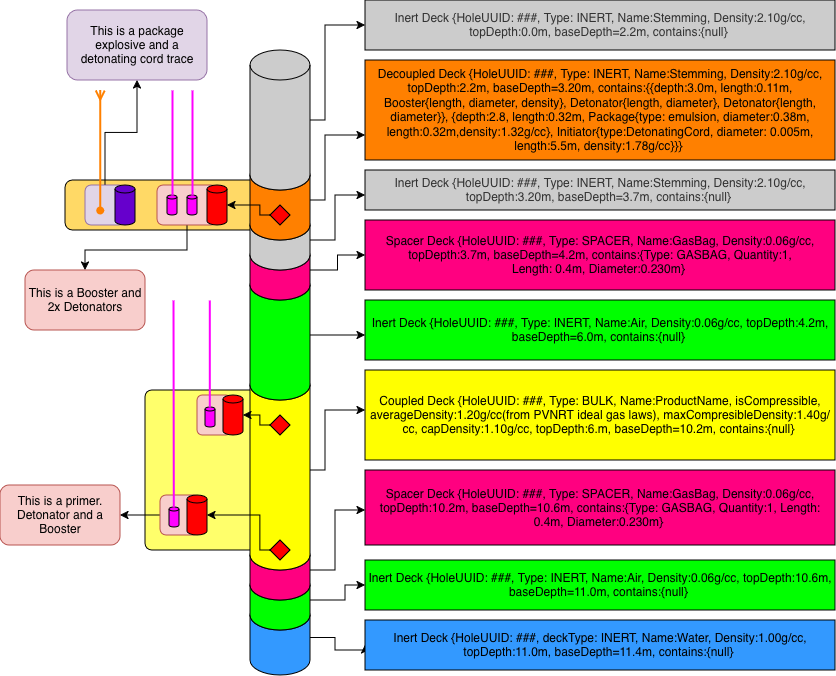

# Kirra Development Plan: February 2026

## Charging System, KAP File Format & Charge Rule Engine

**Version:** 2.0  
**Author:** Brent Buffham / Development Team  
**Date:** 2026-02-06  
**Duration:** 4 Weeks (Feb 5 - Mar 1, 2026)  
**Target Repository:** brentbuffham/Kirra2D

---

## Table of Contents

1. [Executive Summary](#executive-summary)
2. [Core Data Model](#core-data-model)
3. [Week 1: Data Model & Constants](#week-1-data-model--constants)
4. [Week 2: IndexedDB & Product System](#week-2-indexeddb--product-system)
5. [Week 3: KAP File Format](#week-3-kap-file-format)
6. [Week 4: Charge Rule Engine & UI](#week-4-charge-rule-engine--ui)
7. [Integration Points](#integration-points)
8. [Testing Checklist](#testing-checklist)
9. [Appendix: Product Categories](#appendix-product-categories)

---

## Executive Summary

This plan implements a complete charging system for Kirra2D:

| Week  | Focus              | Key Deliverables                                              |
| ----- | ------------------ | ------------------------------------------------------------- |
| **1** | Data Model         | Deck/Product classes, validation, JSDoc types                 |
| **2** | Products & Storage | IndexedDB stores, product dialogs, XLSX import                |
| **3** | KAP Files          | `.kap` export/import with versioning                          |
| **4** | Rules & UI         | Charge rule engine, drag-drop deck builder, hole section view |

### Key Design Decisions

1. **Every hole has at least one deck** (default: INERT Air)
2. **Depths are `lengthFromCollar`** - supports negative for uphole blasting
3. **Primers are separate entities** - can be placed in Inert, Coupled, or Decoupled decks (NOT Spacer)
4. **Decoupled deck contents** belong to parent deck; if outside bounds, attributed to containing deck
5. **Initiating elements** (detonators, cord traces) have `burnRateMs` and `delayMs`

---

## Core Data Model

### Visual Overview (from your diagram)



---

### Document Info (Reference)

| Field | Value |
| ----- | ----- |
| Created | 2026-02-06 |
| Author | Brent Buffham |
| Duration | 4 Weeks (Feb 5 - Mar 1, 2026) |
| Repository | brentbuffham/Kirra2D |
| Language | JavaScript (ES6+ with JSDoc) |

---

### 1. Overview

#### 1.1 Project Goals

Implement a complete charging system for Kirra2D:

1. **Product Management** — Define blast products (explosives, stemming, detonators, spacers)
2. **Deck-Based Charging** — Build charge columns using stackable deck segments
3. **Primer Placement** — Position detonator+booster assemblies within holes
4. **KAP Project Files** — Save/load complete projects as `.kap` archives
5. **Configurable Charge Rules** — Auto-generate charge profiles based on rules

#### 1.2 Weekly Schedule (Reference)

| Week | Dates | Focus | Deliverables |
| ---- | ----- | ----- | ------------- |
| 1 | Feb 5–8 | Data Model | Classes, constants, validation, JSDoc |
| 2 | Feb 9–15 | Products/Storage | IndexedDB, product dialogs, XLSX import |
| 3 | Feb 16–22 | KAP Files | Export/import .kap, versioning, File menu |
| 4 | Feb 23–Mar 1 | Rules & UI | Rule engine, drag-drop builder, section view |

#### 1.3 Key Design Decisions (Reference)

- Every hole has ≥1 deck (default: INERT Air) → Ensures valid state
- Depths use `lengthFromCollar` → Supports negative for uphole blasting
- Primers are separate from decks → Can be in INERT, COUPLED, DECOUPLED (NOT SPACER)
- Decoupled contents belong to parent deck → Reassigned if outside bounds
- Initiators have `burnRateMs` + `delayMs` → Accurate timing
- Pure JavaScript with JSDoc → Matches existing Kirra codebase

#### 1.4 Dependencies to Add

```json
{
  "jszip": "^3.10.1",
  "xlsx": "^0.18.5"
}
```

---

### 2. Core Data Model (Detailed)

#### 2.1 Deck Types

| Type | Description | Products | `contains` |
| ---- | ----------- | -------- | ---------- |
| INERT | Non-explosive material | Non-Explosive | `null` |
| COUPLED | Bulk explosive filling diameter | Bulk-Explosive | `null` |
| DECOUPLED | Packages with annular backfill | Non-Explosive backfill | Array |
| SPACER | Gas bags, stem caps | Spacer products | item details |

#### 2.2 Product Categories

| Category | Types | Used In |
| -------- | ----- | ------- |
| Non-Explosive | Air, Water, Stemming, StemGel, DrillCuttings | INERT decks, DECOUPLED backfill |
| Bulk-Explosive | ANFO, HeavyANFO, BlendGassed, BlendNonGassed, Emulsion, Molecular | COUPLED decks |
| High-Explosive | Booster, PackagedEmulsion, CastBooster, Pentolite | DECOUPLED contents, Primers |
| Detonator | Electronic, NonElectric, Electric, DetonatingCord | Primers, DECOUPLED contents |
| Spacer | GasBag, StemCap, StemBrush, StemPlug, StemLock | SPACER decks |

#### 2.3 Validation Rules

1. Hole must have diameter AND length → else warning
2. Every hole has minimum 1 deck → default INERT:Air
3. Decks must be contiguous → no gaps allowed
4. Decks cannot overlap
5. Negative depths allowed → for uphole blasting
6. Primers NOT in Spacer decks → validation error
7. Decoupled contents belong to parent deck → reassign if outside bounds

#### 2.4 Visual Data Model (from user diagram)

```text
HOLE (existing Kirra blast hole)
|
+-- holeID, entityName, holeDiameter, holeLength
+-- startX/Y/Z, endX/Y/Z (collar to toe)
|
+-- DECKS[] (ordered by topDepth, contiguous)
     |
     +-- INERT DECK
     |    +-- deckID: UUID
     |    +-- holeID: parent reference
     |    +-- deckType: "INERT"
     |    +-- topDepth: 0.0m (lengthFromCollar)
     |    +-- baseDepth: 2.2m
     |    +-- product: {name: "Stemming", density: 2.10 g/cc}
     |    +-- contains: null
     |
     +-- DECOUPLED DECK
     |    +-- deckType: "DECOUPLED"
     |    +-- topDepth: 2.2m, baseDepth: 3.2m
     |    +-- product: {name: "Stemming"} <- annular backfill
     |    +-- contains: [
     |         {type: "Booster", lengthFromCollar: 3.0m, length: 0.11m, diameter: 0.076m},
     |         {type: "Detonator", lengthFromCollar: 3.0m, legLength: 9.0m, burnRateMs: 0, delayMs: 0},
     |         {type: "Detonator", lengthFromCollar: 3.0m, legLength: 9.0m, burnRateMs: 0, delayMs: 25},
     |         {type: "Package", lengthFromCollar: 2.8m, length: 0.32m, diameter: 0.38m, density: 1.32},
     |         {type: "DetonatingCord", lengthFromCollar: 2.2m, length: 5.5m, burnRateMs: 0.2}
     |       ]
     |
     +-- INERT DECK (Stemming)
     |    +-- topDepth: 3.2m, baseDepth: 3.7m
     |    +-- product: {name: "Stemming", density: 2.10}
     |
     +-- SPACER DECK
     |    +-- deckType: "SPACER"
     |    +-- topDepth: 3.7m, baseDepth: 4.2m
     |    +-- product: {name: "GasBag", density: 0.06}
     |    +-- contains: {type: "GASBAG", quantity: 1, length: 0.4m, diameter: 0.230m}
     |
     +-- INERT DECK (Air)
     |    +-- topDepth: 4.2m, baseDepth: 6.0m
     |    +-- product: {name: "Air", density: 0.0012}
     |
     +-- COUPLED DECK
     |    +-- deckType: "COUPLED"
     |    +-- topDepth: 6.0m, baseDepth: 10.2m
     |    +-- product: {name: "HeavyANFO"}
     |    +-- isCompressible: true
     |    +-- averageDensity: 1.20 g/cc
     |    +-- capDensity: 1.10 g/cc
     |    +-- maxCompressibleDensity: 1.40 g/cc
     |    +-- contains: null (bulk fills hole)
     |
     +-- SPACER DECK
     |    +-- topDepth: 10.2m, baseDepth: 10.6m
     |    +-- contains: {type: "GASBAG", quantity: 1, length: 0.4m, diameter: 0.230m}
     |
     +-- INERT DECK (Air)
     |    +-- topDepth: 10.6m, baseDepth: 11.0m
     |
     +-- INERT DECK (Water)
          +-- topDepth: 11.0m, baseDepth: 11.4m
          +-- product: {name: "Water", density: 1.00}

PRIMERS[] (separate entities)
|
+-- PRIMER 1
|    +-- primerID: UUID
|    +-- holeID: reference
|    +-- lengthFromCollar: 9.8m (within Coupled Deck)
|    +-- detonator: {productID, legLength: 12.0m, burnRateMs: 0, delayMs: 100}
|    +-- booster: {productID, quantity: 1, massGrams: 400}
|
+-- PRIMER 2
     +-- lengthFromCollar: 3.0m (within Decoupled Deck)
     +-- detonator: {...}
     +-- booster: {...}
```

---

## Week 1: Data Model & Constants

**Dates:** February 5–8, 2026

**Goals:**

- Define JavaScript classes with JSDoc for IDE support
- Create constants/enums for all types
- Build validation functions
- No UI work yet

**Files to create:**

```text
src/charging/
├── ChargingConstants.js
├── ChargingClasses.js
├── Products.js
├── ChargingValidation.js
└── index.js
```

---

### `src/charging/ChargingConstants.js`

```javascript
/**
 * @fileoverview Kirra Charging System Constants
 */

// DECK TYPES
export const DECK_TYPES = Object.freeze({
    INERT: "INERT",
    COUPLED: "COUPLED",
    DECOUPLED: "DECOUPLED",
    SPACER: "SPACER"
});

// NON-EXPLOSIVE TYPES
export const NON_EXPLOSIVE_TYPES = Object.freeze({
    AIR: "Air",
    WATER: "Water",
    STEMMING: "Stemming",
    STEM_GEL: "StemGel",
    DRILL_CUTTINGS: "DrillCuttings"
});

// BULK EXPLOSIVE TYPES
export const BULK_EXPLOSIVE_TYPES = Object.freeze({
    ANFO: "ANFO",
    HEAVY_ANFO: "HeavyANFO",
    BLEND_GASSED: "BlendGassed",
    BLEND_NON_GASSED: "BlendNonGassed",
    EMULSION: "Emulsion",
    MOLECULAR: "Molecular"
});

// HIGH EXPLOSIVE TYPES
export const HIGH_EXPLOSIVE_TYPES = Object.freeze({
    BOOSTER: "Booster",
    PACKAGED_EMULSION: "PackagedEmulsion",
    PACKAGED_WATERGEL: "PackagedWatergel",
    CAST_BOOSTER: "CastBooster",
    PENTOLITE: "Pentolite"
});

// DETONATOR TYPES
export const DETONATOR_TYPES = Object.freeze({
    ELECTRONIC: "Electronic",
    NON_ELECTRIC: "NonElectric",
    ELECTRIC: "Electric",
    DETONATING_CORD: "DetonatingCord"
});

// SPACER TYPES
export const SPACER_TYPES = Object.freeze({
    GAS_BAG: "GasBag",
    STEM_CAP: "StemCap",
    STEM_BRUSH: "StemBrush",
    STEM_PLUG: "StemPlug",
    STEM_LOCK: "StemLock"
});

// DECOUPLED CONTENT TYPES
export const DECOUPLED_CONTENT_TYPES = Object.freeze({
    BOOSTER: "Booster",
    DETONATOR: "Detonator",
    PACKAGE: "Package",
    DETONATING_CORD: "DetonatingCord",
    SHOCK_TUBE: "ShockTube"
});

// DEFAULT DECK
export const DEFAULT_DECK = Object.freeze({
    deckType: DECK_TYPES.INERT,
    productType: NON_EXPLOSIVE_TYPES.AIR,
    productName: "Air",
    density: 0.0012
});

// STANDARD LEG LENGTHS (meters)
export const STANDARD_LEG_LENGTHS = Object.freeze([
    4.0, 4.2, 4.8, 6.0, 9.0, 12.0, 15.0, 18.0, 24.0, 30.0
]);

// CHARGING DEFAULTS
export const CHARGING_DEFAULTS = Object.freeze({
    preferredStemLength: 3.5,
    minStemLength: 2.5,
    preferredChargeLength: 6.0,
    minChargeLength: 2.0,
    wetTolerance: 0.5,
    dampTolerance: 1.0,
    shortHoleLength: 4.0,
    primerInterval: 8.0,
    bottomOffsetRatio: 0.1,
    maxPrimersPerDeck: 3,
    hotHoleTemperature: 50
});

// SHORT HOLE TIERS
export const SHORT_HOLE_TIERS = Object.freeze([
    { minLength: 4.0, maxLength: Infinity, chargeRatio: 0.50 },
    { minLength: 3.0, maxLength: 4.0, chargeRatio: 0.40 },
    { minLength: 2.0, maxLength: 3.0, chargeRatio: 0.25 },
    { minLength: 1.0, maxLength: 2.0, fixedMassKg: 5 },
    { minLength: 0.0, maxLength: 1.0, chargeRatio: 0 }
]);

// VALIDATION MESSAGES
export const VALIDATION_MESSAGES = Object.freeze({
    NO_DIAMETER_OR_LENGTH: "This hole has no diameter or length and by definition is not a hole.",
    DECK_OVERLAP: "Decks cannot overlap.",
    DECK_GAP: "Gap detected between decks.",
    PRIMER_IN_SPACER: "Primers cannot be placed in Spacer decks.",
    ZERO_DECK_LENGTH: "Deck has zero length.",
    NO_PRODUCT_ASSIGNED: "Deck has no product assigned.",
    NO_DETONATOR: "Primer has no detonator assigned.",
    NO_BOOSTER: "Primer has no booster assigned.",
    PRIMER_OUTSIDE_DECKS: "Primer is outside all deck bounds.",
    NO_DECKS: "Hole has no decks defined."
});

// INDEXEDDB STORE NAMES
export const CHARGING_STORES = Object.freeze({
    PRODUCTS: "chargingProducts",
    DECKS: "chargingDecks",
    PRIMERS: "chargingPrimers",
    CHARGE_CONFIGS: "chargeConfigs"
});

// KAP FILE VERSION
export const KAP_VERSION = "1.0.0";
export const SCHEMA_VERSION = "1.0.0";

// COLORS FOR VISUALIZATION
export const DECK_COLORS = Object.freeze({
    INERT_AIR: "#FFFFFF",
    INERT_WATER: "#4169E1",
    INERT_STEMMING: "#8B7355",
    COUPLED: "#FF69B4",
    DECOUPLED: "#FFD700",
    SPACER: "#ADD8E6",
    BOOSTER: "#FF0000",
    DETONATOR: "#0000FF"
});
```

---

### `src/charging/ChargingClasses.js`

```javascript
/**
 * @fileoverview Core Classes for Kirra Charging System
 */

import {
    DECK_TYPES,
    NON_EXPLOSIVE_TYPES,
    DEFAULT_DECK,
    VALIDATION_MESSAGES
} from "./ChargingConstants.js";

// UUID Generator
export function generateUUID() {
    if (crypto && crypto.randomUUID) {
        return crypto.randomUUID();
    }
    return "xxxxxxxx-xxxx-4xxx-yxxx-xxxxxxxxxxxx".replace(/[xy]/g, function(c) {
        var r = Math.random() * 16 | 0;
        var v = c === "x" ? r : (r & 0x3 | 0x8);
        return v.toString(16);
    });
}

/**
 * Deck Class - A section of a blast hole between two depths
 */
export class Deck {
    constructor(options) {
        this.deckID = options.deckID || generateUUID();
        this.holeID = options.holeID;
        this.deckType = options.deckType || DECK_TYPES.INERT;
        this.topDepth = options.topDepth;       // lengthFromCollar
        this.baseDepth = options.baseDepth;     // lengthFromCollar
        this.product = options.product || null;
        this.contains = options.contains || null;
        
        // For compressible COUPLED decks
        this.isCompressible = options.isCompressible || false;
        this.averageDensity = options.averageDensity || null;
        this.capDensity = options.capDensity || null;
        this.maxCompressibleDensity = options.maxCompressibleDensity || null;
        
        this.created = options.created || new Date().toISOString();
        this.modified = new Date().toISOString();
    }
    
    get length() {
        return Math.abs(this.baseDepth - this.topDepth);
    }
    
    get effectiveDensity() {
        if (this.isCompressible && this.averageDensity) return this.averageDensity;
        return this.product ? (this.product.density || 0) : 0;
    }
    
    calculateVolume(holeDiameter) {
        var radius = holeDiameter / 2;
        return Math.PI * radius * radius * this.length;
    }
    
    calculateMass(holeDiameter) {
        return this.calculateVolume(holeDiameter) * this.effectiveDensity * 1000;
    }
    
    containsDepth(depth) {
        var min = Math.min(this.topDepth, this.baseDepth);
        var max = Math.max(this.topDepth, this.baseDepth);
        return depth >= min && depth <= max;
    }
    
    validate() {
        var errors = [], warnings = [];
        if (this.topDepth === this.baseDepth) errors.push(VALIDATION_MESSAGES.ZERO_DECK_LENGTH);
        if (!this.product) warnings.push(VALIDATION_MESSAGES.NO_PRODUCT_ASSIGNED);
        if (this.deckType === DECK_TYPES.DECOUPLED && (!this.contains || this.contains.length === 0)) {
            warnings.push("Decoupled deck has no contents");
        }
        if (this.deckType === DECK_TYPES.SPACER && !this.contains) {
            warnings.push("Spacer deck has no item details");
        }
        return { valid: errors.length === 0, errors, warnings };
    }
    
    toJSON() {
        return {
            deckID: this.deckID,
            holeID: this.holeID,
            deckType: this.deckType,
            topDepth: this.topDepth,
            baseDepth: this.baseDepth,
            product: this.product,
            contains: this.contains,
            isCompressible: this.isCompressible,
            averageDensity: this.averageDensity,
            capDensity: this.capDensity,
            maxCompressibleDensity: this.maxCompressibleDensity,
            created: this.created,
            modified: this.modified
        };
    }
    
    static fromJSON(obj) {
        return new Deck(obj);
    }
}

/**
 * DecoupledContent Class - Item inside a DECOUPLED deck
 */
export class DecoupledContent {
    constructor(options) {
        this.contentID = options.contentID || generateUUID();
        this.contentType = options.contentType;  // Booster, Detonator, Package, DetonatingCord, ShockTube
        this.lengthFromCollar = options.lengthFromCollar;
        this.length = options.length || null;
        this.diameter = options.diameter || null;
        this.density = options.density || null;
        this.productID = options.productID || null;
        this.productName = options.productName || null;
        
        // For initiators
        this.burnRateMs = options.burnRateMs || null;   // ms per meter
        this.delayMs = options.delayMs || null;         // assignable delay
        this.legLength = options.legLength || null;     // detonator leg
        this.serialNumber = options.serialNumber || null;
    }
    
    get isInitiator() {
        return ["Detonator", "DetonatingCord", "ShockTube"].includes(this.contentType);
    }
    
    get totalDelayMs() {
        if (!this.isInitiator) return 0;
        var burn = 0;
        if (this.burnRateMs) {
            burn = this.contentType === "Detonator"
                ? this.burnRateMs * (this.legLength || 0)
                : this.burnRateMs * (this.length || 0);
        }
        return (this.delayMs || 0) + burn;
    }
    
    calculateMass() {
        if (!this.length || !this.diameter || !this.density) return null;
        var r = this.diameter / 2;
        return Math.PI * r * r * this.length * this.density * 1000;
    }
    
    toJSON() {
        return {
            contentID: this.contentID,
            contentType: this.contentType,
            lengthFromCollar: this.lengthFromCollar,
            length: this.length,
            diameter: this.diameter,
            density: this.density,
            productID: this.productID,
            productName: this.productName,
            burnRateMs: this.burnRateMs,
            delayMs: this.delayMs,
            legLength: this.legLength,
            serialNumber: this.serialNumber
        };
    }
    
    static fromJSON(obj) {
        return new DecoupledContent(obj);
    }
}

/**
 * Primer Class - Detonator + Booster combination
 * Can be placed in INERT, COUPLED, DECOUPLED (NOT SPACER)
 */
export class Primer {
    constructor(options) {
        this.primerID = options.primerID || generateUUID();
        this.holeID = options.holeID;
        this.lengthFromCollar = options.lengthFromCollar;
        
        this.detonator = {
            productID: options.detonator?.productID || null,
            productName: options.detonator?.productName || null,
            legLength: options.detonator?.legLength || null,
            burnRateMs: options.detonator?.burnRateMs || 0,
            delayMs: options.detonator?.delayMs || 0,
            serialNumber: options.detonator?.serialNumber || null
        };
        
        this.booster = {
            productID: options.booster?.productID || null,
            productName: options.booster?.productName || null,
            quantity: options.booster?.quantity || 1,
            massGrams: options.booster?.massGrams || null
        };
        
        this.deckID = options.deckID || null;
        this.created = options.created || new Date().toISOString();
        this.modified = new Date().toISOString();
    }
    
    get totalDelayMs() {
        var burn = (this.detonator.burnRateMs || 0) * (this.detonator.legLength || 0);
        return (this.detonator.delayMs || 0) + burn;
    }
    
    get totalBoosterMassGrams() {
        return (this.booster.massGrams || 0) * (this.booster.quantity || 1);
    }
    
    validate(decks) {
        var errors = [], warnings = [];
        var assignedDeck = null;
        
        for (var i = 0; i < decks.length; i++) {
            if (decks[i].containsDepth(this.lengthFromCollar)) {
                assignedDeck = decks[i];
                break;
            }
        }
        
        if (!assignedDeck) {
            errors.push(VALIDATION_MESSAGES.PRIMER_OUTSIDE_DECKS + " (depth: " + this.lengthFromCollar + "m)");
        } else if (assignedDeck.deckType === DECK_TYPES.SPACER) {
            errors.push(VALIDATION_MESSAGES.PRIMER_IN_SPACER);
        }
        
        if (!this.detonator.productID && !this.detonator.productName) {
            warnings.push(VALIDATION_MESSAGES.NO_DETONATOR);
        }
        if (!this.booster.productID && !this.booster.productName) {
            warnings.push(VALIDATION_MESSAGES.NO_BOOSTER);
        }
        
        return { valid: errors.length === 0, errors, warnings, assignedDeck };
    }
    
    toJSON() {
        return {
            primerID: this.primerID,
            holeID: this.holeID,
            lengthFromCollar: this.lengthFromCollar,
            detonator: Object.assign({}, this.detonator),
            booster: Object.assign({}, this.booster),
            deckID: this.deckID,
            created: this.created,
            modified: this.modified
        };
    }
    
    static fromJSON(obj) {
        return new Primer(obj);
    }
}

/**
 * HoleCharging Class - Manages all charging data for a single hole
 */
export class HoleCharging {
    constructor(hole) {
        this.holeID = hole.holeID;
        this.entityName = hole.entityName || null;
        this.holeDiameter = hole.holeDiameter || 0;
        this.holeLength = hole.holeLengthCalculated || hole.measuredLength || 0;
        
        this.decks = [];
        this.primers = [];
        
        this.created = new Date().toISOString();
        this.modified = new Date().toISOString();
        
        if (this.holeDiameter > 0 && this.holeLength !== 0) {
            this.initializeDefaultDeck();
        }
    }
    
    initializeDefaultDeck() {
        if (this.decks.length === 0) {
            var top = this.holeLength < 0 ? this.holeLength : 0;
            var base = this.holeLength < 0 ? 0 : this.holeLength;
            this.decks.push(new Deck({
                holeID: this.holeID,
                deckType: DECK_TYPES.INERT,
                topDepth: top,
                baseDepth: base,
                product: { name: "Air", density: DEFAULT_DECK.density }
            }));
        }
    }
    
    sortDecks() {
        this.decks.sort(function(a, b) { return a.topDepth - b.topDepth; });
    }
    
    insertDeck(newDeck) {
        newDeck.holeID = this.holeID;
        var toRemove = [];
        var toAdd = [newDeck];
        var newMin = Math.min(newDeck.topDepth, newDeck.baseDepth);
        var newMax = Math.max(newDeck.topDepth, newDeck.baseDepth);
        
        for (var i = 0; i < this.decks.length; i++) {
            var existing = this.decks[i];
            var exMin = Math.min(existing.topDepth, existing.baseDepth);
            var exMax = Math.max(existing.topDepth, existing.baseDepth);
            
            if (newMin < exMax && newMax > exMin) {
                toRemove.push(existing);
                
                // Top portion
                if (exMin < newMin) {
                    toAdd.push(new Deck({
                        holeID: this.holeID,
                        deckType: existing.deckType,
                        topDepth: exMin,
                        baseDepth: newMin,
                        product: existing.product ? Object.assign({}, existing.product) : null
                    }));
                }
                // Bottom portion
                if (exMax > newMax) {
                    toAdd.push(new Deck({
                        holeID: this.holeID,
                        deckType: existing.deckType,
                        topDepth: newMax,
                        baseDepth: exMax,
                        product: existing.product ? Object.assign({}, existing.product) : null
                    }));
                }
            }
        }
        
        this.decks = this.decks.filter(function(d) { return toRemove.indexOf(d) === -1; });
        for (var j = 0; j < toAdd.length; j++) {
            this.decks.push(toAdd[j]);
        }
        this.sortDecks();
        this.modified = new Date().toISOString();
        return { success: true };
    }
    
    addPrimer(primer) {
        primer.holeID = this.holeID;
        var val = primer.validate(this.decks);
        if (!val.valid) return val;
        
        primer.deckID = val.assignedDeck ? val.assignedDeck.deckID : null;
        this.primers.push(primer);
        this.modified = new Date().toISOString();
        return { success: true, errors: [], warnings: val.warnings, assignedDeck: val.assignedDeck };
    }
    
    getDeckAtDepth(depth) {
        for (var i = 0; i < this.decks.length; i++) {
            if (this.decks[i].containsDepth(depth)) return this.decks[i];
        }
        return null;
    }
    
    getTotalExplosiveMass() {
        var total = 0;
        for (var i = 0; i < this.decks.length; i++) {
            var deck = this.decks[i];
            if (deck.deckType === DECK_TYPES.COUPLED) {
                total += deck.calculateMass(this.holeDiameter);
            } else if (deck.deckType === DECK_TYPES.DECOUPLED && deck.contains) {
                for (var j = 0; j < deck.contains.length; j++) {
                    var c = deck.contains[j];
                    if (c.contentType === "Package" || c.contentType === "Booster") {
                        var content = new DecoupledContent(c);
                        var mass = content.calculateMass();
                        if (mass) total += mass;
                    }
                }
            }
        }
        for (var k = 0; k < this.primers.length; k++) {
            total += (this.primers[k].totalBoosterMassGrams || 0) / 1000;
        }
        return total;
    }
    
    calculatePowderFactor(burden, spacing) {
        var mass = this.getTotalExplosiveMass();
        var volume = burden * spacing * Math.abs(this.holeLength);
        return volume > 0 ? mass / volume : 0;
    }
    
    validate() {
        var errors = [], warnings = [];
        
        if (!this.holeDiameter || this.holeLength === 0) {
            warnings.push(VALIDATION_MESSAGES.NO_DIAMETER_OR_LENGTH);
        }
        if (this.decks.length === 0) {
            errors.push(VALIDATION_MESSAGES.NO_DECKS);
        }
        
        this.sortDecks();
        for (var i = 0; i < this.decks.length - 1; i++) {
            var gap = Math.abs(this.decks[i + 1].topDepth - this.decks[i].baseDepth);
            if (gap > 0.001) {
                warnings.push(VALIDATION_MESSAGES.DECK_GAP + " Gap: " + gap.toFixed(3) + "m");
            }
        }
        
        for (var j = 0; j < this.decks.length; j++) {
            var dv = this.decks[j].validate();
            errors = errors.concat(dv.errors);
            warnings = warnings.concat(dv.warnings);
        }
        
        for (var k = 0; k < this.primers.length; k++) {
            var pv = this.primers[k].validate(this.decks);
            errors = errors.concat(pv.errors);
            warnings = warnings.concat(pv.warnings);
        }
        
        return { valid: errors.length === 0, errors: errors, warnings: warnings };
    }
    
    clear() {
        this.decks = [];
        this.primers = [];
        this.initializeDefaultDeck();
    }
    
    toJSON() {
        return {
            holeID: this.holeID,
            entityName: this.entityName,
            holeDiameter: this.holeDiameter,
            holeLength: this.holeLength,
            decks: this.decks.map(function(d) { return d.toJSON(); }),
            primers: this.primers.map(function(p) { return p.toJSON(); }),
            created: this.created,
            modified: this.modified
        };
    }
    
    static fromJSON(obj, hole) {
        var hc = new HoleCharging(hole || {
            holeID: obj.holeID,
            entityName: obj.entityName,
            holeDiameter: obj.holeDiameter,
            holeLengthCalculated: obj.holeLength
        });
        hc.decks = [];
        hc.primers = [];
        if (obj.decks) {
            hc.decks = obj.decks.map(function(d) { return Deck.fromJSON(d); });
        }
        if (obj.primers) {
            hc.primers = obj.primers.map(function(p) { return Primer.fromJSON(p); });
        }
        hc.created = obj.created || hc.created;
        hc.modified = obj.modified || hc.modified;
        return hc;
    }
}

// Window exports
if (typeof window !== "undefined") {
    window.generateUUID = generateUUID;
    window.Deck = Deck;
    window.DecoupledContent = DecoupledContent;
    window.Primer = Primer;
    window.HoleCharging = HoleCharging;
}
```

---

### `src/charging/Products.js`

```javascript
/**
 * @fileoverview Product Definitions for Kirra Charging System
 */

import { generateUUID } from "./ChargingClasses.js";

// Base Product
export class Product {
    constructor(options) {
        this.productID = options.productID || generateUUID();
        this.productCategory = options.productCategory;
        this.productType = options.productType;
        this.name = options.name;
        this.supplier = options.supplier || null;
        this.description = options.description || null;
        this.colorHex = options.colorHex || "#CCCCCC";
        this.active = options.active !== false;
        this.created = options.created || new Date().toISOString();
        this.modified = new Date().toISOString();
    }
    
    toJSON() {
        return {
            productID: this.productID,
            productCategory: this.productCategory,
            productType: this.productType,
            name: this.name,
            supplier: this.supplier,
            description: this.description,
            colorHex: this.colorHex,
            active: this.active,
            created: this.created,
            modified: this.modified
        };
    }
}

// Non-Explosive (Air, Water, Stemming, StemGel)
export class NonExplosiveProduct extends Product {
    constructor(options) {
        super(Object.assign({}, options, { productCategory: "NonExplosive" }));
        this.density = options.density || 0;
        this.particleSizeMm = options.particleSizeMm || null;
    }
    
    toJSON() {
        return Object.assign(Product.prototype.toJSON.call(this), {
            density: this.density,
            particleSizeMm: this.particleSizeMm
        });
    }
    
    static fromJSON(obj) { return new NonExplosiveProduct(obj); }
}

// Bulk Explosive (ANFO, Blends, Emulsion)
export class BulkExplosiveProduct extends Product {
    constructor(options) {
        super(Object.assign({}, options, { productCategory: "BulkExplosive" }));
        this.density = options.density || 0.85;
        this.isCompressible = options.isCompressible || false;
        this.minDensity = options.minDensity || null;
        this.maxDensity = options.maxDensity || null;
        this.vodMs = options.vodMs || null;
        this.reKjKg = options.reKjKg || null;
        this.rws = options.rws || 100;
        this.rbs = options.rbs || null;
        this.waterResistant = options.waterResistant || false;
        this.dampResistant = options.dampResistant || false;
        this.criticalDiameterMm = options.criticalDiameterMm || null;
        this.sleepTimeHours = options.sleepTimeHours || null;
        this.anfoPercentage = options.anfoPercentage || null;
        this.emulsionPercentage = options.emulsionPercentage || null;
        this.gassingAgent = options.gassingAgent || null;
    }
    
    calculateMass(length, diameter, density) {
        var d = density || this.density;
        var r = diameter / 2;
        return Math.PI * r * r * length * d * 1000;
    }
    
    calculateLength(massKg, diameter, density) {
        var d = density || this.density;
        var r = diameter / 2;
        return massKg / (Math.PI * r * r * d * 1000);
    }
    
    toJSON() {
        return Object.assign(Product.prototype.toJSON.call(this), {
            density: this.density,
            isCompressible: this.isCompressible,
            minDensity: this.minDensity,
            maxDensity: this.maxDensity,
            vodMs: this.vodMs,
            reKjKg: this.reKjKg,
            rws: this.rws,
            rbs: this.rbs,
            waterResistant: this.waterResistant,
            dampResistant: this.dampResistant,
            criticalDiameterMm: this.criticalDiameterMm,
            sleepTimeHours: this.sleepTimeHours,
            anfoPercentage: this.anfoPercentage,
            emulsionPercentage: this.emulsionPercentage,
            gassingAgent: this.gassingAgent
        });
    }
    
    static fromJSON(obj) { return new BulkExplosiveProduct(obj); }
}

// High Explosive (Boosters, Packages)
export class HighExplosiveProduct extends Product {
    constructor(options) {
        super(Object.assign({}, options, { productCategory: "HighExplosive" }));
        this.massGrams = options.massGrams || 0;
        this.diameterMm = options.diameterMm || 0;
        this.lengthMm = options.lengthMm || 0;
        this.density = options.density || 1.5;
        this.vodMs = options.vodMs || null;
        this.reKjKg = options.reKjKg || null;
        this.waterResistant = options.waterResistant !== false;
        this.capSensitive = options.capSensitive || false;
        this.castBooster = options.castBooster || false;
    }
    
    get lengthM() { return this.lengthMm / 1000; }
    get diameterM() { return this.diameterMm / 1000; }
    get massKg() { return this.massGrams / 1000; }
    
    toJSON() {
        return Object.assign(Product.prototype.toJSON.call(this), {
            massGrams: this.massGrams,
            diameterMm: this.diameterMm,
            lengthMm: this.lengthMm,
            density: this.density,
            vodMs: this.vodMs,
            reKjKg: this.reKjKg,
            waterResistant: this.waterResistant,
            capSensitive: this.capSensitive,
            castBooster: this.castBooster
        });
    }
    
    static fromJSON(obj) { return new HighExplosiveProduct(obj); }
}

// Detonator
export class DetonatorProduct extends Product {
    constructor(options) {
        super(Object.assign({}, options, { productCategory: "Detonator" }));
        this.detonatorType = options.detonatorType || "Electronic";
        this.timingType = options.timingType || "programmable";
        this.burnRateMs = options.burnRateMs || 0;
        this.minDelayMs = options.minDelayMs || 0;
        this.maxDelayMs = options.maxDelayMs || 20000;
        this.delayIncrementMs = options.delayIncrementMs || 1;
        this.delaySeriesMs = options.delaySeriesMs || null;
        this.accuracy = options.accuracy || null;
        this.legLengthsM = options.legLengthsM || [4, 6, 9, 12, 15, 18, 24, 30];
        this.shellDiameterMm = options.shellDiameterMm || 7.6;
        this.shellLengthMm = options.shellLengthMm || 98;
        this.coreLoadGm = options.coreLoadGm || null;
    }
    
    get isElectronic() { return this.detonatorType === "Electronic"; }
    get isDetonatingCord() { return this.detonatorType === "DetonatingCord"; }
    
    getNearestLegLength(required) {
        for (var i = 0; i < this.legLengthsM.length; i++) {
            if (this.legLengthsM[i] >= required) return this.legLengthsM[i];
        }
        return this.legLengthsM[this.legLengthsM.length - 1];
    }
    
    toJSON() {
        return Object.assign(Product.prototype.toJSON.call(this), {
            detonatorType: this.detonatorType,
            timingType: this.timingType,
            burnRateMs: this.burnRateMs,
            minDelayMs: this.minDelayMs,
            maxDelayMs: this.maxDelayMs,
            delayIncrementMs: this.delayIncrementMs,
            delaySeriesMs: this.delaySeriesMs,
            accuracy: this.accuracy,
            legLengthsM: this.legLengthsM,
            shellDiameterMm: this.shellDiameterMm,
            shellLengthMm: this.shellLengthMm,
            coreLoadGm: this.coreLoadGm
        });
    }
    
    static fromJSON(obj) { return new DetonatorProduct(obj); }
}

// Spacer (GasBag, StemCap)
export class SpacerProduct extends Product {
    constructor(options) {
        super(Object.assign({}, options, { productCategory: "Spacer" }));
        this.spacerType = options.spacerType || "GasBag";
        this.lengthMm = options.lengthMm || null;
        this.diameterMm = options.diameterMm || null;
        this.diameterRangeMm = options.diameterRangeMm || null;
        this.density = options.density || 0.06;
    }
    
    get lengthM() { return this.lengthMm ? this.lengthMm / 1000 : null; }
    
    toJSON() {
        return Object.assign(Product.prototype.toJSON.call(this), {
            spacerType: this.spacerType,
            lengthMm: this.lengthMm,
            diameterMm: this.diameterMm,
            diameterRangeMm: this.diameterRangeMm,
            density: this.density
        });
    }
    
    static fromJSON(obj) { return new SpacerProduct(obj); }
}

// Factory
export function createProductFromJSON(obj) {
    switch (obj.productCategory) {
        case "NonExplosive": return NonExplosiveProduct.fromJSON(obj);
        case "BulkExplosive": return BulkExplosiveProduct.fromJSON(obj);
        case "HighExplosive": return HighExplosiveProduct.fromJSON(obj);
        case "Detonator": return DetonatorProduct.fromJSON(obj);
        case "Spacer": return SpacerProduct.fromJSON(obj);
        default: return new Product(obj);
    }
}

// Window exports
if (typeof window !== "undefined") {
    window.Product = Product;
    window.NonExplosiveProduct = NonExplosiveProduct;
    window.BulkExplosiveProduct = BulkExplosiveProduct;
    window.HighExplosiveProduct = HighExplosiveProduct;
    window.DetonatorProduct = DetonatorProduct;
    window.SpacerProduct = SpacerProduct;
    window.createProductFromJSON = createProductFromJSON;
}
```

---

## Week 2: IndexedDB & Product System

**Dates:** February 9–15, 2026

**Goals:**

- Add IndexedDB stores for charging data
- Match existing Kirra patterns (`debouncedSave*`)
- Product management dialog
- XLSX import for products

**Files to create:**

```text
src/charging/
├── ChargingDatabase.js
├── ProductDialog.js
├── ProductImport.js
└── defaultProducts.json
```

---

### `src/charging/ChargingDatabase.js`

```javascript
/**
 * @fileoverview IndexedDB Storage for Kirra Charging System
 */

import { CHARGING_STORES } from "./ChargingConstants.js";
import { createProductFromJSON } from "./Products.js";

var DB_NAME = "KirraDB";
var DB_VERSION = 2;

// Products cache
var productsCache = new Map();
var saveProductsTimeout = null;

// Decks cache (Map of holeID -> Deck[])
var decksCache = new Map();
var saveDecksTimeout = null;

// Primers cache (Map of holeID -> Primer[])
var primersCache = new Map();
var savePrimersTimeout = null;

// Initialize charging stores
export function initChargingStores() {
    return new Promise(function(resolve, reject) {
        var request = indexedDB.open(DB_NAME, DB_VERSION);
        
        request.onupgradeneeded = function(e) {
            var db = e.target.result;
            var stores = Object.values(CHARGING_STORES);
            for (var i = 0; i < stores.length; i++) {
                if (!db.objectStoreNames.contains(stores[i])) {
                    db.createObjectStore(stores[i], { keyPath: "id" });
                    console.log("Created charging store:", stores[i]);
                }
            }
        };
        
        request.onsuccess = function(e) {
            e.target.result.close();
            console.log("Charging stores initialized");
            resolve();
        };
        
        request.onerror = function(e) {
            reject(e.target.error);
        };
    });
}

// ============ PRODUCTS ============

export function getAllProducts() {
    return Array.from(productsCache.values());
}

export function getProductsByCategory(category) {
    return getAllProducts().filter(function(p) {
        return p.productCategory === category;
    });
}

export function getProductById(id) {
    return productsCache.get(id);
}

export function saveProduct(product) {
    product.modified = new Date().toISOString();
    productsCache.set(product.productID, product);
    debouncedSaveProducts();
}

export function deleteProduct(id) {
    productsCache.delete(id);
    debouncedSaveProducts();
}

export function bulkAddProducts(products) {
    for (var i = 0; i < products.length; i++) {
        products[i].modified = new Date().toISOString();
        productsCache.set(products[i].productID, products[i]);
    }
    debouncedSaveProducts();
}

export function clearAllProducts() {
    productsCache.clear();
    debouncedSaveProducts();
}

function debouncedSaveProducts() {
    if (saveProductsTimeout) clearTimeout(saveProductsTimeout);
    saveProductsTimeout = setTimeout(function() {
        console.log("Auto-saving products...");
        saveProductsToIndexedDB();
    }, 2000);
}

function saveProductsToIndexedDB() {
    return new Promise(function(resolve, reject) {
        var request = indexedDB.open(DB_NAME);
        request.onsuccess = function(e) {
            var db = e.target.result;
            var tx = db.transaction([CHARGING_STORES.PRODUCTS], "readwrite");
            var store = tx.objectStore(CHARGING_STORES.PRODUCTS);
            
            store.clear().onsuccess = function() {
                var data = getAllProducts().map(function(p) { return p.toJSON(); });
                store.add({ id: "productsData", data: data });
            };
            
            tx.oncomplete = function() {
                console.log("Products saved:", productsCache.size);
                db.close();
                resolve();
            };
            
            tx.onerror = function(err) {
                reject(err);
            };
        };
    });
}

export function loadProductsFromIndexedDB() {
    return new Promise(function(resolve, reject) {
        var request = indexedDB.open(DB_NAME);
        request.onsuccess = function(e) {
            var db = e.target.result;
            
            if (!db.objectStoreNames.contains(CHARGING_STORES.PRODUCTS)) {
                db.close();
                resolve([]);
                return;
            }
            
            var tx = db.transaction([CHARGING_STORES.PRODUCTS], "readonly");
            var store = tx.objectStore(CHARGING_STORES.PRODUCTS);
            var getReq = store.get("productsData");
            
            getReq.onsuccess = function() {
                productsCache.clear();
                if (getReq.result && getReq.result.data) {
                    for (var i = 0; i < getReq.result.data.length; i++) {
                        var product = createProductFromJSON(getReq.result.data[i]);
                        productsCache.set(product.productID, product);
                    }
                }
                console.log("Loaded products:", productsCache.size);
                resolve(getAllProducts());
            };
            
            tx.oncomplete = function() {
                db.close();
            };
        };
    });
}

// ============ DECKS ============

export function getDecksForHole(holeID) {
    return decksCache.get(holeID) || [];
}

export function setDecksForHole(holeID, decks) {
    decksCache.set(holeID, decks);
    debouncedSaveDecks();
}

export function clearDecksForHole(holeID) {
    decksCache.delete(holeID);
    debouncedSaveDecks();
}

function debouncedSaveDecks() {
    if (saveDecksTimeout) clearTimeout(saveDecksTimeout);
    saveDecksTimeout = setTimeout(function() {
        console.log("Auto-saving decks...");
        saveDecksToIndexedDB();
    }, 2000);
}

function saveDecksToIndexedDB() {
    return new Promise(function(resolve, reject) {
        var request = indexedDB.open(DB_NAME);
        request.onsuccess = function(e) {
            var db = e.target.result;
            var tx = db.transaction([CHARGING_STORES.DECKS], "readwrite");
            var store = tx.objectStore(CHARGING_STORES.DECKS);
            
            var decksObj = {};
            decksCache.forEach(function(decks, holeID) {
                decksObj[holeID] = decks.map(function(d) { return d.toJSON ? d.toJSON() : d; });
            });
            
            store.clear().onsuccess = function() {
                store.add({ id: "decksData", data: decksObj });
            };
            
            tx.oncomplete = function() {
                console.log("Decks saved for", decksCache.size, "holes");
                db.close();
                resolve();
            };
        };
    });
}

export function loadDecksFromIndexedDB() {
    return new Promise(function(resolve, reject) {
        var request = indexedDB.open(DB_NAME);
        request.onsuccess = function(e) {
            var db = e.target.result;
            
            if (!db.objectStoreNames.contains(CHARGING_STORES.DECKS)) {
                db.close();
                resolve(new Map());
                return;
            }
            
            var tx = db.transaction([CHARGING_STORES.DECKS], "readonly");
            var store = tx.objectStore(CHARGING_STORES.DECKS);
            var getReq = store.get("decksData");
            
            getReq.onsuccess = function() {
                decksCache.clear();
                if (getReq.result && getReq.result.data) {
                    var data = getReq.result.data;
                    var keys = Object.keys(data);
                    for (var i = 0; i < keys.length; i++) {
                        decksCache.set(keys[i], data[keys[i]]);
                    }
                }
                console.log("Loaded decks for", decksCache.size, "holes");
                resolve(decksCache);
            };
            
            tx.oncomplete = function() {
                db.close();
            };
        };
    });
}

// ============ PRIMERS ============

export function getPrimersForHole(holeID) {
    return primersCache.get(holeID) || [];
}

export function setPrimersForHole(holeID, primers) {
    primersCache.set(holeID, primers);
    debouncedSavePrimers();
}

function debouncedSavePrimers() {
    if (savePrimersTimeout) clearTimeout(savePrimersTimeout);
    savePrimersTimeout = setTimeout(function() {
        console.log("Auto-saving primers...");
        savePrimersToIndexedDB();
    }, 2000);
}

function savePrimersToIndexedDB() {
    return new Promise(function(resolve, reject) {
        var request = indexedDB.open(DB_NAME);
        request.onsuccess = function(e) {
            var db = e.target.result;
            var tx = db.transaction([CHARGING_STORES.PRIMERS], "readwrite");
            var store = tx.objectStore(CHARGING_STORES.PRIMERS);
            
            var primersObj = {};
            primersCache.forEach(function(primers, holeID) {
                primersObj[holeID] = primers.map(function(p) { return p.toJSON ? p.toJSON() : p; });
            });
            
            store.clear().onsuccess = function() {
                store.add({ id: "primersData", data: primersObj });
            };
            
            tx.oncomplete = function() {
                console.log("Primers saved for", primersCache.size, "holes");
                db.close();
                resolve();
            };
        };
    });
}

export function loadPrimersFromIndexedDB() {
    return new Promise(function(resolve, reject) {
        var request = indexedDB.open(DB_NAME);
        request.onsuccess = function(e) {
            var db = e.target.result;
            
            if (!db.objectStoreNames.contains(CHARGING_STORES.PRIMERS)) {
                db.close();
                resolve(new Map());
                return;
            }
            
            var tx = db.transaction([CHARGING_STORES.PRIMERS], "readonly");
            var store = tx.objectStore(CHARGING_STORES.PRIMERS);
            var getReq = store.get("primersData");
            
            getReq.onsuccess = function() {
                primersCache.clear();
                if (getReq.result && getReq.result.data) {
                    var data = getReq.result.data;
                    var keys = Object.keys(data);
                    for (var i = 0; i < keys.length; i++) {
                        primersCache.set(keys[i], data[keys[i]]);
                    }
                }
                console.log("Loaded primers for", primersCache.size, "holes");
                resolve(primersCache);
            };
            
            tx.oncomplete = function() {
                db.close();
            };
        };
    });
}

// Window exports
if (typeof window !== "undefined") {
    window.initChargingStores = initChargingStores;
    window.getAllProducts = getAllProducts;
    window.getProductsByCategory = getProductsByCategory;
    window.getProductById = getProductById;
    window.saveProduct = saveProduct;
    window.deleteProduct = deleteProduct;
    window.bulkAddProducts = bulkAddProducts;
    window.loadProductsFromIndexedDB = loadProductsFromIndexedDB;
    window.getDecksForHole = getDecksForHole;
    window.setDecksForHole = setDecksForHole;
    window.loadDecksFromIndexedDB = loadDecksFromIndexedDB;
    window.getPrimersForHole = getPrimersForHole;
    window.setPrimersForHole = setPrimersForHole;
    window.loadPrimersFromIndexedDB = loadPrimersFromIndexedDB;
}
```

---

## Week 3: KAP File Format

**Dates:** February 16–22, 2026

**Goals:**

- Export complete project as `.kap` (zipped JSON)
- Import with validation and versioning
- Add to File menu

**Files to create:**

```text
src/charging/
├── KAPFileService.js
└── KAPMigrations.js
```

**KAP file structure:**

```text
project.kap (ZIP archive)
├── manifest.json   (metadata, version info)
├── holes.json       (allBlastHoles)
├── decks.json       (charging decks by holeID)
├── primers.json     (primers by holeID)
├── products.json    (product definitions)
├── configs.json     (charge configurations)
├── drawings.json    (KAD drawings)
├── surfaces.json    (surface data)
└── layers.json      (layer organization)
```

---

### `src/charging/KAPFileService.js`

```javascript
/**
 * @fileoverview KAP File Service - Export/Import .kap project files
 */

import JSZip from "jszip";
import { KAP_VERSION, SCHEMA_VERSION } from "./ChargingConstants.js";

var STORE_CONFIG = [
    { filename: "holes.json", getData: getHolesData, setData: setHolesData, required: true },
    { filename: "decks.json", getData: getDecksData, setData: setDecksData, required: false },
    { filename: "primers.json", getData: getPrimersData, setData: setPrimersData, required: false },
    { filename: "products.json", getData: getProductsData, setData: setProductsData, required: false },
    { filename: "configs.json", getData: getConfigsData, setData: setConfigsData, required: false },
    { filename: "drawings.json", getData: getDrawingsData, setData: setDrawingsData, required: false },
    { filename: "surfaces.json", getData: getSurfacesData, setData: setSurfacesData, required: false },
    { filename: "layers.json", getData: getLayersData, setData: setLayersData, required: false }
];

// Data getters
function getHolesData() { return window.allBlastHoles || []; }
function getDecksData() {
    var result = {};
    if (window.decksCache) { /* ... */ }
    return result;
}
// ... (export/import logic continues in full plan)
```