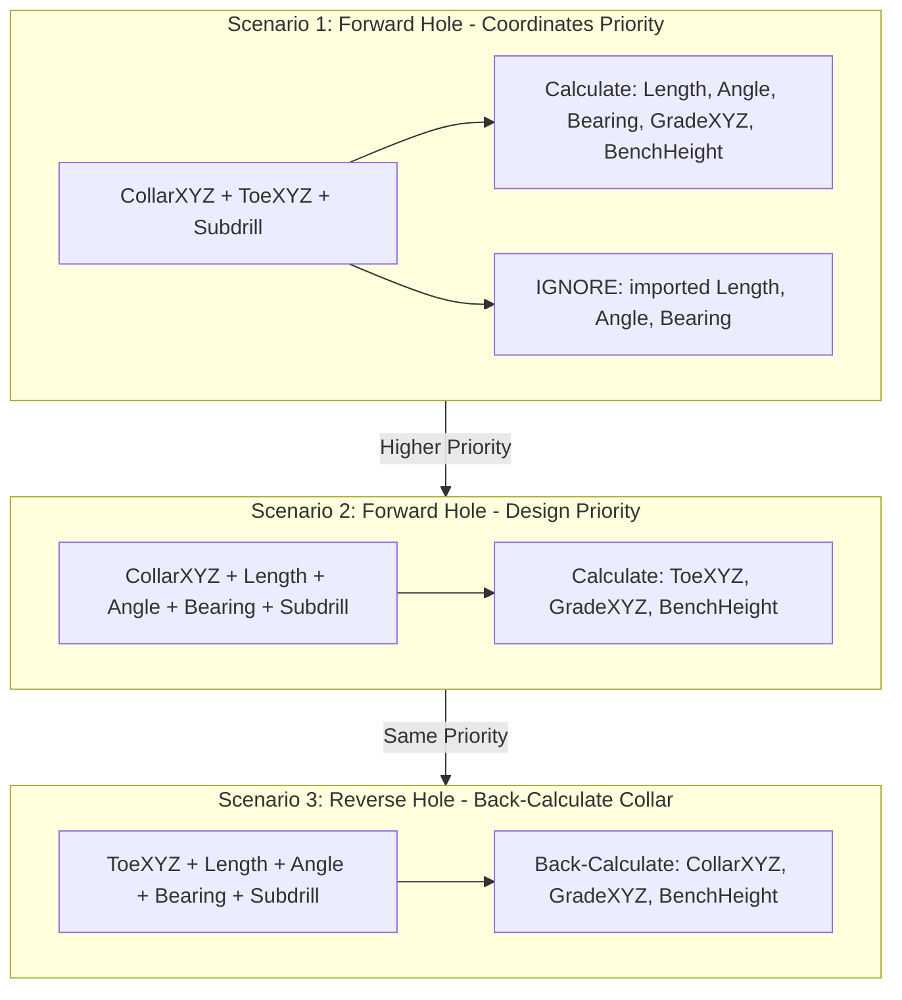

# Dialog Modernization and CSV Import Geometry Fix Plan

## Overview

This plan covers two related tasks:
1. **Surface Assignment Dialogs** - Convert to FloatingDialog with Grade-first mode selection
2. **CSV Import Geometry Conflicts** - Implement priority-based calculation with reverse geometry support

---

## Part A: Surface Assignment Dialog Modernization

### Current State
- **Location**: [`src/kirra.js`](src/kirra.js) lines 35231-35652
- **Issue**: Uses 8x Swal.fire() calls across both tools

### Enhanced Grade Dialog Design

Grade option listed first, with pre-filled elevation value (average CollarZ - 10):

```
+--------------------------------------------------+
|  Assign Grade Elevation                          |
+--------------------------------------------------+
|                                                  |
|  Assignment Mode:                                |
|                                                  |
|  (*) Assign GRADE Elevation                      |
|      > Calculates: ToeZ = GradeZ - Subdrill      |
|      > Recalculates: Length, ToeXYZ              |
|                                                  |
|  ( ) Assign TOE Elevation                        |
|      > Calculates: GradeZ = ToeZ + Subdrill      |
|      > Recalculates: Length, GradeXYZ            |
|                                                  |
|  Elevation (mZ):  [_274.0_]  <- avg CollarZ - 10 |
|                                                  |
|             [Cancel]  [Apply]                    |
+--------------------------------------------------+
```

### Default Elevation Calculation

```javascript
// Step 1) Calculate average collar elevation from selected holes
function getDefaultGradeElevation() {
    var holes = selectedMultipleHoles && selectedMultipleHoles.length > 0 
        ? selectedMultipleHoles 
        : allBlastHoles;
    
    if (!holes || holes.length === 0) return 274; // fallback
    
    var sumZ = 0;
    for (var i = 0; i < holes.length; i++) {
        sumZ += holes[i].startZLocation || 0;
    }
    var avgCollarZ = sumZ / holes.length;
    
    // Step 2) Subtract 10m for typical bench height
    return Math.round((avgCollarZ - 10) * 10) / 10;
}
```

### Implementation

**Create**: [`src/dialog/popups/generic/SurfaceAssignmentDialogs.js`](src/dialog/popups/generic/SurfaceAssignmentDialogs.js)

Key functions:
1. `showAssignCollarDialog(onConfirm)` - Manual collar elevation entry
2. `showAssignGradeDialog(onConfirm)` - Enhanced with Grade-first radio selector
3. `showSurfaceSelectDialog(surfaces, onSelect)` - Multi-surface picker
4. `showAssignmentCompleteDialog(count, targetName, type)` - Success message
5. `getDefaultGradeElevation()` - Calculate default from average CollarZ - 10
6. Move `assignHoleToSurfaceElevation()` and `assignHolesToFixedElevation()` to this file

---

## Part B: CSV Import Geometry Conflict Resolution

### Problem Statement

When importing CSV with conflicting data, we need a clear priority hierarchy. GradeXYZ is rarely provided by other programs, so we focus on CollarXYZ, ToeXYZ, and design parameters.

### Revised Geometry Priority Hierarchy



### Priority Resolution Table

| Priority | Has Collar | Has Toe | Has L/A/B | Has Subdrill | Action |
|----------|-----------|---------|-----------|--------------|--------|
| **1** | Yes | Yes | Any | Yes | **IGNORE L/A/B** - Calculate from CollarXYZ + ToeXYZ |
| **2** | Yes | No | Yes | Yes | Calculate ToeXYZ, GradeXYZ from design params |
| **3** | No | Yes | Yes | Yes | **REVERSE CALC** - Calculate CollarXYZ from ToeXYZ + L/A/B |
| **4** | Yes | Yes | No | No | Calculate L/A/B, estimate Subdrill |
| **5** | Yes | No | No | No | Use defaults (vertical hole, 10m bench) |

### Implementation

**Modify**: [`src/kirra.js`](src/kirra.js) function `calculateMissingGeometry()` at line 28195

```javascript
function calculateMissingGeometry(hole) {
    // Step 1) Determine what data we have
    var hasCollarXYZ = isValidCoord(hole.startXLocation, hole.startYLocation, hole.startZLocation);
    var hasToeXYZ = isValidCoordDifferent(hole, "end");
    var hasLAB = (hole.holeLengthCalculated > 0) && 
                 (hole.holeAngle !== undefined) && 
                 (hole.holeBearing !== undefined);
    var hasSubdrill = hole.subdrillAmount !== undefined && hole.subdrillAmount > 0;
    
    // Step 2) PRIORITY 1: CollarXYZ + ToeXYZ (coordinates take precedence)
    if (hasCollarXYZ && hasToeXYZ) {
        console.log("CSV Import: Using CollarXYZ + ToeXYZ (ignoring L/A/B if provided)");
        calculateFromCollarAndToe(hole);
        return;
    }
    
    // Step 3) PRIORITY 2: CollarXYZ + L/A/B + Subdrill (forward calculation)
    if (hasCollarXYZ && hasLAB && hasSubdrill) {
        console.log("CSV Import: Using CollarXYZ + L/A/B + Subdrill");
        calculateFromDesignParams(hole);
        return;
    }
    
    // Step 4) PRIORITY 3: ToeXYZ + L/A/B + Subdrill (REVERSE calculation)
    if (!hasCollarXYZ && hasToeXYZ && hasLAB && hasSubdrill) {
        console.log("CSV Import: REVERSE CALC - ToeXYZ + L/A/B -> CollarXYZ");
        calculateCollarFromToe(hole);
        return;
    }
    
    // Step 5) Fallback: Use whatever we have with defaults
    if (hasCollarXYZ) {
        applyDefaults(hole);
        calculateFromDesignParams(hole);
    }
}
```

### Reverse Hole Geometry Function

```javascript
// Step 6) Calculate CollarXYZ from ToeXYZ + Length + Angle + Bearing
function calculateCollarFromToe(hole) {
    var length = hole.holeLengthCalculated;
    var angleRad = hole.holeAngle * (Math.PI / 180);
    var bearingRad = hole.holeBearing * (Math.PI / 180);
    var subdrill = hole.subdrillAmount || 0;
    
    // Horizontal and vertical components
    var horizontalDist = length * Math.sin(angleRad);
    var verticalDist = length * Math.cos(angleRad);
    
    // Back-calculate CollarXYZ from ToeXYZ (reverse direction)
    // Toe is at the END, Collar is at the START
    // Collar = Toe - (direction vector)
    hole.startXLocation = hole.endXLocation - horizontalDist * Math.sin(bearingRad);
    hole.startYLocation = hole.endYLocation - horizontalDist * Math.cos(bearingRad);
    hole.startZLocation = hole.endZLocation + verticalDist; // Up from toe
    
    // Calculate GradeXYZ (subdrill amount above toe)
    var subdrillVertical = subdrill * Math.cos(angleRad);
    var subdrillHorizontal = subdrill * Math.sin(angleRad);
    
    hole.gradeXLocation = hole.endXLocation - subdrillHorizontal * Math.sin(bearingRad);
    hole.gradeYLocation = hole.endYLocation - subdrillHorizontal * Math.cos(bearingRad);
    hole.gradeZLocation = hole.endZLocation + subdrillVertical;
    
    // Calculate BenchHeight
    hole.benchHeight = hole.startZLocation - hole.gradeZLocation;
}
```

---

## Files to Modify

| File | Action | Description |
|------|--------|-------------|
| `src/dialog/popups/generic/SurfaceAssignmentDialogs.js` | CREATE | New dialog file (~350 lines) |
| `src/kirra.js` | MODIFY | Lines 35231-35652 (replace Swal) |
| `src/kirra.js` | MODIFY | Lines 28195-28282 (geometry priority + reverse calc) |
| `kirra.html` | MODIFY | Add script tag |
| `src/aiCommentary/` | CREATE | Documentation |

---

## Coding Standards

- No template literals - string concatenation only
- Step comments (// Step 1), 2), etc.)
- Use Factory: `window.createEnhancedFormContent()`, `window.FloatingDialog`
- Expose via `window.functionName = functionName`

---

## Testing Checklist

### Surface Assignment Dialogs
- [ ] Assign Grade dialog shows Grade mode first, Toe mode second
- [ ] Default elevation = average CollarZ - 10
- [ ] Assign Grade mode correctly calculates ToeZ from GradeZ
- [ ] Assign Toe mode correctly calculates GradeZ from ToeZ
- [ ] Assign Collar dialog works for manual entry

### CSV Import Geometry - Forward Calculations
- [ ] CollarXYZ + ToeXYZ + Subdrill - calculates L/A/B, ignores imported L/A/B
- [ ] CollarXYZ + L/A/B + Subdrill - calculates ToeXYZ, GradeXYZ

### CSV Import Geometry - Reverse Calculations
- [ ] ToeXYZ + L/A/B + Subdrill - back-calculates CollarXYZ
- [ ] ToeXYZ + L/A/B + Subdrill - correctly calculates GradeXYZ
- [ ] Verify BenchHeight calculated correctly in reverse mode

### Edge Cases
- [ ] Vertical holes (angle = 0)
- [ ] Horizontal holes (angle = 90)
- [ ] Subdrill = 0
- [ ] Missing data gracefully falls back to defaults