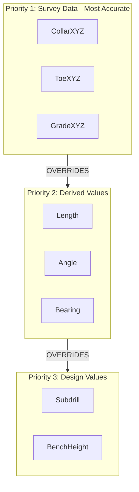

# Dialog Modernization and CSV Import Geometry Fix Plan

## Overview

This plan covers two related tasks:

1. **Surface Assignment Dialogs** - Convert to FloatingDialog with enhanced Grade mode
2. **CSV Import Geometry Conflicts** - Implement priority-based calculation to resolve conflicting data

---

## Part A: Surface Assignment Dialog Modernization

### Current State

- **Location**: [`src/kirra.js`](src/kirra.js) lines 35231-35652
- **Issue**: Uses 8x Swal.fire() calls across both tools
- **Helper functions**: `assignHoleToSurfaceElevation()` (line 35186), `assignHolesToFixedElevation()` (line 35563)

### Enhanced Grade Dialog Design

The Grade assignment dialog will use radio buttons with calculation descriptions:

```javascript
+--------------------------------------------------+
|  Assign Grade Elevation                          |
+--------------------------------------------------+
|                                                  |
|  Assignment Mode:                                |
|                                                  |
|  (*) Assign TOE Elevation                        |
|      > Calculates: GradeZ = ToeZ + Subdrill      |
|      > Recalculates: Length, GradeXYZ            |
|                                                  |
|  ( ) Assign GRADE Elevation                      |
|      > Calculates: ToeZ = GradeZ - Subdrill      |
|      > Recalculates: Length, ToeXYZ              |
|                                                  |
|  Elevation (mZ):  [_274.0_]                      |
|                                                  |
|             [Cancel]  [Apply]                    |
+--------------------------------------------------+
```


### Implementation

**Create**: [`src/dialog/popups/generic/SurfaceAssignmentDialogs.js`](src/dialog/popups/generic/SurfaceAssignmentDialogs.js)Key functions:

1. `showAssignCollarDialog(onConfirm)` - Manual collar elevation entry
2. `showAssignGradeDialog(onConfirm)` - Enhanced with radio mode selector
3. `showSurfaceSelectDialog(surfaces, onSelect)` - Multi-surface picker
4. `showAssignmentCompleteDialog(count, targetName, type)` - Success message
5. Move `assignHoleToSurfaceElevation()` and `assignHolesToFixedElevation()` to this file

**Calculation Logic for Assign Grade modes:**| Mode | Input | Calculates | Formula ||------|-------|------------|---------|| Assign Toe | ToeZ elevation | GradeZ, Length | GradeZ = CollarZ - BenchHeight; ToeZ is input || Assign Grade | GradeZ elevation | ToeZ, Length | ToeZ = GradeZ - Subdrill/cos(angle) |---

## Part B: CSV Import Geometry Conflict Resolution

### Problem Statement

When importing CSV with **both** coordinates (CollarXYZ, ToeXYZ, GradeXYZ) **and** design parameters (Length, Angle, Bearing, Subdrill), conflicts arise:

- Imported coordinates may not match Length/Angle/Bearing values
- Current code at line 28269 does nothing when both exist
- User expects coordinates to take priority (most accurate data)

### Geometry Priority Hierarchy

Based on accuracy (from README.md):




### Conflict Resolution Strategy

| Has CollarXYZ | Has ToeXYZ | Has GradeXYZ | Has L/A/B | Action ||--------------|-----------|-------------|----------|--------|| Yes | Yes | Yes | Yes | **IGNORE L/A/B** - Calculate from coordinates || Yes | Yes | No | Yes | **IGNORE L/A/B** - Calculate from CollarXYZ+ToeXYZ, derive GradeXYZ || Yes | No | Yes | Yes | **IGNORE L/A/B** - Calculate from CollarXYZ+GradeXYZ, derive ToeXYZ || Yes | No | No | Yes | Use L/A/B to calculate ToeXYZ, GradeXYZ || Yes | Yes | Yes | No | Calculate L/A/B from coordinates |

### Implementation

**Modify**: [`src/kirra.js`](src/kirra.js) function `calculateMissingGeometry()` at line 28195

```javascript
function calculateMissingGeometry(hole) {
    // Step 1) Determine what data we have
    var hasCollarXYZ = isValidCoord(hole.startXLocation) && 
                       isValidCoord(hole.startYLocation) && 
                       isValidCoord(hole.startZLocation);
    var hasToeXYZ = isValidCoord(hole.endXLocation) && 
                    isValidCoord(hole.endYLocation) && 
                    isValidCoord(hole.endZLocation) &&
                    coordsDiffer(hole, "end");
    var hasGradeXYZ = isValidCoord(hole.gradeXLocation) && 
                      isValidCoord(hole.gradeYLocation) && 
                      isValidCoord(hole.gradeZLocation) &&
                      coordsDiffer(hole, "grade");
    var hasLAB = hole.holeLengthCalculated > 0 || 
                 hole.holeAngle !== 0 || 
                 hole.holeBearing !== 0;
    
    // Step 2) PRIORITY RESOLUTION - Coordinates take precedence
    if (hasCollarXYZ && hasToeXYZ) {
        // PRIORITY 1: Survey coordinates exist - IGNORE imported L/A/B
        calculateFromCoordinates(hole);
        if (!hasGradeXYZ) {
            calculateGradeFromSubdrill(hole);
        }
        return;
    }
    
    if (hasCollarXYZ && hasGradeXYZ && !hasToeXYZ) {
        // PRIORITY 2: CollarXYZ + GradeXYZ - Calculate ToeXYZ from subdrill
        calculateToeFromGradeAndSubdrill(hole);
        calculateFromCoordinates(hole);
        return;
    }
    
    // Step 3) Fall back to design parameters (existing logic)
    // ... existing code for L/A/B calculation
}
```

**Add helper functions:**

```javascript
// Step 4) Calculate Length, Angle, Bearing from CollarXYZ and ToeXYZ
function calculateFromCoordinates(hole) {
    var dx = hole.endXLocation - hole.startXLocation;
    var dy = hole.endYLocation - hole.startYLocation;
    var dz = hole.startZLocation - hole.endZLocation; // positive = down
    
    hole.holeLengthCalculated = Math.sqrt(dx*dx + dy*dy + dz*dz);
    
    // Bearing: 0=North, 90=East (clockwise)
    var bearing = Math.atan2(dx, dy) * (180 / Math.PI);
    if (bearing < 0) bearing += 360;
    hole.holeBearing = bearing;
    
    // Angle: 0=vertical, 90=horizontal
    var horizontalDist = Math.sqrt(dx*dx + dy*dy);
    hole.holeAngle = Math.atan2(horizontalDist, dz) * (180 / Math.PI);
    
    // BenchHeight and Subdrill from GradeZ
    if (isValidCoord(hole.gradeZLocation)) {
        hole.benchHeight = hole.startZLocation - hole.gradeZLocation;
        hole.subdrillAmount = hole.gradeZLocation - hole.endZLocation;
    }
}
```


### UI Warning (Optional Enhancement)

Add visual indicator in CSV Import dialog when conflicts are detected:

```javascript
Column Mapping
--------------
ToeX: [Column 5] 
ToeY: [Column 6]
ToeZ: [Column 7]
Length: [Column 8]  ⚠️ Ignored - ToeXYZ takes priority
Angle: [Column 9]   ⚠️ Ignored - ToeXYZ takes priority
```

---

## Files to Modify

| File | Action | Description ||------|--------|-------------|| `src/dialog/popups/generic/SurfaceAssignmentDialogs.js` | CREATE | New dialog file (~300 lines) || `src/kirra.js` | MODIFY | Lines 35231-35652 (replace Swal with FloatingDialog calls) || `src/kirra.js` | MODIFY | Lines 28195-28282 (calculateMissingGeometry priority logic) || `kirra.html` | MODIFY | Add script tag for new dialog file || `src/aiCommentary/` | CREATE | Documentation of changes |---

## Coding Standards Compliance

- No template literals - string concatenation only ("text " + var)
- Step comments (// Step 1), 2), etc.)
- Use Factory code: `window.createEnhancedFormContent()`, `window.FloatingDialog`
- Expose functions via `window.functionName = functionName`
- No ES6 exports

---

## Testing Checklist

### Surface Assignment Dialogs

- [ ] Assign Collar - manual elevation (no surface)
- [ ] Assign Collar - single surface auto-assign
- [ ] Assign Collar - multiple surface selection
- [ ] Assign Grade - Assign Toe mode (calculate GradeZ)
- [ ] Assign Grade - Assign Grade mode (calculate ToeZ)
- [ ] Verify radio buttons work with descriptions
- [ ] Success message dialogs display

### CSV Import Geometry

- [ ] Import CollarXYZ + ToeXYZ only - verify L/A/B calculated
- [ ] Import CollarXYZ + ToeXYZ + GradeXYZ - verify Subdrill/BenchHeight calculated