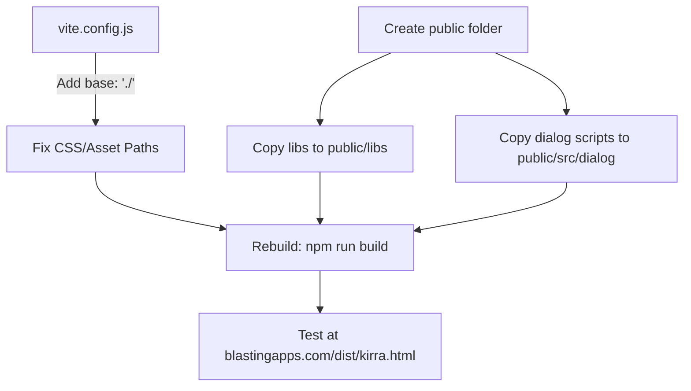

# Fix Kirra Vite Build Deployment

## Root Cause Analysis

The build is broken due to three main issues:

### Issue 1: CSS and Asset Path Resolution (Absolute vs Relative Paths)

- The built `dist/kirra.html` references CSS as `/assets/main-DpZd0ikW.css` (absolute path starting with `/`)
- On your server at `blastingapps.com/dist/kirra.html`, this resolves to `blastingapps.com/assets/...` instead of `blastingapps.com/dist/assets/...`
- This is why CSS is not loading and icons appear unstyled/oversized (no CSS `button img { width: 24px; }` rule)

**Fix:** Add `base: './'` to [vite.config.js](vite.config.js) to use relative paths instead of absolute paths.

### Issue 2: External Script Tags Not Bundled

- Your `kirra.html` includes 15 script tags loading external JS files via `<script src="src/dialog/...">` 
- Vite only bundles ES module imports, not traditional script tags
- These files (like `HolesContextMenu.js`, `KADContextMenu.js`, etc.) are NOT copied to dist and return 404 errors

**Fix:** Either convert these to ES module imports, or copy them to dist as static assets.

### Issue 3: `libs/` Folder Not Copied

- `libs/jscolor.min.js` and `libs/d3.min.js` are loaded via script tags
- Without a `public/` folder, Vite doesn't copy these to dist
- Network requests show they're currently loading (status 200) because they exist at `dist/libs/` from a previous manual copy, but this isn't automated

**Fix:** Create a `public/` folder with the `libs/` directory, or configure Vite to copy static assets.

## Recommended Solution

### Option A: Minimal Fix (Recommended for quick deployment)

1. **Set relative base path** - Add `base: './'` to vite.config.js
2. **Create public folder** with:

- `libs/jscolor.min.js`
- `libs/d3.min.js`  
- `src/dialog/` folder (all 15 JS files)

3. **Update HTML script paths** to remove the `src/` prefix since public files are copied to dist root

### Option B: Full Module Refactor (Better long-term)

1. **Set relative base path** - Add `base: './'` to vite.config.js
2. **Convert all script tags to ES module imports** in kirra.js
3. **Create public folder** for only `libs/` (jscolor, d3)

---

## Implementation Plan

