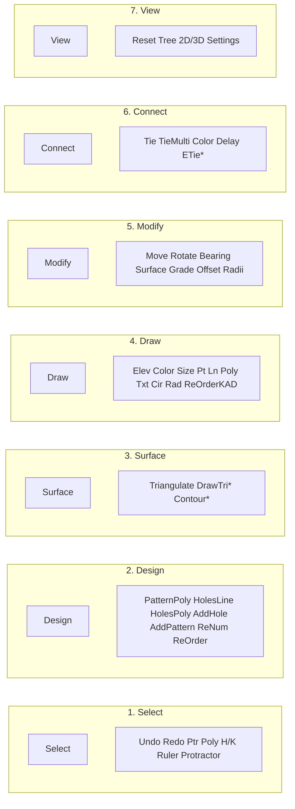

# Floating Toolbar Redesign Plan

## Current state

- **Structure**: Single panel `[#toolbarPanel](D:\GIT_WORKSPACE\GIT_KIRRA-2D-3D\Kirra2D\kirra.html)` (class `tree-panel toolbar-panel`) with one `[.toolbar-grid](D:\GIT_WORKSPACE\GIT_KIRRA-2D-3D\Kirra2D\kirra.html)` inside `.toolbar-panel-content`.
- **Layout**: [kirra.css](D:\GIT_WORKSPACE\GIT_KIRRA-2D-3D\Kirra2D\src\kirra.css) lines 3114–3118, 3276–3284, 3410–3419 — `grid-template-columns: repeat(2, 1fr)`, `gap: 2px`, `padding: 0 4px`. Panel width 90px, resizable.
- **Behaviour**: [ToolbarPanel.js](D:\GIT_WORKSPACE\GIT_KIRRA-2D-3D\Kirra2D\src\toolbar\ToolbarPanel.js) handles one container: drag, collapse, position/collapse in localStorage, and `sidebar-open` offset. [kirra.js](D:\GIT_WORKSPACE\GIT_KIRRA-2D-3D\Kirra2D\src\kirra.js) uses `getElementById("toolbarPanel")` and `#toolbarPanel #connectLabel`; tool state is driven by global element IDs (e.g. `selectPointerTool`, `holesAddingTool`); `[resetFloatingToolbarButtons](D:\GIT_WORKSPACE\GIT_KIRRA-2D-3D\Kirra2D\src\kirra.js)` (lines 4916–5048) unchecks by those IDs.
- **Tool groups in one list**: Undo/Redo, Select (pointer, polygon, Holes/KAD), Create (pattern, holes along line/polyline, add holes), Surface (triangulate), Draw (elevation, color, size, points, line, polygon, text, circle, radius), Modify (move, bearing, assign surface/grade, offset, radii), Connect (tie single/multi, color, delay), Measure (ruler, protractor), View (reset, tree, 2D/3D, settings).

## Decision: 7-Panel Split (Workflow-Oriented)

Based on user requirements, the toolbar will be split into **7 separate floating panels** organized by workflow stage:

| Panel | ID | Tools | Notes |
|-------|-----|-------|-------|
| **1. Select** | `toolbarPanelSelect` | Undo, Redo, Pointer Select, Polygon Select, Holes/KAD toggle, Ruler, Protractor | Core selection & measurement |
| **2. Design** | `toolbarPanelDesign` | Pattern in Polygon, Holes on Line, Holes along Polyline, Add Hole, Add Pattern, Renumber Holes, Reorder Rows | Blast pattern creation & organization |
| **3. Surface** | `toolbarPanelSurface` | Surface Create (triangulate), *DrawTriangle (FUTURE)*, *ContourSurface (FUTURE)* | Surface tools - placeholder for future |
| **4. Draw** | `toolbarPanelDraw` | Elevation, Color picker, Line size, Points, Line, Polygon, Text, Circle, Radius, Reorder KAD | KAD drawing tools |
| **5. Modify** | `toolbarPanelModify` | Move, Rotate, Bearing, Assign Surface, Assign Grade, Offset, Radii | Transform & assignment tools |
| **6. Connect** | `toolbarPanelConnect` | Single Tie, Multi Tie, Connector Color, Delay input, *ElectronicTieTools (FUTURE)* | Timing & connection tools |
| **7. View** | `toolbarPanelView` | Reset View, Tree toggle, 2D/3D toggle, Settings | Display controls |

*Items marked (FUTURE) are placeholders for tools to be implemented later.*

---

## Layout Diagram (7-Panel Split)



*Items with asterisk (*) are future implementations.*

Each panel has the same internal structure (header + `.toolbar-grid`) and can be dragged/collapsed independently.

---

## ASCII Mockups (7-Panel Layout)

### Panel 1 – Select
```
+---------------------+
| Select            − |
+---------------------+
| ↺ Undo | ⟳ Redo     |
| ⊙ Ptr  | ⊞ Poly     |
| [Holes] | [KAD]     |
| 📏 Ruler | ∡ Protr  |
+---------------------+
```

### Panel 2 – Design
```
+---------------------+
| Design            − |
+---------------------+
| ⬡ PatPoly | ┈─ Line |
| ┈── Poly  | +○ Add  |
| ⊞ Pattern           |
| #  ReNum  | ⇅ ReOrd |
+---------------------+
```

### Panel 3 – Surface
```
+---------------------+
| Surface           − |
+---------------------+
| △ Triangulate       |
| ▲ DrawTri*          |
| ◎ Contour*          |
+---------------------+
```
*(Future tools)*

### Panel 4 – Draw
```
+---------------------+
| Draw              − |
+---------------------+
| Z Elev  | [■] Color |
| [1] Size            |
| •  ╱  ▢  A  ○  ⭕   |
| [radius]            |
| ⇅ ReOrder KAD       |
+---------------------+
```

### Panel 5 – Modify
```
+---------------------+
| Modify            − |
+---------------------+
| ⇄ Move  | ↻ Rotate  |
| ∠ Bearing           |
| ↑ Surface | ↓ Grade |
| ⊕ Offset | ◎ Radii  |
+---------------------+
```

### Panel 6 – Connect
```
+---------------------+
| Connect           − |
+---------------------+
| ⟷ Tie   | ⟷⟷ Multi  |
| [■] Color | [25] ms |
| ⚡ E-Tie*            |
+---------------------+
```
*(Future tools)*

### Panel 7 – View
```
+---------------------+
| View              − |
+---------------------+
| ⟳ Reset  | ≡ Tree   |
| [2D/3D]  | ⚙ Settings|
+---------------------+
```

Each panel is a separate draggable window; user can position them independently. Positions saved to localStorage per panel.

---

## Implementation Plan

### Phase 1: HTML Structure ([kirra.html](D:\GIT_WORKSPACE\GIT_KIRRA-2D-3D\Kirra2D\kirra.html))

Replace the single `#toolbarPanel` with 7 panels:

```html
<!-- Panel 1: Select -->
<div id="toolbarPanelSelect" class="tree-panel toolbar-panel">
  <div class="tree-panel-header">Select<span class="collapse-btn">−</span></div>
  <div class="tree-panel-content toolbar-panel-content">
    <div class="toolbar-grid">
      <!-- Undo, Redo, Pointer, Polygon, Holes/KAD, Ruler, Protractor -->
    </div>
  </div>
</div>

<!-- Panel 2: Design -->
<div id="toolbarPanelDesign" class="tree-panel toolbar-panel">...</div>

<!-- Panel 3: Surface -->
<div id="toolbarPanelSurface" class="tree-panel toolbar-panel">...</div>

<!-- Panel 4: Draw -->
<div id="toolbarPanelDraw" class="tree-panel toolbar-panel">...</div>

<!-- Panel 5: Modify -->
<div id="toolbarPanelModify" class="tree-panel toolbar-panel">...</div>

<!-- Panel 6: Connect -->
<div id="toolbarPanelConnect" class="tree-panel toolbar-panel">...</div>

<!-- Panel 7: View -->
<div id="toolbarPanelView" class="tree-panel toolbar-panel">...</div>
```

**Key rule**: All tool `id` attributes remain unchanged (e.g., `selectPointerTool`, `holesAddingTool`). Each ID appears once in the document.

### Phase 2: ToolbarPanel.js Updates

```javascript
// Create array of panel instances
const toolbarPanels = [
  new ToolbarPanel('toolbarPanelSelect', { defaultTop: 60, defaultLeft: 10 }),
  new ToolbarPanel('toolbarPanelDesign', { defaultTop: 60, defaultLeft: 120 }),
  new ToolbarPanel('toolbarPanelSurface', { defaultTop: 60, defaultLeft: 230 }),
  new ToolbarPanel('toolbarPanelDraw', { defaultTop: 200, defaultLeft: 10 }),
  new ToolbarPanel('toolbarPanelModify', { defaultTop: 200, defaultLeft: 120 }),
  new ToolbarPanel('toolbarPanelConnect', { defaultTop: 200, defaultLeft: 230 }),
  new ToolbarPanel('toolbarPanelView', { defaultTop: 340, defaultLeft: 10 }),
];

// Update sidebar state for all panels
function updateAllToolbarsSidebarState(sidebarOpen) {
  toolbarPanels.forEach(panel => panel.updateSidebarState(sidebarOpen));
}
```

Each panel stores its position independently:
- `kirra-toolbar-position-select`
- `kirra-toolbar-position-design`
- etc.

### Phase 3: CSS Updates ([kirra.css](D:\GIT_WORKSPACE\GIT_KIRRA-2D-3D\Kirra2D\src\kirra.css))

**Panel Header:**
```css
.toolbar-panel .tree-panel-header {
  height: 60px;        /* Taller header for easier dragging */
  min-height: 60px;
}
```

**Tool Button Spacing:**
```css
.toolbar-grid {
  gap: 2px;            /* 2-4px separation between buttons */
  padding: 2px;
}
```

**Additional:**
- Reuse existing `.toolbar-panel`, `.toolbar-grid` styles
- Add default staggered positions so panels don't overlap on first load
- Consider smaller panel widths (~90px) since each panel has fewer tools

### Phase 4: kirra.js Updates

Replace references to single `toolbarPanel`:
- Line ~33979-34011: `toolbarPanel.updateSidebarState` → `updateAllToolbarsSidebarState`
- `resetFloatingToolbarButtons` remains unchanged (tool IDs are the same)

### New Tools to Wire Up

| Tool | Panel | Function | Status |
|------|-------|----------|--------|
| Renumber Holes | Design | `renumberHolesFunction()` | Exists in HoleEditingTools.js |
| Reorder Rows | Design | `reorderBlastHoleRows()` | Exists in RowEditingTools.js |
| Reorder KAD | Draw | `reorderKadPoints()` | Exists in RowEditingTools.js |
| Rotate (KAD) | Modify | Enhance existing rotate tool | Needs implementation |
| DrawTriangle | Surface | Draw triangle on surface | FUTURE |
| ContourSurface | Surface | Generate contour lines | FUTURE |
| Electronic Tie | Connect | E-det timing tools | FUTURE |

---

## Default Panel Positions

Panels arranged in a 3x3 grid layout (approximate):

```
+----------+----------+----------+
|  Select  |  Design  | Surface  |
+----------+----------+----------+
|   Draw   |  Modify  | Connect  |
+----------+----------+----------+
|   View   |          |          |
+----------+----------+----------+
```

User can drag any panel anywhere; positions persist via localStorage.

---

## Phase 5: Dockable Toolbars

### 5A: Edge Snapping

Panels snap to screen edges when dragged within a threshold (e.g., 20px).

**Snap Zones:**
```
+--[TOP EDGE - snap zone]------------------+
|                                          |
[L]                                      [R]
[E]        (canvas area)                 [I]
[F]                                      [G]
[T]                                      [H]
|                                        [T]
+--[BOTTOM EDGE - snap zone]---------------+
```

**Implementation (ToolbarPanel.js):**

```javascript
// Constants
const SNAP_THRESHOLD = 20;  // pixels from edge to trigger snap

// In drag handler
function handleDrag(e) {
  const rect = container.getBoundingClientRect();
  const viewportWidth = window.innerWidth;
  const viewportHeight = window.innerHeight;

  let snapX = null, snapY = null;

  // Edge detection
  if (e.clientX < SNAP_THRESHOLD) snapX = 0;                          // Left edge
  if (e.clientX > viewportWidth - SNAP_THRESHOLD) snapX = viewportWidth - rect.width;  // Right edge
  if (e.clientY < SNAP_THRESHOLD) snapY = 0;                          // Top edge
  if (e.clientY > viewportHeight - SNAP_THRESHOLD) snapY = viewportHeight - rect.height; // Bottom edge

  // Apply snap or free position
  container.style.left = (snapX !== null ? snapX : e.clientX - offsetX) + 'px';
  container.style.top = (snapY !== null ? snapY : e.clientY - offsetY) + 'px';

  // Store docked state
  this.dockedEdge = (snapX !== null || snapY !== null) ? { x: snapX, y: snapY } : null;
}
```

**Visual Feedback:**
- Show highlight/guide line when near snap zone
- Optional: slight "magnetism" feel as panel approaches edge

---

### 5B: Panel-to-Panel Snapping

Panels snap together when dragged near each other, forming groups.

**Snap Positions:**
```
+--------+--------+
| Panel1 | Panel2 |  ← Horizontal snap (right edge of 1 to left edge of 2)
+--------+--------+

+--------+
| Panel1 |
+--------+
| Panel2 |  ← Vertical snap (bottom edge of 1 to top edge of 2)
+--------+
```

**Implementation (ToolbarPanel.js):**

```javascript
const PANEL_SNAP_THRESHOLD = 15;  // pixels between panels to trigger snap

function findNearbyPanels(currentPanel, allPanels) {
  const currentRect = currentPanel.getBoundingClientRect();
  const snapTargets = [];

  allPanels.forEach(panel => {
    if (panel === currentPanel) return;
    const targetRect = panel.getBoundingClientRect();

    // Check right edge → left edge (horizontal snap)
    if (Math.abs(currentRect.right - targetRect.left) < PANEL_SNAP_THRESHOLD &&
        overlapsVertically(currentRect, targetRect)) {
      snapTargets.push({ panel, side: 'right', x: targetRect.left - currentRect.width });
    }

    // Check left edge → right edge
    if (Math.abs(currentRect.left - targetRect.right) < PANEL_SNAP_THRESHOLD &&
        overlapsVertically(currentRect, targetRect)) {
      snapTargets.push({ panel, side: 'left', x: targetRect.right });
    }

    // Check bottom edge → top edge (vertical snap)
    if (Math.abs(currentRect.bottom - targetRect.top) < PANEL_SNAP_THRESHOLD &&
        overlapsHorizontally(currentRect, targetRect)) {
      snapTargets.push({ panel, side: 'bottom', y: targetRect.top - currentRect.height });
    }

    // Check top edge → bottom edge
    if (Math.abs(currentRect.top - targetRect.bottom) < PANEL_SNAP_THRESHOLD &&
        overlapsHorizontally(currentRect, targetRect)) {
      snapTargets.push({ panel, side: 'top', y: targetRect.bottom });
    }
  });

  return snapTargets;
}

function overlapsVertically(rect1, rect2) {
  return rect1.bottom > rect2.top && rect1.top < rect2.bottom;
}

function overlapsHorizontally(rect1, rect2) {
  return rect1.right > rect2.left && rect1.left < rect2.right;
}
```

**Snapped Panel Groups:**
```javascript
// Track which panels are snapped together
const panelGroups = new Map();  // panelId -> groupId

// When panels snap together
function createGroup(panel1, panel2) {
  const groupId = panel1.id + '_' + panel2.id;
  panelGroups.set(panel1.id, groupId);
  panelGroups.set(panel2.id, groupId);
}

// Optional: Move group together when dragging header of first panel
function dragGroup(groupId, deltaX, deltaY) {
  panelGroups.forEach((gId, panelId) => {
    if (gId === groupId) {
      const panel = document.getElementById(panelId);
      panel.style.left = (parseInt(panel.style.left) + deltaX) + 'px';
      panel.style.top = (parseInt(panel.style.top) + deltaY) + 'px';
    }
  });
}
```

**Visual Feedback:**
- Show snap guide lines when panels are close
- Highlight target panel edge during drag
- Optional: subtle animation when snapping

---

### 5C: localStorage Persistence

Save docked/snapped state:

```javascript
// Save state
function saveToolbarState(panelId) {
  const state = {
    left: parseInt(container.style.left),
    top: parseInt(container.style.top),
    collapsed: isCollapsed,
    dockedEdge: this.dockedEdge,        // { x, y } or null
    snappedTo: this.snappedTo           // { panelId, side } or null
  };
  localStorage.setItem(`kirra-toolbar-${panelId}`, JSON.stringify(state));
}

// Restore state on load
function restoreToolbarState(panelId) {
  const state = JSON.parse(localStorage.getItem(`kirra-toolbar-${panelId}`));
  if (state) {
    container.style.left = state.left + 'px';
    container.style.top = state.top + 'px';
    if (state.collapsed) collapse();
    this.dockedEdge = state.dockedEdge;
    this.snappedTo = state.snappedTo;
  }
}
```

---

### Docking Summary

| Feature | Description | User Benefit |
|---------|-------------|--------------|
| Edge Snap | Panels snap to screen edges | Clean alignment, maximize canvas |
| Panel-to-Panel | Panels snap together | Group related tools, organized workspace |
| Group Drag | Move snapped panels together | Efficient repositioning |
| Persistence | Remember docked positions | Consistent workspace across sessions |

**Default Layout (docked):**
```
+--[TOP]----------------------------------+
| +--------+--------+--------+            |
| | Select | Design | Surface| (docked)   |
| +--------+--------+--------+            |
|                                         |
| +------+                    +--------+  |
| | Draw |                    | View   |  |
| +------+                    +--------+  |
| |Modify|                    (docked R)  |
| +------+                                |
| |Connect                                |
| +------+                                |
| (docked L)                              |
+-----------------------------------------+
```

---

## Notes

- No change to tool behaviour or to the rule "Use FloatingDialog for dialogs"
- Tool IDs must remain unique across all panels
- Future tools marked with asterisk (*) are placeholders - add empty buttons with disabled state or omit until implementation
- Docking is optional per panel - user can undock by dragging away from edge/group