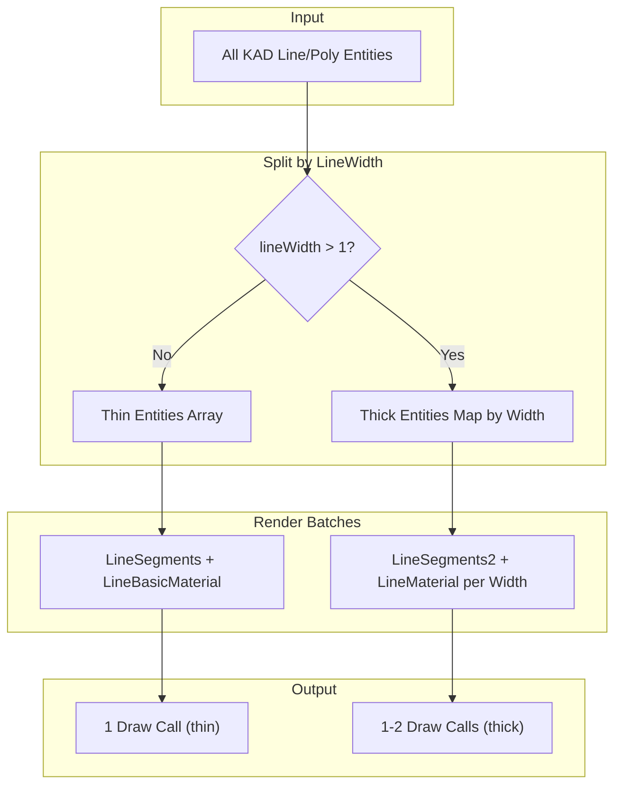

# Hybrid Fat Lines Implementation

## Architecture




## Files to Modify

1. **[src/three/GeometryFactory.js](src/three/GeometryFactory.js)** - Add hybrid method and fat lines imports
2. **[src/kirra.js](src/kirra.js)** - Update super-batch call and add resize handler

## Implementation Steps

### Step 1: Add Fat Line Imports to GeometryFactory.js

Add Three.js fat line imports at top of file (around line 5):

```javascript
import { LineSegments2 } from "three/examples/jsm/lines/LineSegments2.js";
import { LineSegmentsGeometry } from "three/examples/jsm/lines/LineSegmentsGeometry.js";
import { LineMaterial } from "three/examples/jsm/lines/LineMaterial.js";
```


### Step 2: Add Hybrid Super-Batch Method to GeometryFactory.js

Create new method `createHybridSuperBatchedLines()` after existing `createSuperBatchedLines()` (around line 615):

- Split entities into thin (lineWidth <= 1) and thick (lineWidth > 1) groups
- Thin lines use existing `THREE.LineSegments` + `LineBasicMaterial` logic
- Thick lines use `LineSegments2` + `LineMaterial` grouped by lineWidth
- Return object with: `{ thinLineSegments, fatLinesByWidth, entityRanges }`

### Step 3: Update kirra.js Super-Batch Call

Replace current call at line 22837:

```javascript
// Before
var superBatch = GeometryFactory.createSuperBatchedLines(linePolyEntities, worldToThreeLocal);

// After
var resolution = new THREE.Vector2(window.innerWidth, window.innerHeight);
var superBatch = GeometryFactory.createHybridSuperBatchedLines(linePolyEntities, worldToThreeLocal, resolution);
```

Update the result handling to add both thin and thick batches to kadGroup.

### Step 4: Add Resolution Resize Handler

Add resize event listener in kirra.js (in the Three.js initialization section) to update LineMaterial resolution:

```javascript
window.addEventListener("resize", function() {
    // Update fat line materials resolution
    if (window.threeRenderer && window.threeRenderer.kadGroup) {
        var res = new THREE.Vector2(window.innerWidth, window.innerHeight);
        window.threeRenderer.kadGroup.traverse(function(child) {
            if (child.material && child.material.isLineMaterial) {
                child.material.resolution.copy(res);
            }
        });
    }
});
```


## Expected Result

| Scenario | Draw Calls ||----------|-----------|| All lines lineWidth=1 | 1 (LineBasicMaterial) || 99% thin, 1% thick (width=2) | 2 (1 thin + 1 fat) |