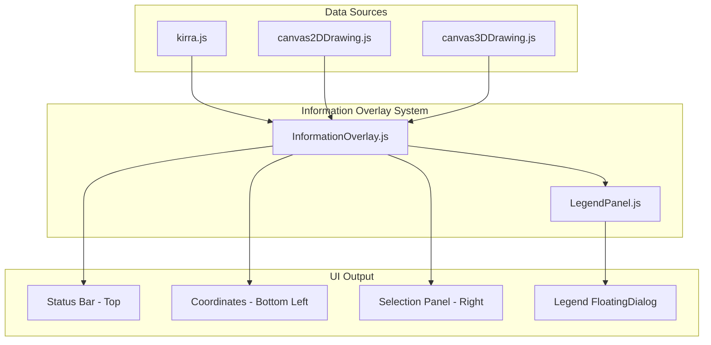

# Information Overlay System Plan

## Problem Statement

Currently, UI text information is rendered in multiple ways:

- 3D scene: `drawToolPromptThreeJS()` renders verbose text sprites that look bad and clutter the scene
- 2D canvas: Direct `ctx.fillText()` calls for legends, measurements, and status (only visible in 2D mode)
- No unified system for coordinates, selections, or status messages

## Architecture Overview




## File Structure

```javascript
src/
├── ui/                           (NEW FOLDER)
│   ├── InformationOverlay.js     (NEW - Main overlay system)
│   └── LegendPanel.js            (NEW - FloatingDialog-based legends)
├── dialog/
│   └── FloatingDialog.js         (EXISTING - Extended for legends)
├── kirra.js                      (MODIFY - Integration)
└── kirra.css                     (MODIFY - Add overlay styles)
```


## Implementation Details

### Phase 1: Create InformationOverlay Module

Create [`src/ui/InformationOverlay.js`](src/ui/InformationOverlay.js):Key exports:

- `initInformationOverlay()` - Creates DOM structure
- `updateOverlayStatus(message, type)` - Replaces `updateStatusMessage()`
- `updateOverlayCoordinates(worldX, worldY, worldZ)` - Mouse/world position
- `updateOverlaySelection(holes, kadObjects, connectorInfo)` - Selection info
- `clearInformationOverlay()` - Reset all panels

DOM Structure to create:

```html
<div id="information-overlay" class="information-overlay">
    <div id="overlay-status" class="overlay-panel overlay-status"></div>
    <div id="overlay-coordinates" class="overlay-panel overlay-coordinates"></div>
    <div id="overlay-selection" class="overlay-panel overlay-selection"></div>
</div>
```


### Phase 2: Create LegendPanel Module

Create [`src/ui/LegendPanel.js`](src/ui/LegendPanel.js):Uses existing [FloatingDialog](src/dialog/FloatingDialog.js) pattern for:

- Draggable, closable legend window
- Collapsible sections for each legend type
- Auto-show/hide based on active features

Legend types to support:

1. Slope Legend (from `drawLegend()` at line 20459)
2. Relief Legend (from `drawReliefLegend()` at line 15293)
3. Voronoi Legend (from `drawVoronoiLegendAndCells()` at line 22115)
4. Surface Legend (from `drawSurfaceLegend()` at line 34501)

### Phase 3: CSS Styling

Add to [`src/kirra.css`](src/kirra.css):

```css
.information-overlay {
    position: absolute;
    top: 0;
    left: 0;
    width: 100%;
    height: 100%;
    pointer-events: none;
    z-index: 100;
}

.overlay-panel {
    position: absolute;
    background: rgba(0, 0, 0, 0.75);
    color: #ffffff;
    padding: 8px 12px;
    border-radius: 4px;
    pointer-events: auto;
    display: none;
}

.overlay-status { top: 10px; left: 50%; transform: translateX(-50%); }
.overlay-coordinates { bottom: 10px; left: 10px; font-family: monospace; }
.overlay-selection { top: 50%; right: 10px; transform: translateY(-50%); }
```


### Phase 4: Integration in kirra.js

Modifications to [`src/kirra.js`](src/kirra.js):

1. Import new modules (around line 144):
```javascript
import { initInformationOverlay, updateOverlayStatus, updateOverlayCoordinates, updateOverlaySelection, clearInformationOverlay } from "./ui/InformationOverlay.js";
import { showLegendPanel, hideLegendPanel, updateLegendData } from "./ui/LegendPanel.js";
```


2. Initialize overlay on startup (in init function)
3. Replace `updateStatusMessage()` (line 31743) calls with `updateOverlayStatus()`
4. Replace `drawToolPromptThreeJS()` calls (lines 21881-21900) with `updateOverlaySelection()`
5. Call `updateOverlayCoordinates()` in mouse move handlers
6. Call legend functions when display options change:

- `displayOptions.slopeMap` -> show slope legend
- `displayOptions.burdenRelief` -> show relief legend
- `displayOptions.voronoiPF` -> show voronoi legend
- Surface visibility -> show surface legend

### Phase 5: Remove/Deprecate Canvas Legend Drawing

Comment out or remove:

- `drawLegend()` function (lines 20459-20503)
- `drawReliefLegend()` function (lines 15293-15351)
- Canvas legend calls in `drawVoronoiLegendAndCells()` (keep cell drawing)
- `drawSurfaceLegend()` function (lines 34501-34600)

### Phase 6: Remove 3D Tool Prompts

In [`src/draw/canvas3DDrawing.js`](src/draw/canvas3DDrawing.js):

- Remove or deprecate `drawToolPromptThreeJS()` function (lines 739-781)
- Update TODO comment at line 738 to mark as complete

## Migration Mapping

| Current Function | New Function | Notes |

|-----------------|--------------|-------|

| `updateStatusMessage()` | `updateOverlayStatus()` | 216 call sites |

| `drawToolPromptThreeJS()` | `updateOverlaySelection()` | 5 call sites |

| `drawLegend()` | `showLegendPanel()` | Slope legend |

| `drawReliefLegend()` | `showLegendPanel()` | Relief legend |

| `drawVoronoiLegendAndCells()` legend part | `showLegendPanel()` | Keep cell drawing |

| `drawSurfaceLegend()` | `showLegendPanel()` | Surface legend |

## Behavior Rules

1. Status messages auto-clear after timeout (configurable)
2. Selection panel shows only when items selected, hides on ESC
3. Coordinates update on mouse move (throttled for performance)
4. Legend panel auto-shows when feature activated, can be manually closed
5. All panels respect dark mode via CSS classes
6. Overlay works identically in 2D and 3D modes

## Testing Checklist

- [ ] Status messages appear and auto-clear
- [ ] Coordinates update on mouse move in both modes
- [ ] Selection panel shows holes and KAD objects
- [ ] Connector info shows during connection mode
- [ ] Each legend type displays correctly
- [ ] Legend panel is draggable and closable
- [ ] Dark mode styling works
- [ ] 3D mode no longer shows verbose text sprites