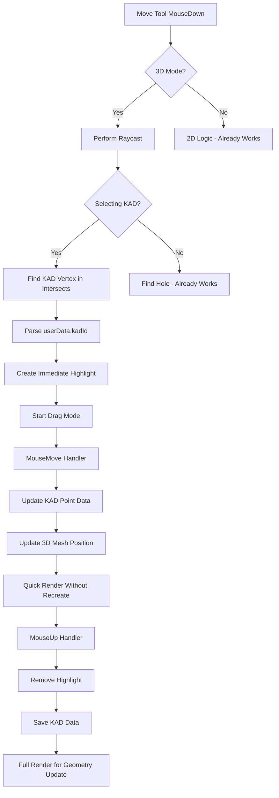

# KAD Move Tool 3D Implementation

## Problem Analysis

### Current State - What Works

- **2D KAD Move**: Fully functional with snapping, highlighting, and data updates
- **3D Hole Move**: Fully functional with immediate highlights and real-time position updates
- **3D Partial KAD**: Mousedown handler exists but incomplete

### Current State - What's Broken

1. **kadId Mismatch**: KAD points drawn with kadId="entityName" but Move Tool expects "entityName:::vertexIndex"
2. **No Immediate Highlight**: 3D KAD selection calls renderThreeJS() which recreates ALL geometry (slow)
3. **No Real-time Visual Update**: Mousemove updates data but doesn't move the 3D visual
4. **No Multiple Selection**: Can't select/move multiple KAD points together

## Architecture Overview



## Implementation Plan

### Phase 1: Fix kadId Format in KAD Drawing

**File**: [`Kirra2D/src/kirra.js`](Kirra2D/src/kirra.js) lines ~23125-23190

**Change**: Update KAD drawing to include vertex index in kadId

```javascript
// Current (line 23129):
drawKADPointThreeJS(..., name); // kadId = "entityName"

// New:
const vertexIndex = entity.data.indexOf(pointData);
const kadId = name + ":::" + vertexIndex;
drawKADPointThreeJS(..., kadId); // kadId = "entityName:::0"
```

**Apply to**:

- Points: line 23129
- Line/Poly vertices: Need to add vertex markers (currently only segments drawn)
- Circles: line 23182
- Text: line 23188

### Phase 2: Create Immediate KAD Highlight Function

**File**: [`Kirra2D/src/draw/canvas3DDrawing.js`](Kirra2D/src/draw/canvas3DDrawing.js)

**Add new function** (after highlightSelectedHoleThreeJS):

```javascript
export function highlightSelectedKADPointThreeJS(kadObject, highlightType) {
    // Similar to highlightSelectedHoleThreeJS but for KAD vertices
    // Creates pink circle/tube highlight around KAD point
    // Stores userData: { type: "kadHighlight", kadId: "entity:::index" }
}
```

### Phase 3: Fix Move Tool 3D Mousedown - Add Immediate Highlight

**File**: [`Kirra2D/src/kirra.js`](Kirra2D/src/kirra.js) lines ~26343-26383

**Current**: Calls renderThreeJS() - slow, recreates everything

**Change to**:

```javascript
// Step 2e.1) Create highlight IMMEDIATELY (don't call renderThreeJS)
if (typeof highlightSelectedKADPointThreeJS === "function") {
    highlightSelectedKADPointThreeJS(selectedKADObject, "selected");
}

// Step 2e.2) Quick render to show highlight
if (threeRenderer && threeRenderer.renderer) {
    threeRenderer.renderer.render(threeRenderer.scene, threeRenderer.camera);
}
```

### Phase 4: Fix Move Tool 3D Mousemove - Real-time Visual Update

**File**: [`Kirra2D/src/kirra.js`](Kirra2D/src/kirra.js) lines ~26799-26832

**Problem**: Updates data but doesn't update 3D visual

**Solution**: Find KAD mesh/sprite and update its position

```javascript
// After updating data (line 26809):
// Step 4i.2) Update KAD visual in real-time (similar to holes)
const kadId = moveToolSelectedKAD.entityName + ":::" + moveToolSelectedKAD.elementIndex;

// Find the KAD point mesh in kadGroup
threeRenderer.kadGroup.children.forEach(function(child) {
    if (child.userData && child.userData.kadId === kadId) {
        // Calculate delta from initial position
        const originalLocal = worldToThreeLocal(moveToolSelectedKAD.initialX, moveToolSelectedKAD.initialY);
        const newLocal = worldToThreeLocal(worldX, worldY);
        const deltaLocalX = newLocal.x - originalLocal.x;
        const deltaLocalY = newLocal.y - originalLocal.y;
        
        // Move the mesh by delta
        child.position.set(deltaLocalX, deltaLocalY, 0);
    }
});

// Also move the highlight
threeRenderer.kadGroup.children.forEach(function(child) {
    if (child.userData && child.userData.type === "kadHighlight" && child.userData.kadId === kadId) {
        child.position.set(deltaLocalX, deltaLocalY, 0);
    }
});
```

### Phase 5: Fix Move Tool 3D Mouseup - Clean Highlight Removal

**File**: [`Kirra2D/src/kirra.js`](Kirra2D/src/kirra.js) lines ~26935-26982

**Add KAD highlight removal** (similar to hole highlights):

```javascript
// Step 7b.1) Remove KAD highlights if applicable
if (threeRenderer && threeRenderer.kadGroup) {
    const highlightsToRemove = [];
    threeRenderer.kadGroup.children.forEach(function(child) {
        if (child.userData && child.userData.type === "kadHighlight") {
            highlightsToRemove.push(child);
        }
    });
    highlightsToRemove.forEach(function(highlight) {
        threeRenderer.kadGroup.remove(highlight);
        if (highlight.geometry) highlight.geometry.dispose();
        if (highlight.material) highlight.material.dispose();
    });
}
```

### Phase 6: Multiple KAD Point Selection Support

**File**: [`Kirra2D/src/kirra.js`](Kirra2D/src/kirra.js)

**Add Shift+Click handling in Move Tool mousedown**:

```javascript
// In 3D KAD selection (after line 26343):
if (foundKAD) {
    // Check if Shift key held for multiple selection
    if (event.shiftKey && selectedMultipleKADObjects.length > 0) {
        // Add to existing selection
        const alreadySelected = selectedMultipleKADObjects.find(
            obj => obj.entityName === foundKAD.entityName && 
                   obj.elementIndex === foundKAD.elementIndex
        );
        
        if (!alreadySelected) {
            selectedMultipleKADObjects.push({
                entityName: foundKAD.entityName,
                elementIndex: foundKAD.elementIndex,
                // ... other properties
            });
        }
    } else {
        // Single selection - clear others
        selectedMultipleKADObjects = [{...}];
    }
}
```

### Phase 7: Move Multiple KAD Points Together

**File**: [`Kirra2D/src/kirra.js`](Kirra2D/src/kirra.js)

**Add support for dragInitialKADPositions** (similar to dragInitialPositions for holes):

```javascript
// In mousedown (line ~26388):
if (selectedMultipleKADObjects.length > 0) {
    dragInitialKADPositions = selectedMultipleKADObjects.map(obj => ({
        entityName: obj.entityName,
        elementIndex: obj.elementIndex,
        x: obj.pointXLocation,
        y: obj.pointYLocation,
        z: obj.pointZLocation
    }));
}

// In mousemove (line ~26799):
if (dragInitialKADPositions && dragInitialKADPositions.length > 0) {
    // Calculate delta from first KAD point
    const firstKAD = dragInitialKADPositions[0];
    const deltaX = worldX - firstKAD.x;
    const deltaY = worldY - firstKAD.y;
    
    // Move all KAD points by same delta
    dragInitialKADPositions.forEach(item => {
        const entity = allKADDrawingsMap.get(item.entityName);
        const newX = item.x + deltaX;
        const newY = item.y + deltaY;
        entity.data[item.elementIndex].pointXLocation = newX;
        entity.data[item.elementIndex].pointYLocation = newY;
        // Update visual...
    });
}
```

### Phase 8: Draw Vertex Markers for Line/Poly Entities

**File**: [`Kirra2D/src/kirra.js`](Kirra2D/src/kirra.js) lines ~23131-23173

**Problem**: Lines/Polys only draw segments, no vertex markers for selection

**Solution**: Draw small spheres at each vertex

```javascript
// After drawing segments (line 23156):
// Step 6c) Draw vertex markers for selection
for (var i = 0; i < visiblePoints.length; i++) {
    var point = visiblePoints[i];
    var local = worldToThreeLocal(point.pointXLocation, point.pointYLocation);
    var kadId = name + ":::" + entity.data.indexOf(point);
    var vertexSize = 0.3; // Small marker
    drawKADPointThreeJS(local.x, local.y, point.pointZLocation || 0, 
                        vertexSize, point.color || "#FF0000", kadId);
}
```

## Testing Checklist

- [ ] Single KAD point move in 3D with immediate highlight
- [ ] Multiple KAD points selected with Shift+click
- [ ] Multiple KAD points dragged together
- [ ] Highlight properly removed on mouseup
- [ ] KAD data saved to database
- [ ] Line/Poly vertices selectable and movable
- [ ] Circle center movable
- [ ] Text position movable
- [ ] Snapping works in 3D (already implemented in mousemove)
- [ ] justFinishedDragging prevents re-selection after drag
- [ ] 2D KAD move still works (no regression)

## Key Files Modified

1. [`Kirra2D/src/kirra.js`](Kirra2D/src/kirra.js) - Main Move Tool logic
2. [`Kirra2D/src/draw/canvas3DDrawing.js`](Kirra2D/src/draw/canvas3DDrawing.js) - KAD highlight function
3. [`Kirra2D/src/three/GeometryFactory.js`](Kirra2D/src/three/GeometryFactory.js) - KAD highlight geometry (if needed)