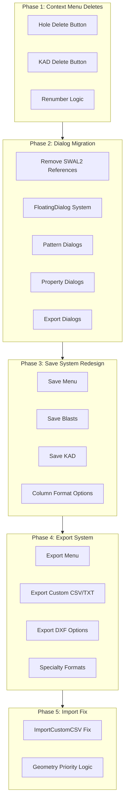

# Kirra2D Modernization & Save/Export Reorganization Plan

## Architecture Overview



---

## Phase 1: Context Menu Delete Buttons

### 1.1 Holes Context Menu Delete Button

**File**: [`src/dialog/contextMenu/HolesContextMenu.js`](src/dialog/contextMenu/HolesContextMenu.js)**Changes**:

- Add `showOption2: true` and `option2Text: "Delete"` to FloatingDialog options (line ~327)
- Implement `onOption2` callback with renumber prompt

**Multiple Selection Support**:

- If multiple holes selected (`holes.length > 1`): Delete all selected holes
- If single hole selected: Delete that hole
- Use `window.showConfirmationDialog()` to ask: "Renumber holes after delete?" (Yes/No)
- **Yes**: Call `window.renumberHolesFunction(deleteRenumberStart, entityName)` after deletion
- **No**: Just delete without renumbering

**Delete Logic**:

```javascript
onOption2: () => {
    // Delete all holes in the 'holes' array (single or multiple)
    const entitiesToRenumber = new Set();
    
    holes.forEach((hole) => {
        const index = window.allBlastHoles.findIndex(h => 
            h.holeID === hole.holeID && h.entityName === hole.entityName
        );
        if (index !== -1) {
            window.allBlastHoles.splice(index, 1);
            entitiesToRenumber.add(hole.entityName);
        }
    });
    
    // Ask if user wants to renumber
    window.showConfirmationDialog(
        "Renumber Holes?",
        "Do you want to renumber holes after deletion?",
        "Yes",
        "No",
        () => {
            // Renumber each affected entity
            entitiesToRenumber.forEach(entityName => {
                window.renumberHolesFunction(window.deleteRenumberStart, entityName);
            });
            window.debouncedSaveHoles();
            window.debouncedUpdateTreeView();
            window.drawData(window.allBlastHoles, window.selectedHole);
        },
        () => {
            // Just save and redraw without renumbering
            window.debouncedSaveHoles();
            window.debouncedUpdateTreeView();
            window.drawData(window.allBlastHoles, window.selectedHole);
        }
    );
    
    dialog.close();
}
```

**Reference Existing Functions**:

- `renumberHolesFunction(startNumber, selectedEntityName)` - line 18327 in kirra.js
- `debouncedSaveHoles()` - existing function
- Pattern: See existing delete logic around line 18200 in kirra.js

---

### 1.2 KAD Context Menu Delete Button

**File**: [`src/dialog/contextMenu/KADContextMenu.js`](src/dialog/contextMenu/KADContextMenu.js)**Changes**:

- Add `showOption2: true` and `option2Text: "Delete"` to FloatingDialog options (line ~166)
- Implement `onOption2` callback to delete point/segment/element

**Multiple Selection Support**:

- The KAD context menu currently only shows for **single element selection** (one point or segment)
- No multiple selection support needed for KAD (different from holes)
- Always auto-renumber after deletion (no prompt needed)

**Delete Logic**:

```javascript
onOption2: () => {
    const entity = window.getEntityFromKADObject(kadObject);
    if (!entity) return;
    
    let deletionIndex = kadObject.elementIndex;
    
    // For segment selections, delete the endpoint (next point)
    const isLineOrPolySegment = (kadObject.entityType === "line" || kadObject.entityType === "poly") && 
                                 kadObject.selectionType === "segment";
    if (isLineOrPolySegment) {
        const isPoly = kadObject.entityType === "poly";
        const numPoints = entity.data.length;
        deletionIndex = isPoly ? (deletionIndex + 1) % numPoints : deletionIndex + 1;
    }
    
    // Remove the point/vertex
    entity.data.splice(deletionIndex, 1);
    
    // Handle edge cases
    if (entity.data.length === 0) {
        // Delete entire entity if no points left
        window.allKADDrawingsMap.delete(kadObject.entityName);
        window.updateStatusMessage("Deleted entity " + kadObject.entityName);
    } else if (entity.data.length === 1 && (entity.entityType === "line" || entity.entityType === "poly")) {
        // Delete entity if only 1 point remains in line/poly
        window.allKADDrawingsMap.delete(kadObject.entityName);
        window.updateStatusMessage("Deleted entity " + kadObject.entityName + " (insufficient points)");
    } else if (entity.data.length === 2 && entity.entityType === "poly") {
        // Convert poly to line if only 2 points remain
        entity.entityType = "line";
        entity.data.forEach(point => {
            point.entityType = "line";
            point.closed = false;
        });
        window.updateStatusMessage("Converted " + kadObject.entityName + " to line (2 points)");
        // Auto-renumber remaining points
        window.renumberEntityPoints(entity);
    } else {
        // Normal case: just renumber
        window.renumberEntityPoints(entity);
        window.updateStatusMessage("Deleted point from " + kadObject.entityName);
    }
    
    // Save and redraw
    window.debouncedSaveKAD();
    window.debouncedUpdateTreeView();
    window.clearAllSelectionState();
    window.drawData(window.allBlastHoles, window.selectedHole);
    
    dialog.close();
    setTimeout(() => window.updateStatusMessage(""), 2000);
}
```

**Reference Existing Functions**:

- `renumberEntityPoints(entity)` - line 18096 in kirra.js (already exists!)
- `deleteObjectInMap(map, pointToDelete)` - line 18107 in kirra.js
- Use existing KAD deletion pattern

**Button Layout** (for both menus):

```javascript
[Option2: Delete] [Option1: Hide] [Cancel] [Confirm/Apply]
```

---

## Phase 2: Complete SWAL2 to FloatingDialog Migration

### 2.1 Fix Export Statement Syntax Error

**Issue**: `Uncaught SyntaxError: Unexpected token 'export'`**Root Cause**: kirra.js is loaded as a regular script (not ES6 module), but contains ES6 export statements.**Solution**:

1. Remove all `export` statements from kirra.js
2. Ensure all functions are exposed via `window.functionName = functionName`
3. Check HTML to ensure scripts are loaded with `type="module"` if using ES6 imports

---

### 2.2 Extract Pattern Dialogs

**File**: Create [`src/dialog/popups/generic/HolePatternDialogsImpl.js`](src/dialog/popups/generic/HolePatternDialogsImpl.js)**Functions to Extract from kirra.js**:

1. `addHolePopup()` - line ~19135 (337 lines)
2. `addPatternPopup(worldX, worldY)` - line ~19510
3. `showHolesAlongLinePopup()` - line ~32403
4. `showPatternInPolygonPopup()` - line ~33009
5. `showHolesAlongPolylinePopup(vertices)` - line ~33812

**Conversion Pattern**:

- Replace all `Swal.fire({...})` with `new FloatingDialog({...})`
- Convert template literals to string concatenation: `` `Hello ${name}` `` → `"Hello " + name`
- Replace `Swal.getPopup().querySelector()` with dialog content manipulation
- Use `window.createEnhancedFormContent(fields)` for form generation
- Use `window.getFormData(formContent)` for form data extraction
- Test all validation logic after conversion

---

### 2.3 Extract Property Dialogs

**File**: Create [`src/dialog/popups/generic/HolePropertyDialogsImpl.js`](src/dialog/popups/generic/HolePropertyDialogsImpl.js)**Functions to Extract**:

1. `editBlastNamePopup()`
2. `editHoleTypePopup()`
3. `editHoleLengthPopup()`
4. `measuredLengthPopup()`
5. `measuredMassPopup()`
6. `measuredCommentPopup()`
7. `renameEntityDialog()`

**Same conversion pattern as 2.2**---

### 2.4 Extract Export Dialogs

**File**: [`src/dialog/popups/generic/ExportDialogs.js`](src/dialog/popups/generic/ExportDialogs.js) (already exists as placeholder)**Functions to Extract**:

1. `saveIREDESPopup()` - line ~18728 (150+ lines)
2. `saveAQMPopup()` - line ~(find exact location)

**Complex HTML Templates**: These have 150+ line Swal templates that need careful conversion---

### 2.5 Extract KAD Dialogs

**File**: Create [`src/dialog/popups/generic/KADDialogsImpl.js`](src/dialog/popups/generic/KADDialogsImpl.js)**Functions to Extract**:

1. `showKADPropertyEditorPopup()` - Already done! (in KADContextMenu.js)
2. `showOffsetKADPopup()`
3. `showRadiiConfigPopup()`
4. `showTriangulationPopup()`

---

## Phase 3: Save System Redesign

### 3.1 Save Menu Architecture

**New Menu Structure** (HTML):

```javascript
File > Save >
  ├── Save All Blasts (All Entities)
  ├── Save Current Blast (Single Entity)
  ├── Save Visible Blasts Only
  ├── Save KAD Entities
  │   ├── Save All KAD
  │   ├── Save Selected KAD
  │   └── Save Visible KAD
  └── Save Format ▶
      ├── 4 Column (ID, X, Y, Z)
      ├── 7 Column (+ ToeXYZ)
      ├── 9 Column (+ Diameter, Type)
      ├── 12 Column (+ FromHole, Delay, Color)
      ├── 14 Column (+ EntityName, EntityType) [Default]
      ├── 30 Column (Extended)
      ├── 32 Column (Full)
      └── 35 Column (Complete)
```


### 3.2 Save Implementation

**File**: Create [`src/dialog/popups/generic/SaveDialogs.js`](src/dialog/popups/generic/SaveDialogs.js)**Functions to Create**:

```javascript
// Step 1) Show save options dialog
function showSaveDialog() {
    const fields = [
        {
            label: "Save Scope",
            name: "saveScope",
            type: "radio",
            value: "all",
            options: [
                { value: "all", label: "All Blasts" },
                { value: "current", label: "Current Blast" },
                { value: "visible", label: "Visible Only" }
            ]
        },
        {
            label: "Format",
            name: "columnFormat",
            type: "select",
            value: "14",
            options: [
                { value: "4", text: "4 Column (ID, X, Y, Z)" },
                { value: "7", text: "7 Column (+ ToeXYZ)" },
                { value: "9", text: "9 Column (+ Diameter, Type)" },
                { value: "12", text: "12 Column (+ FromHole, Delay, Color)" },
                { value: "14", text: "14 Column (+ EntityName, EntityType) [Default]" },
                { value: "30", text: "30 Column (Extended)" },
                { value: "32", text: "32 Column (Full)" },
                { value: "35", text: "35 Column (Complete)" }
            ]
        }
    ];
    
    const formContent = window.createEnhancedFormContent(fields);
    
    const dialog = new window.FloatingDialog({
        title: "Save Blast Holes",
        content: formContent,
        showConfirm: true,
        showCancel: true,
        confirmText: "Save",
        onConfirm: () => {
            const formData = window.getFormData(formContent);
            saveBlastHoles(formData.saveScope, formData.columnFormat);
        }
    });
    
    dialog.show();
}

// Step 2) Save blast holes with format
function saveBlastHoles(scope, columnFormat) {
    // Filter holes based on scope
    let holesToSave = [];
    if (scope === "all") {
        holesToSave = window.allBlastHoles;
    } else if (scope === "current") {
        holesToSave = window.allBlastHoles.filter(h => h.entityName === window.selectedEntityName);
    } else if (scope === "visible") {
        holesToSave = window.allBlastHoles.filter(h => window.isHoleVisible(h));
    }
    
    // Generate CSV based on column format
    const csvContent = generateCSV(holesToSave, columnFormat);
    
    // Download file
    downloadCSV(csvContent, "Kirra_Blast_" + columnFormat + "col.csv");
}

// Step 3) Generate CSV with proper column format
function generateCSV(holes, columnFormat) {
    // Implementation based on column format
    // Reference existing saveKirraCSV functions
}
```

**Column Format Reference** (README.md lines 88-112):

- 4 column: ID, X, Y, Z
- 7 column: ID, X, Y, Z, toeX, toeY, toeZ
- 9 column: + Diameter, Type
- 12 column: + FromHole, Delay, Color
- 14 column: + entityName, entityType (current full format)
- 30, 32, 35 column: Extended formats (need to define)

---

## Phase 4: Export System Redesign

### 4.1 Export Menu Architecture

**New Menu Structure**:

```javascript
File > Export >
  ├── Export Custom CSV/TXT (Column Picker)
  ├── Export DXF ▶
  │   ├── Standard DXF (Holes)
  │   ├── Vulcan Compatible DXF (Holes)
  │   ├── DXF Entities (KAD Objects)
  │   └── DXF 3DFaces (Surfaces)
  ├── Export Surfaces ▶
  │   ├── Point Clouds (.xyz, .txt)
  │   ├── Surpac DTM (2 files, non-binary)
  │   ├── OBJ (Textured)
  │   └── OBJ (Blank)
  ├── Export Images ▶
  │   └── GeoTIFF
  ├── Export CBLAST
  ├── Export IREDES (Epiroc)
  └── Export AQM (MineStar)
```


### 4.2 Export Custom CSV/TXT Implementation

**File**: [`src/dialog/popups/generic/ExportCustomCSVDialog.js`](src/dialog/popups/generic/ExportCustomCSVDialog.js)**Features**:

- Reuse the column mapping UI from importCustomCSV
- User picks which of the 35 available columns to export
- Column order selection (drag and drop or numbered list)
- Preview first 5 rows before export
- Delimiter selection (comma, tab, semicolon, pipe)

---

### 4.3 Export DXF Implementation

**File**: Create [`src/dialog/popups/generic/ExportDXFDialog.js`](src/dialog/popups/generic/ExportDXFDialog.js)**4.3.1 Standard DXF (Holes)**:

- Current implementation (already exists)
- Basic 3D polyline export

**4.3.2 Vulcan Compatible DXF** (Reference: [`src/referenceFiles/HoleToVulcanDXF-VBA.bas`](src/referenceFiles/HoleToVulcanDXF-VBA.bas)):

- Add Vulcan-specific XData (Extended Entity Data)
- Lines 280-289 show the format:
```javascript
1001 MAPTEK_VULCAN
1000 VulcanName=<holeName>
1000 VulcanGroup=
1000 VulcanValue=0
1000 VulcanDescription=Imported from Excel - ADB
1000 VulcanPrimitive=
1000 VulcanLine=0
1000 VulcanPattern=0
1000 VulcanFeature=
```


- Include APPID table for MAPTEK_VULCAN (lines 192-200)
- Use proper DXF header with EXTMIN/EXTMAX (lines 155-174)
- Color code 140 for red holes (line 276)

**4.3.3 DXF Entities (KAD Objects)**:

- Export lines, polylines, circles, text as DXF entities
- Preserve colors and layer information

**4.3.4 DXF 3DFaces (Surfaces)**:

- Export triangulated surfaces as 3DFACE entities
- Support multiple surfaces as layers

---

### 4.4 Export Surfaces Implementation

**File**: Create [`src/dialog/popups/generic/ExportSurfacesDialog.js`](src/dialog/popups/generic/ExportSurfacesDialog.js)**4.4.1 Point Clouds**:

- Format: `X Y Z` (space or comma separated)
- Optional: `X Y Z R G B` with color

**4.4.2 Surpac DTM** (Non-binary, 2 files):

- `.str` file: Surface definition
- `.dtm` file: Triangle data
- Research Surpac ASCII format specification

**4.4.3 OBJ Export**:

- Textured: Include .mtl file and texture references
- Blank: Just geometry (vertices, faces, normals)

**4.4.4 GeoTIFF**:

- Research Canvas to GeoTIFF conversion
- Include georeferencing metadata
- May require external library (geotiff.js)

---

### 4.5 Export CBLAST Implementation

**Reference**: [`src/referenceFiles/CBLASTExport.bas`](src/referenceFiles/CBLASTExport.bas)**File**: Create [`src/dialog/popups/generic/ExportCBLASTDialog.js`](src/dialog/popups/generic/ExportCBLASTDialog.js)**Format** (from VBA lines 94-122):

```javascript
HOLE,,<holeID>,<easting>,<northing>,<elevation>,<bearing>,<angle>,<depth>,<diameter>,,,
PRODUCT,,<holeID>,<deckCount>,<product1>,<length1>,<product2>,<length2>,,,,,,,
DETONATOR,,<holeID>,<detCount>,<detonatorType>,<depth>,<delay>,,,,,,,
STRATA,,<holeID>,0,,,,,,,,,,
```

**Key Logic**:

- Angle = 90 - Dip (line 62)
- Handle "DO NOT CHARGE" holes (lines 88-89)
- Detonator depth = hole depth (line 71)
- Escape commas in string fields (lines 80-81)

**Dialog Fields**:

- Blast name (from DATA!H4 equivalent)
- Stemming type (user input or from hole data)
- Product type (user input or from hole data)
- Detonator type (user input or from hole data)
- Primer type (user input or from hole data)

---

### 4.6 Export IREDES & AQM

**Files**:

- [`src/dialog/popups/generic/ExportIREDESDialog.js`](src/dialog/popups/generic/ExportIREDESDialog.js)
- [`src/dialog/popups/generic/ExportAQMDialog.js`](src/dialog/popups/generic/ExportAQMDialog.js)

**Implementation**:

- Extract `saveIREDESPopup()` and `saveAQMPopup()` from kirra.js (line ~18728)
- Convert from Swal to FloatingDialog
- Preserve existing export logic
- Test XML generation (IREDES) and format (AQM)

---

## Phase 5: Fix importCustomCSV Geometry Conflicts

### 5.1 Problem Analysis

**Issue** (from user images): When import CSV provides:

- CollarXYZ (StartXYZ)
- GradeXYZ
- ToeXYZ (EndXYZ)
- Length
- Subdrill

**Conflicts**:

1. GradeZ vs Subdrill: Both try to calculate BenchHeight

- `BenchHeight = CollarZ - GradeZ` (direct)
- `BenchHeight = Length × cos(Angle) - Subdrill` (calculated)

2. Length vs calculated from coordinates:

- `Length = √[(ΔX)² + (ΔY)² + (ΔZ)²]` (from coords)
- `Length = provided value` (from CSV)

**Working Import**: CollarXYZ + Angle + Bearing + Length + Subdrill (no conflicts)

### 5.2 Geometry Priority Hierarchy

**Solution**: Implement priority logic based on README.md "Accuracy Hierarchy" (lines 439-450)**Priority Order** (Most Accurate → Least Accurate):

1. **Direct Z measurements**: BenchHeight, SubdrillAmount, VerticalDrop (±0.01m)
2. **2D XY calculations**: HoleBearing (±0.5°)
3. **3D compound**: HoleLength (±0.02m)
4. **Inverse trig**: HoleAngle (±1°, poor near vertical)
5. **Interpolations**: GradeXY (±0.05m to ±0.5m)

### 5.3 Import Resolution Strategy

**File**: [`src/kirra.js`](src/kirra.js) (around line 30242, importCustomCSV dialog)**Scenario Detection Logic**:

```javascript
// Step 1) Detect what data we have
const hasCollarXYZ = mappedColumns.startXLocation && mappedColumns.startYLocation && mappedColumns.startZLocation;
const hasGradeXYZ = mappedColumns.gradeXLocation && mappedColumns.gradeYLocation && mappedColumns.gradeZLocation;
const hasToeXYZ = mappedColumns.endXLocation && mappedColumns.endYLocation && mappedColumns.endZLocation;
const hasLength = mappedColumns.subdrillLength || mappedColumns.holeLengthCalculated;
const hasSubdrill = mappedColumns.subdrillAmount;
const hasAngle = mappedColumns.holeAngle;
const hasBearing = mappedColumns.holeBearing;
const hasBenchHeight = mappedColumns.benchHeight;

// Step 2) Resolution Strategy
if (hasCollarXYZ && hasToeXYZ && hasGradeXYZ) {
    // SCENARIO 6: Full Survey (README line 573)
    // PRIORITY: Use coordinates directly, ignore Length/Subdrill from CSV
    // Calculate: Length, Angle, Bearing from coordinates
    // Calculate: BenchHeight = CollarZ - GradeZ (MOST ACCURATE)
    // Calculate: Subdrill = GradeZ - ToeZ (MOST ACCURATE)
    // IGNORE: CSV Length and Subdrill values (less accurate)
    
} else if (hasCollarXYZ && hasAngle && hasBearing && hasLength && hasSubdrill) {
    // SCENARIO 3: Angled Hole Design (README line 509)
    // PRIORITY: Use design parameters
    // Calculate: ToeXYZ, GradeXYZ from design
    
} else if (hasCollarXYZ && hasBenchHeight && hasSubdrill) {
    // SCENARIO 2: Vertical Hole Bench Design (README line 489)
    // Special case for vertical holes
}

// Step 3) Show warning if conflicts detected
if (hasGradeXYZ && hasSubdrill && hasLength) {
    showWarning("CSV contains both GradeXYZ and Subdrill/Length. Using coordinate-based calculations (more accurate).");
}
```

**Implementation**:

1. Add conflict detection in column mapping stage
2. Show visual indicators (⚠️) next to conflicting columns
3. Provide tooltip explaining which values will be used
4. Add checkbox: "Use coordinates (recommended)" vs "Use length/subdrill values"
5. Log decisions to console for debugging

### 5.4 Calculation Function Updates

**Reference**: `calculateHoleGeometry(clickedHole, newValue, modeLAB)` (line 21128 in kirra.js)**Modes**:

- Mode 1: Length
- Mode 2: Angle
- Mode 3: Bearing
- Mode 7: Diameter
- Mode 8: Subdrill

**Add Mode 9**: Recalculate from coordinates

```javascript
if (modeLAB === 9) {
    // Recalculate everything from CollarXYZ, GradeXYZ, ToeXYZ
    const dx = hole.endXLocation - hole.startXLocation;
    const dy = hole.endYLocation - hole.startYLocation;
    const dz = hole.startZLocation - hole.endZLocation; // VerticalDrop
    
    // Most accurate calculations
    hole.holeLengthCalculated = Math.sqrt(dx*dx + dy*dy + dz*dz);
    hole.benchHeight = hole.startZLocation - hole.gradeZLocation;
    hole.subdrillAmount = hole.gradeZLocation - hole.endZLocation;
    hole.holeAngle = Math.acos(dz / hole.holeLengthCalculated) * (180 / Math.PI);
    hole.holeBearing = (450 - Math.atan2(dx, dy) * (180 / Math.PI)) % 360;
}
```

---

## Testing Checklist

### Phase 1 Testing:

- [ ] Delete single hole (with renumber prompt)
- [ ] Delete single hole (without renumber)
- [ ] **Delete multiple holes (with renumber prompt)**
- [ ] **Delete multiple holes (without renumber)**
- [ ] **Delete multiple holes from different entities**
- [ ] Delete KAD point (auto-renumber)
- [ ] Delete KAD segment (auto-renumber)
- [ ] Delete entire KAD entity (only 1 point left)
- [ ] Convert poly to line (only 2 points left)
- [ ] Verify IndexedDB persistence
- [ ] Verify TreeView updates

### Phase 2 Testing:

- [ ] All pattern dialogs work with FloatingDialog
- [ ] All property dialogs work
- [ ] All export dialogs work
- [ ] No SWAL2 references remain
- [ ] No export statement errors

### Phase 3 Testing:

- [ ] Save All Blasts (all formats)
- [ ] Save Current Blast
- [ ] Save Visible Only
- [ ] Save KAD (all, selected, visible)
- [ ] Verify all column formats generate correctly

### Phase 4 Testing:

- [ ] Export Custom CSV with column picker
- [ ] Export Standard DXF
- [ ] Export Vulcan DXF (verify XData)
- [ ] Export DXF Entities
- [ ] Export DXF 3DFaces
- [ ] Export surfaces (all formats)
- [ ] Export CBLAST (verify format)
- [ ] Export IREDES
- [ ] Export AQM

### Phase 5 Testing:

- [ ] Import CollarXYZ + GradeXYZ + ToeXYZ (coordinates priority)
- [ ] Import CollarXYZ + Angle + Bearing + Length + Subdrill (design priority)
- [ ] Import with conflicts shows warning
- [ ] Verify conflict resolution uses coordinate-based calculations
- [ ] Verify holes have correct geometry after import

---

## File Structure After Implementation

```javascript
src/
├── dialog/
│   ├── FloatingDialog.js (existing)
│   ├── contextMenu/
│   │   ├── HolesContextMenu.js (updated: add Delete button)
│   │   └── KADContextMenu.js (updated: add Delete button)
│   └── popups/
│       └── generic/
│           ├── SaveDialogs.js (NEW)
│           ├── ExportCustomCSVDialog.js (NEW)
│           ├── ExportDXFDialog.js (NEW)
│           ├── ExportSurfacesDialog.js (NEW)
│           ├── ExportCBLASTDialog.js (NEW)
│           ├── ExportIREDESDialog.js (NEW)
│           ├── ExportAQMDialog.js (NEW)
│           ├── HolePatternDialogsImpl.js (NEW)
│           ├── HolePropertyDialogsImpl.js (NEW)
│           └── KADDialogsImpl.js (NEW)
└── kirra.js (updated: remove extracted functions, fix import conflicts)
```

---

## Implementation Notes

1. **No ES6 Exports**: All new dialog files should expose functions via `window.functionName = functionName` for compatibility with existing kirra.js
2. **String Concatenation**: Always use `"string " + variable` instead of template literals `` `string ${variable}` ``
3. **FloatingDialog Consistency**: All dialogs must use FloatingDialog class, not Swal2
4. **Step Comments**: Add numbered step comments to all functions for readability
5. **IndexedDB Persistence**: Always call `debouncedSaveHoles()` or `debouncedSaveKAD()` after data changes
6. **TreeView Updates**: Always call `debouncedUpdateTreeView()` after entity changes
7. **User Feedback**: Use `window.updateStatusMessage()` for all operations with 2-second auto-clear
8. **Validation**: Maintain all existing validation logic during dialog migration

---

## Research Required

Before implementing Phase 4:

1. **Surpac DTM Format**: ASCII format specification for .str and .dtm files
2. **GeoTIFF Export**: Canvas to GeoTIFF conversion library (geotiff.js?)
3. **IREDES Format**: Verify current XML structure is correct
4. **AQM Format**: Verify current format specification

---

## Risk Mitigation

1. **Large Refactor**: Extract dialogs one at a time, test thoroughly before moving to next
2. **Data Loss**: Ensure all save/export functions are non-destructive and preserve data