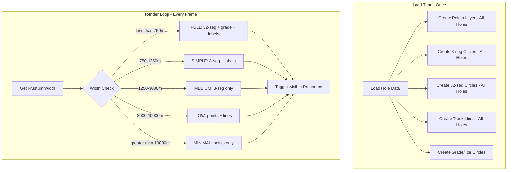

# LOD Performance and 2D/3D Optimization Plan

## Problem Summary

1. **3D LOD not working**: LOD uses track length in pixel calculation, keeping holes at FULL detail
2. **Render loop starts unnecessarily**: Starts at init even when app defaults to 2D mode
3. **No processing indicator**: Heavy operations freeze UI without feedback
4. **No developer LOD controls**: Cannot tune thresholds during testing

---

## Architecture Overview



---

## File Changes

### 1. Fix Render Loop Start at Init

**File**: [src/kirra.js](src/kirra.js) (around line 1154)

Current code starts render loop unconditionally:
```javascript
// Step 9) Start render loop
threeRenderer.startRenderLoop();
```

Change to only start if in 3D mode:
```javascript
// Step 9) Start render loop ONLY if in 3D mode
// In 2D mode (default), render loop wastes CPU/GPU
if (onlyShowThreeJS) {
    threeRenderer.startRenderLoop();
    console.log("Render loop started (3D mode active at init)");
} else {
    console.log("Render loop NOT started (2D mode default)");
}
```

### 2. Rewrite LODManager.js

**File**: [src/three/LODManager.js](src/three/LODManager.js)

Replace pixel-based thresholds with frustum-width thresholds:

```javascript
// NEW: Frustum width thresholds in meters
export var LOD_FRUSTUM_THRESHOLDS = {
    FULL: 750,      // < 750m: Full detail
    SIMPLE: 1250,   // < 1250m: 8-seg, no grade
    MEDIUM: 3000,   // < 3000m: 8-seg, no labels
    LOW: 10000      // < 10000m: points + lines
    // > 10000m: points only
};

export var LOD_LEVEL = {
    FULL: 0,
    SIMPLE: 1,
    MEDIUM: 2,
    LOW: 3,
    MINIMAL: 4
};
```

Add new methods:
- `getFrustumWidth()` - Get camera frustum width in world units
- `getLODLevelFromFrustum()` - Determine LOD from frustum
- `updateVisibility()` - Toggle layer visibility (called every frame)
- `setLayers(layers)` - Register LOD layer references

### 3. Add Processing Indicator

**File**: [src/components/ProcessingIndicator.js](src/components/ProcessingIndicator.js) (NEW FILE)

Simple overlay component:
- `ProcessingIndicator.show(message)` - Show "Please wait" overlay
- `ProcessingIndicator.hide()` - Hide overlay
- `ProcessingIndicator.wrap(asyncFn, message)` - Wrap async function

### 4. Modify ThreeRenderer.js

**File**: [src/three/ThreeRenderer.js](src/three/ThreeRenderer.js)

Add LOD visibility update in render method (around line 1211):

```javascript
render() {
    // ... existing early returns ...
    
    // NEW: Update LOD visibility (nearly free - just toggles)
    if (this.lodManager) {
        this.lodManager.updateVisibility();
    }
    
    // ... rest of render ...
}
```

### 5. Create 8-Segment Circle Pool

**File**: [src/three/InstancedMeshManager.js](src/three/InstancedMeshManager.js)

Add method to create low-segment instanced circles:

```javascript
createSimpleLODCircles(holes, segments) {
    // Create InstancedMesh with 8-segment circles
    // Used for SIMPLE and MEDIUM LOD levels
}
```

### 6. Modify Hole Drawing in kirra.js

**File**: [src/kirra.js](src/kirra.js) (around line 29880)

At load time, create ALL LOD representations:

1. Points batch (all holes) - for LOW/MINIMAL
2. 8-segment circles (all holes) - for SIMPLE/MEDIUM  
3. 32-segment circles (existing instanced) - for FULL
4. Register layers with LODManager

Show ProcessingIndicator for datasets > 2000 holes.

### 7. Add Developer LOD Controls

**File**: [kirra.html](kirra.html) (around line 2237, in developerPanel)

Add HTML:
```html
<hr>
LOD Controls:
<br>
<label>Override: </label>
<select id="lodOverrideSelect">
    <option value="auto">Auto</option>
    <option value="0">FULL</option>
    <option value="1">SIMPLE</option>
    <option value="2">MEDIUM</option>
    <option value="3">LOW</option>
    <option value="4">MINIMAL</option>
</select>
<br>
<label>Frustum: <span id="frustumWidthDisplay">0m</span></label>
<br>
<label>LOD: <span id="currentLODDisplay">-</span></label>
```

**File**: [src/kirra.js](src/kirra.js)

Add event listener for LOD override dropdown and display update in render loop.

---

## LOD Layer Visibility Matrix

| Level | Frustum | 32-seg | 8-seg | Grade | Toe | Lines | Points | Labels |
|-------|---------|--------|-------|-------|-----|-------|--------|--------|
| FULL | < 750m | ON | off | ON | ON | ON | off | ON |
| SIMPLE | < 1250m | off | ON | off | ON | ON | off | ON |
| MEDIUM | < 3000m | off | ON | off | off | ON | off | off |
| LOW | < 10000m | off | off | off | off | ON | ON | off |
| MINIMAL | > 10000m | off | off | off | off | off | ON | off |

---

## Performance Expectations

| Holes | Load Time | Zoom/Pan FPS | Memory Impact |
|-------|-----------|--------------|---------------|
| 5,000 | ~200ms | 60fps | ~50MB |
| 10,000 | ~400ms | 60fps | ~100MB |
| 15,000 | ~600ms | 30-60fps | ~150MB |

Memory increases ~2x because we store both points and circles, but zoom/pan becomes instant since we only toggle `.visible` properties.

---

## Testing Checklist

- [ ] App starts in 2D mode with render loop stopped
- [ ] Switching to 3D starts render loop
- [ ] Switching to 2D stops render loop
- [ ] LOD changes automatically on zoom
- [ ] Developer dropdown overrides LOD
- [ ] Frustum width displays in developer panel
- [ ] Processing indicator shows for > 2000 holes
- [ ] 10,000 holes zoom smoothly at 60fps