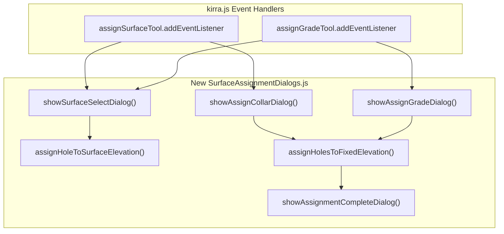

# Surface Assignment Dialog Modernization Plan

## Overview

Convert the `assignSurfaceTool` and `assignGradeTool` handlers from SweetAlert2 to FloatingDialog class. The grade tool will be enhanced to support two modes:
1. **Assign Toe** - Calculate Grade and Subdrill from Toe elevation
2. **Assign Grade** - Calculate Toe and Subdrill from Grade elevation

## Current State

- **Location**: [`src/kirra.js`](src/kirra.js) lines 35231-35652
- **Current dialogs**: 8 Swal.fire() calls across both tools
- **Helper functions**: `assignHoleToSurfaceElevation()`, `assignHolesToFixedElevation()`

## Architecture



## Implementation Tasks

### 1. Create New Dialog File

Create [`src/dialog/popups/generic/SurfaceAssignmentDialogs.js`](src/dialog/popups/generic/SurfaceAssignmentDialogs.js):

**Key Functions:**

1. `showAssignCollarDialog(onConfirm)` - FloatingDialog for manual collar elevation entry
2. `showAssignGradeDialog(onConfirm)` - Enhanced FloatingDialog with mode selector:
   - Radio buttons: "Assign Toe Elevation" vs "Assign Grade Elevation"
   - Single elevation input field
   - On confirm: call appropriate calculation logic
3. `showSurfaceSelectDialog(surfaces, onSelect)` - FloatingDialog for surface selection
4. `showAssignmentCompleteDialog(count, targetName, type)` - Success message dialog
5. `assignHoleToSurfaceElevation(hole, targetElevation, type)` - Move from kirra.js (line 35186)
6. `assignHolesToFixedElevation(elevation, type)` - Move from kirra.js (line 35563)

**Enhanced Grade Dialog Form:**

```javascript
// Step 1) Create form fields using Factory code
var fields = [
    { label: "Assignment Mode:", name: "assignMode", type: "radio", value: "toe",
      options: [
        { value: "toe", label: "Assign Toe (calc Grade/Subdrill)" },
        { value: "grade", label: "Assign Grade (calc Toe/Subdrill)" }
      ]
    },
    { label: "Elevation (mZ):", name: "elevation", type: "number", value: "274", step: "0.1" }
];
// Step 2) USE FACTORY CODE - DO NOT RECREATE
var formContent = window.createEnhancedFormContent(fields, false);
```

### 2. Update Calculation Logic

Extend `assignHoleToSurfaceElevation()` to support new "grade" mode that calculates Toe from Grade:

```javascript
// Existing type="grade" - assigns grade, calculates toe/subdrill from benchHeight
// New type="grade_from_toe" - assigns toe, calculates grade from subdrill
```

**Calculation Logic:**
- **Assign Toe (existing "grade" mode)**: 
  - GradeZ = ToeZ + SubdrillAmount / cos(angle)
  - Recalculate hole length from collar to new toe
- **Assign Grade (new mode)**:
  - ToeZ = GradeZ - SubdrillAmount / cos(angle)  
  - Recalculate hole length from collar to new toe

### 3. Update kirra.js Event Handlers

Replace lines 35231-35652 in [`src/kirra.js`](src/kirra.js):

- Keep event listeners structure
- Replace Swal.fire() calls with new dialog functions
- Call `window.showAssignCollarDialog()`, `window.showAssignGradeDialog()`, etc.

### 4. Add Script Tag to HTML

Add to [`kirra.html`](kirra.html) after line 2548 (near other dialog scripts):

```html
<script src="src/dialog/popups/generic/SurfaceAssignmentDialogs.js"></script>
```

### 5. Create AI Commentary

Document changes in `src/aiCommentary/YYYYMMDD-hhmm-SurfaceAssignmentDialogs.md`

## Files Modified

| File | Action | Lines Affected |
|------|--------|---------------|
| `src/dialog/popups/generic/SurfaceAssignmentDialogs.js` | CREATE | ~300 lines |
| `src/kirra.js` | MODIFY | 35231-35652 (~420 lines refactored) |
| `kirra.html` | MODIFY | Add 1 script tag |
| `src/aiCommentary/` | CREATE | Documentation file |

## Coding Standards Compliance

- No template literals - use string concatenation only
- Step comments for all functions
- Use Factory code: `window.createEnhancedFormContent()`, `window.FloatingDialog`, `window.showModalMessage()`
- Expose all functions via `window.functionName = functionName`
- No ES6 exports (window object only for backward compatibility)

## Testing Checklist

- [ ] Assign Collar - No surface loaded (manual elevation dialog)
- [ ] Assign Collar - Single surface (auto-assign to surface)
- [ ] Assign Collar - Multiple surfaces (surface selection dialog)
- [ ] Assign Collar - Pre-selected holes vs click-to-select mode
- [ ] Assign Grade - No surface (enhanced dialog with mode selector)
- [ ] Assign Grade - Assign Toe mode - verify Grade/Subdrill calculated correctly
- [ ] Assign Grade - Assign Grade mode - verify Toe calculated correctly
- [ ] Assign Grade - Single/multiple surface selection
- [ ] Success message dialogs display correctly
- [ ] Tool checkbox unchecks after operation
- [ ] IndexedDB persistence (debouncedSaveHoles called)