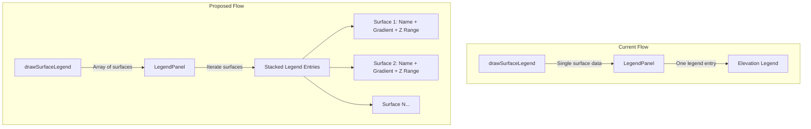

# Surface Legend Stacking and Hillshade Enhancement Plan

## Problem Summary

1. **Legend not stacking for multiple surfaces** - `activeLegends.surface` is a single object, not an array
2. **Legend not always correct** - Shows combined Z range and last surface's gradient
3. **No Hillshade legend** - Missing from `surfaceGradients` object
4. **Hillshade needs color customization** - Add jColor picker for grey/red/orange etc.

## Architecture Changes




## Implementation Details

### 1. Modify LegendPanel.js - Support Multiple Surfaces

**File:** [`src/overlay/panels/LegendPanel.js`](src/overlay/panels/LegendPanel.js)

- Change `activeLegends.surface` from single object to array: `activeLegends.surfaces = []`
- Add "hillshade" to `surfaceGradients` object (grey-scale gradient)
- Modify `buildSurfaceLegendHTML()` to iterate over multiple surfaces
- Each surface entry shows: surface name, compact gradient bar, min/max Z values
- Update `handleLegendUpdate()` to handle array of surfaces

### 2. Modify drawSurfaceLegend() in kirra.js

**File:** [`src/kirra.js`](src/kirra.js) (lines 35332-35373)

- Instead of combining all surfaces into one legend, send individual surface data
- Include: surface ID, name, gradient type, minZ, maxZ, hillshadeColor (if set)

### 3. Add Hillshade Gradient Definition

Add to `surfaceGradients` in `LegendPanel.js`:

```javascript
"hillshade": "#333333 0%, #666666 25%, #999999 50%, #cccccc 75%, #ffffff 100%"
```


### 4. Add Hillshade Color Picker to Surface Context Menu

**File:** [`src/dialog/contextMenu/SurfacesContextMenu.js`](src/dialog/contextMenu/SurfacesContextMenu.js)

- Add conditional color swatch field when gradient === "hillshade"
- Use jColor picker pattern from `openColorPickerForElement()`
- Store `surface.hillshadeColor` property
- Default to grey (#808080)

### 5. Update Hillshade Rendering to Support Custom Colors

**File:** [`src/kirra.js`](src/kirra.js) (lines 35952-35970)

- Modify `getHillshadeColor()` to accept optional base color parameter
- Apply tinting: blend grey-scale illumination with chosen color

## Key Files to Modify

| File | Changes ||------|---------|| [`src/overlay/panels/LegendPanel.js`](src/overlay/panels/LegendPanel.js) | Multi-surface support, hillshade gradient || [`src/kirra.js`](src/kirra.js) | drawSurfaceLegend(), getHillshadeColor() || [`src/dialog/contextMenu/SurfacesContextMenu.js`](src/dialog/contextMenu/SurfacesContextMenu.js) | Hillshade color picker || [`src/kirra.css`](src/kirra.css) | Compact legend styling |

## Compact Legend Design (per Image 10)

Each surface legend entry will be compact:

- Surface name as title (8pt bold)
- Gradient bar (16px wide x 60px tall - smaller than current 100px)