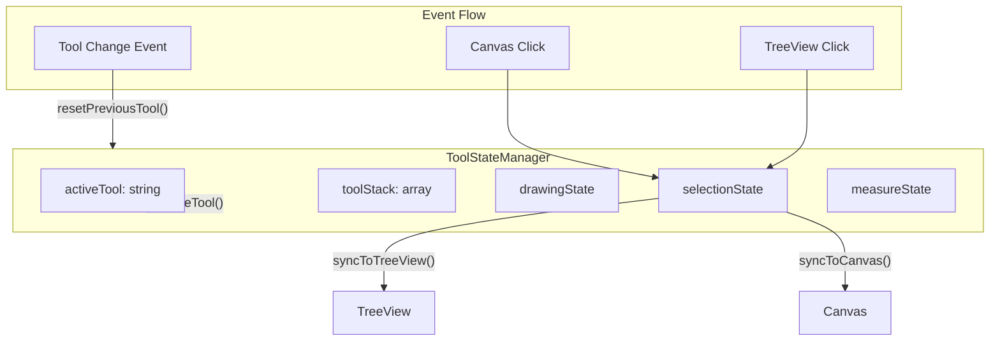

# Tool State Management and TreeView Refactor

## Problem Analysis

### 1. Tool State Management Issues

Currently, tools are managed through scattered boolean flags in [`src/kirra.js`](src/kirra.js):

```2814:2868:src/kirra.js
//drawing tool booleans
let isDrawingPoint = false;
let isDrawingLine = false;
let isDrawingCircle = false;
let isDrawingPoly = false;
let isDrawingText = false;
// ... more flags scattered throughout
```

The `setAllBoolsToFalse()` function (line 2971) resets most flags but:

- Does not clear temporary drawing data (polyPointsX, polyPointsY, rulerStartPoint, etc.)
- Does not clear measure tool state
- Does not properly manage selection persistence
- Each tool manually adds/removes event listeners

### 2. TreeView Selection Issues

The TreeView `onSelectionChange()` method (line 41222) only handles entity-level selection:

```41233:41260:src/kirra.js
if (parts[0] === "hole") {
    const holeId = parts.slice(1).join("⣿");  // BUG: Node ID is "hole⣿entityName⣿holeID" but parsed incorrectly
    const hole = allBlastHoles.find((h) => h.holeID === holeId);
    // ... doesn't handle individual vertex selection for KAD elements
```

**Issues:**

- Hole node IDs use format `"hole⣿entityName⣿holeID"` but parsing is incorrect
- KAD vertex/element selection not implemented
- Canvas-to-TreeView sync only highlights at entity level

### 3. FloatingDialog Duplication

The FloatingDialog class exists in two places:

1. **Module file**: [`src/dialog/FloatingDialog.js`](src/dialog/FloatingDialog.js) (1025 lines) - exports to window
2. **Duplicate in kirra.js**: Lines 41703-42438

The import is commented out at line 76 of kirra.js:

```javascript
// import { FloatingDialog, ... } from "./dialog/FloatingDialog.js";
```

Since [`src/dialog/FloatingDialog.js`](src/dialog/FloatingDialog.js) already sets `window.FloatingDialog = FloatingDialog`, the duplicate code in kirra.js should be removed.---

## Proposed Architecture



---

## Implementation Plan

### Phase 1: Create ToolStateManager

Create [`src/tools/ToolStateManager.js`](src/tools/ToolStateManager.js):

- Centralize all tool flags (isDrawingPoint, isAddingHole, isMoveToolActive, etc.)
- Implement `setActiveTool(toolName)` that:

1. Calls cleanup for previous tool
2. Resets all flags via `resetAllToolState()`
3. Clears temporary data (polyPoints, rulerPoints, etc.)
4. Manages selection persistence based on tool type

- Implement `resetAllToolState()` to replace `setAllBoolsToFalse()`
- Add `preserveSelectionForTool(toolName)` logic (Modify tools keep selections)

### Phase 2: Move TreeView to Module

Create [`src/dialog/tree/TreeView.js`](src/dialog/tree/TreeView.js):Move lines 39849-41702 from kirra.js to the new module.**Fix selection synchronization:**

1. Fix hole node ID parsing (format is `"hole⣿entityName⣿holeID"`):
```javascript
if (parts[0] === "hole" && parts.length >= 3) {
    const entityName = parts[1];
    const holeID = parts[2];
    const hole = allBlastHoles.find((h) => 
        h.entityName === entityName && h.holeID === holeID
    );
}
```


2. Add element-level selection for KAD objects:
```javascript
if (parts.length >= 4 && parts[2] === "element") {
    // Handle vertex/element selection
    const entityType = parts[0];
    const entityName = parts[1];
    const elementId = parts[3];
}
```


3. Update `highlightNodes()` to handle both entity and element levels

### Phase 3: Fix Canvas-to-TreeView Sync

Update the canvas selection handlers to properly sync individual selections:

- When a hole is selected on canvas, highlight `"hole⣿entityName⣿holeID"`
- When a KAD vertex is selected, highlight `"type⣿entityName⣿element⣿pointID"`
- When multiple items selected, highlight all corresponding nodes

### Phase 4: Remove FloatingDialog Duplicate

1. Ensure [`src/dialog/FloatingDialog.js`](src/dialog/FloatingDialog.js) is loaded in index.html
2. Remove lines 41703-42438 from kirra.js (FloatingDialog class and helpers)
3. The module already exports to window, so no other changes needed

### Phase 5: 2D/3D Mode Selection Persistence

- Store selection state before mode switch
- Restore selection state after mode switch
- Ensure `selectedHole`, `selectedMultipleHoles`, `selectedKADObject`, `selectedMultipleKADObjects` persist

---

## Files to Create/Modify

| File | Action ||------|--------|| `src/tools/ToolStateManager.js` | Create new || `src/dialog/tree/TreeView.js` | Create new (move from kirra.js) || `src/kirra.js` | Remove TreeView class (39849-41702), remove FloatingDialog duplicate (41703-42438), integrate ToolStateManager || `index.html` | Add script tags for new modules |---

## Selection Persistence Rules