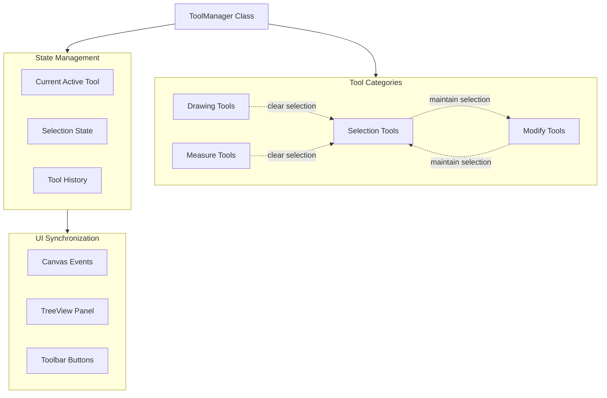

# Tool State Management and Modularization Plan

## Overview

Create a centralized ToolManager system to handle tool state transitions, prevent state conflicts, and ensure selections persist appropriately. Move TreeView class to its own module and verify FloatingDialog modularization.

## Architecture




## Phase 1: Create ToolManager Class

**File**: Create [`src/tools/ToolManager.js`](src/tools/ToolManager.js)

### Critical Bugs Being Fixed

**Bug 1: Incomplete State Reset** (kirra.js line 2971 - `setAllBoolsToFalse()`)

- Currently does NOT clear temporary drawing data:
- `polyPointsX`, `polyPointsY` (polygon selection points)
- `rulerStartPoint` (ruler tool state)
- `rulerProtractorPoints` (protractor state)
- Drawing tool canvas overlays
- Result: Ghost data persists between tools causing visual artifacts

**Bug 2: Manual Event Listener Management**

- Each tool manually adds/removes listeners
- No centralized cleanup leads to memory leaks
- Multiple listeners can stack if tool switching is rapid

**Bug 3: Selection Persistence Not Managed**

- `setAllBoolsToFalse()` doesn't consider when to preserve selections
- Moving between compatible tools (Selection ↔ Modify) clears selections unnecessarily

### Tool Categories

- **Selection Tools**: `selectPointer`, `selectPolygon`, `multiHoleSelection`
- **Drawing Tools**: `addPoint`, `addLine`, `addPoly`, `addCircle`, `addText`, `addHole`
- **Modify Tools**: `moveTool`, `bearingTool`, `connectHoles`, `offset`, `radii`
- **Measure Tools**: `ruler`, `rulerProtractor`

### Core Methods

```javascript
class ToolManager {
  constructor() {
    this.activeTool = null
    this.activeCategory = null
    this.selectionState = { holes: [], kadObjects: [] }
    this.toolHistory = []
    
    // Step 1) Track temporary tool data that must be cleared
    this.temporaryData = {
      polyPointsX: [],
      polyPointsY: [],
      rulerStartPoint: null,
      rulerProtractorPoints: [],
      drawingOverlays: []
    }
    
    // Step 2) Track active event listeners for cleanup
    this.eventListeners = new Map()
  }
  
  // Step 3) Switch to new tool with proper cleanup
  switchTool(toolName, options) {
    // Clear previous tool's temporary data
    this.clearTemporaryData(this.activeTool)
    
    // Remove previous tool's event listeners
    this.removeToolListeners(this.activeTool)
    
    // Handle selection based on tool categories
    if (this.shouldClearSelection(this.activeTool, toolName)) {
      this.clearSelection()
    } else {
      this.preserveSelection()
    }
    
    // Activate new tool
    this.activeTool = toolName
    this.activeCategory = this.getToolCategory(toolName)
    
    // Setup new tool
    this.addToolListeners(toolName)
  }
  
  // Step 4) Clear ALL temporary data for a tool
  clearTemporaryData(toolName) {
    if (!toolName) return
    
    // Reset drawing polygon points
    if (this.isDrawingTool(toolName) || toolName === 'selectPolygon') {
      this.temporaryData.polyPointsX.length = 0
      this.temporaryData.polyPointsY.length = 0
      this.clearDrawingOverlays()
    }
    
    // Reset measure tool data
    if (this.isMeasureTool(toolName)) {
      this.temporaryData.rulerStartPoint = null
      this.temporaryData.rulerProtractorPoints.length = 0
    }
  }
  
  // Step 5) Category-aware reset
  resetToolsByCategory(category)
  
  // Step 6) Selection management with rules
  preserveSelection()
  clearSelection()
  shouldClearSelection(fromTool, toTool)
  
  // Step 7) Event listener management
  addToolListeners(toolName)
  removeToolListeners(toolName)
  
  // Step 8) State queries
  isToolActive(toolName)
  getActiveCategory()
  isDrawingTool(toolName)
  isMeasureTool(toolName)
}
```


### Tool Transition Rules

1. **Selection → Modify**: Preserve selection state
2. **Modify → Selection**: Preserve selection state
3. **Any → Drawing**: Clear selection, reset previous tool
4. **Any → Measure**: Clear selection, reset previous tool
5. **2D ↔ 3D**: Preserve all selections

### Integration Points

- Line 2713-2877 in `kirra.js`: Replace individual `isXXX` variables with `toolManager.state`
- Line 3217-3444 in `kirra.js`: Replace `resetEverythingExcluding()` with `toolManager.switchTool()`
- All tool checkbox event handlers: Use `toolManager.switchTool()` instead of manual state management

## Phase 2: Move TreeView to Module

**Source**: `[src/kirra.js](src/kirra.js):39846-41702` (1857 lines)**Destination**: Create [`src/dialog/tree/TreeView.js`](src/dialog/tree/TreeView.js)

### Steps

1. Extract TreeView class (lines 39849-41437)
2. Extract helper functions (lines 41439-41701):

- `openColorPickerForElement()`
- `updateTreeViewVisibilityStates()`
- `updateTreeView()`
- `debouncedUpdateTreeView()`

3. Create proper imports/exports
4. Update `kirra.js` to import TreeView

### Dependencies to Export

```javascript
// TreeView.js needs access to:
import { allBlastHoles, selectedHole, selectedMultipleHoles } from '../kirra.js'
import { allKADDrawingsMap, selectedKADObject, selectedMultipleKADObjects } from '../kirra.js'
import { loadedSurfaces, loadedImages } from '../kirra.js'
import { drawData } from '../draw/canvas2DDrawing.js'
```


## Phase 3: Fix TreeView Selection Sync

**Files**: [`src/dialog/tree/TreeView.js`](src/dialog/tree/TreeView.js) (after move)

### Critical Bugs Being Fixed

**Bug 4: Incorrect Hole Node ID Parsing** (kirra.js line 41222-41274 - `onSelectionChange()`)

```javascript
// WRONG - Current code (line 41234-41237):
if (parts[0] === "hole") {
  const holeId = parts.slice(1).join("⣿");  // BUG: This gives "entityName⣿holeID"
  const hole = allBlastHoles.find((h) => h.holeID === holeId);  // NEVER MATCHES!
}

// CORRECT - Should be:
if (parts[0] === "hole" && parts.length === 3) {
  const entityName = parts[1]  // Extract entityName
  const holeID = parts[2]      // Extract holeID
  const hole = allBlastHoles.find(h => 
    h.entityName === entityName && h.holeID === holeID
  )
}
```

Node ID format is: `"hole⣿entityName⣿holeID"` (3 parts)

- parts[0] = "hole"
- parts[1] = entityName
- parts[2] = holeID

**Bug 5: Missing KAD Vertex Selection**

- Current code only handles entity-level KAD selection
- Individual vertex/element clicks in TreeView not implemented
- Element node format exists but parsing missing: `"entityType⣿entityName⣿element⣿pointID"`

### Current Issues

- TreeView only highlights entity-level (blast entities, KAD entities)
- Individual items (holes, vertices) not highlighted
- Multi-select not visually indicated

### Enhancements

#### 3.1 Individual Hole Highlighting

Update `highlightNodes()` method (line 40006-40019):

```javascript
highlightNodes(nodeIds) {
  this.isSyncing = true
  this.clearSelection()
  
  nodeIds.forEach((nodeId) => {
    // Support: "hole⣿entityName⣿holeID" format
    const element = this.container.querySelector(`[data-node-id="${nodeId}"]`)
    if (element) {
      this.selectedNodes.add(nodeId)
      element.classList.add("selected")
      
      // Auto-expand parent if collapsed
      this.ensureNodeVisible(nodeId)
    }
  })
  
  this.isSyncing = false
}
```


#### 3.2 KAD Vertex Highlighting

Update `buildDrawingData()` (line 41018-41141) to include vertex nodeIds:

```javascript
// Element node format: "entityType⣿entityName⣿element⣿pointID"
// Example: "line⣿MyLine⣿element⣿5"
```


#### 3.3 Canvas → TreeView Sync

Integrate with ToolManager:

```javascript
// In ToolManager.updateSelection()
if (window.treeView) {
  const nodeIds = this.selectionState.holes.map(h => 
    `hole⣿${h.entityName}⣿${h.holeID}`
  )
  window.treeView.highlightNodes(nodeIds)
}
```


#### 3.4 TreeView → Canvas Sync

Update `onSelectionChange()` (line 41222-41274) to handle individual items:

```javascript
onSelectionChange() {
  if (this.isSyncing) return
  
  // Clear canvas selections
  selectedMultipleHoles.length = 0
  selectedMultipleKADObjects.length = 0
  
  this.selectedNodes.forEach((nodeId) => {
    const parts = nodeId.split("⣿")
    
    if (parts[0] === "hole" && parts.length === 3) {
      // Individual hole: "hole⣿entityName⣿holeID"
      const hole = allBlastHoles.find(h => 
        h.entityName === parts[1] && h.holeID === parts[2]
      )
      if (hole) selectedMultipleHoles.push(hole)
    }
    else if (parts.includes("element") && parts.length === 4) {
      // KAD vertex: "type⣿entityName⣿element⣿pointID"
      const entity = allKADDrawingsMap.get(parts[1])
      if (entity) {
        const element = entity.data.find(el => el.pointID == parts[3])
        if (element) {
          selectedMultipleKADObjects.push({
            entityName: parts[1],
            entityType: parts[0],
            elementIndex: entity.data.indexOf(element),
            selectionType: "vertex"
          })
        }
      }
    }
  })
  
  // Redraw canvas with selections
  drawData(allBlastHoles, selectedHole)
}
```


## Phase 4: Fix FloatingDialog Duplication

### Critical Bug Being Fixed

**Bug 6: Duplicate FloatingDialog Class** (kirra.js line 41703-42438)**Current Situation:**

1. ✅ Module exists: `src/dialog/FloatingDialog.js` (1025 lines)

- Exports to window: `window.FloatingDialog = FloatingDialog`
- Includes all helper functions

2. ❌ Import commented out in kirra.js line 76:
   ```javascript
            // import { FloatingDialog, ... } from "./dialog/FloatingDialog.js";
   ```


3. ❌ Duplicate code in kirra.js lines 41703-42438 (736 lines)

- Same FloatingDialog class
- Same helper functions
- Dead code that should have been removed

**Why This is Bad:**

- Maintenance nightmare: Changes must be made in TWO places
- Confusion: Which version is actually being used?
- Bundle size: Duplicate code increases file size
- The module sets `window.FloatingDialog`, so the duplicate is completely unnecessary

### Actions Required

1. **Uncomment the import** in kirra.js line 76:
   ```javascript
            import { FloatingDialog, createFormContent, createEnhancedFormContent, showConfirmationDialog } from "./dialog/FloatingDialog.js";
   ```


2. **Delete** lines 41703-42438 from `kirra.js` (entire duplicate FloatingDialog section)
3. **Verify** all FloatingDialog usage in kirra.js works with the imported version


## Phase 5: Integration and Testing

### 5.1 Update kirra.js Imports

Add at top of file:

```javascript
import { ToolManager } from './tools/ToolManager.js'
import { TreeView } from './dialog/tree/TreeView.js'
```


### 5.2 Initialize ToolManager

Replace tool initialization code (lines 2713-2877):

```javascript
// OLD: 40+ individual boolean flags
// NEW:
const toolManager = new ToolManager()
window.toolManager = toolManager
```


### 5.3 Update Tool Activation

Replace all checkbox event handlers:

```javascript
// OLD:
isAddingPoint = true
resetEverythingExcluding("addPoint")

// NEW:
toolManager.switchTool("addPoint", { clearSelection: true })
```


### 5.4 Update Mode Switching

In dimension2D-3DBtn change handler (line ~2488-2539):

```javascript
// Switching modes should preserve selection
toolManager.preserveSelection()
// ... mode switch code ...
toolManager.restoreSelection()
```


## File Structure After Changes

```javascript
src/
├── tools/
│   └── ToolManager.js                    [NEW - 800 lines]
├── dialog/
│   ├── tree/
│   │   └── TreeView.js                   [NEW - moved from kirra.js]
│   └── FloatingDialog.js                 [EXISTS - verified]
└── kirra.js                              [MODIFIED - remove ~3900 lines]
```


## Summary of Bugs Fixed

| Bug | Location | Issue | Fix ||-----|----------|-------|-----|| 1 | kirra.js:2971 | `setAllBoolsToFalse()` doesn't clear temporary data | ToolManager tracks and clears all temp data || 2 | kirra.js | Manual event listener management | ToolManager centralizes listener lifecycle || 3 | kirra.js | No selection persistence logic | ToolManager implements category-based rules || 4 | kirra.js:41234 | Wrong hole node ID parsing in TreeView | Fix parsing: `parts[1]` = entity, `parts[2]` = holeID || 5 | kirra.js:41222 | Missing KAD vertex selection in TreeView | Implement element-level parsing and selection || 6 | kirra.js:41703 | Duplicate FloatingDialog code (736 lines) | Delete duplicate, use module import |

## Expected Outcomes

1. **Predictable Tool Behavior**: No more tool state conflicts or ghost data
2. **Complete State Cleanup**: All temporary data cleared when switching tools
3. **No Memory Leaks**: Event listeners properly managed and removed
4. **Consistent Selection**: Selections persist when appropriate, clear when appropriate
5. **Synchronized UI**: Canvas and TreeView always show matching selections at correct granularity
6. **Clean Code**: 

- ToolManager: ~800 lines
- TreeView: ~1900 lines (moved from kirra.js)
- kirra.js: ~3900 lines smaller (removed TreeView + duplicate FloatingDialog)

7. **Better Debugging**: Single point to inspect tool state and temporary data

## Implementation Order

1. Create ToolManager skeleton (tool categories, basic switch logic)
2. Move TreeView to module (verify it still works)
3. Delete duplicate FloatingDialog code from kirra.js