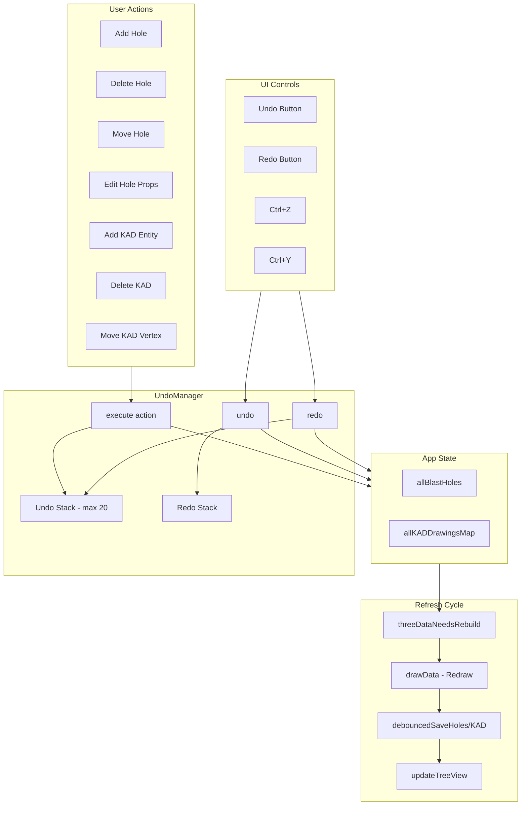
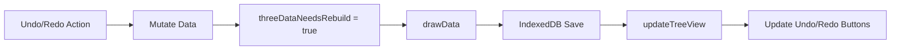

# UndoManager Implementation Plan

## Architecture Overview

The UndoManager will use the **Command Pattern** - storing action objects that know how to execute, undo, and redo themselves. This approach is memory-efficient (stores deltas, not full snapshots) and scales well for complex operations.



## File Structure

New file: `src/tools/UndoManager.js` (~300-400 lines)

## Core UndoManager Class Design

```javascript
// src/tools/UndoManager.js
class UndoManager {
    constructor(options) {
        this.maxUndoLevels = options.maxLevels || 20;  // Default: 20 levels
        this.undoStack = [];
        this.redoStack = [];
        this.onStateChange = null;  // Callback for UI updates
    }
    
    // Execute an action and add to undo stack
    execute(action) { ... }
    
    // Undo the last action
    undo() { ... }
    
    // Redo the last undone action  
    redo() { ... }
    
    // Check if undo/redo available
    canUndo() { return this.undoStack.length > 0; }
    canRedo() { return this.redoStack.length > 0; }
    
    // Clear all history (e.g., on file load)
    clear() { ... }
    
    // Update UI button states
    updateButtonStates() { ... }
}
```

## Action Types to Implement

### Blast Hole Actions

| Action | Undo Data | Redo Data |

|--------|-----------|-----------|

| `ADD_HOLE` | hole ID(s) to remove | hole object(s) to re-add |

| `DELETE_HOLE` | hole object(s) to restore | hole ID(s) that were deleted |

| `MOVE_HOLE` | original positions | new positions |

| `EDIT_HOLE_PROPS` | original property values | new property values |

| `ADD_PATTERN` | array of hole IDs | array of hole objects |

### KAD Drawing Actions

| Action | Undo Data | Redo Data |

|--------|-----------|-----------|

| `ADD_KAD_ENTITY` | entityName to remove | entity data to re-add |

| `DELETE_KAD_ENTITY` | entity data to restore | entityName deleted |

| `ADD_KAD_VERTEX` | entityName, pointID | vertex data |

| `DELETE_KAD_VERTEX` | entityName, vertex data | entityName, pointID |

| `MOVE_KAD_VERTEX` | original XYZ | new XYZ |

| `EDIT_KAD_PROPS` | original props | new props |

## Toolbar UI Buttons

### Location: Toolbar Header (kirra.html ~line 2510)

Add undo/redo buttons next to the "Tools" title span:

```html
<div class="tree-panel-header" id="toolbarPanelHeader">
    <span>Tools</span>
    <!-- NEW: Undo/Redo buttons in header -->
    <div class="toolbar-undo-redo">
        <button id="undoBtn" class="toolbar-header-btn" title="Undo (Ctrl+Z)" disabled>
            
        </button>
        <button id="redoBtn" class="toolbar-header-btn" title="Redo (Ctrl+Y)" disabled>
            
        </button>
    </div>
    <div class="tree-panel-controls">
        <button class="tree-panel-btn" id="toolbarCollapseBtn">-</button>
    </div>
</div>
```

### CSS Styling (kirra.css)

```css
.toolbar-undo-redo {
    display: flex;
    gap: 2px;
    margin-left: 8px;
}

.toolbar-header-btn {
    width: 24px;
    height: 24px;
    padding: 2px;
    border: none;
    background: transparent;
    cursor: pointer;
    opacity: 0.8;
    border-radius: 3px;
}

.toolbar-header-btn:hover:not(:disabled) {
    background: rgba(255, 255, 255, 0.1);
    opacity: 1;
}

.toolbar-header-btn:disabled {
    opacity: 0.3;
    cursor: not-allowed;
}

.toolbar-header-btn img {
    width: 18px;
    height: 18px;
}
```

### Icons Needed

Two new icons from Tabler Icons (matching existing icon style):

- `icons/arrow-back-up.png` - Undo (curved arrow pointing back/up)
- `icons/arrow-forward-up.png` - Redo (curved arrow pointing forward/up)

Download from: https://tabler.io/icons (search "arrow back up" and "arrow forward up")

Note: `arrow-back.png` already exists but is a straight arrow - the curved "up" variants are more recognizable as undo/redo.

## Integration Points in kirra.js

### 1. Keyboard Shortcuts (~line 32730)

Add Ctrl+Z and Ctrl+Y handlers to existing keydown listener:

```javascript
// In document.addEventListener("keydown", ...)
if ((event.ctrlKey || event.metaKey) && event.key === "z") {
    event.preventDefault();
    window.undoManager.undo();
}
if ((event.ctrlKey || event.metaKey) && event.key === "y") {
    event.preventDefault();
    window.undoManager.redo();
}
```

### 2. Hole Operations to Wrap

Key locations in [kirra.js](D:\GIT_WORKSPACE\GIT_KIRRA-2D-3D\Kirra2D\src\kirra.js):

- Line ~26392: `addHoleToAllBlastHoles()` - wrap with ADD_HOLE action
- Line ~23482: `deleteSelectedHoles()` - wrap with DELETE_HOLE action  
- Line ~12751: hole deletion in various places - wrap with DELETE_HOLE
- Line ~36483: pattern generation adds holes - wrap with ADD_PATTERN (batch)
- Move operations in drag handlers - wrap with MOVE_HOLE

### 3. KAD Operations to Wrap

Key locations:

- Line ~32830: vertex deletion via DELETE key
- Line ~32858: entity deletion via DELETE key
- KAD drawing tools add entities to `allKADDrawingsMap`
- [HolesContextMenu.js](D:\GIT_WORKSPACE\GIT_KIRRA-2D-3D\Kirra2D\src\dialog\contextMenu\HolesContextMenu.js) line ~542, ~651: insert hole operations

### 4. Expose to Window

In `exposeGlobalsToWindow()` (~line 500):

```javascript
window.undoManager = undoManager;
```

## Batch Operations Support

Pattern generation and multi-select operations create multiple changes. The UndoManager will support batch grouping:

```javascript
undoManager.beginBatch("Generate Pattern");
// ... add 50 holes ...
undoManager.endBatch();  // Creates single undo entry
```

## Post-Action Refresh Cycle (CRITICAL)

After every undo/redo operation, the following refresh sequence MUST be triggered to keep the app in sync:



### Refresh Functions to Call

Each action's `undo()` and `redo()` methods must call these in order:

```javascript
// Step 1) Mark 3D scene for rebuild
window.threeDataNeedsRebuild = true;

// Step 2) Redraw canvas (2D and 3D)
window.drawData(window.allBlastHoles, window.selectedHole);

// Step 3) Persist to IndexedDB (use appropriate debounced save)
// For hole operations:
window.debouncedSaveHoles();
// For KAD operations:
window.debouncedSaveKAD();

// Step 4) Sync TreeView with data changes
if (typeof window.updateTreeView === "function") {
    window.updateTreeView();
}
// Or use debounced version:
if (typeof window.debouncedUpdateTreeView === "function") {
    window.debouncedUpdateTreeView();
}

// Step 5) Update undo/redo button states
undoManager.updateButtonStates();
```

### Key Functions Reference

| Function | Purpose | Location |

|----------|---------|----------|

| `window.threeDataNeedsRebuild` | Flag to trigger 3D scene rebuild | Global flag |

| `drawData(allBlastHoles, selectedHole)` | Main redraw for 2D canvas and 3D scene | kirra.js ~line 15796 |

| `debouncedSaveHoles()` | Save holes to IndexedDB (debounced) | kirra.js, exposed to window |

| `debouncedSaveKAD()` | Save KAD entities to IndexedDB (debounced) | kirra.js, exposed to window |

| `updateTreeView()` | Refresh TreeView panel | TreeView.js, exposed to window |

| `debouncedUpdateTreeView()` | Debounced TreeView refresh | kirra.js, exposed to window |

| `syncCanvasToTreeView()` | Sync selection state to TreeView | kirra.js |

### Action Base Class with Refresh

```javascript
class UndoableAction {
    constructor(type, affectsHoles, affectsKAD) {
        this.type = type;
        this.affectsHoles = affectsHoles;
        this.affectsKAD = affectsKAD;
        this.description = "";
    }
    
    // Called after undo() or redo() completes
    refresh() {
        // Step 1) Mark 3D for rebuild
        window.threeDataNeedsRebuild = true;
        
        // Step 2) Redraw
        window.drawData(window.allBlastHoles, window.selectedHole);
        
        // Step 3) Save to IndexedDB
        if (this.affectsHoles && window.debouncedSaveHoles) {
            window.debouncedSaveHoles();
        }
        if (this.affectsKAD && window.debouncedSaveKAD) {
            window.debouncedSaveKAD();
        }
        
        // Step 4) Update TreeView
        if (window.debouncedUpdateTreeView) {
            window.debouncedUpdateTreeView();
        }
    }
}
```

## Status Bar Integration

Update status message to show undo availability:

- After undo: "Undid: Delete 3 holes (5 remaining)"
- After redo: "Redid: Add pattern (4 remaining)"

## Memory Considerations

- Each action stores only the delta (changed data), not full state
- Maximum 20 levels by default (configurable via localStorage setting)
- Oldest actions are dropped when limit exceeded
- Clear on file import to prevent cross-file undo issues
- Estimated memory per action: 1-50KB depending on operation size

## Testing Checklist

### Core Functionality

- Add single hole then undo
- Delete multiple holes then undo
- Move hole then undo
- Generate pattern then undo (batch)
- Add KAD line vertices then undo each
- Delete KAD entity then undo
- Undo multiple times in sequence
- Redo after undo
- Verify Ctrl+Z and Ctrl+Y work
- Verify toolbar buttons enable/disable correctly
- Verify 21st action drops oldest undo
- Test button tooltips show remaining undo count

### Refresh Cycle Verification

- After undo: verify 2D canvas redraws correctly
- After undo: verify 3D scene updates (threeDataNeedsRebuild)
- After undo: verify IndexedDB is updated (reload page, data persists)
- After undo: verify TreeView reflects the change
- After redo: verify all above refresh steps work
- Test rapid undo/redo doesn't cause race conditions with debounced saves