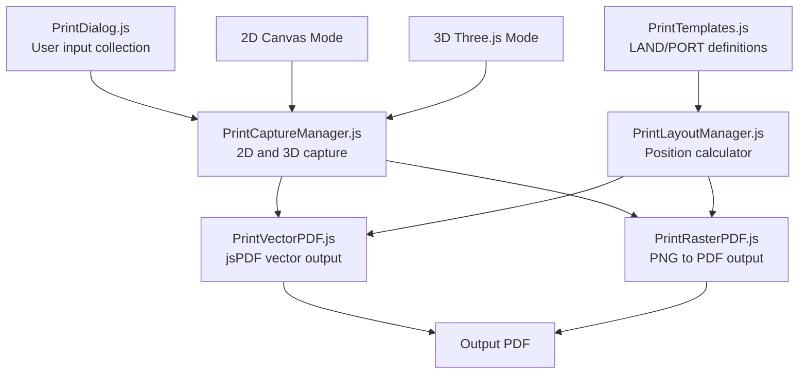

# Unified Print System for 2D and 3D Modes

## Overview

This plan implements a template-based PDF printing system that works seamlessly for both 2D Canvas mode and 3D Three.js mode. The system uses PDF templates as layout references, supports both vector and raster output types, and automatically adapts navigation indicators (North Arrow for 2D, XYZ Gizmo for 3D).

## Current State Analysis

### Existing Print System (2D Only)

**Files:**
- [`Kirra2D/src/print/PrintSystem.js`](Kirra2D/src/print/PrintSystem.js) - Main coordinator, print boundary calculation
- [`Kirra2D/src/print/PrintVectorPDF.js`](Kirra2D/src/print/PrintVectorPDF.js) - Vector PDF generation using jsPDF
- [`Kirra2D/src/print/PrintRendering.js`](Kirra2D/src/print/PrintRendering.js) - Canvas drawing functions for data
- [`Kirra2D/src/print/PrintStats.js`](Kirra2D/src/print/PrintStats.js) - Header/footer with statistics
- [`Kirra2D/src/print/SVGBuilder.js`](Kirra2D/src/print/SVGBuilder.js) - SVG helper functions
- [`Kirra2D/src/print/GeoPDFMetadata.js`](Kirra2D/src/print/GeoPDFMetadata.js) - Georeferencing metadata

**Template References:**
- [`Kirra2D/src/referenceFiles/PrintoutTemplateLAND.pdf`](Kirra2D/src/referenceFiles/PrintoutTemplateLAND.pdf) - Landscape layout reference
- [`Kirra2D/src/referenceFiles/PrintoutTemplatePORT.pdf`](Kirra2D/src/referenceFiles/PrintoutTemplatePORT.pdf) - Portrait layout reference

**Current Features:**
- 2D Canvas print preview with boundary system
- WYSIWYG print-safe area (blue dashed lines)
- Vector PDF output (true vectors using jsPDF drawing API)
- Raster PDF output (high-resolution PNG to PDF)
- Basic header with QR code, URL, title
- Statistics table with blast data and delay groups
- Georeferencing support

**Issues:**
- No 3D mode support
- Hardcoded layout positions (magic numbers throughout)
- No template abstraction
- Limited customization (no blast name, designer, date input)
- North arrow not properly implemented
- Inconsistent layouts between vector and raster modes

### 3D Rendering System

**Files:**
- [`Kirra2D/src/three/ThreeRenderer.js`](Kirra2D/src/three/ThreeRenderer.js) - Core Three.js renderer with `preserveDrawingBuffer: true` (ready for capture)
- [`Kirra2D/src/three/CameraControls.js`](Kirra2D/src/three/CameraControls.js) - Camera orbit, pan, zoom controls
- [`Kirra2D/src/draw/canvas3DDrawing.js`](Kirra2D/src/draw/canvas3DDrawing.js) - 3D geometry drawing functions

**Current Features:**
- WebGL rendering with orthographic camera
- XYZ axis gizmo (configurable: always/only_when_orbit/never)
- Z-up coordinate system (X=East, Y=North, Z=Up)
- Local coordinate transformation for large UTM values
- Surface rendering with triangles and textures
- Blast holes with collar, grade, toe visualization

**Ready for Printing:**
- `preserveDrawingBuffer: true` enables canvas capture
- `canvas.toDataURL()` available for screenshot
- Gizmo can be shown/hidden programmatically

## Architecture Overview



## New Template System

### Template Structure

Templates define layout zones as JSON-like objects with relative positioning:

```javascript
{
  name: "LAND_2D",
  mode: "2D",
  orientation: "landscape",
  zones: {
    header: {
      x: 0.02,              // 2% from left edge
      y: 0.02,              // 2% from top edge
      width: 0.96,          // 96% of page width
      height: 17,           // 17mm absolute height
      sections: {
        logo: { ... },
        title: { ... },
        navigationIndicator: {
          content: "northArrow"  // 2D mode
        }
      }
    },
    map: {
      x: 0.02,
      y: 19,                // After header + gap
      width: 0.96,
      height: "auto",       // Fill remaining space
      printSafeMargin: 0.05 // 5% internal margin
    },
    footer: {
      y: -12,               // 12mm from bottom (negative)
      height: 10,
      sections: { ... }
    }
  }
}
```

### Template Variants

Four templates to create:
1. **LANDSCAPE_2D** - 2D mode, landscape orientation, North Arrow
2. **LANDSCAPE_3D** - 3D mode, landscape orientation, XYZ Gizmo
3. **PORTRAIT_2D** - 2D mode, portrait orientation, North Arrow
4. **PORTRAIT_3D** - 3D mode, portrait orientation, XYZ Gizmo

Key difference between 2D and 3D templates is the `navigationIndicator.content` field:
- 2D: `"northArrow"`
- 3D: `"xyzGizmo"`

## Implementation Plan

### Phase 1: Core Template System

#### 1.1 Create PrintTemplates.js

**File:** [`Kirra2D/src/print/PrintTemplates.js`](Kirra2D/src/print/PrintTemplates.js) (NEW)

**Purpose:** Define all layout templates based on the PDF references

**Structure:**
```javascript
export const PRINT_TEMPLATES = {
  LANDSCAPE_2D: { /* full template */ },
  LANDSCAPE_3D: { /* full template */ },
  PORTRAIT_2D: { /* full template */ },
  PORTRAIT_3D: { /* full template */ }
};

// Helper to get template by mode and orientation
export function getTemplate(mode, orientation) {
  const key = orientation.toUpperCase() + "_" + mode.toUpperCase();
  return PRINT_TEMPLATES[key];
}
```

**Layout Zones to Define:**

**Header Zone (17mm height):**
- Logo/QR Code area (10mm x 10mm at left)
- Title "Kirra" (16pt bold)
- URL "https://blastingapps.com/kirra.html" (6pt)
- Navigation Indicator (North Arrow or XYZ Gizmo) (15mm x 15mm)
- Connector Count section (15% width)
- Blast Statistics section (28% width)
- Metadata section (28% width) - Blast Name, Designer, Date

**Map Zone (auto height):**
- Fills remaining vertical space between header and footer
- 5% internal margin for print-safe area
- Contains all data (holes, KAD, surfaces, images)

**Footer Zone (10mm height):**
- Software credit (left aligned)
- Scale "1:XXXX" (center)
- Designer name (center-right)
- Date/time (right aligned)

#### 1.2 Create PrintLayoutManager.js

**File:** [`Kirra2D/src/print/PrintLayoutManager.js`](Kirra2D/src/print/PrintLayoutManager.js) (NEW)

**Purpose:** Convert template definitions to absolute positions in mm

**Key Methods:**
```javascript
class PrintLayoutManager {
  constructor(template, pageWidth, pageHeight)
  
  // Get zone rectangle in absolute mm
  getZoneRect(zoneName) // Returns {x, y, width, height}
  
  // Get section rectangle within a zone
  getSectionRect(zoneName, sectionName)
  
  // Resolve relative values (%, negative, absolute)
  resolveValue(value, parentSize)
  
  // Calculate auto height for map zone
  calculateAutoHeight(zoneName)
}
```

**Example Usage:**
```javascript
const layout = new PrintLayoutManager(template, 297, 210); // A4 landscape
const headerRect = layout.getZoneRect("header");
// Returns: {x: 5.94, y: 4.2, width: 285.12, height: 17}

const logoRect = layout.getSectionRect("header", "logo");
// Returns: {x: 5.94, y: 4.2, width: 10, height: 10, content: "qrcode"}
```

#### 1.3 Create PrintCaptureManager.js

**File:** [`Kirra2D/src/print/PrintCaptureManager.js`](Kirra2D/src/print/PrintCaptureManager.js) (NEW)

**Purpose:** Unified capture system for both 2D and 3D modes

**Key Methods:**
```javascript
class PrintCaptureManager {
  // Main capture method - routes to 2D or 3D
  static captureCurrentView(mode, context)
  
  // 2D-specific capture
  static capture2DView(context) {
    // Use existing getPrintBoundary() logic
    // Calculate world bounds from print-safe area
    // Return {worldBounds, screenBounds, scale}
  }
  
  // 3D-specific capture
  static capture3DView(context) {
    // Get camera state from CameraControls
    // Calculate visible frustum bounds
    // Capture WebGL canvas: canvas.toDataURL()
    // Return {worldBounds, imageData, cameraState, scale}
  }
  
  // Calculate 3D frustum bounds
  static calculate3DVisibleBounds(threeRenderer, cameraState)
  
  // Capture north arrow for 2D
  static captureNorthArrow(context) {
    // Draw arrow rotated by -currentRotation
    // Return image data URL
  }
  
  // Capture XYZ gizmo for 3D
  static captureXYZGizmo(context) {
    // Force gizmo visible at corner
    // Render and extract gizmo region
    // Restore original gizmo state
    // Return image data URL
  }
}
```

**2D Capture Logic:**
- Reuse existing `getPrintBoundary()` from [`PrintSystem.js`](Kirra2D/src/print/PrintSystem.js)
- Calculate inner boundary (blue dashed lines = print-safe area)
- Convert screen coordinates to world coordinates
- Return world bounds for data rendering

**3D Capture Logic:**
- Get camera state from `cameraControls.getCameraState()`
- Calculate orthographic frustum bounds in world space
- Use `threeRenderer.getCanvas().toDataURL("image/png", 1.0)` to capture
- Temporarily show gizmo at fixed position if needed

### Phase 2: User Input and Print Dialog

#### 2.1 Create PrintDialog.js

**File:** [`Kirra2D/src/print/PrintDialog.js`](Kirra2D/src/print/PrintDialog.js) (NEW)

**Purpose:** Collect user input before printing using FloatingDialog

**User Input Fields:**
1. **Blast Name** (text input, default: "Untitled Blast")
2. **Designer Name** (text input, default: empty)
3. **Additional Notes** (textarea, optional)
4. **Paper Size** (dropdown: A4/A3/A2/A1/A0, default: A4)
5. **Orientation** (radio: Landscape/Portrait, default: Landscape)
6. **Output Type** (radio: Vector PDF / High-Res Image PDF, default: Vector)

**Example Structure:**
```javascript
export function showPrintDialog(mode, context) {
  const fields = [
    {
      type: "text",
      name: "blastName",
      label: "Blast Name:",
      value: "Untitled Blast",
      placeholder: "Enter blast name"
    },
    {
      type: "text",
      name: "designer",
      label: "Designer:",
      value: "",
      placeholder: "Enter designer name"
    },
    // ... more fields
  ];
  
  const dialog = new FloatingDialog({
    title: "Print Settings",
    content: formContent,
    onConfirm: (data) => {
      // Start print process with user data
      startPrint(mode, data, context);
    }
  });
  
  dialog.show();
}
```

**Dialog Flow:**
1. User clicks "Print to PDF" button
2. Dialog appears with input fields
3. User fills in details
4. User clicks "Generate PDF"
5. Print process begins with progress bar

### Phase 3: Print Generation Refactoring

#### 3.1 Refactor PrintVectorPDF.js

**File:** [`Kirra2D/src/print/PrintVectorPDF.js`](Kirra2D/src/print/PrintVectorPDF.js) (REFACTOR)

**Changes:**
- Accept `PrintLayoutManager` instance instead of hardcoded positions
- Accept user input data (blast name, designer, etc.)
- Support both 2D and 3D modes
- Use layout zones for positioning all elements

**New Function Signature:**
```javascript
export function generateTrueVectorPDF(context, userInput, layoutManager, capturedView) {
  // context: all app state
  // userInput: {blastName, designer, notes, paperSize, orientation, outputType}
  // layoutManager: PrintLayoutManager instance
  // capturedView: result from PrintCaptureManager.captureCurrentView()
  
  // Use layoutManager.getSectionRect() for all positioning
  // Render navigation indicator based on mode
  // Include user input in header metadata section
}
```

**Key Improvements:**
1. Replace all hardcoded positions with `layoutManager.getSectionRect()`
2. Add metadata section rendering:
   - Blast Name (from user input)
   - Designer (from user input)
   - Date/Time (auto-generated)
   - Scale (calculated)
3. Conditionally render North Arrow OR XYZ Gizmo
4. Use template-defined font sizes and spacing

#### 3.2 Create PrintRasterPDF.js

**File:** [`Kirra2D/src/print/PrintRasterPDF.js`](Kirra2D/src/print/PrintRasterPDF.js) (NEW - extract from PrintSystem.js)

**Purpose:** High-resolution raster PDF generation (existing `printCanvasHiRes` logic)

**Changes:**
- Extract `printCanvasHiRes()` from [`PrintSystem.js`](Kirra2D/src/print/PrintSystem.js)
- Refactor to use `PrintLayoutManager` for positioning
- Support both 2D and 3D modes
- For 3D: composite captured WebGL image into print canvas

**Key Logic:**
```javascript
export function generateRasterPDF(context, userInput, layoutManager, capturedView) {
  // Step 1: Create high-DPI print canvas (300 DPI)
  // Step 2: Draw header using layoutManager positions
  // Step 3: Draw map area:
  //    - For 2D: render data using existing drawDataForPrinting()
  //    - For 3D: paste captured WebGL imageData
  // Step 4: Draw footer using layoutManager positions
  // Step 5: Convert canvas to PNG
  // Step 6: Create PDF with jsPDF.addImage()
}
```

**3D Mode Specifics:**
- Don't re-render 3D geometry on print canvas
- Use pre-captured `capturedView.imageData` from WebGL
- Composite the image into the map zone
- Add header/footer around it

#### 3.3 Update PrintSystem.js

**File:** [`Kirra2D/src/print/PrintSystem.js`](Kirra2D/src/print/PrintSystem.js) (REFACTOR)

**Changes:**
- Keep print boundary calculation for 2D preview
- Remove `printCanvasHiRes()` (moved to PrintRasterPDF.js)
- Update `printToPDF()` to use new system
- Keep `togglePrintMode()` for 2D preview
- Add 3D print mode state management

**New Main Flow:**
```javascript
export function printToPDF(context) {
  // Step 1: Detect mode (2D or 3D)
  const mode = context.is3DMode ? "3D" : "2D";
  
  // Step 2: Show print dialog
  showPrintDialog(mode, context);
  // Dialog handles rest of flow when user confirms
}
```

#### 3.4 Update Button Handlers

**File:** [`Kirra2D/src/print/PrintSystem.js`](Kirra2D/src/print/PrintSystem.js) (line 889-989)

**Changes to `setupPrintEventHandlers()`:**
- Detect if 3D mode is active
- Show appropriate print preview (2D boundary or 3D frozen view)
- Route to correct print generation path

### Phase 4: Navigation Indicators

#### 4.1 North Arrow for 2D

**Implementation in PrintCaptureManager.js:**
```javascript
static captureNorthArrow(context) {
  const { currentRotation, darkModeEnabled } = context;
  
  // Create 100x100px canvas
  const canvas = document.createElement("canvas");
  canvas.width = 100;
  canvas.height = 100;
  const ctx = canvas.getContext("2d");
  
  // Draw arrow rotated to show true north
  ctx.translate(50, 50);
  ctx.rotate(-currentRotation); // Counter-rotate canvas rotation
  
  // Draw arrow shape
  ctx.fillStyle = darkModeEnabled ? "#ffffff" : "#000000";
  ctx.beginPath();
  ctx.moveTo(0, -40);      // Arrow point
  ctx.lineTo(-10, 20);     // Left wing
  ctx.lineTo(0, 10);       // Center notch
  ctx.lineTo(10, 20);      // Right wing
  ctx.closePath();
  ctx.fill();
  
  // Draw "N" label
  ctx.font = "bold 20px Arial";
  ctx.textAlign = "center";
  ctx.fillText("N", 0, -50);
  
  return canvas.toDataURL("image/png");
}
```

#### 4.2 XYZ Gizmo for 3D

**Implementation in PrintCaptureManager.js:**
```javascript
static captureXYZGizmo(context) {
  const { threeRenderer, cameraControls } = context;
  
  // Step 1: Save current gizmo state
  const originalMode = cameraControls.gizmoDisplayMode;
  
  // Step 2: Force gizmo visible at corner position
  const cameraState = cameraControls.getCameraState();
  const cornerX = -threeRenderer.camera.right * 0.8;
  const cornerY = -threeRenderer.camera.top * 0.8;
  threeRenderer.showAxisHelper(true, cornerX, cornerY, cameraState.scale);
  
  // Step 3: Render scene
  threeRenderer.requestRender();
  
  // Step 4: Extract gizmo region from canvas
  const canvas = threeRenderer.getCanvas();
  const gizmoCanvas = document.createElement("canvas");
  gizmoCanvas.width = 150;
  gizmoCanvas.height = 150;
  const ctx = gizmoCanvas.getContext("2d");
  
  // Copy bottom-left corner (where gizmo is positioned)
  ctx.drawImage(canvas, 
    50, canvas.height - 200,  // Source x, y
    150, 150,                 // Source w, h
    0, 0,                     // Dest x, y
    150, 150                  // Dest w, h
  );
  
  // Step 5: Restore original gizmo state
  if (originalMode !== "always") {
    threeRenderer.showAxisHelper(false);
  }
  
  return gizmoCanvas.toDataURL("image/png");
}
```

**Notes:**
- Gizmo is already implemented in [`ThreeRenderer.js`](Kirra2D/src/three/ThreeRenderer.js) (line 1103-1135)
- Uses Three.js AxesHelper with X=red, Y=green, Z=blue
- Position calculated to stay at fixed screen size (50 pixels)

### Phase 5: Data Rendering

#### 5.1 2D Data Rendering

**Use existing functions from [`PrintRendering.js`](Kirra2D/src/print/PrintRendering.js):**
- `drawDataForPrinting()` - Main data rendering function (line 8)
- Already handles: holes, KAD, surfaces, images, contours
- Already supports both canvas and SVG/vector output

**Integration:**
- Pass layout-calculated map zone to `drawDataForPrinting()`
- Use captured world bounds from `PrintCaptureManager.capture2DView()`

#### 5.2 3D Data Rendering

**Two approaches:**

**Approach A: Pre-captured Image (Simpler, Recommended for Phase 1)**
- Capture WebGL canvas as PNG via `toDataURL()`
- Composite captured image into print canvas
- No re-rendering needed
- Preserves exact view including lighting, shadows, textures

**Approach B: Re-render Vector (Complex, Future Enhancement)**
- Extract geometry from Three.js scene
- Convert to 2D projections
- Render as vectors in PDF
- Allows vector-based 3D prints
- More complex, requires projection math

**Recommended: Use Approach A for initial implementation**

### Phase 6: Surfaces and Images Support

#### 6.1 2D Surfaces

**Current Support:**
- Already implemented in [`PrintRendering.js`](Kirra2D/src/print/PrintRendering.js)
- Surface triangles with elevation-based colors
- Transparency support
- Surface legend with gradient scale

**Verification:**
- Test with loaded surfaces
- Ensure legend renders correctly
- Check transparency in both vector and raster modes

#### 6.2 3D Surfaces

**Current Support:**
- Three.js renders surfaces with vertex colors
- Textured mesh support (OBJ files)
- Gradient-based coloring

**Print Handling:**
- Captured in WebGL screenshot (Approach A)
- Surfaces render exactly as shown on screen
- No special handling needed for Phase 1

#### 6.3 Background Images

**2D Images:**
- GeoTIFF support already implemented
- Rendered with correct georeferencing
- Transparency support

**3D Images:**
- Images placed on planes at elevation Z
- Captured in WebGL screenshot

**Print Handling:**
- Both 2D and 3D images captured in respective view captures
- No additional code needed

### Phase 7: Future Enhancements (NOT in this implementation)

**Cross-Sections:**
- Vertical slice through 3D data
- Requires clipping plane implementation
- Future feature

**Clipping Planes:**
- Hide geometry beyond plane
- Complex Three.js modification
- Future feature

## File Summary

### Files to Create

1. **[`Kirra2D/src/print/PrintTemplates.js`](Kirra2D/src/print/PrintTemplates.js)** - Template definitions (~400 lines)
2. **[`Kirra2D/src/print/PrintLayoutManager.js`](Kirra2D/src/print/PrintLayoutManager.js)** - Layout calculator (~200 lines)
3. **[`Kirra2D/src/print/PrintCaptureManager.js`](Kirra2D/src/print/PrintCaptureManager.js)** - Capture system (~400 lines)
4. **[`Kirra2D/src/print/PrintDialog.js`](Kirra2D/src/print/PrintDialog.js)** - User input dialog (~300 lines)
5. **[`Kirra2D/src/print/PrintRasterPDF.js`](Kirra2D/src/print/PrintRasterPDF.js)** - Raster output (extract ~300 lines from PrintSystem.js)

### Files to Modify

1. **[`Kirra2D/src/print/PrintSystem.js`](Kirra2D/src/print/PrintSystem.js)**
   - Remove `printCanvasHiRes()` (move to PrintRasterPDF.js)
   - Update `printToPDF()` to use new dialog flow
   - Keep `getPrintBoundary()` and `togglePrintMode()` for 2D preview
   - Add 3D print mode detection

2. **[`Kirra2D/src/print/PrintVectorPDF.js`](Kirra2D/src/print/PrintVectorPDF.js)**
   - Replace hardcoded positions with layoutManager calls
   - Add user input data rendering
   - Support both 2D and 3D modes
   - Add navigation indicator rendering

3. **[`Kirra2D/src/print/PrintStats.js`](Kirra2D/src/print/PrintStats.js)**
   - Update to use layout positions
   - Add user metadata rendering

### Files to Reference (No Changes)

1. **[`Kirra2D/src/print/PrintRendering.js`](Kirra2D/src/print/PrintRendering.js)** - Keep existing data rendering
2. **[`Kirra2D/src/print/SVGBuilder.js`](Kirra2D/src/print/SVGBuilder.js)** - Keep SVG helpers
3. **[`Kirra2D/src/print/GeoPDFMetadata.js`](Kirra2D/src/print/GeoPDFMetadata.js)** - Keep georeferencing
4. **[`Kirra2D/src/three/ThreeRenderer.js`](Kirra2D/src/three/ThreeRenderer.js)** - Use existing gizmo and capture
5. **[`Kirra2D/src/three/CameraControls.js`](Kirra2D/src/three/CameraControls.js)** - Use camera state getter

## Testing Checklist

### 2D Mode Testing

- [ ] Print preview boundary shows correctly
- [ ] WYSIWYG: printed output matches preview
- [ ] North arrow rotates with canvas rotation
- [ ] Blast holes render correctly
- [ ] KAD entities (points, lines, circles, text) render
- [ ] Surfaces with elevation gradient render
- [ ] Background images (GeoTIFF) render
- [ ] Statistics table shows correct data
- [ ] Delay groups table with colors
- [ ] User input (blast name, designer) appears in header
- [ ] Both vector and raster outputs work
- [ ] Both landscape and portrait orientations work
- [ ] All paper sizes (A4/A3/A2/A1/A0) work

### 3D Mode Testing

- [ ] WebGL canvas captures correctly
- [ ] XYZ gizmo appears in print
- [ ] Gizmo shows current camera orientation
- [ ] 3D surfaces render in print
- [ ] Textured surfaces (OBJ) render in print
- [ ] Blast holes in 3D render correctly
- [ ] Background images on planes render
- [ ] Lighting and shadows captured
- [ ] Statistics table shows correct data
- [ ] User input appears in header
- [ ] Both landscape and portrait work
- [ ] All paper sizes work

## Implementation Notes

### Coordinate Systems

**2D Canvas:**
- World coordinates: Large UTM values (e.g., 476882, 6772456)
- Canvas coordinates: Screen pixels
- Print coordinates: PDF mm
- Transformation: `worldToCanvas()` then scale to PDF mm

**3D Three.js:**
- World coordinates: Large UTM values
- Local coordinates: Translated to origin (small values for precision)
- Screen coordinates: Canvas pixels after camera projection
- Print coordinates: WebGL canvas captured as image

### Key Considerations

1. **Preserve Drawing Buffer:** Already enabled in ThreeRenderer.js (line 46)
2. **Image Quality:** Use 300 DPI for raster prints (11.8 px/mm)
3. **Vector Quality:** jsPDF native drawing for scalable output
4. **User Experience:** Show progress dialog during generation
5. **Memory:** Large canvases may fail; handle errors gracefully
6. **Dark Mode:** Navigation indicators adapt to theme

### Error Handling

- Print boundary not active (2D mode)
- No data to print
- Canvas too large for browser
- Image generation failure
- User cancels dialog

## Continuation on Another Computer

All information needed to continue this work:

1. **Template References:** See [`Kirra2D/src/referenceFiles/PrintoutTemplateLAND.pdf`](Kirra2D/src/referenceFiles/PrintoutTemplateLAND.pdf) and PORT.pdf for layout
2. **Current Print System:** Study [`PrintSystem.js`](Kirra2D/src/print/PrintSystem.js) and [`PrintVectorPDF.js`](Kirra2D/src/print/PrintVectorPDF.js)
3. **3D Rendering:** Study [`ThreeRenderer.js`](Kirra2D/src/three/ThreeRenderer.js) for capture capability
4. **Coordinate System:** Read [`20251124-0145-COORDINATE_SYSTEM_FIX.md`](Kirra2D/src/aiCommentary/20251124-0145-COORDINATE_SYSTEM_FIX.md)
5. **This Plan:** Located in [`aiPlans/`](Kirra2D/src/aiPlans/) folder

### Key Dependencies

- jsPDF library (already installed)
- Three.js library (already installed)
- FloatingDialog class (already implemented)
- GeometryFactory for 3D objects (already implemented)

### Testing Data

- Test with blast holes loaded
- Test with KAD drawings (points, lines, polygons, circles, text)
- Test with surfaces (elevation-based and textured)
- Test with background images (GeoTIFF)
- Test in both 2D and 3D modes
- Test all paper sizes and orientat