# IndexedDB Schema

## Overview

Kirra uses **IndexedDB** for client-side data persistence of large datasets. The database name is **"KirraDB"** and consists of four main object stores that manage blast holes, drawings, surfaces, and layer organization.

IndexedDB is used instead of localStorage for:
- **Large data structures** (blast patterns with thousands of holes)
- **Binary data** (texture images, OBJ meshes)
- **Complex relationships** (layers, entities, surfaces)
- **Performance** (asynchronous operations, indexed queries)

---

## Database Structure

The complete entity-relationship diagram below shows all four object stores and their relationships:

```mermaid
erDiagram
    KIRRA-DATABASE ||--o{ BLASTHOLES : contains
    KIRRA-DATABASE ||--o{ KADDRAWINGS : contains
    KIRRA-DATABASE ||--o{ KADSURFACE : contains
    KIRRA-DATABASE ||--o{ KADLAYERS : contains

    BLASTHOLES {
        string id PK "blastHolesData"
        array data "Array of blast hole objects"
    }
    
    BLASTHOLE-OBJECT {
        float benchHeight
        float burden
        string colorHexDecimal
        int connectorCurve
        float endXLocation
        float endYLocation
        float endZLocation
        string entityName
        string entityType "hole"
        string fromHoleID
        float gradeXLocation
        float gradeYLocation
        float gradeZLocation
        float holeAngle
        float holeBearing
        float holeDiameter
        string holeID PK
        float holeLengthCalculated
        int holeTime
        string holeType "Production"
        string measuredComment
        string measuredCommentTimeStamp
        float measuredLength
        string measuredLengthTimeStamp
        float measuredMass
        string measuredMassTimeStamp
        int posID
        int rowID
        float spacing
        float startXLocation
        float startYLocation
        float startZLocation
        float subdrillAmount
        float subdrillLength
        int timingDelayMilliseconds
        boolean visible
    }

    KADDRAWINGS {
        string id PK "kadDrawingData"
        array data "Array[entityName, entityObject]"
    }

    DRAWING-ENTITY {
        string entityName PK "Unique entity identifier"
        string name "Display name"
        string entityType "poly|line|point|circle|text"
        string layerId FK "Reference to layer"
        boolean visible "Visibility flag"
        array data "Array of geometry points"
    }

    POLY-ENTITY {
        string entityName PK
        string name
        string entityType "poly"
        string layerId FK
        boolean visible
        array data "Array of poly points"
    }

    POLY-POINT {
        string entityName FK
        string entityType "poly"
        int pointID "Sequential point ID"
        float pointXLocation "Easting coordinate"
        float pointYLocation "Northing coordinate"
        float pointZLocation "Elevation"
        boolean closed "Is polygon closed"
        string color "Hex color #RRGGBB"
        int lineWidth "Line width in pixels"
        boolean visible
    }

    LINE-ENTITY {
        string entityName PK
        string name
        string entityType "line"
        string layerId FK
        boolean visible
        array data "Array of line points"
    }

    LINE-POINT {
        string entityName FK
        string entityType "line"
        int pointID "Sequential point ID"
        float pointXLocation "Easting coordinate"
        float pointYLocation "Northing coordinate"
        float pointZLocation "Elevation"
        boolean closed "Always false for lines"
        string color "Hex color #RRGGBB"
        int lineWidth "Line width in pixels"
        boolean visible
    }

    POINT-ENTITY {
        string entityName PK
        string name
        string entityType "point"
        string layerId FK
        boolean visible
        array data "Array of point objects"
    }

    POINT-OBJECT {
        string entityName FK
        string entityType "point"
        int pointID "Sequential point ID"
        float pointXLocation "Easting coordinate"
        float pointYLocation "Northing coordinate"
        float pointZLocation "Elevation"
        boolean closed "Always false"
        string color "Hex color #RRGGBB"
        boolean connected "Connection flag"
        boolean visible
    }

    CIRCLE-ENTITY {
        string entityName PK
        string entityName_attr "Entity identifier"
        string entityType "circle"
        string layerId FK
        boolean visible
        array data "Array of circle centers"
    }

    CIRCLE-OBJECT {
        string entityName FK
        string entityType "circle"
        int pointID "Sequential circle ID"
        float pointXLocation "Center X (Easting)"
        float pointYLocation "Center Y (Northing)"
        float pointZLocation "Center Z (Elevation)"
        string radius "Circle radius"
        boolean closed "Always false"
        string color "Hex color #RRGGBB"
        int lineWidth "Line width in pixels"
        boolean connected "Connection flag"
        boolean visible
    }

    TEXT-ENTITY {
        string entityName PK
        string entityName_attr "Entity identifier"
        string entityType "text"
        string layerId FK
        boolean visible
        array data "Array of text placements"
    }

    TEXT-OBJECT {
        string entityName FK
        string entityType "text"
        int pointID "Sequential text ID"
        float pointXLocation "Text X (Easting)"
        float pointYLocation "Text Y (Northing)"
        float pointZLocation "Text Z (Elevation)"
        string text "Text content"
        int fontHeight "Font size in pixels"
        boolean closed "Always false"
        string color "Hex color #RRGGBB"
        boolean connected "Connection flag"
        boolean visible
    }

    KADSURFACE {
        string id PK "Surface identifier"
        string name "Display name"
        string type "delaunay|triangulated"
        array points "Array of 3D vertices"
        array triangles "Array of triangle faces"
        string created "ISO DateTime"
        string gradient "hillshade|texture"
        string hillshadeColor "Color for hillshade"
        string layerId FK "Reference to layer"
        float maxLimit "Max elevation limit"
        float minLimit "Min elevation limit"
        object metadata "Surface metadata"
        float transparency "0-1 transparency"
        boolean visible "Visibility flag"
        boolean isTexturedMesh "Has texture mapping"
        string objContent "OBJ file content"
        string mtlContent "MTL file content"
        object meshBounds "3D bounding box"
        object flattenedImageBounds "2D image bounds"
        string flattenedImageDataURL "Base64 PNG"
        object flattenedImageDimensions "Image size"
        object materialProperties "Material definitions"
        object textureBlobs "Texture image blobs"
    }

    SURFACE-METADATA {
        string algorithm "constrained_delaunay"
        int pointCount "Number of vertices"
        int triangleCount "Number of triangles"
        int constraintCount "Number of constraints"
        string blastHolePointType "Point type"
    }

    SURFACE-POINT {
        float x "Easting coordinate"
        float y "Northing coordinate"
        float z "Elevation"
    }

    SURFACE-TRIANGLE {
        array vertices "3 vertex references"
        array uvs "UV texture coordinates"
        array normals "Normal vectors"
        string material "Material reference"
    }

    MESH-BOUNDS {
        float minX "Minimum easting"
        float maxX "Maximum easting"
        float minY "Minimum northing"
        float maxY "Maximum northing"
        float minZ "Minimum elevation"
        float maxZ "Maximum elevation"
    }

    MATERIAL-PROPERTIES {
        string name "Material name"
        array Ka "Ambient color RGB"
        array Kd "Diffuse color RGB"
        array Ks "Specular color RGB"
        int Ns "Specular exponent"
        int illum "Illumination model"
        string map_Kd "Texture filename"
    }

    TEXTURE-BLOB {
        string filename PK "Texture filename"
        int size "File size in bytes"
        string type "MIME type image/jpeg"
        blob data "Binary image data"
    }

    FLATTENED-IMAGE {
        int width "Image width pixels"
        int height "Image height pixels"
        string dataURL "Base64 PNG data"
    }

    KADLAYERS {
        string id PK "layersData"
        array drawingLayers "Drawing layer array"
        array surfaceLayers "Surface layer array"
    }

    DRAWING-LAYER {
        string layerId PK
        string layerName
        array entities "Array of entity IDs"
        string importDate "ISO DateTime"
        string sourceFile "Source filename"
        boolean visible
    }

    SURFACE-LAYER {
        string layerId PK
        string layerName
        array surfaces "Array of surface IDs"
        string importDate "ISO DateTime"
        string sourceFile "Source filename"
        boolean visible
    }

    BLASTHOLES ||--o{ BLASTHOLE-OBJECT : stores
    KADDRAWINGS ||--o{ DRAWING-ENTITY : stores
    DRAWING-ENTITY ||--o{ POLY-ENTITY : "is type of"
    DRAWING-ENTITY ||--o{ LINE-ENTITY : "is type of"
    DRAWING-ENTITY ||--o{ POINT-ENTITY : "is type of"
    DRAWING-ENTITY ||--o{ CIRCLE-ENTITY : "is type of"
    DRAWING-ENTITY ||--o{ TEXT-ENTITY : "is type of"
    POLY-ENTITY ||--o{ POLY-POINT : contains
    LINE-ENTITY ||--o{ LINE-POINT : contains
    POINT-ENTITY ||--o{ POINT-OBJECT : contains
    CIRCLE-ENTITY ||--o{ CIRCLE-OBJECT : contains
    TEXT-ENTITY ||--o{ TEXT-OBJECT : contains
    KADSURFACE ||--|| SURFACE-METADATA : has
    KADSURFACE ||--o{ SURFACE-POINT : contains
    KADSURFACE ||--o{ SURFACE-TRIANGLE : contains
    KADSURFACE ||--|| MESH-BOUNDS : has
    KADSURFACE ||--o{ MATERIAL-PROPERTIES : has
    KADSURFACE ||--o{ TEXTURE-BLOB : contains
    KADSURFACE ||--|| FLATTENED-IMAGE : generates
    MATERIAL-PROPERTIES ||--|| TEXTURE-BLOB : references
    KADLAYERS ||--o{ DRAWING-LAYER : manages
    KADLAYERS ||--o{ SURFACE-LAYER : manages
    DRAWING-LAYER ||--o{ DRAWING-ENTITY : references
    SURFACE-LAYER ||--o{ KADSURFACE : references
```



---

## Object Store Descriptions

### 1. BLASTHOLES Store

**Purpose**: Stores all blast hole data with complete geometric and operational properties.

**Primary Key**: `"blastHolesData"` (singleton record)

**Structure**: Contains a single record with an array of blast hole objects.

#### Blast Hole Object Fields

| Field | Type | Description |
|-------|------|-------------|
| `holeID` | string | Unique identifier for the hole |
| `entityName` | string | Entity/pattern name this hole belongs to |
| `entityType` | string | Always `"hole"` for blast holes |
| `startXLocation` | float | Collar X coordinate (Easting) |
| `startYLocation` | float | Collar Y coordinate (Northing) |
| `startZLocation` | float | Collar Z coordinate (Elevation) |
| `endXLocation` | float | Toe X coordinate (Easting) |
| `endYLocation` | float | Toe Y coordinate (Northing) |
| `endZLocation` | float | Toe Z coordinate (Elevation) |
| `gradeXLocation` | float | Grade point X (floor level) |
| `gradeYLocation` | float | Grade point Y (floor level) |
| `gradeZLocation` | float | Grade point Z (floor elevation) |
| `holeLengthCalculated` | float | Calculated distance collar→toe (meters) |
| `holeAngle` | float | Angle from vertical (0°=vertical, 90°=horizontal) |
| `holeBearing` | float | Bearing from North (0-360°, 0=N, 90=E) |
| `holeDiameter` | float | Hole diameter in millimeters |
| `benchHeight` | float | Vertical distance collar→grade (meters) |
| `subdrillAmount` | float | Vertical distance grade→toe (meters, +ve=downhole) |
| `subdrillLength` | float | Vector distance grade→toe along hole (meters) |
| `holeType` | string | Production, Presplit, Buffer, Undefined, etc. |
| `burden` | float | Design burden spacing (meters) |
| `spacing` | float | Design hole spacing (meters) |
| `rowID` | int | Row number in pattern (HDBScan calculated) |
| `posID` | int | Position in row (HDBScan calculated) |
| `fromHoleID` | string | Previous hole in timing sequence |
| `timingDelayMilliseconds` | int | Firing delay from previous hole (ms) |
| `holeTime` | int | Total time from blast start (ms) |
| `colorHexDecimal` | string | Display color (#RRGGBB) |
| `connectorCurve` | int | Connector line curvature |
| `visible` | boolean | Visibility flag |
| `measuredLength` | float | Actual drilled depth (meters) |
| `measuredLengthTimeStamp` | string | Measurement timestamp |
| `measuredMass` | float | Actual explosive mass (kg) |
| `measuredMassTimeStamp` | string | Measurement timestamp |
| `measuredComment` | string | Notes or comments |
| `measuredCommentTimeStamp` | string | Comment timestamp |

**Database Operations**:
```javascript
// Save all blast holes
await saveBlastHolesToDB(allBlastHoles);

// Load all blast holes
var holes = await loadBlastHolesFromDB();

// Delete all blast holes
await deleteBlastHolesFromDB();
```

---

### 2. KADDRAWINGS Store

**Purpose**: Stores CAD-like drawing entities including points, lines, polygons, circles, and text.

**Primary Key**: `"kadDrawingData"` (singleton record)

**Structure**: Contains a single record with an array of `[entityName, entityObject]` pairs.

#### Drawing Entity Types

##### Polygon (poly)
Closed or open multi-point shapes:
```javascript
{
  entityName: "Pit_Shell",
  name: "Pit Shell Outline",
  entityType: "poly",
  layerId: "layer_default_drawings",
  visible: true,
  data: [
    {
      entityName: "Pit_Shell",
      entityType: "poly",
      pointID: 1,
      pointXLocation: 1000.0,
      pointYLocation: 2000.0,
      pointZLocation: 150.0,
      closed: true,
      color: "#FF0000",
      lineWidth: 2,
      visible: true
    },
    // ... more points
  ]
}
```

##### Line (line)
Open polylines connecting points:
```javascript
{
  entityName: "Road_Centerline",
  entityType: "line",
  layerId: "layer_default_drawings",
  data: [/* LINE-POINT objects */]
}
```

##### Point (point)
Discrete point objects:
```javascript
{
  entityName: "Survey_Points",
  entityType: "point",
  layerId: "layer_default_drawings",
  data: [
    {
      entityName: "Survey_Points",
      entityType: "point",
      pointID: 1,
      pointXLocation: 1500.0,
      pointYLocation: 2500.0,
      pointZLocation: 200.0,
      color: "#00FF00",
      connected: false,
      visible: true
    }
  ]
}
```

##### Circle (circle)
Circle geometries with center and radius:
```javascript
{
  entityName: "Drill_Markers",
  entityType: "circle",
  data: [
    {
      entityName: "Drill_Markers",
      entityType: "circle",
      pointID: 1,
      pointXLocation: 1200.0, // center X
      pointYLocation: 2200.0, // center Y
      pointZLocation: 175.0,  // center Z
      radius: "50",           // radius string
      color: "#0000FF",
      lineWidth: 1,
      visible: true
    }
  ]
}
```

##### Text (text)
Text annotations with font properties:
```javascript
{
  entityName: "Labels",
  entityType: "text",
  data: [
    {
      entityName: "Labels",
      entityType: "text",
      pointID: 1,
      pointXLocation: 1100.0,
      pointYLocation: 2100.0,
      pointZLocation: 160.0,
      text: "Bench 150",
      fontHeight: 12,         // pixels
      color: "#000000",
      visible: true
    }
  ]
}
```

**Database Operations**:
```javascript
// Save all drawings
await saveKADDrawingsCompleteToDB();

// Load all drawings
await loadAllKADDrawingsIntoMemory();

// Delete specific entity
await deleteKADDrawingEntityFromDB(entityName, entityType);
```

---

### 3. KADSURFACE Store

**Purpose**: Manages 3D surface data with two types of surfaces:

1. **Delaunay Surfaces**: Algorithm-generated terrain from point clouds
2. **Triangulated Meshes**: Imported OBJ models with texture mapping

**Primary Key**: Surface ID (e.g., `"dtm_001.obj"`, `"terrain_surface"`)

#### Surface Object Structure

```javascript
{
  id: "terrain_001.obj",
  name: "Terrain 001",
  type: "triangulated",           // or "delaunay"
  layerId: "layer_default_surfaces",
  visible: true,
  
  // Geometry data
  points: [
    { x: 1000.0, y: 2000.0, z: 150.0 },
    { x: 1010.0, y: 2000.0, z: 152.0 },
    // ... more vertices
  ],
  
  triangles: [
    { vertices: [0, 1, 2], uvs: [...], normals: [...], material: "Material.001" },
    // ... more triangles
  ],
  
  // Visualization settings
  gradient: "texture",            // hillshade|viridis|turbo|default
  hillshadeColor: "#808080",
  transparency: 1.0,              // 0-1 range
  minLimit: null,                 // elevation clamp min
  maxLimit: null,                 // elevation clamp max
  
  // Textured mesh specific
  isTexturedMesh: true,
  objContent: "v 1000 2000 150\n...",  // OBJ file content
  mtlContent: "newmtl Material\n...",  // MTL file content
  
  materialProperties: {
    "Material.001": {
      name: "Material.001",
      Ka: [1.0, 1.0, 1.0],        // ambient color
      Kd: [0.8, 0.8, 0.8],        // diffuse color
      Ks: [0.5, 0.5, 0.5],        // specular color
      Ns: 96.0,                   // specular exponent
      illum: 2,                   // illumination model
      map_Kd: "texture.jpg"       // texture filename
    }
  },
  
  textureBlobs: {
    "texture.jpg": Blob {
      size: 524288,
      type: "image/jpeg"
    }
  },
  
  // 3D mesh bounds
  meshBounds: {
    minX: 1000.0, maxX: 2000.0,
    minY: 2000.0, maxY: 3000.0,
    minZ: 100.0,  maxZ: 200.0
  },
  
  // Pre-rendered 2D flattened image for quick display
  flattenedImageDataURL: "data:image/png;base64,...",
  flattenedImageBounds: {
    minX: 1000.0, maxX: 2000.0,
    minY: 2000.0, maxY: 3000.0
  },
  flattenedImageDimensions: {
    width: 1024,
    height: 768
  },
  
  // Metadata
  metadata: {
    algorithm: "constrained_delaunay",
    pointCount: 5420,
    triangleCount: 10234,
    constraintCount: 156,
    blastHolePointType: "collar"
  },
  
  created: "2025-01-10T14:30:00.000Z"
}
```

#### Surface Gradient Options

| Gradient Type | Description | Requirements |
|--------------|-------------|--------------|
| `"default"` | Simple elevation-based blue-red gradient | None |
| `"texture"` | Use OBJ texture mapping | `isTexturedMesh=true`, texture blobs |
| `"hillshade"` | Lighting-based shading | `hillshadeColor` |
| `"viridis"` | Perceptually uniform colormap | None |
| `"turbo"` | Rainbow-like scientific colormap | None |
| `"parula"` | MATLAB default colormap | None |
| `"cividis"` | Colorblind-friendly colormap | None |
| `"terrain"` | Green-brown terrain colors | None |

**Database Operations**:
```javascript
// Save surface
await saveSurfaceToDB(surfaceObject);

// Load all surfaces
await loadAllSurfacesIntoMemory();

// Load specific surface
var surface = await loadSurfaceFromDB(surfaceId);

// Delete surface
await deleteSurfaceFromDB(surfaceId);
```

---

### 4. KADLAYERS Store

**Purpose**: Organizes drawing entities and surfaces into layers for visibility management and organization.

**Primary Key**: `"layersData"` (singleton record)

**Structure**: Contains two arrays:
- `drawingLayers`: Array of DRAWING-LAYER objects
- `surfaceLayers`: Array of SURFACE-LAYER objects

#### Drawing Layer Structure

```javascript
{
  layerId: "layer_2025-01-10_12-30-45",
  layerName: "DXF Import - Site Plan",
  entities: [
    "Pit_Shell",
    "Road_Centerline",
    "Survey_Points"
  ],
  importDate: "2025-01-10T12:30:45.000Z",
  sourceFile: "site_plan.dxf",
  visible: true
}
```

#### Surface Layer Structure

```javascript
{
  layerId: "layer_surface_2025-01-10_14-15-30",
  layerName: "Terrain Surfaces",
  surfaces: [
    "terrain_001.obj",
    "pit_shell.dtm"
  ],
  importDate: "2025-01-10T14:15:30.000Z",
  sourceFile: "terrain_001.obj",
  visible: true
}
```

#### Default Layers

When the database is initialized, default layers are created:

```javascript
{
  drawingLayers: [
    {
      layerId: "layer_default_drawings",
      layerName: "Default Drawing Layer",
      entities: [],
      importDate: new Date().toISOString(),
      sourceFile: "default",
      visible: true
    }
  ],
  surfaceLayers: [
    {
      layerId: "layer_default_surfaces",
      layerName: "Default Surface Layer",
      surfaces: [],
      importDate: new Date().toISOString(),
      sourceFile: "default",
      visible: true
    }
  ]
}
```

**Database Operations**:
```javascript
// Save layer structure
await saveLayersToDB(drawingLayers, surfaceLayers);

// Load layers
var { drawingLayers, surfaceLayers } = await loadLayersFromDB();

// Delete layer (moves entities to default layer)
await deleteLayerFromDB(layerId, layerType);
```

---

## Layer Structure Explanation

Layers provide organizational hierarchy for imported data:

### Drawing Layer Features
- **Visibility Control**: Show/hide entire layers of entities
- **Import Tracking**: Records source file and import date
- **Entity Management**: Groups related drawing entities (lines, polygons, points, circles, text)
- **Isolation**: Work on specific datasets without affecting others

### Surface Layer Features
- **Surface Grouping**: Organize multiple surfaces (DTM, OBJ meshes)
- **Batch Visibility**: Toggle multiple surfaces simultaneously
- **Source Tracking**: Maintains import metadata
- **Gradient Management**: Apply consistent visualization settings per layer

### Layer Hierarchy in TreeView

The TreeView panel displays layers hierarchically:

```
📁 drawings
  └─ 📂 DXF Import - Site Plan (layer)
      ├─ 📂 points
      │   └─ Survey_Points
      ├─ 📂 lines
      │   └─ Road_Centerline
      └─ 📂 polygons
          └─ Pit_Shell

📁 surfaces
  └─ 📂 Terrain Surfaces (layer)
      ├─ terrain_001.obj
      └─ pit_shell.dtm
```

Visibility is **cascading**:
- Hiding a layer hides all entities within it
- Hiding an entity type folder hides all entities of that type
- Individual entity visibility can be toggled

---

## Database Operations Reference

### Opening Database

```javascript
function openKirraDB() {
  return new Promise((resolve, reject) => {
    var request = indexedDB.open("KirraDB", 1);
    
    request.onsuccess = function(event) {
      resolve(event.target.result);
    };
    
    request.onerror = function(event) {
      reject("Database error: " + event.target.errorCode);
    };
    
    request.onupgradeneeded = function(event) {
      var db = event.target.result;
      if (!db.objectStoreNames.contains("blastHoles")) {
        db.createObjectStore("blastHoles", { keyPath: "id" });
      }
      if (!db.objectStoreNames.contains("kadDrawings")) {
        db.createObjectStore("kadDrawings", { keyPath: "id" });
      }
      if (!db.objectStoreNames.contains("kadSurfaces")) {
        db.createObjectStore("kadSurfaces", { keyPath: "id" });
      }
      if (!db.objectStoreNames.contains("kadLayers")) {
        db.createObjectStore("kadLayers", { keyPath: "id" });
      }
    };
  });
}
```

### Saving Data

```javascript
async function saveToStore(storeName, data) {
  var db = await openKirraDB();
  return new Promise((resolve, reject) => {
    var transaction = db.transaction([storeName], "readwrite");
    var store = transaction.objectStore(storeName);
    var request = store.put(data);
    
    request.onsuccess = function() { resolve(); };
    request.onerror = function() { reject(request.error); };
  });
}
```

### Loading Data

```javascript
async function loadFromStore(storeName, key) {
  var db = await openKirraDB();
  return new Promise((resolve, reject) => {
    var transaction = db.transaction([storeName], "readonly");
    var store = transaction.objectStore(storeName);
    var request = store.get(key);
    
    request.onsuccess = function() { resolve(request.result); };
    request.onerror = function() { reject(request.error); };
  });
}
```

### Deleting Data

```javascript
async function deleteFromStore(storeName, key) {
  var db = await openKirraDB();
  return new Promise((resolve, reject) => {
    var transaction = db.transaction([storeName], "readwrite");
    var store = transaction.objectStore(storeName);
    var request = store.delete(key);
    
    request.onsuccess = function() { resolve(); };
    request.onerror = function() { reject(request.error); };
  });
}
```

---

## Performance Considerations

### Blob Storage
- **Texture images** stored as Blobs, not base64 (reduces size by ~33%)
- **Pre-rendered flattened images** cached to avoid re-rendering surfaces
- **Three.js meshes NOT stored** (rebuilt from OBJ content on load)

### Lazy Loading
- **TreeView chunking**: Large entities loaded in 50-element chunks
- **Surface triangulation**: Only loaded when visible
- **Texture loading**: Deferred until surface is displayed

### Indexing Strategy
- No secondary indexes needed (small datasets, single-key access)
- Future: Consider indexes on `entityName`, `layerId` if performance degrades

### Data Size Guidelines
| Data Type | Typical Size | Storage Location |
|-----------|--------------|------------------|
| Blast holes | 1 KB per hole | IndexedDB |
| Drawing entities | 500 bytes per point | IndexedDB |
| Surface triangulation | 100-500 KB | IndexedDB |
| OBJ mesh content | 1-10 MB | IndexedDB |
| Texture images | 500 KB - 5 MB | IndexedDB (Blobs) |
| Flattened surface image | 100-500 KB | IndexedDB (Base64 PNG) |

---

## Browser Compatibility

IndexedDB is supported in all modern browsers:
- Chrome 24+
- Firefox 16+
- Safari 10+
- Edge (all versions)

**Storage Limits**:
- Chrome: ~60% of available disk space
- Firefox: ~50% of available disk space
- Safari: 1 GB per origin
- Mobile browsers: 50-200 MB typical

**Quota Exceeded Handling**:
```javascript
try {
  await saveSurfaceToDB(surface);
} catch (error) {
  if (error.name === 'QuotaExceededError') {
    console.error("Storage quota exceeded. Delete old surfaces.");
  }
}
```

---

## Migration and Versioning

The current database version is **1**. Future schema changes will use version upgrades:

```javascript
request.onupgradeneeded = function(event) {
  var db = event.target.result;
  var oldVersion = event.oldVersion;
  
  if (oldVersion < 1) {
    // Create initial stores
  }
  
  if (oldVersion < 2) {
    // Future migration: add new object store
    db.createObjectStore("kadImages", { keyPath: "id" });
  }
};
```

**Migration Strategy**:
1. Increment database version in `indexedDB.open()`
2. Add migration logic in `onupgradeneeded`
3. Test with existing data before release
4. Provide user notification of upgrade

---

## Related Documentation

- [Data Persistence](Data-Persistence) - localStorage and IndexedDB usage
- [TreeView Convention](TreeView-Convention) - Node ID formats using ⣿ separator
- [File Formats](File-Formats) - Import/export file I/O
- [Application Architecture](Application-Architecture) - Source code organization

---

*For implementation details, see `src/kirra.js` functions: `openKirraDB()`, `saveBlastHolesToDB()`, `loadAllKADDrawingsIntoMemory()`, `saveSurfaceToDB()`, `saveLayersToDB()`*
